# Design Document — Area Code App

## Overview

Area Code is a map-first social discovery platform for South African urban consumers. The system transforms physical venues into animated map nodes that pulse, grow, and reward community activity in real time. This design covers the complete V1 scope: live map with 5 node visual states, check-in system (reward + presence types), reward engine (4 types), business horizontal-swipe dashboard (6 panels), node claiming with CIPC verification, staff validator, city leaderboard, activity feed, search, share/deep links, push notifications, privacy/POPIA compliance, QR fallback, offline states, data saver mode, device performance tiers, admin panel, and abuse prevention.

The architecture is a pnpm monorepo with a web-first strategy and a clean Expo extraction path. Frontend apps (consumer web, mobile, business, staff, admin) share feature modules and a common shared package. The backend is Fastify + TypeScript with PostgreSQL (PostGIS), Redis, and Socket.io. Infrastructure is AWS (Lambda, API Gateway V2, ECS Fargate, RDS, ElastiCache, S3, SES, 4 Cognito pools) managed entirely by Terraform.

Key design decisions:
- **Web-first with mobile extraction path**: Business logic, hooks, stores, and types live in `packages/` and are framework-agnostic. Platform-specific rendering is isolated to thin adapter layers.
- **Async reward evaluation**: Check-in returns immediately; reward evaluation happens via SQS → Lambda, with results delivered via Socket.io. This keeps the check-in moment fast.
- **Redis for all real-time state**: Pulse scores, cooldowns, presence, toast queues, consent cache. DB is never queried for live state. If Redis is down, nodes render dormant.
- **4 separate auth contexts**: Consumer, Business, Staff, Admin — each with its own Cognito pool, auth store, token namespace, and route guards. No shared `useAuth()`.
- **Horizontal-only business dashboard**: 6 panels with spring-physics swipe. No vertical nav, no sidebar, no tabs.
- **POPIA-first privacy**: No location persistence, consent-derived broadcast settings, aggregation minimums, right to erasure.

## Architecture

### High-Level System Diagram

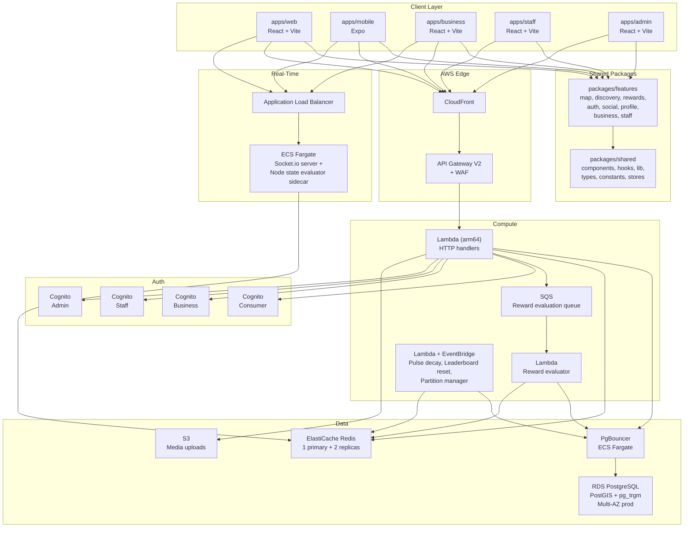

### Monorepo Structure

```
area-code/
  apps/
    web/                    React 18 + Vite (consumer portal)
    mobile/                 Expo (consumer portal, shares packages/)
    business/               React + Vite (business dashboard)
    staff/                  React + Vite (staff validator)
    admin/                  React + Vite (admin panel)
  packages/
    features/
      map/                  LiveMap, NodeMarker, CheckInSheet, ToastOverlay, NodePulse
      discovery/            NodeDetail, TrendingGrid, CategoryFilter, SearchSheet
      rewards/              RewardCard, CheckInReward, StreakTracker, RedemptionCode
      business/             BusinessDashboard, LivePanel, RewardsPanel, AudiencePanel,
                            NodeEditorPanel, BoostPanel, SettingsPanel
      auth/                 Login, Signup, PhoneVerify, ProfileSetup (consumer only)
      social/               ActivityFeed, Leaderboard, FollowList, Notifications
      profile/              UserProfile, BadgeCollection, CheckInHistory, TierBadge
      staff/                StaffValidator, RecentRedemptions
    shared/
      components/           MapView, AnimatedNode, LiveToast, BottomSheet, Avatar,
                            TierBadge, NodeStateIndicator, primitives (Box, Text, Row)
      hooks/                useCheckIn, useNodePulse, useRealtimeToast, useGeolocation,
                            useRewards, useSocketRoom, useCooldownTimer
      lib/                  api, socket, formatters, geoUtils, rewardEngine, toastQueue,
                            storage, platform, featureGating
      types/                index.ts (all shared TypeScript types)
      constants/            sa-cities, node-categories, reward-types, tier-levels
      stores/               mapStore, userStore, toastStore, rewardStore, businessStore,
                            consumerAuthStore, businessAuthStore, staffAuthStore, adminAuthStore,
                            navigationStore, locationStore
  backend/
    src/
      features/
        check-in/           handler.ts, service.ts, repository.ts, types.ts
        nodes/              handler.ts, service.ts, repository.ts, types.ts
        rewards/            handler.ts, service.ts, repository.ts, types.ts
        business/           handler.ts, service.ts, repository.ts, types.ts
        auth/               handler.ts, service.ts, repository.ts, types.ts
        social/             handler.ts, service.ts, repository.ts, types.ts
        admin/              handler.ts, service.ts, repository.ts, types.ts
        staff/              handler.ts, service.ts, repository.ts, types.ts
        notifications/      handler.ts, service.ts, repository.ts, types.ts
      shared/
        middleware/          auth.ts, rate-limit.ts, validation.ts
        redis/               client.ts, keys.ts
        db/                  prisma.ts, migration-runner.ts
        errors/              AppError.ts
        socket/              server.ts, events.ts, rooms.ts
      workers/               pulse-decay.ts, leaderboard-reset.ts, partition-manager.ts, cleanup.ts
    prisma/
      schema.prisma
      migrations/
  infra/
    modules/
      lambda/               Lambda function + IAM execution role
      cognito/              User pool + client + domain
      rds/                  RDS instance + parameter group
      elasticache/          Redis replication group
      ecs-service/          ECS Fargate service + ALB + ECR
      api-gateway/          API Gateway V2 HTTP API + routes + stages
      s3/                   S3 bucket + bucket policy
      waf/                  WAF ACL + rules
    environments/
      dev/                  main.tf, variables.tf, outputs.tf
      prod/                 main.tf, variables.tf, outputs.tf
    shared/
      backend.tf            S3 + DynamoDB remote state
      provider.tf           AWS provider pinned to us-east-1
```

### Dependency Rules (Non-Negotiable)

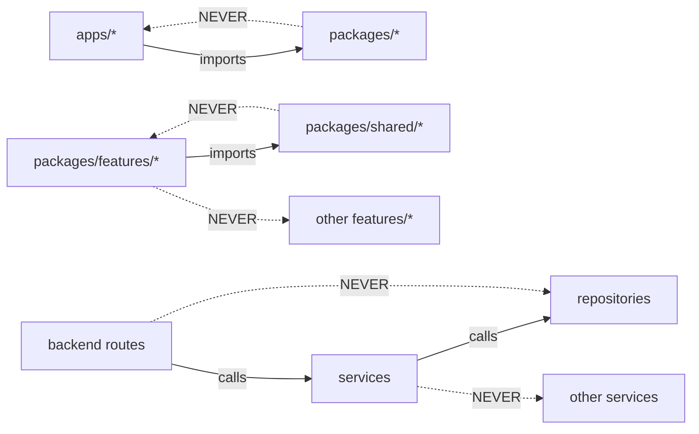

### Backend Layer Architecture

Every Fastify route handler follows this strict order:
1. JWT verify (middleware) → 401
2. Role check (consumer/business/staff/admin) → 403
3. Zod input validation → 400
4. Rate limit check (Redis) → 429
5. Service layer call (business logic)
6. Repository call (DB operations inside service)
7. Redis state update (if real-time state changes)
8. Socket.io emit (if broadcast needed)
9. Return 200/201

Services contain all business logic — never access `req`/`reply`. Repositories contain only DB/Redis queries — zero business logic. Cross-domain logic goes through `backend/src/shared/interfaces/`.

## Components and Interfaces

### Frontend Components

#### Map Feature (`packages/features/map/`)

| Component | Responsibility |
|-----------|---------------|
| `LiveMap` | Full-viewport map container. Mounts Mapbox once, persists across navigation. Manages category chips, toast strip, layer switching. |
| `NodeMarker` | SVG-layered node marker: blur halo → outer ring → core dot → live count badge. Driven by `pulseScore` from `mapStore`. |
| `NodePulse` | Animates node state transitions: breathe, pulse, surge. Uses Framer Motion (web) / Reanimated (mobile). |
| `CheckInSheet` | Bottom sheet for check-in flow. GPS acquisition → API call → animation → reward display. |
| `ToastOverlay` | FOMO toast strip. Priority queue, 1 visible at a time, 4s display, spring slide animations. Hidden when bottom sheet open. |
| `CategoryFilterBar` | Horizontally scrollable category chips. Absolutely positioned over map. |

#### Discovery Feature (`packages/features/discovery/`)

| Component | Responsibility |
|-----------|---------------|
| `NodeDetail` | Node detail bottom sheet: header, social section, rewards section, CTA. 4 sections max. |
| `TrendingGrid` | Trending nodes grid for the Trending map layer. |
| `CategoryFilter` | Category filtering logic for map layer switching. |
| `SearchSheet` | Search bottom sheet with "Nearby" and "Trending in {city}" sections. 300ms debounce, 2-char minimum. |

#### Business Feature (`packages/features/business/`)

| Component | Responsibility |
|-----------|---------------|
| `BusinessDashboard` | Horizontal swipe container. 6 panels, spring physics, pill indicator. Each panel = `100dvh`. |
| `LivePanel` | Real-time check-in counter, avatars, pulse graph, context benchmarks. Zero-state checklist for new nodes. |
| `RewardsPanel` | Reward cards (claimed/slots/expiry), "+" create button, slot lock warning. |
| `AudiencePanel` | Anonymised aggregates: age range, tier distribution, repeat vs new. Min 20 users per data point. |
| `NodeEditorPanel` | Node customisation: colour, icon, name, category, photos carousel, pulse state preview. |
| `BoostPanel` | Tiered ZAR pricing (R25/2hr, R50/6hr, R150/24hr), Yoco checkout. Prices from API. |
| `SettingsPanel` | Profile, contact, hours, subscription, staff management, QR code display/download/regenerate, flag appeals. |

#### Shared Components (`packages/shared/components/`)

| Component | Responsibility |
|-----------|---------------|
| `MapView` | Platform abstraction: Mapbox GL JS (web) / `@rnmapbox/maps` (mobile). Identical props interface. |
| `AnimatedNode` | Animation wrapper for node markers. Abstracts Framer Motion / Reanimated. |
| `LiveToast` | Single toast renderer with spring slide animation. |
| `BottomSheet` | Reusable bottom sheet: `rounded-t-3xl`, spring slide, backdrop overlay. |
| `Avatar` | User avatar with tier badge overlay. |
| `TierBadge` | Tier indicator: Local (grey), Regular (bronze), Fixture (silver), Institution (gold), Legend (animated gradient). |
| `primitives` | `Box` → div/View, `Text` → span/Text, `Row` → div(flex-row)/View(flexDirection:row). |

### Shared Hooks

| Hook | Responsibility |
|------|---------------|
| `useCheckIn` | React Query mutation for `POST /v1/check-in`. Invalidates node queries on success. |
| `useNodePulse` | Subscribes to `node:pulse_update` socket events. Updates `mapStore.pulseScores`. |
| `useRealtimeToast` | Subscribes to `toast:new` socket events. Client-side haversine filtering (≤2km). Manages toast queue. |
| `useGeolocation` | GPS acquisition with timeout (8s), accuracy check, permission state management. |
| `useRewards` | React Query for reward data. Handles reward proximity ("one more visit" line). |
| `useSocketRoom` | Join/leave socket rooms with symmetric cleanup on unmount. |
| `useCooldownTimer` | Countdown timer for check-in cooldown display. |

### Shared Stores (Zustand + immer)

| Store | State |
|-------|-------|
| `mapStore` | `nodes: Record<string, Node>`, `pulseScores: Record<string, number>`, `mapInstance: MapInstance \| null` |
| `userStore` | `user`, `tier`, `totalCheckIns`, `streakCount`, onboarding flags |
| `toastStore` | `queue: Toast[]`, `isBottomSheetOpen: boolean` |
| `rewardStore` | `activeRewards`, `unclaimedRewards` |
| `businessStore` | `business`, `nodes`, `currentPanel` |
| `locationStore` | `lastKnownPosition`, `accuracy`, `permissionState` |
| `navigationStore` | `activeDefaultTab` (time-based: Rewards 00:00–17:00, Leaderboard 17:00–23:59) |
| `consumerAuthStore` | Consumer auth state, tokens (`consumer:` namespace) |
| `businessAuthStore` | Business auth state, tokens (`business:` namespace) |
| `staffAuthStore` | Staff auth state, tokens (`staff:` namespace) |
| `adminAuthStore` | Admin auth state, tokens (`admin:` namespace) |

### Backend Feature Modules

Each backend feature follows the handler → service → repository pattern:

#### Check-In (`backend/src/features/check-in/`)

```typescript
// handler.ts — POST /v1/check-in
interface CheckInRequest {
  nodeId: string
  lat?: number
  lng?: number
  qrToken?: string
  type: 'reward' | 'presence'
}

interface CheckInResponse {
  success: boolean
  cooldownUntil: string // ISO timestamp
}
```

```typescript
// service.ts
class CheckInService {
  async processCheckIn(userId: string, input: CheckInRequest): Promise<CheckInResponse>
  // 1. Proximity check (PostGIS) or QR token validation
  // 2. Cooldown check (Redis)
  // 3. Velocity/abuse checks
  // 4. Insert check_in record
  // 5. Update Redis pulse score
  // 6. Publish to SQS reward queue
  // 7. Emit socket events
}
```

#### Nodes (`backend/src/features/nodes/`)

```typescript
// Key endpoints
GET  /v1/nodes/:citySlug          // Nodes for city (cached 30s via CloudFront)
GET  /v1/nodes/:nodeId/detail     // Full node detail (auth optional)
GET  /v1/nodes/:nodeSlug/public   // Public node info (no auth, for OG tags)
GET  /v1/nodes/:nodeId/who-is-here // Rate-limited: 20 req/10min/user
GET  /v1/nodes/search?q=&lat=&lng= // pg_trgm fuzzy search
POST /v1/nodes                     // Create node (business auth)
PUT  /v1/nodes/:nodeId             // Update node (business auth, owner only)
POST /v1/nodes/:nodeId/claim       // Claim node (business auth, CIPC verification)
POST /v1/nodes/:nodeId/report      // Report node (consumer auth)
```

#### Rewards (`backend/src/features/rewards/`)

```typescript
// Key endpoints
GET  /v1/rewards/near-me?lat=&lng=  // Active rewards within 5km
POST /v1/business/rewards            // Create reward (business auth)
PUT  /v1/business/rewards/:id        // Update reward (business auth)
POST /v1/rewards/:id/redeem          // Staff validates redemption code
GET  /v1/users/me/unclaimed-rewards  // Unclaimed rewards for offline users

// SQS Lambda — reward-evaluator
// Triggered by check-in SQS messages
// Evaluates all active rewards at node, auto-claims qualified
```

#### Auth (`backend/src/features/auth/`)

```typescript
// Consumer auth
POST /v1/auth/consumer/signup      // { phone, username, displayName, citySlug }
POST /v1/auth/consumer/verify-otp  // { phone, code } → { accessToken, refreshToken, user }
POST /v1/auth/consumer/login       // { phone } → OTP sent
POST /v1/auth/consumer/refresh     // { refreshToken } → { accessToken }

// Business auth
POST /v1/auth/business/signup      // { email, phone, businessName, registrationNumber? }
POST /v1/auth/business/verify-otp  // { phone, code } → { accessToken, refreshToken, business }
POST /v1/auth/business/login       // { phone } → OTP sent

// Staff auth
POST /v1/auth/staff/login          // { phone } → OTP sent
POST /v1/auth/staff/verify-otp     // { phone, code } → { accessToken, refreshToken, staff }
POST /v1/staff-invite/accept       // { inviteToken, name, phone }

// Shared
POST /v1/auth/logout               // { refreshToken } → revoke
GET  /v1/auth/account-type?phone=  // → consumer | business | staff | not_found
```

#### Business (`backend/src/features/business/`)

```typescript
GET  /v1/business/me                // Business profile + subscription
GET  /v1/business/plans             // Pricing (never hardcoded)
POST /v1/business/checkout          // Yoco checkout session
POST /v1/business/staff/invite      // Invite staff member
GET  /v1/business/staff             // List staff accounts
DELETE /v1/business/staff/:id       // Remove staff account
POST /v1/business/boost             // Purchase node boost
```

#### Social (`backend/src/features/social/`)

```typescript
POST /v1/users/:id/follow          // Follow user
DELETE /v1/users/:id/follow         // Unfollow user
GET  /v1/feed                       // Activity feed (grouped by venue)
GET  /v1/leaderboard/:citySlug     // City leaderboard (top 50 + user rank)
```

### Socket.io Events

```typescript
// Server → Client
interface ServerToClientEvents {
  'node:pulse_update': (payload: { nodeId: string; pulseScore: number; checkInCount: number; state: NodeState }) => void
  'node:state_surge': (payload: { nodeId: string; fromState: NodeState; toState: NodeState }) => void
  'node:state_change': (payload: { nodeId: string; state: NodeState }) => void
  'toast:new': (payload: { type: ToastType; message: string; nodeId?: string; nodeLat?: number; nodeLng?: number; avatarUrl?: string }) => void
  'reward:claimed': (payload: { rewardId: string; rewardTitle: string; redemptionCode: string; codeExpiresAt: string }) => void
  'reward:slots_update': (payload: { rewardId: string; slotsRemaining: number }) => void
  'leaderboard:update': (payload: { userId: string; rank: number; delta: number }) => void
}

// Client → Server
interface ClientToServerEvents {
  'room:join': (payload: { room: string }) => void
  'room:leave': (payload: { room: string }) => void
  'presence:join': (payload: { nodeId: string }) => void
  'presence:leave': (payload: { nodeId: string }) => void
}
```

### Socket Room Strategy

| Room Pattern | Subscribers | Events |
|-------------|------------|--------|
| `city:{citySlug}` | All clients in city (incl. anonymous) | `node:pulse_update`, `toast:new`, `node:state_surge` |
| `node:{nodeId}` | Clients with node detail sheet open | `reward:slots_update` |
| `user:{userId}` | Authenticated user only | `reward:claimed`, `leaderboard:update` |
| `business:{businessId}` | Business dashboard clients | Live check-in events, reward claim events |

### Webhook Endpoints

```typescript
POST /v1/webhooks/yoco  // Yoco payment events (signature verified)
```

### Infrastructure Interfaces

#### Terraform Module Interfaces

| Module | Key Inputs | Key Outputs |
|--------|-----------|-------------|
| `lambda` | `function_name`, `handler`, `runtime`, `memory`, `timeout`, `env_vars`, `provisioned_concurrency` | `function_arn`, `invoke_url` |
| `cognito` | `pool_name`, `access_token_validity`, `refresh_token_validity`, `explicit_auth_flows` | `pool_id`, `client_id`, `pool_arn` |
| `rds` | `instance_class`, `multi_az`, `backup_retention`, `postgis_enabled` | `endpoint`, `read_replica_endpoint` |
| `elasticache` | `node_type`, `num_replicas`, `replication_group_id` | `primary_endpoint`, `reader_endpoint` |
| `ecs-service` | `image`, `cpu`, `memory`, `desired_count`, `health_check_path` | `service_arn`, `alb_dns` |
| `api-gateway` | `name`, `routes`, `stage_name`, `waf_acl_arn` | `api_endpoint`, `stage_url` |
| `s3` | `bucket_name`, `cors_rules`, `lifecycle_rules` | `bucket_arn`, `bucket_domain` |
| `waf` | `scope`, `rate_limit_rules`, `managed_rules` | `acl_arn` |

## Data Models

### Database Schema

All tables use PostgreSQL with PostGIS and pg_trgm extensions. Timestamps are `TIMESTAMPTZ` (UTC). Prisma ORM with `@map`/`@@map` for snake_case DB ↔ camelCase code.

#### Core Tables

```sql
-- Users (consumer accounts)
CREATE TABLE users (
  id UUID PRIMARY KEY DEFAULT gen_random_uuid(),
  phone TEXT UNIQUE,
  username TEXT UNIQUE NOT NULL,
  display_name TEXT NOT NULL,
  avatar_url TEXT,
  city_id UUID REFERENCES cities(id),
  neighbourhood_id UUID REFERENCES neighbourhoods(id),
  tier TEXT DEFAULT 'local' CHECK (tier IN ('local','regular','fixture','institution','legend')),
  total_check_ins INTEGER DEFAULT 0,
  cognito_sub TEXT UNIQUE,
  created_at TIMESTAMPTZ DEFAULT NOW()
);

-- Business accounts
CREATE TABLE business_accounts (
  id UUID PRIMARY KEY DEFAULT gen_random_uuid(),
  email TEXT UNIQUE NOT NULL,
  business_name TEXT NOT NULL,
  registration_number TEXT,
  cognito_sub TEXT UNIQUE,
  tier TEXT DEFAULT 'free' CHECK (tier IN ('free','starter','growth','pro','payg')),
  trial_ends_at TIMESTAMPTZ,
  payment_grace_until TIMESTAMPTZ,
  yoco_customer_id TEXT,
  is_active BOOLEAN DEFAULT TRUE,
  created_at TIMESTAMPTZ DEFAULT NOW()
);

-- Cities
CREATE TABLE cities (
  id UUID PRIMARY KEY DEFAULT gen_random_uuid(),
  name TEXT NOT NULL,
  slug TEXT UNIQUE NOT NULL,
  country TEXT DEFAULT 'ZA'
);

-- Neighbourhoods (V1 schema for V2 leaderboard)
CREATE TABLE neighbourhoods (
  id UUID PRIMARY KEY DEFAULT gen_random_uuid(),
  city_id UUID REFERENCES cities(id),
  name TEXT NOT NULL,
  slug TEXT UNIQUE NOT NULL,
  boundary GEOGRAPHY(POLYGON, 4326)
);
CREATE INDEX ON neighbourhoods USING GIST(boundary);

-- Nodes (businesses/venues)
CREATE TABLE nodes (
  id UUID PRIMARY KEY DEFAULT gen_random_uuid(),
  name TEXT NOT NULL,
  slug TEXT UNIQUE NOT NULL,
  category TEXT NOT NULL CHECK (category IN ('food','coffee','nightlife','retail','fitness','arts')),
  lat DOUBLE PRECISION NOT NULL,
  lng DOUBLE PRECISION NOT NULL,
  location GEOGRAPHY(POINT, 4326) GENERATED ALWAYS AS
    (ST_SetSRID(ST_MakePoint(lng, lat), 4326)) STORED,
  city_id UUID REFERENCES cities(id),
  business_id UUID REFERENCES business_accounts(id),
  submitted_by UUID REFERENCES business_accounts(id),
  claim_status TEXT DEFAULT 'unclaimed'
    CHECK (claim_status IN ('unclaimed','pending','claimed')),
  claim_cipc_status TEXT
    CHECK (claim_cipc_status IN ('validated','pending_manual','cipc_unavailable','rejected')),
  node_colour TEXT DEFAULT 'default',
  node_icon TEXT,
  qr_checkin_enabled BOOLEAN DEFAULT FALSE,
  is_verified BOOLEAN DEFAULT FALSE,
  is_active BOOLEAN DEFAULT TRUE,
  created_at TIMESTAMPTZ DEFAULT NOW()
);
CREATE INDEX ON nodes USING GIST(location);

-- Check-ins (partitioned by month)
CREATE TABLE check_ins (
  id UUID PRIMARY KEY DEFAULT gen_random_uuid(),
  user_id UUID REFERENCES users(id),
  node_id UUID REFERENCES nodes(id),
  neighbourhood_id UUID REFERENCES neighbourhoods(id),
  type TEXT NOT NULL DEFAULT 'reward'
    CHECK (type IN ('reward','presence')),
  checked_in_at TIMESTAMPTZ DEFAULT NOW()
) PARTITION BY RANGE (checked_in_at);
CREATE INDEX ON check_ins(node_id, checked_in_at);
CREATE INDEX ON check_ins(user_id, checked_in_at);

-- Rewards
CREATE TABLE rewards (
  id UUID PRIMARY KEY DEFAULT gen_random_uuid(),
  node_id UUID REFERENCES nodes(id),
  type TEXT NOT NULL
    CHECK (type IN ('nth_checkin','daily_first','streak','milestone','referral','surprise')),
  title TEXT NOT NULL,
  description TEXT,
  trigger_value INTEGER,
  total_slots INTEGER,
  claimed_count INTEGER DEFAULT 0,
  slots_locked BOOLEAN DEFAULT FALSE,
  is_active BOOLEAN DEFAULT TRUE,
  expires_at TIMESTAMPTZ,
  created_at TIMESTAMPTZ DEFAULT NOW()
);

-- Reward redemptions (idempotent via UNIQUE constraint)
CREATE TABLE reward_redemptions (
  id UUID PRIMARY KEY DEFAULT gen_random_uuid(),
  reward_id UUID REFERENCES rewards(id),
  user_id UUID REFERENCES users(id),
  redemption_code CHAR(6) NOT NULL,
  code_expires_at TIMESTAMPTZ NOT NULL,
  redeemed_at TIMESTAMPTZ,
  created_at TIMESTAMPTZ DEFAULT NOW(),
  UNIQUE(reward_id, user_id)
);

-- Node images
CREATE TABLE node_images (
  id UUID PRIMARY KEY DEFAULT gen_random_uuid(),
  node_id UUID REFERENCES nodes(id) ON DELETE CASCADE,
  s3_key TEXT NOT NULL,
  display_order INTEGER DEFAULT 0,
  uploaded_by UUID REFERENCES business_accounts(id),
  created_at TIMESTAMPTZ DEFAULT NOW()
);

-- Reports
CREATE TABLE reports (
  id UUID PRIMARY KEY DEFAULT gen_random_uuid(),
  reporter_id UUID REFERENCES users(id),
  node_id UUID REFERENCES nodes(id),
  type TEXT NOT NULL
    CHECK (type IN ('wrong_location','permanently_closed','fake_rewards','offensive_content','other')),
  detail TEXT,
  status TEXT DEFAULT 'pending'
    CHECK (status IN ('pending','reviewed','dismissed','actioned')),
  created_at TIMESTAMPTZ DEFAULT NOW()
);

-- Leaderboard history
CREATE TABLE leaderboard_history (
  id UUID PRIMARY KEY DEFAULT gen_random_uuid(),
  city_id UUID REFERENCES cities(id),
  week_ending TIMESTAMPTZ NOT NULL,
  user_id UUID REFERENCES users(id),
  rank INTEGER NOT NULL,
  check_in_count INTEGER NOT NULL,
  created_at TIMESTAMPTZ DEFAULT NOW()
);
CREATE INDEX ON leaderboard_history(city_id, week_ending);
CREATE INDEX ON leaderboard_history(user_id);

-- Consumer POPIA consent (broadcast_location derived from here, not users table)
CREATE TABLE consent_records (
  id UUID PRIMARY KEY DEFAULT gen_random_uuid(),
  user_id UUID REFERENCES users(id),
  consent_version TEXT NOT NULL,
  analytics_opt_in BOOLEAN DEFAULT FALSE,
  broadcast_location BOOLEAN DEFAULT TRUE,
  consented_at TIMESTAMPTZ DEFAULT NOW()
);
CREATE INDEX ON consent_records(user_id, consented_at DESC);

-- Business consent records (ECTA compliance)
CREATE TABLE business_consent_records (
  id UUID PRIMARY KEY DEFAULT gen_random_uuid(),
  business_id UUID REFERENCES business_accounts(id),
  consent_version TEXT NOT NULL,
  tier TEXT NOT NULL,
  ip_address TEXT,
  accepted_at TIMESTAMPTZ DEFAULT NOW()
);

-- Push notification tokens
CREATE TABLE user_push_tokens (
  id UUID PRIMARY KEY DEFAULT gen_random_uuid(),
  user_id UUID REFERENCES users(id),
  token TEXT NOT NULL,
  platform TEXT NOT NULL CHECK (platform IN ('expo','web')),
  device_id TEXT,
  is_active BOOLEAN DEFAULT TRUE,
  created_at TIMESTAMPTZ DEFAULT NOW(),
  last_used_at TIMESTAMPTZ,
  UNIQUE(user_id, token)
);

-- Notification preferences
CREATE TABLE notification_preferences (
  user_id UUID PRIMARY KEY REFERENCES users(id),
  streak_at_risk BOOLEAN DEFAULT FALSE,
  reward_activated BOOLEAN DEFAULT FALSE,
  reward_claimed_push BOOLEAN DEFAULT TRUE,
  leaderboard_prewarning BOOLEAN DEFAULT FALSE,
  followed_user_checkin BOOLEAN DEFAULT FALSE,
  updated_at TIMESTAMPTZ DEFAULT NOW()
);

-- Staff invites
CREATE TABLE staff_invites (
  id UUID PRIMARY KEY DEFAULT gen_random_uuid(),
  business_id UUID REFERENCES business_accounts(id),
  invite_token TEXT UNIQUE NOT NULL,
  invited_phone TEXT,
  invited_email TEXT,
  accepted BOOLEAN DEFAULT FALSE,
  expires_at TIMESTAMPTZ NOT NULL,
  created_at TIMESTAMPTZ DEFAULT NOW()
);

-- Staff accounts
CREATE TABLE staff_accounts (
  id UUID PRIMARY KEY DEFAULT gen_random_uuid(),
  business_id UUID REFERENCES business_accounts(id),
  name TEXT NOT NULL,
  phone TEXT UNIQUE NOT NULL,
  cognito_sub TEXT UNIQUE,
  is_active BOOLEAN DEFAULT TRUE,
  created_at TIMESTAMPTZ DEFAULT NOW()
);

-- User follows (social graph)
CREATE TABLE user_follows (
  id UUID PRIMARY KEY DEFAULT gen_random_uuid(),
  follower_id UUID REFERENCES users(id),
  following_id UUID REFERENCES users(id),
  created_at TIMESTAMPTZ DEFAULT NOW(),
  UNIQUE(follower_id, following_id)
);
CREATE INDEX ON user_follows(follower_id);
CREATE INDEX ON user_follows(following_id);

-- Abuse flags
CREATE TABLE abuse_flags (
  id UUID PRIMARY KEY DEFAULT gen_random_uuid(),
  type TEXT NOT NULL
    CHECK (type IN ('device_velocity','ip_subnet','pulse_anomaly','reward_drain','new_account_velocity')),
  entity_id UUID NOT NULL,
  entity_type TEXT NOT NULL CHECK (entity_type IN ('user','node','device')),
  evidence_json JSONB,
  reviewed BOOLEAN DEFAULT FALSE,
  auto_actioned BOOLEAN DEFAULT FALSE,
  created_at TIMESTAMPTZ DEFAULT NOW()
);
CREATE INDEX ON abuse_flags(entity_type, entity_id);
CREATE INDEX ON abuse_flags(reviewed, created_at);

-- Device fingerprints
CREATE TABLE device_fingerprints (
  id UUID PRIMARY KEY DEFAULT gen_random_uuid(),
  user_id UUID REFERENCES users(id),
  fingerprint_hash TEXT NOT NULL,
  platform TEXT NOT NULL CHECK (platform IN ('web','ios','android')),
  first_seen_at TIMESTAMPTZ DEFAULT NOW(),
  last_seen_at TIMESTAMPTZ DEFAULT NOW(),
  UNIQUE(user_id, fingerprint_hash)
);
CREATE INDEX ON device_fingerprints(fingerprint_hash);

-- Admin audit log
CREATE TABLE audit_log (
  id UUID PRIMARY KEY DEFAULT gen_random_uuid(),
  admin_id UUID NOT NULL,
  admin_role TEXT NOT NULL,
  action TEXT NOT NULL,
  entity_type TEXT NOT NULL,
  entity_id UUID NOT NULL,
  before_state JSONB,
  after_state JSONB,
  note TEXT,
  created_at TIMESTAMPTZ DEFAULT NOW()
);
CREATE INDEX ON audit_log(entity_type, entity_id);
CREATE INDEX ON audit_log(admin_id);
CREATE INDEX ON audit_log(created_at);

-- Admin impersonation log
CREATE TABLE impersonation_log (
  id UUID PRIMARY KEY DEFAULT gen_random_uuid(),
  admin_id UUID NOT NULL,
  target_user_id UUID NOT NULL,
  target_account_type TEXT NOT NULL,
  note TEXT NOT NULL,
  started_at TIMESTAMPTZ DEFAULT NOW(),
  ended_at TIMESTAMPTZ
);

-- Admin messages
CREATE TABLE admin_messages (
  id UUID PRIMARY KEY DEFAULT gen_random_uuid(),
  admin_id UUID NOT NULL,
  target_user_id UUID NOT NULL,
  message TEXT NOT NULL,
  read_at TIMESTAMPTZ,
  created_at TIMESTAMPTZ DEFAULT NOW()
);

-- Webhook events (Yoco idempotency)
CREATE TABLE webhook_events (
  id UUID PRIMARY KEY DEFAULT gen_random_uuid(),
  event_id TEXT UNIQUE NOT NULL,
  event_type TEXT NOT NULL,
  processed_at TIMESTAMPTZ DEFAULT NOW()
);
```

### Redis Data Structures

All key patterns defined in `backend/src/shared/redis/keys.ts`. All ephemeral keys have explicit TTLs.

```
// Node pulse scores (sorted set per city — node heat ranking)
ZADD nodes:pulse:{cityId} {pulseScore} {nodeId}

// Check-in cooldowns
SET checkin:cooldown:reward:{userId}:{nodeId} 1 EX 14400    // 4 hours
SET checkin:cooldown:presence:{userId}:{nodeId} 1 EX 3600   // 1 hour

// Daily check-in count per node (expires at midnight UTC)
INCR checkin:today:{nodeId}
EXPIREAT checkin:today:{nodeId} {midnightUTC}

// Active users per node (set with per-member expiry via sorted set)
ZADD node:active:{nodeId} {expiryTimestamp} {userId}

// Toast queue per city (capped at 100)
LPUSH toast:queue:{cityId} {toastJson}
LTRIM toast:queue:{cityId} 0 99

// User consent cache (derived from consent_records)
SET user:consent:{userId} {"broadcast_location":true,"analytics_opt_in":false} EX 3600

// Surge toast cooldown per user per venue
SET toast:surge:seen:{userId}:{nodeId} 1 EX 3600

// OTP cooldown
SET otp:cooldown:{phone} 1 EX 60

// Notification deferred
SET notif:deferred:{userId} 1 EX 604800   // 7 days

// Reward notification daily limit
INCR reward_notifications_today:{userId}
EXPIRE reward_notifications_today:{userId} 86400

// Leaderboard (sorted set per city per week)
ZADD leaderboard:{cityId}:week {checkInCount} {userId}

// QR token validation (HMAC-based, 15-minute rotation)
// Computed at validation time, not stored
```

### Pulse Score Calculation

```
pulseScore = (checkInsLast30min × 5) + (uniqueUsersToday × 2) + (activeRewards × 10) + trendingBonus
nodeSize   = base + (pulseScore × 0.4px), max base × 2.5
```

| State | Score Range | Base Size | Animation |
|-------|-----------|-----------|-----------|
| `dormant` | 0 | 8px | 0.02 opacity outer ring, 4s breathe |
| `quiet` | 1–10 | 10px | accent ring 20% opacity, 3s breathe |
| `active` | 11–30 | 14px | coloured ring, inner glow, 1.5s pulse |
| `buzzing` | 31–60 | 20px | double ring, blur halo, 0.8s pulse, live count badge |
| `popping` | 61+ | 28px | triple-layer glow, blur 12px, 0.4s pulse, avatar stack |

### Pulse Decay

- **Off-peak (00:00–17:59 SAST)**: `score × 0.90` every 5 minutes
- **Peak (18:00–23:59 SAST)**: `score × 0.95` every 5 minutes
- Floor: 0

### Check-In Pipeline (Sequence)

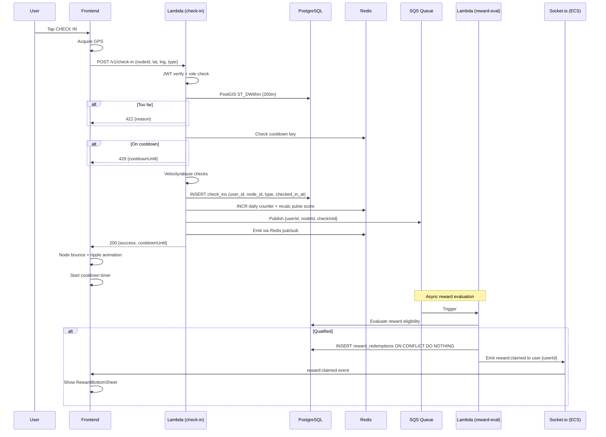

### Business Subscription Flow

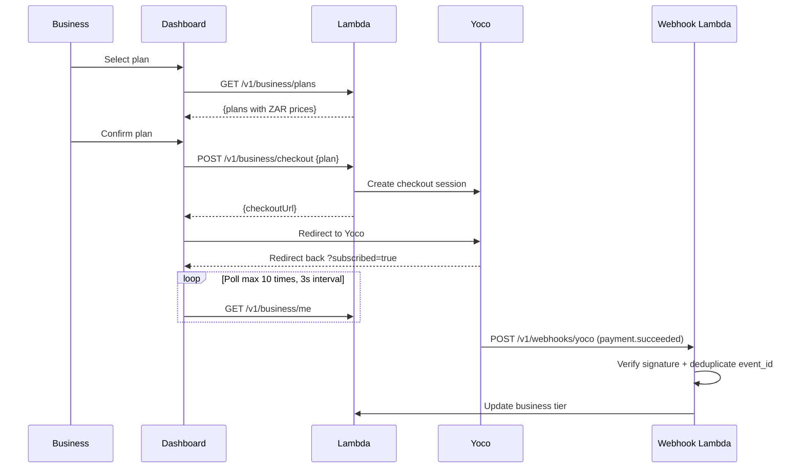

### Design System Tokens

All colours defined in `tokens.css`. Never hardcoded hex in components.

```css
:root {
  --bg-map: #0a0a0f;
  --bg-base: #0f0f17;
  --bg-surface: #161622;
  --bg-raised: #1e1e2e;
  --bg-overlay: rgba(10,10,15,0.85);
  --text-primary: #f0f0f5;
  --text-secondary: #a0a0b8;
  --text-muted: #606078;
  --accent: #6c63ff;
  --accent-bright: #8b84ff;
  --accent-dim: #4a43cc;
  --on-accent: #ffffff;
  --success: #22d3a0;
  --danger: #ff4757;
  --warning: #ffb830;
  --info: #38bdf8;
  --node-food: #ff6b6b;
  --node-coffee: #a0785a;
  --node-nightlife: #b44eff;
  --node-retail: #38bdf8;
  --node-fitness: #22d3a0;
  --node-arts: #ff9f43;
  --node-default: #6c63ff;
  --tier-local: #606078;
  --tier-regular: #cd7f32;
  --tier-fixture: #c0c0c0;
  --tier-institution: #ffd700;
  --border: rgba(255,255,255,0.08);
  --border-strong: rgba(255,255,255,0.16);
  --nav-height: 56px;
  --bottom-sheet-radius: 20px;
}
```

Typography: `Syne` (700, 800) for headings, `DM Sans` (400, 500) for body. 4px base spacing. Spring physics default: `tension: 280, friction: 60`.

## Staff Validator Design

### Component: `StaffValidator` (`packages/features/staff/`)

| Component | Responsibility |
|-----------|---------------|
| `StaffValidator` | Code input field + validation result display. Single-purpose interface at `/staff`. |
| `RecentRedemptions` | Scrollable list of recent redemptions: code + timestamp only. No user identity shown. |

### Staff Auth Flow

1. Business owner invites staff via Settings panel → `POST /v1/business/staff/invite { phone }`.
2. System sends invite link: `areacode.co.za/staff-invite/{token}` (7-day expiry).
3. Staff accepts invite → `POST /v1/staff-invite/accept { inviteToken, name, phone }` → creates Cognito account in `area-code-staff` pool.
4. Staff logs in at `/staff/login` → OTP → `staffAuthStore` manages tokens with `staff:` namespace.
5. Staff Cognito access token TTL: 8 hours (shift-length session).

### Staff Validation Endpoint

```typescript
POST /v1/rewards/:rewardId/redeem
Body: { redemptionCode: string }
Auth: staff JWT
Response: { valid: boolean, rewardTitle?: string, redeemedAt?: string }
```

Staff accounts are limited per business tier: Starter = 2, Growth = 5, Pro = unlimited.

## City Leaderboard Design

### Leaderboard Data Flow

1. Each check-in increments `ZADD leaderboard:{cityId}:week {newCount} {userId}` in Redis.
2. `GET /v1/leaderboard/:citySlug` reads from Redis sorted set (`ZREVRANGE` top 50 + `ZREVRANK` for requesting user).
3. Leaderboard resets Monday 00:00 SAST via `leaderboard-reset` EventBridge Lambda worker.

### Reset Sequence (Worker: `leaderboard-reset.ts`)

1. For each city: `ZREVRANGE leaderboard:{cityId}:week 0 49 WITHSCORES` → snapshot to `leaderboard_history` table.
2. `RENAME leaderboard:{cityId}:week leaderboard:{cityId}:week:prev` then `DEL leaderboard:{cityId}:week:prev` — never zero scores individually.
3. Push notifications to top 10: "You finished #{rank} in {cityName} this week."
4. Pre-reset notification at Sunday 20:00 SAST to opted-in users with current rank.

### Leaderboard UI

- Accessible from bottom nav (trophy icon).
- Top 50 displayed with rank, avatar, username, tier badge, check-in count.
- User's own rank pinned at bottom if outside top 50.
- Monday morning recap card in Activity Feed: prior week's top 3 + user's rank, auto-dismiss after 8s or on tap.

## Search Design

### Search Flow

1. User taps search icon (top-right of map) → `SearchSheet` bottom sheet slides up.
2. Input debounced at 300ms, minimum 2 characters.
3. `GET /v1/nodes/search?q={query}&lat={lat}&lng={lng}` → backend uses `pg_trgm` trigram fuzzy matching on `nodes.name`.
4. Results in two sections: "Nearby" (sorted by `proximity × pulseScore`) and "Trending in {cityName}".
5. Tap result → close sheet, `flyTo` node coordinates, auto-open `NodeDetail` bottom sheet.

### Backend Search Query

```sql
SELECT id, name, slug, category, lat, lng,
  similarity(name, $query) AS sim,
  ST_Distance(location::geography, ST_SetSRID(ST_MakePoint($lng, $lat), 4326)::geography) AS dist
FROM nodes
WHERE similarity(name, $query) > 0.2
  AND city_id = $cityId
  AND is_active = true
ORDER BY sim DESC, dist ASC
LIMIT 20
```

Requires `CREATE EXTENSION IF NOT EXISTS pg_trgm` in the first migration.

## Privacy and POPIA Compliance Design

### Consent Architecture

- `consent_records` table is append-only. Latest row per user is the active consent.
- `broadcast_location` is derived from `consent_records`, never stored on `users` table.
- Redis cache: `SET user:consent:{userId} {json} EX 3600`. Cache miss → DB query → repopulate.
- Consent version stored in Lambda env var `AREA_CODE_CONSENT_VERSION`. Major version bump triggers re-consent bottom sheet.

### Privacy Controls (Profile → Privacy)

1. "Show my activity on the map" toggle — single toggle, defaults ON, changes silently (no confirmation dialog, no email).
2. When OFF: user excluded from "who's here" avatars, live count badge not incremented for their check-in, no toast emitted. Pulse score still updates on backend.
3. View all check-in history, export (CSV), delete all (soft-delete → hard-delete after 30 days per POPIA Article 14).

### Sign-Up Consent

Two explicit opt-ins presented at sign-up:
- "Contribute anonymised check-in data to city insights" — OFF by default.
- "Show my activity on the map" — ON by default with explanation text.

### Aggregation Rule

No data point in any report or API response may represent fewer than 20 unique users. Enforced in the Audience panel and all analytics endpoints.

## Anonymous User Experience Design

### What Anonymous Users See

| Feature | Access |
|---------|--------|
| Map with node markers (colour, size, state) | ✓ |
| Node pulse state labels | ✓ |
| Node name, category, address | ✓ |
| Today's check-in count (number only, no avatars) | ✓ |
| Reward count ("2 active rewards", no details) | ✓ |
| Real-time toasts and pulse updates (city room) | ✓ |
| Check in | Sign-up bottom sheet |
| "Who's here" avatars | Sign-up bottom sheet |
| Reward details | Sign-up bottom sheet |
| Leaderboard | Sign-up bottom sheet |
| User profiles | Sign-up bottom sheet |

### Anonymous Socket Connection

Anonymous users connect to Socket.io without JWT. Server joins them to `city:{citySlug}` only (no `user:` room). They receive `node:pulse_update` and `toast:new` events. No presence events emitted.

### Auth Gate Pattern

Gated actions trigger a sign-up bottom sheet — never a redirect to `/login`. The bottom sheet presents the hard-fork: "I'm a customer" / "I'm a business".

## User Tiers and Profile Design

### Tier Thresholds

| Tier | Check-Ins | Badge | Colour Token |
|------|-----------|-------|-------------|
| Local | 0–9 | Grey circle | `--tier-local` |
| Regular | 10–49 | Bronze circle | `--tier-regular` |
| Fixture | 50–149 | Silver circle | `--tier-fixture` |
| Institution | 150–499 | Gold circle | `--tier-institution` |
| Legend | 500+ | Animated gradient | CSS `linear-gradient(135deg, #f093fb, #f5576c, #fda085)` |

Tier is recalculated on each check-in by incrementing `users.total_check_ins` and evaluating thresholds. Tier badges appear on avatars in "who's here" and on the leaderboard.

### Profile Screen

Displays: tier badge, total check-ins, streak count, check-in history, badge collection.

### Streak System

- Streak badge: persistent bottom-left corner above nav when streak > 0.
- SVG flame icon: `--warning` colour when streak ≥ 3, `--text-muted` when 1–2.
- Tap streak badge → micro-sheet: "{N}-night streak. Check in today to keep it." with progress dots.
- After 18:00 local time with no check-in today: single subtle pulse on streak badge.
- Day boundary: 00:00–23:59 SAST.

## Share and Deep Links Design

### Share Flow

1. User taps "Share node" from node detail 3-dot menu.
2. Native share sheet opens with URL `areacode.co.za/node/{nodeSlug}` and text "Check this out on Area Code".
3. Public endpoint `GET /v1/nodes/{nodeSlug}/public` (no auth) returns name, category, city, pulse score, active reward count for OG tags.

### Deep Link Handling

| Link Pattern | Behaviour |
|-------------|-----------|
| `areacode.co.za/node/{nodeSlug}` | Open app → fly to node → auto-open detail sheet |
| `areacode.co.za/qr/{nodeId}/{token}` | Open app → validate QR → process check-in |
| `areacode.co.za/staff-invite/{token}` | Open staff invite acceptance flow |

- Web: standard URL routing via Expo Router.
- Mobile: Expo Router universal links. Requires Apple App Site Association and Android Asset Links files served from web app.
- Deep link scheme: `areacode://` mapping to Expo Router file-based routes.

## Report and Flag Design

### Report Flow

1. User taps "Report this venue" from node detail 3-dot menu.
2. Single-select report types: wrong location, permanently closed, fake/manipulated check-ins, inappropriate content, other.
3. Optional text field (max 200 chars) → `POST /v1/nodes/{nodeId}/report`.
4. Reporter identity never revealed to node owner.

### Auto-Flag Rules

- 5+ fraud reports in 24 hours → node set to `flagged`, hidden from trending surfaces.
- Business owner notified: "Your node has been reported and is under review."
- Business can submit appeal via Settings panel (max 500 chars + optional photo).
- Reporter with 3 rejected reports in 30 days → banned from further reports.

## Push Notifications Design

### Delivery Channels

- Mobile: Expo Push Notifications (iOS/Android).
- Web: Web Push (VAPID keys for Chrome, Edge, Firefox).
- Push tokens stored in `user_push_tokens` table. Preferences in `notification_preferences`.

### Notification Types

| Type | Default | Max Frequency | Delivery |
|------|---------|--------------|----------|
| Streak at risk | OFF | 1/day | Push only |
| Reward activated at regulars | OFF | 2/day | Push only |
| Leaderboard pre-reset | OFF | 1/week (Sun 20:00 SAST) | Push only |
| Top 10 result | ON | 1/week (Mon 00:00 SAST) | Push only |
| Reward claimed | ON | Per-event | Socket primary, 60s push fallback |

Push is never sent for: toast events, pulse score changes, other users' check-ins.

### Permission Prompt Strategy

1. After first successful check-in, show personalised value hook bottom sheet.
2. Use nearby recent check-in event if available, else fall back to value list.
3. "Not now" → defer 7 days via Redis key `notif:deferred:{userId}` with `EX 604800`. Never ask twice in one session.
4. Handle `DeviceNotRegistered` by setting `is_active = false` on the push token.

## Offline and Connectivity Design

### State Detection and UI

| State | Indicator | Behaviour |
|-------|-----------|-----------|
| Fully offline | Banner: "No connection. Check-ins paused." | Cached map tiles, node states show "Last updated Xm ago" |
| Socket disconnected, API reachable | Dot in nav: "Live updates paused" | Poll at 30s intervals |
| Restored | Indicators dismissed silently | Resume real-time, replay last 5 min of events only |

### Offline UI Rules

- CHECK IN button: greyed out with text "Connect to check in" — no error toast.
- Node detail rewards section: "Rewards unavailable offline".
- Node states persisted via Zustand → `localStorage`/`AsyncStorage` as fallback.
- User profile and tier cached indefinitely.

### Socket Reconnect Strategy

Exponential backoff with jitter: `baseDelay: 1000ms, maxDelay: 30000ms, jitter: true`. Handles South African load shedding reconnect storms. Redis pub/sub queue capped at 500 events per city.

## Data Saver and Performance Tiers Design

### Data Saver Mode

Activated when `navigator.connection.saveData` is true or user enables in Profile → Settings.

| Feature | Normal | Data Saver |
|---------|--------|-----------|
| Map tiles | Dynamic | Static |
| Real-time updates | Socket.io | 30s polling |
| Avatar images | Loaded | Initials placeholders |
| Background refetch | Enabled | Disabled |
| Blur halos / triple-layer glow | Enabled | Disabled |
| Lottie animations | Enabled | CSS transitions |

Small "D" badge on nav bar when active, tappable to explain and offer disable.

### Device Performance Tiers

Detected on first map load via `navigator.hardwareConcurrency` + 500ms frame-rate probe.

| Tier | Detection | Adjustments |
|------|-----------|-------------|
| High | 4+ cores, 55+ fps | Full visual fidelity |
| Mid | 2–3 cores, 30–54 fps | Disable 3D buildings, halve blur halo opacity |
| Low | 1–2 cores, <30 fps | Disable 3D buildings + blur halos, reduce pitch to 20°, Framer Motion `reducedMotion: true` |

Nodes still breathe and pulse at all tiers — reduction is cosmetic depth only.

## Context-Aware Navigation Design

### Time-Based Default Tab

| Time (SAST) | Default Tab | Rationale |
|-------------|------------|-----------|
| 00:00–17:00 | Rewards | Discovery mode — users planning where to go |
| 17:00–23:59 | Leaderboard | Social mode — users competing in real time |

Implementation: `navigationStore.activeDefaultTab` set by `useEffect` reading current hour on mount and on each app foreground event. No server call. User's last-visited tab always wins if they've already navigated — time-based default only on fresh app open.

## First-Time User Onboarding Design

### Onboarding Hints (Context-Delivered, Non-Blocking)

| Trigger | Hint | Dismissal |
|---------|------|-----------|
| First app open (after 1.5s) | Pill at map centre: "Tap any dot to explore" [×] | Tap any node or [×] |
| First layer-swipe attempt | Edge hint: "← Social  Trending  Rewards →" | Fades after 3s or first successful swipe |
| First check-in complete | Quiet toast: "You're on the map." | Auto-dismiss (standard 4s) |

State tracked in `userStore`: `hintSeen`, `layerHintSeen`, `firstCheckIn`. Persisted to storage. Hints never shown twice. No tutorial screens, no modals, no spotlights.

## Admin Panel Design

### Admin App (`apps/admin/`)

Separate React + Vite app at `/admin` with `area-code-admin` Cognito pool.

### Admin Roles (Cognito `custom:admin_role`)

| Role | Permissions |
|------|------------|
| `super_admin` | All actions including impersonation (read-only, mandatory note) |
| `support_agent` | View + message users, extend trials, view consent. No delete, no impersonate. |
| `content_moderator` | Node management, report queue, claim review only. |

### Admin Panels

| Panel | Features |
|-------|---------|
| Consumer Management | View check-in history, disable/re-enable account (Cognito `AdminDisableUser`), reset abuse flags, recalculate tier, override streak (mandatory reason), process right-to-erasure (soft-delete → hard-delete 30-day queue), view push tokens, view consent history, send in-app admin messages |
| Business Management | View subscription/payment history, extend trial (logged), view/revoke staff accounts, force-deactivate rewards, override CIPC validation, view/invalidate QR tokens |
| POPIA Consent Audit | Per-user consent view, re-consent export (users on version < current), erasure request queue with countdown, data access request log |
| Report Queue | Nodes with 3+ reports of same type surfaced. Review, dismiss, or action. |

### Audit Logging

All admin actions logged to `audit_log` table: `admin_id`, `admin_role`, `action`, `entity_type`, `entity_id`, `before_state` (JSONB), `after_state` (JSONB), `note`. Impersonation sessions logged to `impersonation_log` with mandatory `note` — API rejects impersonation without a note.

### Admin Message Delivery

Socket (primary) with push fallback — never via email.

## Abuse Prevention Design

### Velocity Checks (Run on Every `POST /v1/check-in`)

| Check | Condition | Action |
|-------|-----------|--------|
| Device velocity | Same fingerprint, >3 check-ins at different nodes in 30 min | Flag for review |
| IP subnet | >3 users from same /28 subnet within 50m in 1 hour | Flag all |
| Pulse anomaly | Node jumped ≥2 states in <2 min | Auto-suppress + notify admin |
| Reward drain | Same device claiming >2 rewards at same node in 24h | Auto-block + flag |
| New account velocity | Account <24h old, >3 check-ins | Rate-limit to 1/hour |

### Auto-Action vs Review

Only pulse anomaly and reward drain are auto-suppressed (high confidence). Device velocity, IP subnet, and new account velocity flag for admin review without auto-action.

### Device Fingerprinting

- Web: FingerprintJS Pro (hashed).
- Native: device UUID + model hash.
- Stored in `device_fingerprints` table linked to `user_id`.
- Multiple accounts sharing a fingerprint flagged for review — never blocked on fingerprint alone (shared devices exist).

## Cross-Platform Abstraction Design

### Platform Primitives (`packages/shared/components/primitives/`)

| Primitive | Web | Mobile |
|-----------|-----|--------|
| `Box` | `<div>` | `<View>` |
| `Text` | `<span>` | `<Text>` |
| `Row` | `<div style="flex-direction:row">` | `<View style={{flexDirection:'row'}}>` |

### Platform Abstraction Layers

| Abstraction | File | Purpose |
|-------------|------|---------|
| Storage | `packages/shared/lib/storage.ts` | Wraps `localStorage` (web) / `AsyncStorage` (mobile) |
| Platform | `packages/shared/lib/platform.ts` | `isWeb`, `setPageTitle`, `getDeviceInfo` |
| Map | `packages/shared/components/MapView` | Mapbox GL JS (web) / `@rnmapbox/maps` (mobile) |
| Animation | Feature-level wrappers | Framer Motion (web) / Reanimated v3 (mobile) |

### Rules

- No file in `packages/` imports `window`, `document`, `navigator`, `localStorage`, or `sessionStorage` directly.
- No shared component uses `<div>`, `<span>`, or `<p>` directly — only primitives.
- No CSS grid in shared components — flex only.
- NativeWind v4 class names for all styling — never inline style objects.
- Expo Router for all navigation — never React Router DOM.

## GPS Failure States Design

### Failure Handling Matrix

| Condition | UI Response |
|-----------|------------|
| Location permission denied | Full-screen prompt: "Area Code needs your location to check in." [Enable] [Browse only] |
| Accuracy > 200m | CHECK IN button text: "Weak signal — move closer to the entrance" |
| Acquisition timeout (8s) | Message: "Location unavailable. Try moving to an open area." |
| Backend 422 `accuracy_insufficient` | QR fallback prompt: direct user to scan venue QR code |

`useGeolocation` hook manages GPS acquisition with 8s timeout, accuracy check, and permission state. Browse-only mode shows map but disables check-in.

## Internationalisation Preparation Design

### i18n Architecture

- Web: `i18next` + `react-i18next`.
- Mobile: `i18n-js`.
- All user-facing strings use translation keys: `t('check_in.button_label')`.
- V1 ships English only. V2 Afrikaans support = translation file addition, no component changes.
- Translation files in `packages/shared/i18n/locales/{lang}.json`.

## Rewards Discovery Layer Design

### Rewards Map Layer

When consumer switches to Rewards layer:
1. All nodes without active rewards dim (opacity reduction).
2. Nodes with active rewards display a reward pill above the marker: "{rewardTitle} · {slotsRemaining} left", spring fade-in.
3. Tap reward pill → open node detail bottom sheet directly.

### Rewards Feed (Bottom Nav)

Two sections:
- "Rewards Near You" — sorted by `proximity × scarcity`. Data from `GET /v1/rewards/near-me?lat=&lng=` (5km radius).
- "Rewards at Your Regulars" — nodes user has checked into 3+ times.

### Reward Notifications

When a reward activates at a node the user has previously visited (notifications enabled): push "New reward at {nodeName} — {slotsRemaining} slots open now." Max 2 reward push notifications per day per user via Redis key `reward_notifications_today:{userId}`.

## Image Upload Design

### Presigned URL Flow

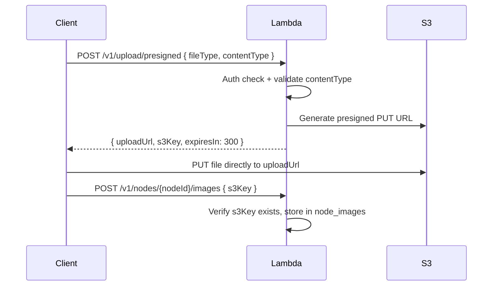

### Upload Constraints

- Max file size: 5MB (enforced via presigned URL policy).
- Allowed content types: `image/jpeg`, `image/webp`, `image/png`.
- S3 key format: `{env}/{type}/{ownerId}/{uuid}.{ext}`.
- File uploads never pass through Lambda — always direct to S3.

## Node Claiming and Business Onboarding Design

### Claim Flow

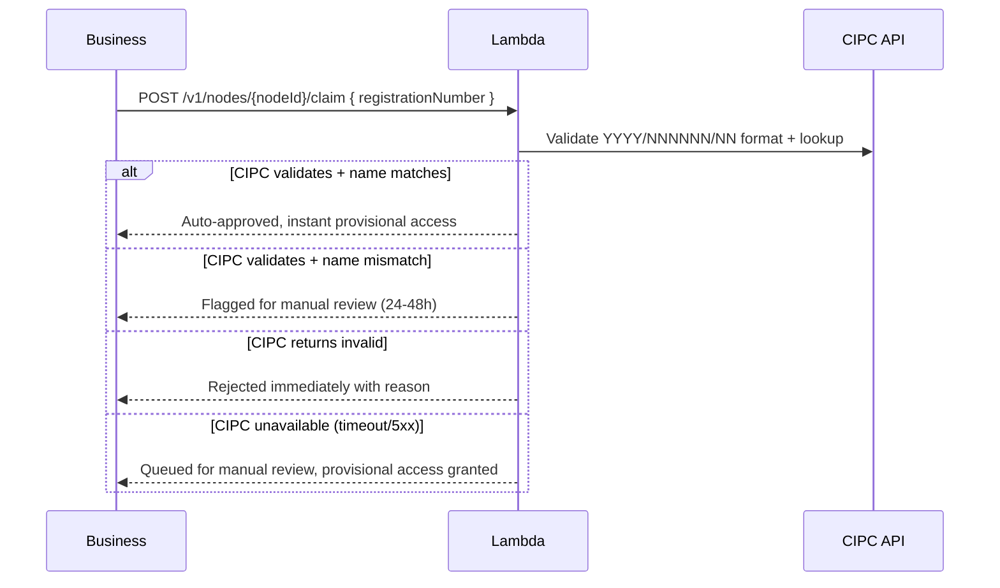

### Claim States

- `nodes.claim_status`: `unclaimed` → `pending` → `claimed`.
- `nodes.claim_cipc_status`: `validated`, `pending_manual`, `cipc_unavailable`, `rejected`.
- Provisional access: `unverified` badge on node. Rewards are live, badge remains until admin confirms.
- Only one pending claim per node. Additional applicants see "Claim in progress" and can submit counter-claim for admin review.

### New Node Creation

When venue doesn't exist: business fills form (name, address or map pin, category, optional photos). If Mapbox geocoding fails, "Pin it on the map" fallback — reverse-geocode coordinates to nearest suburb for display, `lat`/`lng` as source of truth.

## QR Code Fallback Check-In Design

### QR Token Generation

- QR encodes `areacode.co.za/qr/{nodeId}/{token}`.
- Token rotated every 15 minutes: `HMAC(nodeId + flooredTimestamp, serverSecret)`.
- Business enables via `qr_checkin_enabled = true` on node.

### QR Check-In Flow

1. Consumer scans QR → `POST /v1/check-in { nodeId, qrToken }`.
2. Backend validates token is unexpired and belongs to specified node.
3. GPS proximity verification bypassed for QR check-ins.
4. All other check-in rules (cooldown, velocity, rewards) still apply.

### Business QR Management (Settings Panel)

- Display QR at A4-printable resolution.
- "Download PNG" and "Regenerate" buttons.
- Regenerate invalidates old token and generates new URL token.

## Social Graph and Activity Feed Design

### Activity Feed Grouping

Feed groups check-ins by venue: "3 people you follow were at Assembly last night" — not 3 separate cards. Ungrouped only when 1 person at a venue. Feed cards surface reward claimed when applicable: "Aisha got a free filter at Truth Coffee" over "Aisha checked in to Truth Coffee".

### "Who's Here" Social Context

- Followed users present → names above avatar stack: "Sipho is here" or "Sipho and 2 others you follow are here".
- No followed users → tier composition below avatars: "Mostly Fixtures and Institutions". Omit if no data.
- Avatars tappable to full profile only when viewer and subject mutually follow. Non-mutual: tier badge + initials only.
- `GET /v1/nodes/{nodeId}/who-is-here` rate-limited: 20 req/10min/user.

### Follow Endpoints

```typescript
POST /v1/users/:id/follow     // Follow user
DELETE /v1/users/:id/follow   // Unfollow user
GET /v1/feed                   // Activity feed (grouped by venue)
```

## API Standards Design

### Versioning and Pagination

- All routes prefixed with `/v1/`. No unversioned routes.
- Cursor-based pagination on all list endpoints. Default limit 20, max 50. `limit > 50` rejected.
- Response format: `{ items, nextCursor, hasMore }`.

### CORS

Fastify CORS plugin with explicit allowed origins. Never `origin: '*'` in production. Dev adds `localhost` origins.

### Health Check

`GET /health` — no auth, no rate limit. Returns `{ status, env, version, timestamp, db, redis }`. DB or Redis unreachable → HTTP 503. Used for ECS ALB target health checks.

## Platform Safety Design

### Anti-Stalking Protections

1. `broadcast_location` toggle changes silently — no confirmation, no notification to followers, no email.
2. When OFF: live count badge not incremented, no toast emitted, user excluded from "who's here".
3. "Who's here" avatars tappable to full profile only on mutual follow.
4. `GET /nodes/{nodeId}/who-is-here` rate-limited to 20 req/10min/user, flagged on excess.
5. "Delete all check-in history" prominently in Profile → Privacy (not buried). Fast flow: one tap to view, one tap to delete. Hard delete after 30 days.

## Yoco Webhook Security Design

### Webhook Processing

1. `POST /v1/webhooks/yoco` — verify Yoco signature header. Invalid → 401 + log.
2. Deduplicate via `webhook_events` table (`UNIQUE(event_id)`). Duplicate → 200 (no-op).
3. Return 200 immediately after signature verification + dedup.
4. Process business logic async: `payment.succeeded` → update tier, `payment.failed` → trigger grace period.
5. Idempotent: same event ID processed twice causes no duplicate side effects.

## Viewport and Scroll Discipline Design

### Full-Bleed Screen Rules

| Screen | Viewport | Scrolling |
|--------|----------|-----------|
| Map | `100dvh × 100dvw` | No page scroll. Pinch-zoom only. |
| Business Dashboard | Each panel `100dvh` | Inner content scrolls, page does not. |
| Staff Validator | Full viewport | No page scroll. |

- No `max-w-*` wrappers on full-bleed screens.
- Bottom nav statically positioned — never scrolls with content.
- Use `flex flex-col` with `flex-1` for viewport fill — never `space-y-8` with fixed gaps.
- No page-level scroll bars on map, dashboard, or staff validator.

## CloudWatch Alarms and Monitoring Design

### Terraform-Defined Alarms

| Alarm | Threshold |
|-------|-----------|
| Check-in Lambda error rate | >10 errors in 2 periods of 60s |
| Lambda duration P95 | >400ms |
| RDS CPU | >80% |
| ElastiCache evictions | >0 |
| ECS task restarts | >2/hour |

### SLO Targets

| Endpoint | P95 Latency | Availability |
|----------|------------|-------------|
| `POST /v1/check-in` | ≤500ms | 99.5% |
| `GET /v1/nodes/{id}/detail` | ≤300ms | 99.9% |
| Socket city room join | ≤2s | 99.0% |
| `GET /v1/rewards/near-me` | ≤600ms | 99.5% |

Error budget: 0.5% monthly downtime on check-in (~3.6h). Breach triggers blameless post-mortem within 48h.

### RDS Backup Strategy

- Automated backups: 7-day retention in production, window 02:00–03:00 UTC.
- Manual snapshot `area-code-{env}-pre-migration-{date}` before migrations touching `check_ins` or `users`.

## Deployment and CI/CD Design

### Lambda Deployment

- Architecture: `arm64` (Graviton2). Runtime: `provided.al2023`.
- Bundled via esbuild to single JS file → zip → `aws lambda update-function-code`.
- Provisioned concurrency: check-in (min 2), node-detail (min 2), rewards-near-me (min 1).
- Rollback: prior artifact uploaded as `previous.zip` before each deploy.

### ECS Socket Server Deployment

- Docker build → push to ECR → `aws ecs update-service --force-new-deployment`.
- Rollback via prior task definition revision (immutable revisions).
- Includes Socket.io server + node state evaluator sidecar.

### Terraform Workflow

- `terraform plan` on PR, `terraform apply` on main merge.
- Remote state: S3 + DynamoDB (created manually before first `terraform init`).
- Environment directories (`dev/`, `prod/`) compose modules — never define resources directly.

### Branch Strategy

- `main` → production (protected, requires PR + passing checks).
- `develop` → staging.
- Feature branches merge to `develop` via PR.

### Database Migration Rollback

RDS snapshots before migrations touching `check_ins` or `users`. Documented point-in-time restore procedure.

## Expo Mobile App Configuration Design

### `apps/mobile/app.config.ts`

- Bundle identifiers: `co.za.areacode.app` (iOS + Android).
- Plugins: `@rnmapbox/maps` (with `MAPBOX_DOWNLOADS_TOKEN`), `expo-location`, `expo-notifications`.
- Location permission descriptions for iOS and Android.
- Deep link scheme: `areacode://`.

### EAS Build Profiles (`apps/mobile/eas.json`)

| Profile | Config |
|---------|--------|
| `development` | `developmentClient: true`, internal distribution |
| `preview` | Internal distribution |
| `production` | Production build |

### Universal Links

- Apple App Site Association and Android Asset Links files served from web app.
- `areacode.co.za/node/*` → Expo Router file-based routes: `app/(map)/node/[nodeSlug]`.

## Address and Geocoding Fallback Design

### Geocoding Strategy

1. Primary: Mapbox geocoding for address lookup.
2. Fallback: "Pin it on the map" — user drags pin to location.
3. Reverse-geocode pin coordinates to nearest suburb/neighbourhood for display.
4. `lat`/`lng` is source of truth — not the address string.

### Search Multilingual Support

`pg_trgm` trigram fuzzy matching handles multilingual name variants (e.g., "KwaZulu", "KZN", "Kwa-Zulu") and informal naming conventions. Minimum 2 characters before search executes.

## Business Consent Records (ECTA) Design

### ECTA Compliance

When a business accepts a subscription (Growth/Pro), insert into `business_consent_records`: `business_id`, `consent_version`, `tier`, `ip_address`, `accepted_at`. Records retained indefinitely for ECTA audit — never deleted.

## Engineering Quality Standards Design

### Enforcement

- File size: warning 300 lines, failure 400 lines. Function: warning 30 lines, failure 150 lines.
- Complexity: cyclomatic warning 10/failure 15, cognitive warning 15/failure 25, nesting warning 3/failure 4.
- CI/CD gates: coverage ≥80%, duplicated lines <3%, maintainability A/B, reliability A, security A, debt ratio <5%.
- ESLint flat config + Prettier (120 char) + Vitest + Husky (pre-commit: format+lint, pre-push: test).
- One component per file. No `any` in props. TypeScript strict mode, no exceptions.
- Every hook with subscription/interval must clean up in return function.
- No test files generated during implementation — testing deferred to post-implementation phase.


## Staff Validator Design (Req 13)

### Component Architecture

| Component | Location | Responsibility |
|-----------|----------|---------------|
| `StaffValidator` | `packages/features/staff/StaffValidator.tsx` | Main screen: code input + recent redemptions list |
| `RecentRedemptions` | `packages/features/staff/RecentRedemptions.tsx` | Scrollable list of validated codes with timestamps |

### Screen Layout

Full-bleed `100dvh` layout, no page-level scroll. Single column:
1. Business logo + node name header
2. 6-digit code input (large, centred, auto-focus, numeric keyboard)
3. Validation result banner (success green / failure red, auto-dismiss 5s)
4. Recent redemptions list (scrollable within remaining viewport)

### API Integration

```typescript
// Staff validates a redemption code
POST /v1/rewards/:id/redeem
Headers: { Authorization: Bearer <staffAccessToken> }
Body: { redemptionCode: string }
Response 200: { success: true, rewardTitle: string, redeemedAt: string }
Response 400: { error: 'invalid_code' | 'expired_code' | 'already_redeemed' }
```

### Privacy Constraint
Recent redemptions display `redemptionCode` + `timestamp` only. No user identity, no avatar, no username. This is enforced at the API level — the staff endpoint never returns user data.

### Auth Flow
- Staff login at `/staff/login` using `staffAuthStore` (8hr access token TTL)
- Staff invite acceptance at `/staff-invite/{token}` → OTP verification → account creation
- Failed route guard → redirect to `/staff/login` (never `/login`)


---

## City Leaderboard Design (Req 14)

### Data Flow

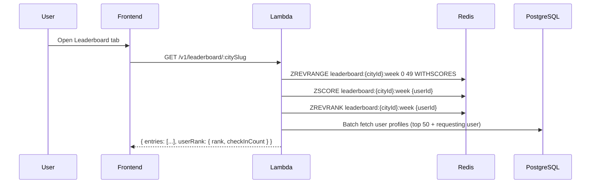

### Redis Structure

```
ZADD leaderboard:{cityId}:week {checkInCount} {userId}
```

- Incremented on every check-in via `ZINCRBY`
- Reset every Monday 00:00 SAST by `leaderboard-reset` worker using `RENAME + DEL` (atomic, never zeroing individual scores)

### Reset Worker Flow

1. **Sunday 20:00 SAST**: Pre-reset Lambda sends push to opted-in users with current rank
2. **Monday 00:00 SAST**: Reset Lambda:
   - `RENAME leaderboard:{cityId}:week leaderboard:{cityId}:week:prev`
   - Read top 50 from `:prev` key
   - INSERT into `leaderboard_history` (city_id, week_ending, user_id, rank, check_in_count)
   - Send push to top 10: "You finished #{rank} in {cityName} this week."
   - `DEL leaderboard:{cityId}:week:prev`

### Frontend Component

| Component | Location | Responsibility |
|-----------|----------|---------------|
| `Leaderboard` | `packages/features/social/Leaderboard.tsx` | Top 50 list + pinned user rank at bottom |
| `LeaderboardRecap` | `packages/features/social/LeaderboardRecap.tsx` | Monday recap card: prior week top 3 + user rank, auto-dismiss 8s |

### Display Rules
- Top 50 shown with rank, avatar, username, tier badge, check-in count
- User's own rank pinned at bottom if outside top 50 (separator line above)
- Accessible from bottom nav (trophy icon)


---

## Search Design (Req 16)

### Component Architecture

| Component | Location | Responsibility |
|-----------|----------|---------------|
| `SearchSheet` | `packages/features/discovery/SearchSheet.tsx` | Bottom sheet with search input + results sections |

### Search Flow

1. User taps search icon (top-right of map)
2. `SearchSheet` slides up as Bottom_Sheet
3. Input field auto-focuses, numeric keyboard suppressed
4. 300ms debounce, 2-char minimum before API call
5. Results in two sections: "Nearby" and "Trending in {cityName}"
6. Tap result → close sheet → `mapStore.mapInstance.flyTo(node)` → auto-open NodeDetail sheet

### Backend Search

```typescript
GET /v1/nodes/search?q={query}&lat={lat}&lng={lng}
```

- PostgreSQL `pg_trgm` trigram fuzzy matching on `nodes.name`
- Results sorted by `similarity(name, query) * (1 / ST_Distance(location, point)) * pulseScore`
- Handles multilingual variants: "KwaZulu", "KZN", "Kwa-Zulu" all match via trigram similarity
- Minimum 2 characters enforced server-side (400 if fewer)
- Returns max 20 results

### Index

```sql
CREATE INDEX idx_nodes_name_trgm ON nodes USING GIN (name gin_trgm_ops);
```


---

## Privacy / POPIA Design (Req 17)

### Consent Architecture

Consent is append-only. The latest `consent_records` row per user is the source of truth. `broadcast_location` is never a column on `users`.

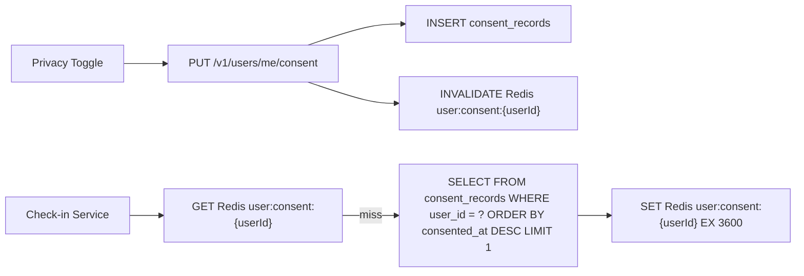

### Consent Fields

| Field | Default | Effect |
|-------|---------|--------|
| `broadcast_location` | `true` | Controls: who's here visibility, toast emission, live count increment |
| `analytics_opt_in` | `false` | Controls: inclusion in anonymised city insights |

### Privacy Toggle Behaviour
- Located in Profile → Privacy (top section, single toggle)
- Changes silently — no confirmation dialog, no notification to followers, no email
- Immediate effect: Redis cache invalidated, next check-in respects new setting

### Data Deletion Flow
1. User taps "Delete all check-in history" in Profile → Privacy
2. Soft-delete: `check_ins` rows marked with `deleted_at` timestamp
3. Hard-delete: `cleanup` worker processes after 30 days (POPIA Article 14)
4. Export available as CSV before deletion via `POST /v1/users/me/export-history`

### Consent Versioning
- Format: `v{major}.{minor}` stored in Lambda env var `AREA_CODE_CONSENT_VERSION`
- Major version bump → re-consent Bottom_Sheet on next app open
- Minor version bump → no re-consent required

### Aggregation Rule
No data point in any API response or report may represent fewer than 20 unique users. Enforced in the Audience panel service layer.


---

## Anonymous User Experience Design (Req 19)

### Access Matrix

| Feature | Anonymous | Authenticated |
|---------|-----------|---------------|
| Map browsing | Yes | Yes |
| Node markers (colour, size, state) | Yes | Yes |
| Node name, category, address | Yes | Yes |
| Today's check-in count (number) | Yes | Yes |
| Reward count ("2 active rewards") | Yes | Yes |
| Check-in | No → sign-up sheet | Yes |
| Who's here (avatars) | No → sign-up sheet | Yes |
| Reward details | No → sign-up sheet | Yes |
| Leaderboard | No → sign-up sheet | Yes |
| User profiles | No → sign-up sheet | Yes |
| Toasts + pulse updates | Yes (city room) | Yes |

### Socket Behaviour
- Anonymous: joins `city:{citySlug}` only (no `user:` room)
- Receives `node:pulse_update`, `toast:new`, `node:state_surge`
- Cannot emit `presence:join` or `presence:leave`

### Sign-Up Bottom Sheet
Triggered on any gated action. Slides up with:
- "Sign up to check in, earn rewards, and join the leaderboard"
- "I'm a customer" / "I'm a business" buttons
- Routes to `/signup/consumer` or `/signup/business`
- Never redirects to a separate `/login` page


---

## User Tiers and Profile Design (Req 20)

### Tier Thresholds

| Tier | Check-ins | Badge Colour | Badge Style |
|------|-----------|-------------|-------------|
| Local | 0–9 | `--tier-local` (#606078) | Grey, static |
| Regular | 10–49 | `--tier-regular` (#cd7f32) | Bronze, static |
| Fixture | 50–149 | `--tier-fixture` (#c0c0c0) | Silver, static |
| Institution | 150–499 | `--tier-institution` (#ffd700) | Gold, static |
| Legend | 500+ | Animated gradient | Gradient shimmer animation |

### Tier Calculation
```typescript
function getTier(totalCheckIns: number): Tier {
  if (totalCheckIns >= 500) return 'legend'
  if (totalCheckIns >= 150) return 'institution'
  if (totalCheckIns >= 50) return 'fixture'
  if (totalCheckIns >= 10) return 'regular'
  return 'local'
}
```

Tier is recalculated on every check-in and stored on `users.tier`. Admin can manually override via admin panel.

### Profile Screen Layout

| Section | Content |
|---------|---------|
| Header | Avatar + tier badge, username, display name, city |
| Stats row | Total check-ins, current streak, current tier |
| Streak badge | Persistent bottom-left above nav when streak > 0 |
| Check-in history | Paginated list (cursor-based) |
| Badge collection | Grid of earned tier badges |

### Streak Badge
- SVG flame icon, positioned bottom-left above nav bar
- Colour: `--warning` when streak ≥ 3, `--text-muted` when 1–2
- Tap → micro-sheet: "{N}-night streak. Check in today to keep it." + progress dots
- Pulses once (subtle) after 18:00 local if no check-in today
- Streak = consecutive days with ≥1 check-in, day boundary 00:00–23:59 SAST


---

## Share / Deep Links Design (Req 21)

### URL Scheme

| Platform | Pattern | Handler |
|----------|---------|---------|
| Web | `areacode.co.za/node/{nodeSlug}` | Expo Router web route |
| Mobile universal link | `areacode.co.za/node/{nodeSlug}` | Apple AASA / Android Asset Links → Expo Router |
| Mobile custom scheme | `areacode://node/{nodeSlug}` | Expo Router deep link |
| QR check-in | `areacode.co.za/qr/{nodeId}/{token}` | Check-in handler (bypasses GPS) |
| Staff invite | `areacode.co.za/staff-invite/{token}` | Staff invite acceptance flow |

### Share Flow

1. User taps "Share node" from NodeDetail 3-dot menu
2. Call `navigator.share()` (web) or `Share.share()` (RN) with:
   - URL: `areacode.co.za/node/{nodeSlug}`
   - Text: "Check this out on Area Code"
3. Fallback: copy URL to clipboard if share API unavailable

### Deep Link Resolution

1. URL opened → Expo Router matches route
2. Fetch node by slug: `GET /v1/nodes/{nodeSlug}/public` (no auth)
3. `mapStore.mapInstance.flyTo({ center: [lng, lat], zoom: 16 })`
4. Auto-open NodeDetail bottom sheet

### OG Tags (Public Endpoint)

```typescript
GET /v1/nodes/{nodeSlug}/public
// No auth required
Response: {
  name: string
  category: string
  city: string
  pulseScore: number
  activeRewardCount: number
  ogImage: string // S3 URL or generated
}
```

Used by web app SSR/meta tags for social sharing previews.


---

## Report / Flag Design (Req 22)

### Report Flow

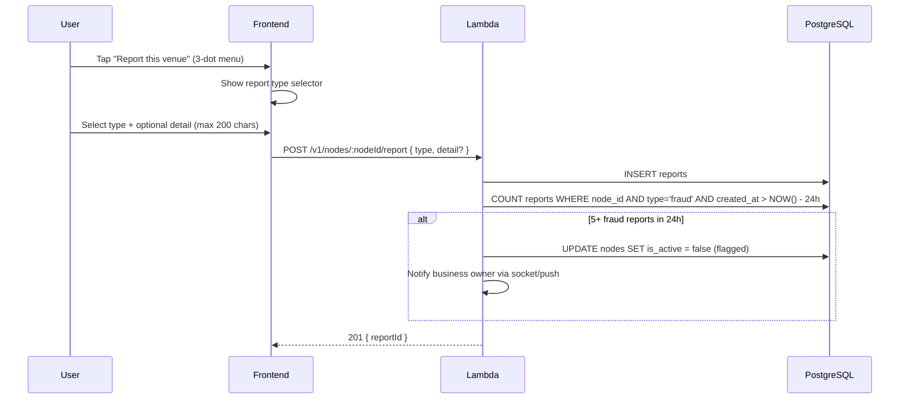

### Report Types
`wrong_location` | `permanently_closed` | `fake_rewards` | `offensive_content` | `other`

### Auto-Flag Rules
- 5+ fraud reports (`fake_rewards`) in 24 hours → node hidden from trending, pending review
- Business notified: "Your node has been reported and is under review."
- Business can appeal via Settings panel (max 500 chars + optional photo)

### Reporter Ban
- 3 rejected reports in 30 days → reporter banned from submitting further reports
- Tracked via `reports.status = 'dismissed'` count per `reporter_id`

### Privacy
Reporter identity is never revealed to the node owner. Admin can see reporter_id in the admin panel.


---

## Push Notifications Design (Req 23)

### Notification Types and Limits

| Type | Default | Max Frequency | Delivery |
|------|---------|--------------|----------|
| Streak at risk | OFF | 1/day | Push only |
| Reward activated at regulars | OFF | 2/day | Push only |
| Leaderboard pre-reset | OFF | 1/week (Sun 20:00 SAST) | Push only |
| Top 10 result | ON | 1/week (Mon 00:00 SAST) | Push only |
| Reward claimed | ON | Per-event | Socket primary, 60s push fallback |

### Delivery Architecture

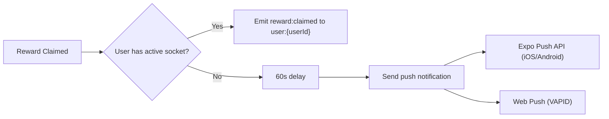

### Push Token Management
- Stored in `user_push_tokens` table with platform (`expo` | `web`), device_id
- `DeviceNotRegistered` error → set `is_active = false`
- Unique constraint on `(user_id, token)` prevents duplicates

### Permission Priming Flow
1. After first successful check-in, show personalised value hook Bottom_Sheet
2. Use nearby recent check-in event if available, else fall back to value list
3. "Not now" → defer 7 days via Redis `notif:deferred:{userId}` EX 604800
4. Never ask twice in one session

### Rate Limiting
- Reward push: max 2/day/user via Redis `reward_notifications_today:{userId}` with 86400s TTL
- Never push for: toast events, pulse changes, other users' check-ins


---

## Offline / Connectivity Design (Req 24)

### State Machine

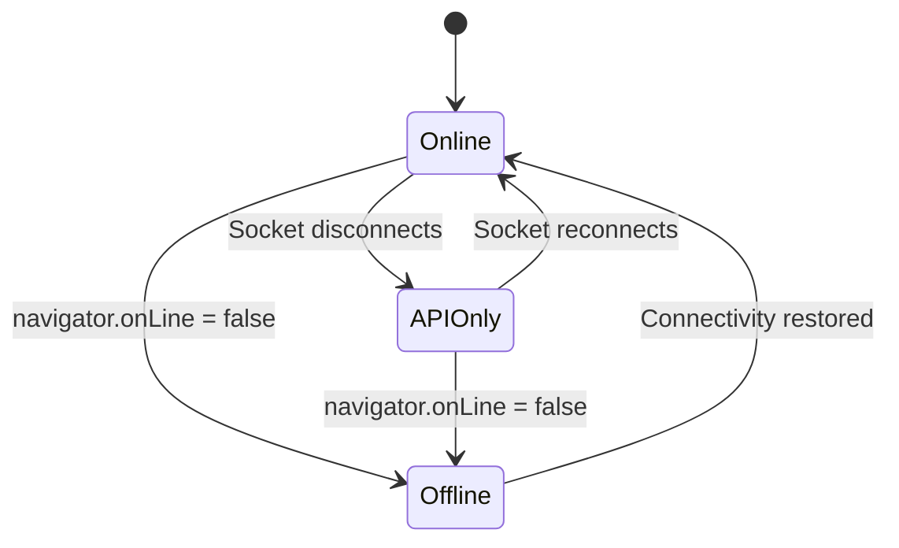

### UI States

| State | Banner | Check-in | Toasts | Map |
|-------|--------|----------|--------|-----|
| Online | None | Enabled | Live | Live |
| API Only | Dot indicator "Live updates paused" | Enabled | Paused | Cached + 30s poll |
| Offline | "No connection. Check-ins paused." | Greyed out "Connect to check in" | Hidden | Cached tiles, "Last updated Xm ago" |

### Reconnection Strategy
- Socket.io: exponential backoff with jitter (`baseDelay: 1000ms, maxDelay: 30000ms, jitter: true`)
- On reconnect: replay last 5 minutes of events only (not full outage backlog)
- Silently resume, dismiss indicators

### Caching
- Node states persisted to `localStorage`/`AsyncStorage` via Zustand persist middleware
- User profile and tier cached indefinitely
- Rewards never cached (always fresh from API)
- Redis pub/sub queue capped at 500 events per city


---

## Data Saver / Performance Tiers Design (Req 25)

### Data Saver Mode

Activated when `navigator.connection.saveData === true` or user enables in Profile → Settings.

| Feature | Normal | Data Saver |
|---------|--------|------------|
| Map tiles | Vector (live) | Static raster |
| Real-time | Socket.io | 30s polling |
| Avatars | Images | Initials placeholders |
| Background refetch | Enabled | Disabled |
| Blur halos | Enabled | Disabled |
| Triple-layer glow | Enabled | Disabled |
| Lottie animations | Enabled | CSS transitions |
| Nav indicator | None | "D" badge (tappable) |

### Device Performance Tiers

Detection: `navigator.hardwareConcurrency` + 500ms frame-rate probe on first map load.

| Tier | Cores | FPS | Adjustments |
|------|-------|-----|-------------|
| High | 4+ | 55+ | Full experience |
| Mid | 2–3 | 30–54 | Disable 3D buildings, halve blur halo opacity |
| Low | 1–2 | <30 | Disable 3D buildings + blur halos, reduce pitch to 20°, `reducedMotion: true` |

Nodes still breathe and pulse at all tiers — reduction is cosmetic depth only.


---

## Context-Aware Navigation Design (Req 26)

### Time-Based Default Tab

| Time (SAST) | Default Tab | Rationale |
|-------------|-------------|-----------|
| 00:00–17:00 | Rewards | Discovery mode — users browsing for deals |
| 17:00–23:59 | Leaderboard | Social mode — evening activity, competition |

### Implementation

```typescript
// navigationStore
interface NavigationState {
  activeDefaultTab: 'rewards' | 'leaderboard'
  hasNavigated: boolean // true once user manually switches tab
}

// useEffect on mount + foreground
const hour = new Date().toLocaleString('en-ZA', { timeZone: 'Africa/Johannesburg', hour: 'numeric', hour12: false })
const defaultTab = parseInt(hour) >= 17 ? 'leaderboard' : 'rewards'
if (!state.hasNavigated) {
  state.activeDefaultTab = defaultTab
}
```

No server call required. `hasNavigated` resets on fresh app open (not on foreground resume).


---

## First-Time Onboarding Design (Req 27)

### Hint Sequence

| Trigger | Hint | Display | Dismiss |
|---------|------|---------|---------|
| First app open | "Tap any dot to explore" pill at map centre | Fade in after 1.5s | [×] button or first node tap |
| First layer-swipe attempt | "← Social  Trending  Rewards →" at map edge | Immediate | 3s timeout or first successful swipe |
| First check-in | Toast: "You're on the map." | Standard toast display | 4s auto-dismiss |

### State Tracking

```typescript
// userStore
interface OnboardingState {
  hintSeen: boolean      // "Tap any dot" pill
  layerHintSeen: boolean // Layer swipe hint
  firstCheckIn: boolean  // First check-in completed
}
```

Persisted to `localStorage`/`AsyncStorage`. Hints never shown twice.

### Design Rules
- No tutorial screens, no modals, no overlays blocking interaction
- No confetti, no particle effects on first check-in
- Hints are contextual and non-blocking


---

## Admin Panel Design (Req 28)

### App Architecture

Separate React + Vite app at `apps/admin/`, own Cognito pool (`area-code-admin`), route prefix `/admin`.

### Role-Based Access

| Feature | super_admin | support_agent | content_moderator |
|---------|-------------|---------------|-------------------|
| Consumer management | Full | View + message | No |
| Business management | Full | View + extend trial | No |
| Node management | Full | No | Full |
| Report queue | Full | No | Full |
| Claim review | Full | No | Full |
| POPIA audit | Full | View consent | No |
| Impersonation | Read-only + mandatory note | No | No |
| Delete/disable accounts | Yes | No | No |

### Admin Screens

| Screen | Key Actions |
|--------|-------------|
| Consumer Users | Search, view history, disable/enable, reset abuse flags, recalculate tier, override streak, process erasure, view push tokens, view consent, send messages |
| Business Accounts | View subscription/payments, extend trial, view/revoke staff, force-deactivate rewards, CIPC override, QR token management |
| Report Queue | Nodes with 3+ reports of same type surfaced first, review/dismiss/action |
| POPIA Audit | Per-user consent view, re-consent export, erasure queue with countdown, data access log |

### Audit Logging

Every admin action inserts into `audit_log`:
```typescript
{
  admin_id: UUID,
  admin_role: string,
  action: string,        // e.g. 'disable_user', 'override_tier'
  entity_type: string,   // e.g. 'user', 'business', 'node'
  entity_id: UUID,
  before_state: JSONB,
  after_state: JSONB,
  note: string | null
}
```

### Impersonation
- Super_admin only, read-only access
- Mandatory `note` field (API rejects without it)
- Logged to `impersonation_log` with `started_at`, `ended_at`
- Admin messages delivered via Socket (primary) + push fallback, never email


---

## Abuse Prevention Design (Req 29)

### Detection Rules

| Rule | Trigger | Action |
|------|---------|--------|
| Device velocity | Same fingerprint, >3 check-ins at different nodes in 30 min | Flag for review |
| IP subnet | >3 users from same /28 subnet within 50m in 1 hour | Flag all users for review |
| Pulse anomaly | Node jumped ≥2 states in <2 minutes | Auto-suppress + flag node + notify admin |
| Reward drain | Same device claiming >2 rewards at same node in 24h | Auto-block + flag |
| New account velocity | Account <24h old, >3 check-ins | Rate-limit to 1/hour |

### Auto-Action vs Review

Only pulse anomaly and reward drain are auto-suppressed (high confidence). Device velocity, IP subnet, and new account velocity flag for admin review without auto-action.

### Device Fingerprinting

| Platform | Method |
|----------|--------|
| Web | FingerprintJS Pro → SHA-256 hash |
| iOS/Android | Device UUID + model hash |

Stored in `device_fingerprints` table linked to `user_id`. Multiple accounts sharing a fingerprint are flagged but never auto-blocked (shared devices exist).

### Check-in Pipeline Integration

Abuse checks run after proximity validation, before DB insert:
```
JWT verify → proximity check → cooldown check → ABUSE CHECKS → insert check_in → ...
```

If flagged with auto-action: return 429 with generic message. If flagged without auto-action: allow check-in, create `abuse_flags` record asynchronously.


---

## Cross-Platform Abstraction Design (Req 34)

### Primitive Mapping

| Primitive | Web | Mobile |
|-----------|-----|--------|
| `Box` | `<div>` | `<View>` |
| `Text` | `<span>` | `<Text>` |
| `Row` | `<div style="flexDirection: row">` | `<View style="flexDirection: row">` |

### Platform Access Rules

No file in `packages/` may import:
- `window`, `document`, `navigator`, `localStorage`, `sessionStorage` directly
- All access through `packages/shared/lib/storage.ts` and `packages/shared/lib/platform.ts`

No shared component uses `<div>`, `<span>`, or `<p>` directly — only primitives.

### Animation Abstraction

| Feature | Web | Mobile |
|---------|-----|--------|
| Spring animations | Framer Motion | React Native Reanimated v3 |
| Wrapper | `AnimatedNode` component | `AnimatedNode` component |

Feature components never import Framer Motion or Reanimated directly.

### Map Abstraction

| Platform | Engine | Wrapper |
|----------|--------|---------|
| Web | Mapbox GL JS | `<MapView>` in `packages/shared/components/` |
| Mobile | `@rnmapbox/maps` | `<MapView>` with identical props interface |

Props interface defined in `packages/shared/types/map.ts`.

### Styling
- NativeWind v4 class names for all styling
- No CSS grid in shared components (flex only)
- No inline style objects
- Expo Router for all navigation (never React Router DOM)


---

## GPS Failure States Design (Req 35)

### State Machine

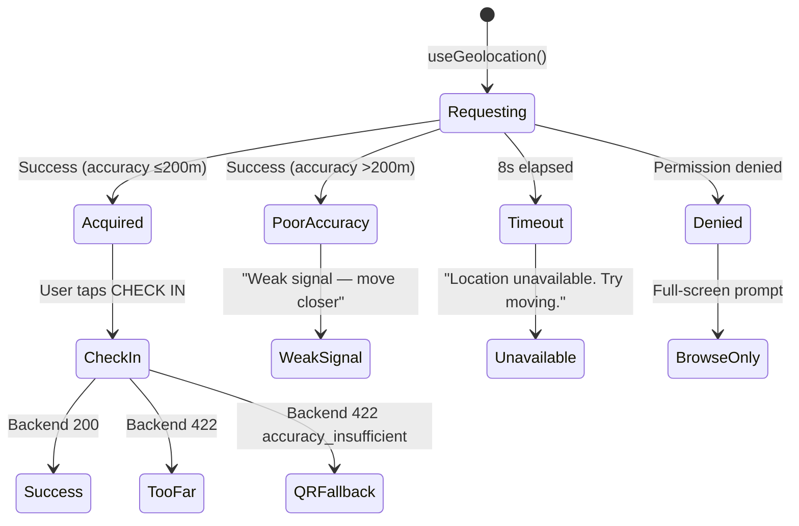

### UI Responses

| State | UI Element | Text |
|-------|-----------|------|
| Permission denied | Full-screen prompt | "Area Code needs your location to check in." + [Enable] + [Browse only] |
| Poor accuracy | CHECK IN button label | "Weak signal — move closer to the entrance" |
| Timeout (8s) | CHECK IN button label | "Location unavailable. Try moving to an open area." |
| Backend 422 (accuracy) | QR fallback prompt | "Scan the venue's QR code to check in" |
| Browse only | Map visible, check-in disabled | Map renders normally, CHECK IN greyed out |


---

## i18n Preparation Design (Req 36)

### Architecture

| Platform | Library | Config Location |
|----------|---------|----------------|
| Web | `i18next` + `react-i18next` | `apps/web/src/i18n/` |
| Mobile | `i18n-js` | `apps/mobile/src/i18n/` |

### Translation Key Convention

```typescript
// All user-facing strings use translation keys
t('check_in.button_label')       // "Check In"
t('check_in.checking_in')        // "Checking in..."
t('check_in.cooldown', { time }) // "Available in {time}"
t('toast.surge', { nodeName })   // "{nodeName} is surging right now"
```

No hardcoded English strings in components. V1 ships English only. V2 Afrikaans support = translation file drop, no component changes.

### File Structure

```
apps/web/src/i18n/
  config.ts          // i18next init
  locales/
    en.json          // English translations
    // af.json        // V2: Afrikaans
```


---

## Rewards Discovery Layer Design (Req 38)

### Map Layer Behaviour

When user swipes to Rewards layer:
1. All nodes without active rewards dim to 20% opacity
2. Nodes with active rewards render at full brightness
3. Reward pill appears above each reward node: `"{rewardTitle} · {slotsRemaining} left"`
4. Pill fades in with spring animation
5. Tap pill → open NodeDetail bottom sheet

### Rewards Feed Screen

Accessible from bottom nav (rewards icon). Two sections:

| Section | Sort | Filter |
|---------|------|--------|
| "Rewards Near You" | proximity × scarcity | Active rewards within 5km |
| "Rewards at Your Regulars" | recency | Nodes with 3+ user check-ins |

### API

```typescript
GET /v1/rewards/near-me?lat={lat}&lng={lng}
// Returns active rewards within 5km
// Sorted by: (1 / distance) * (total_slots / (total_slots - claimed_count + 1))
// Auth required (consumer)
```

### Push Notification
When a reward activates at a node the user has previously visited:
- Push: "New reward at {nodeName} — {slotsRemaining} slots open now."
- Max 2 reward pushes/day/user via Redis counter


---

## Image Upload Design (Req 39)

### Presigned URL Flow

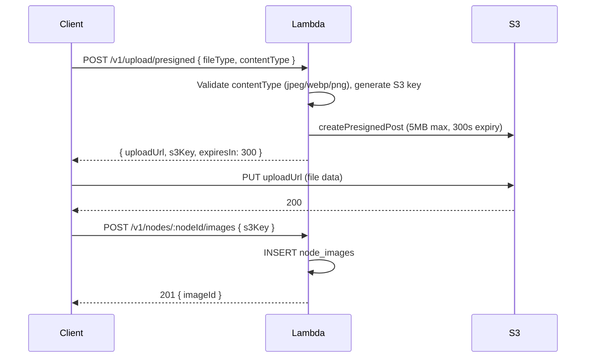

### S3 Key Format
```
{env}/{type}/{ownerId}/{uuid}.{ext}
// e.g. prod/node_image/abc123/550e8400-e29b.jpeg
```

### Constraints
- Max file size: 5MB (enforced via presigned URL policy)
- Allowed types: `image/jpeg`, `image/webp`, `image/png`
- File data never passes through Lambda — direct S3 upload only
- `fileType`: `node_image` | `avatar` | `business_logo`


---

## Deployment / CI/CD Design (Reqs 40, 43)

### Lambda Deployment Pipeline

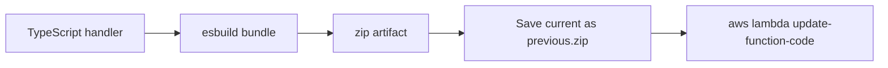

Rollback: upload `previous.zip` via single command.

### ECS Deployment Pipeline

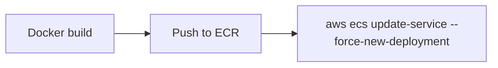

Rollback: prior task definition revision (immutable).

### Terraform Pipeline
- PR: `terraform plan` (GitHub Actions)
- Merge to main: `terraform apply`
- Remote state: S3 + DynamoDB

### Branch Strategy

| Branch | Deploys to | Protection |
|--------|-----------|------------|
| `main` | Production | PR required + passing checks |
| `develop` | Staging | PR required |
| `feature/*` | — | Merges to `develop` via PR |

### Quality Gates (CI)
- Code coverage ≥80%
- Duplicated lines <3%
- Maintainability rating A or B
- Reliability rating A
- Security rating A
- Technical debt ratio <5%
- ESLint + TypeScript `tsc --noEmit` + Vitest

### Database Rollback
- RDS snapshots before migrations on `check_ins`/`users` tables
- Named: `area-code-{env}-pre-migration-{date}`
- Point-in-time restore procedure documented

### Prerequisites
- AWS SNS SMS sandbox exit (OTP delivery)
- AWS SES sandbox exit (transactional email)
- Secrets in AWS Secrets Manager: `area-code/{env}/{service}`
- Terraform remote state backend created manually before first `terraform init`


---

## API Standards Design (Req 41)

### Route Versioning
All routes prefixed with `/v1/`. No unversioned routes. Future breaking changes coexist as `/v2/` alongside `/v1/`.

### Pagination

All list endpoints use cursor-based pagination:

```typescript
// Request
GET /v1/feed?cursor={opaqueCursor}&limit=20

// Response
{
  items: T[],
  nextCursor: string | null,
  hasMore: boolean
}
```

- Default limit: 20
- Max limit: 50
- `limit > 50` → 400 error
- Never offset-based pagination

### CORS

```typescript
// Fastify CORS config
{
  origin: process.env.NODE_ENV === 'production'
    ? ['https://areacode.co.za', 'https://business.areacode.co.za', 'https://staff.areacode.co.za', 'https://admin.areacode.co.za']
    : ['http://localhost:3000', 'http://localhost:3001', 'http://localhost:3002', 'http://localhost:3003'],
  credentials: true
}
// Never origin: '*' in production
```

### Health Check

```typescript
GET /health
// No auth, no rate limit
Response 200: { status: 'ok', env: string, version: string, timestamp: string, db: 'connected', redis: 'connected' }
Response 503: { status: 'degraded', db: 'connected' | 'unreachable', redis: 'connected' | 'unreachable' }
```

Used by ECS ALB target health checks.

### Error Response Format

```typescript
{
  error: string,        // Machine-readable error code
  message: string,      // Human-readable message
  statusCode: number
}
```


---

## Expo Mobile Config Design (Req 42)

### app.config.ts

```typescript
export default {
  name: 'Area Code',
  slug: 'area-code',
  scheme: 'areacode',
  ios: {
    bundleIdentifier: 'co.za.areacode.app',
    infoPlist: {
      NSLocationWhenInUseUsageDescription: 'Area Code uses your location to check in to nearby venues.',
      NSLocationAlwaysUsageDescription: undefined // Never request always-on
    }
  },
  android: {
    package: 'co.za.areacode.app',
    permissions: ['ACCESS_FINE_LOCATION']
  },
  plugins: [
    ['@rnmapbox/maps', { RNMapboxMapsDownloadToken: process.env.MAPBOX_DOWNLOADS_TOKEN }],
    'expo-location',
    'expo-notifications'
  ]
}
```

### Deep Link Mapping

| URL | Expo Router Route |
|-----|-------------------|
| `areacode://node/{nodeSlug}` | `app/(map)/node/[nodeSlug]` |
| `areacode://qr/{nodeId}/{token}` | `app/(map)/qr/[nodeId]/[token]` |
| `areacode://staff-invite/{token}` | `app/staff-invite/[token]` |

### Universal Links
- Apple: `.well-known/apple-app-site-association` served from web app
- Android: `.well-known/assetlinks.json` served from web app
- Pattern: `areacode.co.za/node/*`

### EAS Build Profiles (eas.json)

| Profile | Distribution | Dev Client | Use |
|---------|-------------|------------|-----|
| `development` | internal | Yes | Local dev with dev client |
| `preview` | internal | No | Internal testing |
| `production` | store | No | App Store / Play Store |


---

## Platform Safety Design (Req 44)

### Silent Privacy Toggle
- `broadcast_location` toggle changes silently
- No confirmation dialog, no "your followers will be notified", no email
- Immediate effect on next check-in

### Broadcast Location = false Effects

| Feature | Behaviour |
|---------|-----------|
| Who's here avatars | User excluded |
| Live count badge | Not incremented for this user's check-in |
| Toast emission | No toast for this user's check-in |
| Pulse score | Still updated on backend (anonymous contribution) |
| Check-in record | Still stored (user_id, node_id, type, checked_in_at) |

### Stalking Guards
- "Who's here" avatars tappable to full profile only on mutual follow
- Non-mutual: tier badge + initials only
- `GET /nodes/{nodeId}/who-is-here` rate-limited: 20 req/10min/user, 429 + flag on excess

### Data Deletion
- "Delete all check-in history" prominently in Profile → Privacy (not buried)
- Fast flow: one tap to view → one tap to delete
- Soft-delete immediately, hard-delete after 30 days (POPIA Article 14)


---

## CloudWatch / Monitoring Design (Req 47)

### CloudWatch Alarms (Terraform-defined)

| Alarm | Metric | Threshold | Period |
|-------|--------|-----------|--------|
| Check-in Lambda errors | Errors | >10 | 2 × 60s |
| Lambda duration P95 | Duration | >400ms | 60s |
| RDS CPU | CPUUtilization | >80% | 300s |
| ElastiCache evictions | Evictions | >0 | 300s |
| ECS task restarts | RunningTaskCount delta | >2/hour | 3600s |

All alarms notify SNS topic subscribed to engineering team.

### SLO Targets

| Endpoint | P95 Latency | Availability |
|----------|-------------|-------------|
| `POST /v1/check-in` | ≤500ms | 99.5% |
| `GET /v1/nodes/{id}/detail` | ≤300ms | 99.9% |
| Socket city room join | ≤2s | 99.0% |
| `GET /v1/rewards/near-me` | ≤600ms | 99.5% |

### Error Budget
- 0.5% monthly downtime on check-in (~3.6 hours)
- Breach → blameless post-mortem within 48 hours

### RDS Backups
- Automated: 7-day retention, 02:00–03:00 UTC window
- Manual snapshots before migrations on `check_ins`/`users`: `area-code-{env}-pre-migration-{date}`

### Mapbox Cost Monitoring
- Weekly map load count review in CloudWatch
- Alert at 80% of monthly Mapbox budget
- If >$1,000/month → evaluate MapLibre GL JS + self-hosted Maptiler tiles


---

## Address / Geocoding Fallback Design (Req 48)

### Node Creation Flow

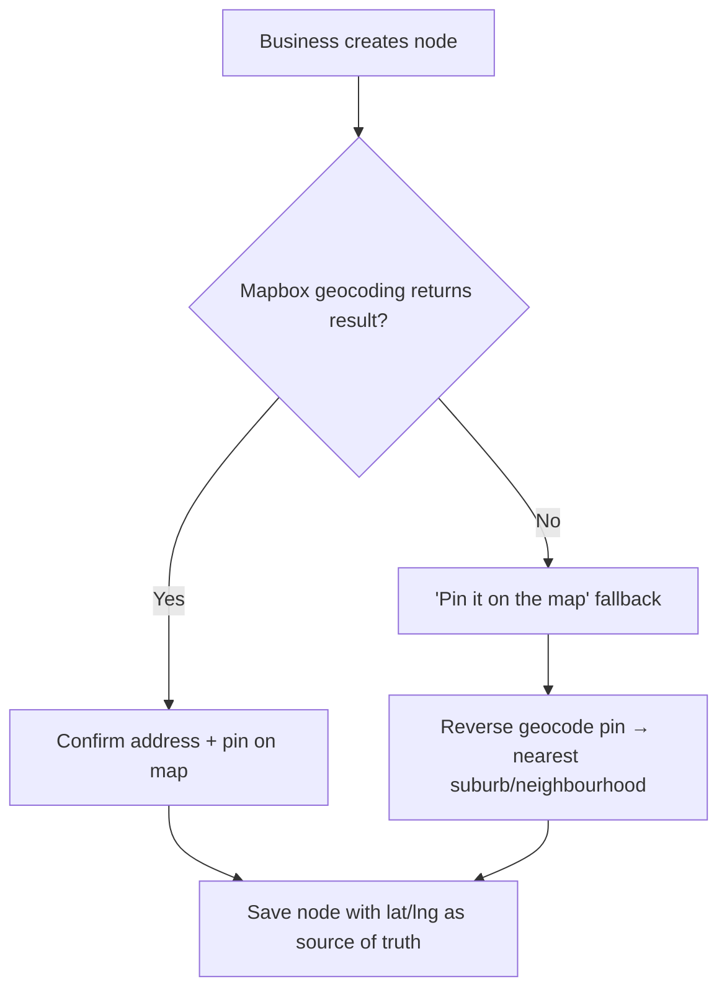

### Design Rules
- `lat`/`lng` is always the source of truth, not the address string
- Reverse geocoding provides display-friendly suburb/neighbourhood name
- Handles informal settlements and backyard businesses where formal addresses don't exist

### Search Integration
- `pg_trgm` trigram fuzzy matching on `nodes.name` in addition to Mapbox text search
- Handles multilingual variants: "KwaZulu" / "KZN" / "Kwa-Zulu" all match
- Minimum 2 characters before search executes
- GIN index on `nodes.name` for trigram operations

```sql
-- Search query pattern
SELECT *, similarity(name, $1) AS sim
FROM nodes
WHERE similarity(name, $1) > 0.3
  AND city_id = $2
ORDER BY sim * (1.0 / ST_Distance(location, ST_SetSRID(ST_MakePoint($3, $4), 4326)::geography)) * COALESCE(pulse_score, 1) DESC
LIMIT 20;
```


---

## Nearby Recent Feed Endpoint Design (Req 53)

### Endpoint

```typescript
GET /v1/feed/nearby-recent?lat={lat}&lng={lng}&radiusMetres=1000&withinMinutes=10
Auth: consumer JWT required
Rate limit: 10 req/min/user
```

### Response

```typescript
{
  event: {
    username: string      // display name only, never @handle or user ID
    nodeName: string
    distanceMetres: number
    minutesAgo: number
  } | null
}
```

### Query

```sql
SELECT u.display_name, n.name AS node_name,
  ST_Distance(
    n.location::geography,
    ST_SetSRID(ST_MakePoint($lng, $lat), 4326)::geography
  ) AS distance_metres,
  EXTRACT(EPOCH FROM (NOW() - ci.checked_in_at)) / 60 AS minutes_ago
FROM check_ins ci
JOIN users u ON u.id = ci.user_id
JOIN nodes n ON n.id = ci.node_id
JOIN consent_records cr ON cr.user_id = ci.user_id
  AND cr.consented_at = (SELECT MAX(consented_at) FROM consent_records WHERE user_id = ci.user_id)
WHERE ci.checked_in_at > NOW() - INTERVAL '10 minutes'
  AND cr.broadcast_location = true
  AND ST_DWithin(
    n.location::geography,
    ST_SetSRID(ST_MakePoint($lng, $lat), 4326)::geography,
    $radiusMetres
  )
ORDER BY ci.checked_in_at DESC
LIMIT 1;
```

### Usage

Called by the notification permission priming flow after first successful check-in. If `event` is non-null, the priming bottom sheet uses the personalised hook ("Sipho just checked in to Truth Coffee, 0.4km away"). If null, falls back to the generic value list.


---

## User Profile Update Design (Req 54)

### Endpoint

```typescript
PATCH /v1/users/me
Auth: consumer JWT required
Body: { displayName?: string, avatarUrl?: string | null, citySlug?: string }
Response 200: UserProfile
Response 422: { error: 'invalid_city', message: 'City not found' }
```

### Validation (Zod)

```typescript
const updateProfileSchema = z.object({
  displayName: z.string().min(1).max(50).optional(),
  avatarUrl: z.string().url().nullable().optional(),
  citySlug: z.string().min(1).optional(),
})
```

### Service Logic

1. If `citySlug` provided: verify city exists in `cities` table → 422 if not found.
2. Update `users` row with provided fields only (partial update).
3. Return updated user profile.


---

## Push Token Registration Design (Req 55)

### Endpoint

```typescript
POST /v1/users/me/push-token
Auth: consumer JWT required
Body: { token: string, platform: 'expo' | 'web', deviceId?: string }
Response 201: { success: true }
```

### Service Logic

```sql
INSERT INTO user_push_tokens (user_id, token, platform, device_id, last_used_at)
VALUES ($userId, $token, $platform, $deviceId, NOW())
ON CONFLICT (user_id, token)
DO UPDATE SET last_used_at = NOW(), is_active = true;
```

Idempotent: duplicate registrations update `last_used_at` and re-activate the token if it was previously deactivated.


---

## Notification Preferences Design (Req 56)

### Endpoints

```typescript
GET /v1/users/me/notification-preferences
Auth: consumer JWT required
Response 200: {
  streakAtRisk: boolean,
  rewardActivated: boolean,
  rewardClaimedPush: boolean,
  leaderboardPrewarning: boolean,
  followedUserCheckin: boolean
}

PATCH /v1/users/me/notification-preferences
Auth: consumer JWT required
Body: Partial<NotificationPreferences>  // only included keys are updated
Response 200: NotificationPreferences   // full object after update
```

### Validation (Zod)

```typescript
const updatePreferencesSchema = z.object({
  streakAtRisk: z.boolean().optional(),
  rewardActivated: z.boolean().optional(),
  rewardClaimedPush: z.boolean().optional(),
  leaderboardPrewarning: z.boolean().optional(),
  followedUserCheckin: z.boolean().optional(),
}).strict()  // reject unknown keys
```

### Service Logic

1. GET: `SELECT * FROM notification_preferences WHERE user_id = $userId`. If no row exists, return defaults (all false except `rewardClaimedPush: true`).
2. PATCH: `INSERT INTO notification_preferences ... ON CONFLICT (user_id) DO UPDATE SET` only the provided fields. Return full row after update.


---

## Webhook Events Table Design (Req 57)

### Schema

```sql
CREATE TABLE webhook_events (
  id UUID PRIMARY KEY DEFAULT gen_random_uuid(),
  event_id TEXT UNIQUE NOT NULL,
  event_type TEXT NOT NULL,
  processed_at TIMESTAMPTZ DEFAULT NOW()
);
```

### Deduplication Flow

```typescript
// In Yoco webhook handler
const inserted = await prisma.$executeRaw`
  INSERT INTO webhook_events (event_id, event_type)
  VALUES (${eventId}, ${eventType})
  ON CONFLICT (event_id) DO NOTHING
  RETURNING id
`
if (inserted === 0) {
  // Duplicate — return 200 immediately, no processing
  return reply.code(200).send({ received: true })
}
// First time — proceed with business logic
```


---

## CI/CD Scaffolding Design (Req 58)

### `infra/lambda_list.txt`

```
check-in
node-detail
nodes-city
nodes-search
nodes-public
nodes-who-is-here
nodes-report
nodes-claim
auth-consumer-signup
auth-consumer-verify-otp
auth-consumer-login
auth-consumer-refresh
auth-business-signup
auth-business-verify-otp
auth-business-login
auth-staff-login
auth-staff-verify-otp
staff-invite-accept
auth-logout
auth-account-type
business-me
business-plans
business-checkout
business-boost
business-rewards
business-staff-invite
business-staff-list
business-staff-remove
business-qr
business-qr-regenerate
rewards-near-me
rewards-redeem
unclaimed-rewards
feed
feed-nearby-recent
leaderboard
follow
unfollow
user-me
user-me-update
user-me-history
user-me-export
user-me-delete-history
user-me-consent
user-me-push-token
user-me-notification-prefs
upload-presigned
node-images
webhooks-yoco
health
admin-users
admin-users-detail
admin-users-update
admin-reports
admin-reports-update
admin-nodes
admin-nodes-claim
admin-consent-audit
admin-erasure-queue
admin-impersonate
run-migration
pulse-decay
leaderboard-reset
leaderboard-pre-reset
partition-manager
cleanup
push-sender
reward-evaluator
```

### `Makefile`

```makefile
FN ?=
ENV ?= dev

build-fn:
	npx esbuild backend/src/handlers/$(FN)/index.ts \
		--bundle --platform=node --target=node20 \
		--outfile=dist/$(FN)/index.js
	cd dist/$(FN) && zip -r ../$(FN).zip .

deploy-fn:
	aws lambda update-function-code \
		--function-name area-code-$(ENV)-$(FN) \
		--zip-file fileb://dist/$(FN).zip

build-all:
	@while IFS= read -r fn; do \
		$(MAKE) build-fn FN=$$fn; \
	done < infra/lambda_list.txt

deploy-all:
	@while IFS= read -r fn; do \
		$(MAKE) deploy-fn FN=$$fn ENV=$(ENV); \
	done < infra/lambda_list.txt
```

### `sonar-project.properties`

```properties
sonar.projectKey=area-code
sonar.organization=area-code
sonar.sources=packages/,apps/,backend/src/
sonar.exclusions=**/node_modules/**,**/dist/**,**/*.test.ts,**/*.test.tsx,**/migrations/**
sonar.tests=packages/,apps/,backend/src/
sonar.test.inclusions=**/*.test.ts,**/*.test.tsx
sonar.typescript.lcov.reportPaths=coverage/lcov.info,backend/coverage/lcov.info
sonar.javascript.lcov.reportPaths=coverage/lcov.info,backend/coverage/lcov.info
```


---

## Initial Partition and Trigram Index Design (Req 59)

### Initial Partitions (Migration)

```sql
-- Create partitions for current and next month
-- Assuming deployment in April 2026
CREATE TABLE IF NOT EXISTS check_ins_2026_04 PARTITION OF check_ins
  FOR VALUES FROM ('2026-04-01') TO ('2026-05-01');

CREATE TABLE IF NOT EXISTS check_ins_2026_05 PARTITION OF check_ins
  FOR VALUES FROM ('2026-05-01') TO ('2026-06-01');
```

The migration runner dynamically calculates the current month and creates two partitions (current + next). The `partition-manager` worker handles subsequent months.

### Trigram Index (Migration)

```sql
CREATE INDEX IF NOT EXISTS idx_nodes_name_trgm
  ON nodes USING GIN (name gin_trgm_ops);
```

This index is created in the same migration as the `nodes` table, after the `pg_trgm` extension is enabled.


---

## Legend Tier Gradient Token Design (Req 60)

### Token Addition to `tokens.css`

```css
:root {
  /* ... existing tier tokens ... */
  --tier-legend: linear-gradient(135deg, #f093fb, #f5576c, #fda085);
}
```

### TierBadge Usage

```tsx
// TierBadge component
const badgeStyle = tier === 'legend'
  ? { background: 'var(--tier-legend)' }  // gradient applied as background
  : { backgroundColor: `var(--tier-${tier})` }  // solid colour

// Legend badge includes shimmer animation
const legendShimmer = tier === 'legend'
  ? 'animate-shimmer bg-[length:200%_100%]'
  : ''
```

### Shimmer Keyframe

```css
@keyframes shimmer {
  0% { background-position: 200% 0; }
  100% { background-position: -200% 0; }
}
.animate-shimmer {
  animation: shimmer 3s ease-in-out infinite;
}
```


---

## Business Socket Room Design (Req 61)

### Room Pattern

`business:{businessId}` — joined by business dashboard clients on authentication.

### Socket Server Logic

```typescript
// On business auth socket connection
if (payload['custom:accountType'] === 'business') {
  const businessId = payload['custom:businessId']
  socket.join(`business:${businessId}`)
}

// On disconnect — automatic room leave (Socket.io handles this)
```

### Event Emission (Check-In Handler)

```typescript
// After check-in is recorded, look up node's business_id
const node = await nodeRepository.findById(nodeId)
if (node.businessId) {
  io.to(`business:${node.businessId}`).emit('business:checkin', {
    nodeId, userId, checkedInAt, type
  })
}
```

### Event Emission (Reward Claim)

```typescript
// After reward is claimed
const reward = await rewardRepository.findById(rewardId)
const node = await nodeRepository.findById(reward.nodeId)
if (node.businessId) {
  io.to(`business:${node.businessId}`).emit('business:reward_claimed', {
    rewardId, rewardTitle: reward.title, nodeId, claimedAt
  })
}
```

### Dashboard Subscription

```typescript
// LivePanel.tsx
useEffect(() => {
  const room = `business:${businessId}`
  socket.emit('room:join', { room })
  const unsubCheckin = socket.on('business:checkin', handleCheckin)
  const unsubReward = socket.on('business:reward_claimed', handleRewardClaim)
  return () => {
    socket.emit('room:leave', { room })
    unsubCheckin()
    unsubReward()
  }
}, [businessId])
```


---

## Universal Link Association Files Design (Req 62)

### Apple App Site Association

File: `apps/web/public/.well-known/apple-app-site-association`

```json
{
  "applinks": {
    "apps": [],
    "details": [
      {
        "appID": "TEAMID.co.za.areacode.app",
        "paths": [
          "/node/*",
          "/qr/*",
          "/staff-invite/*"
        ]
      }
    ]
  }
}
```

`TEAMID` is replaced with the actual Apple Developer Team ID at build time or via environment variable.

### Android Asset Links

File: `apps/web/public/.well-known/assetlinks.json`

```json
[
  {
    "relation": ["delegate_permission/common.handle_all_urls"],
    "target": {
      "namespace": "android_app",
      "package_name": "co.za.areacode.app",
      "sha256_cert_fingerprints": ["SHA256_FINGERPRINT"]
    }
  }
]
```

`SHA256_FINGERPRINT` is replaced with the actual signing certificate fingerprint.

### Serving

Both files are placed in `apps/web/public/.well-known/` and served statically by Vite/Amplify with `Content-Type: application/json`. No authentication required.
