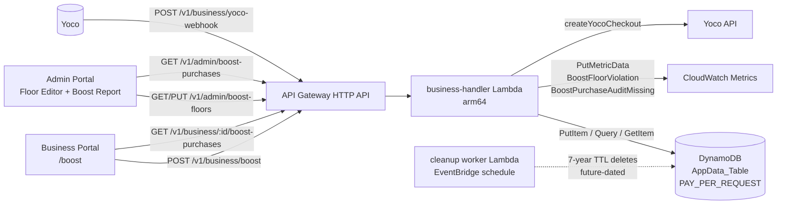
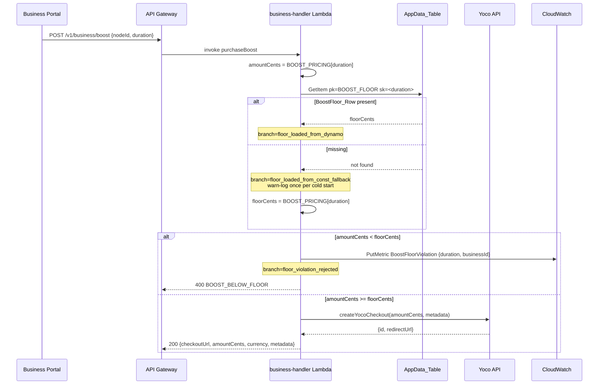
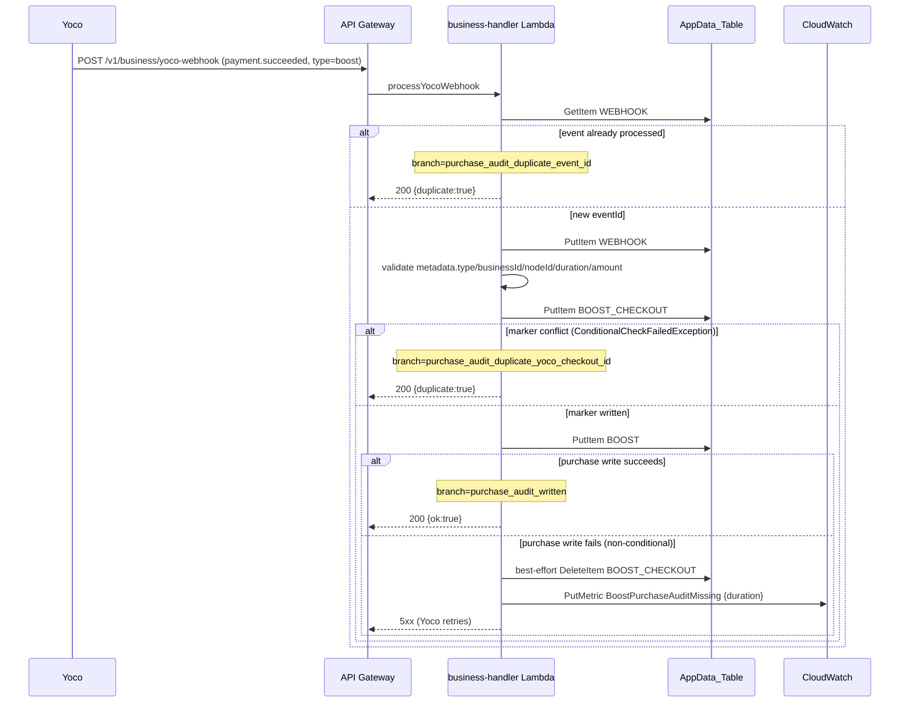
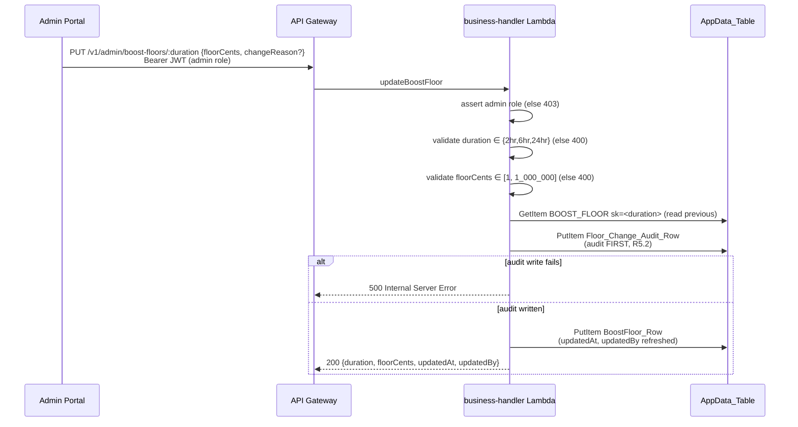

# Design Document

## Overview

This feature closes two latent gaps in the existing booster (per-venue, time-boxed visibility) purchase flow before any future dynamic-pricing work:

1. **Audit gap.** Today, `processYocoWebhook → handlePaymentSucceeded` (in `backend/src/features/business/service.ts`) only acts on `metadata.plan` for subscription tiers. A `metadata.type === 'boost'` event is processed for `WEBHOOK#<eventId>` idempotency but produces **no** persisted record. We add a `BoosterPurchase` audit row keyed on `BOOST#<businessId>` with a secondary `BOOST_CHECKOUT#<yocoCheckoutId>` idempotency marker, written exactly once per successful booster payment.
2. **Floor gap.** There is no server-side minimum-price guard on `purchaseBoost`. We introduce a `BoostFloor` row (one per duration) read at checkout-creation time, configurable per-duration via the admin console, with a full change-audit trail.

The work is intentionally additive and ships without a runtime feature flag:

- The audit-write path is purely additive — no existing reader observes its absence.
- The floor enforcement is seeded equal to the existing `BOOST_PRICING` const, so the rejection branch never fires on day one.
- Rollback is a deploy revert.

All persistence stays on the existing single-table DynamoDB instance (`TableNames.appData`, `PAY_PER_REQUEST`). All compute stays in the existing `business-handler` Lambda (arm64). No new always-on resources. No SMS, no phone-OTP. POPIA stays intact (audit retention is 7 years from `paidAt` / `changedAt`, managed by the existing `cleanup` worker rather than DynamoDB TTL — see Data Models §Retention).

### Goals

- Persist a durable, idempotent `BoosterPurchase` row for every successful booster payment, with enough snapshot context (`tierSnapshot`, `neighbourhoodIdSnapshot`, `floorAtPurchaseCents`) that a future demand-based pricing engine can train on the table without backfill.
- Enforce a server-side per-duration price floor at checkout-creation time, configurable from the admin console with no redeploy and a full audit trail of who changed what when.
- Surface a recent-purchases panel to the business operator and a cross-business query to the admin for refund and dispute support.

### Non-Goals (out of scope)

- Refund / chargeback flow automation (Yoco handles refunds; this spec only ensures the audit table is queryable when ops decides to refund).
- The actual dynamic pricing engine — only the data shape that supports it later.
- Pulse-impact reporting on individual boosts (belongs to `venue-intelligence-reports`).
- Per-business spending caps (separate fraud-prevention spec).
- Multi-currency support — `ZAR` only; a future non-ZAR duration would be a follow-up spec (R3.6).

### Architectural Constraints (binding)

- **Strictly serverless**, per `.kiro/steering/serverless-only.md`. Lambda + API Gateway (HTTP API) + DynamoDB (PAY_PER_REQUEST) + CloudWatch only. No ECS/Fargate, RDS, ElastiCache, ALB/NLB, NAT, EC2, EKS.
- **No SMS, no phone-OTP, no phone-number identifiers**, per `.kiro/steering/no-sms-no-phone-auth.md`. Auth is email + Cognito (Google OAuth). The audit row carries no phone-number or SMS-delivery fields (R1.8, R8.4).
- All Lambdas run on `arm64`.

## Architecture

### Component map



The two new logical surfaces — **floor enforcement** and **audit persistence** — both live inside the existing `business-handler` Lambda. We do not add a new Lambda, a new SQS queue, or a new DynamoDB table.

### Request flows

#### Flow 1: Operator buys a booster (with floor check)



#### Flow 2: Yoco webhook → BoosterPurchase persistence (idempotent)



The two-step write (idempotency marker first, then audit row) preserves the **invariant of exactly one BoosterPurchase row per `yocoCheckoutId`** under any retry pattern, including the case where Yoco issues a fresh `eventId` for a redelivery of the same payment (R2.5). The compensating delete in the failure branch (R2.4) is best-effort: if it fails the original error is re-thrown anyway, because Yoco will retry and the next attempt will land on the existing marker and treat the event as a duplicate.

#### Flow 3: Admin updates a floor (audit-row-first)



### Why this shape

- **Single-table, no new resources.** `AppData_Table` already hosts `WEBHOOK#…` idempotency rows and `BIZ_CHECKIN#…` cache rows. Adding `BOOST#…`, `BOOST_CHECKOUT#…`, `BOOST_FLOOR`, and `BOOST_FLOOR_AUDIT#…` partitions follows the existing pattern. No new always-on cost is introduced (PAY_PER_REQUEST scales to zero).
- **Two-layer idempotency.** Yoco delivers retries with the same `eventId` (handled by the existing `WEBHOOK#<eventId>` row) but can also issue a fresh `eventId` for a redelivery of the same payment. Keying the second layer on `yocoCheckoutId` is the only invariant we can rely on across redeliveries (R2.5).
- **Audit-first ordering for floor changes.** R5.2 demands that no reader observes a new floor before its audit row is durable. We write the audit row before the `BoostFloor_Row`. If the audit write fails, the floor stays unchanged and the admin sees `500` (R5.3).
- **GSI1 for cross-business admin query.** The Admin_Boost_Report needs date-range scans across all businesses. Querying by `gsi1pk = 'BOOST_BY_TIME'` with a `gsi1sk BETWEEN :from AND :to` condition gives O(matches) cost on the existing GSI without a full table scan. The 367-day cap on date ranges (R7.5) is intentional — one full year plus a day for year-on-year comparisons, and it bounds GSI Query cost.

## Components and Interfaces

### Backend: `backend/src/features/business/`

#### `service.ts` (extended)

New / changed functions:

```ts
// Existing — extended to consult the floor before creating the Yoco checkout.
export async function purchaseBoost(
  businessId: string,
  nodeId: string,
  duration: BoostDuration,
): Promise<{ checkoutUrl: string; amountCents: number; currency: 'ZAR'; metadata: BoostMetadata }>

// New — pure function used by purchaseBoost. Also the unit of property-based test §10.1.
export function checkBoostFloor(
  computedPriceCents: number,
  floorCents: number,
): { decision: 'accept' } | { decision: 'reject'; code: 'BOOST_BELOW_FLOOR' }

// New — branch added to handlePaymentSucceeded for metadata.type === 'boost'.
async function persistBoosterPurchase(payload: YocoPaymentSucceededPayload): Promise<void>

// New — admin endpoints.
export async function getBoostFloors(): Promise<BoostFloorView[]>
export async function updateBoostFloor(
  duration: BoostDuration,
  floorCents: number,
  changeReason: string | null,
  admin: { sub: string; email: string },
): Promise<BoostFloorView>
export async function listFloorChangeAudit(
  duration: BoostDuration,
  cursor: string | null,
  limit: number,
): Promise<{ items: FloorChangeAuditView[]; nextCursor: string | null }>

// New — operator and admin queries.
export async function listBoosterPurchasesForBusiness(
  businessId: string,
  cursor: string | null,
  limit: number,
): Promise<{ items: BoosterPurchaseView[]; nextCursor: string | null }>
export async function listBoosterPurchasesByDateRange(
  fromIso: string,
  toIso: string,
  cursor: string | null,
  limit: number,
): Promise<{ items: AdminBoosterPurchaseView[]; nextCursor: string | null }>
export async function getBoosterPurchaseByYocoCheckoutId(
  yocoCheckoutId: string,
): Promise<AdminBoosterPurchaseView | null>
```

`purchaseBoost` keeps the `DEV_MODE` short-circuit unchanged (R9.1: existing API contract preserved when floor equals const). Outside `DEV_MODE` it now performs the floor lookup and either rejects or proceeds.

#### `repository.ts` (extended)

Pure DynamoDB access functions, all using the existing `dynamodb.ts` client and `TableNames.appData`:

```ts
// BoosterPurchase (audit row) + Idempotency_Marker — written together.
export async function putBoosterPurchaseWithMarker(args: {
  purchase: BoosterPurchaseRow
  marker: BoosterCheckoutMarkerRow
}): Promise<{ result: 'written' | 'duplicate' }>

// BoostFloor reads.
export async function getBoostFloor(duration: BoostDuration): Promise<BoostFloorRow | null>
export async function listBoostFloors(): Promise<BoostFloorRow[]> // batch GetItem of 3 keys

// BoostFloor write (audit-first; the function performs both writes in order).
export async function writeFloorAuditThenUpdateFloor(args: {
  audit: FloorChangeAuditRow
  next: BoostFloorRow
}): Promise<void>

// FloorChangeAudit query.
export async function queryFloorChangeAudit(
  duration: BoostDuration,
  cursor: string | null,
  limit: number,
): Promise<{ items: FloorChangeAuditRow[]; nextCursor: string | null }>

// BoosterPurchase queries.
export async function queryBoosterPurchasesForBusiness(
  businessId: string,
  cursor: string | null,
  limit: number,
): Promise<{ items: BoosterPurchaseRow[]; nextCursor: string | null }>
export async function queryBoosterPurchasesByTimeRange(
  fromIso: string,
  toIso: string,
  cursor: string | null,
  limit: number,
): Promise<{ items: BoosterPurchaseRow[]; nextCursor: string | null }>
export async function getBoosterCheckoutMarker(
  yocoCheckoutId: string,
): Promise<BoosterCheckoutMarkerRow | null>
```

`putBoosterPurchaseWithMarker` encodes the two-step idempotency choreography from Flow 2:

1. `PutItem` the marker with `ConditionExpression: 'attribute_not_exists(pk)'`. If `ConditionalCheckFailedException`, return `{ result: 'duplicate' }`.
2. `PutItem` the BoosterPurchase row with the same condition.
3. If step 2 fails with anything other than `ConditionalCheckFailedException` (R1.5), best-effort `DeleteItem` the marker (R2.4) and re-throw so Yoco retries.
4. If step 2 fails with `ConditionalCheckFailedException` and step 1 just succeeded, that means an extremely rare race produced a duplicate `(pk, sk)` for a different `yocoCheckoutId` at the same `paidAt` millisecond — return `{ result: 'duplicate' }` and rely on the marker as the source of truth (R1.6).

#### `types.ts` (extended)

```ts
export const BOOST_FLOOR_DEFAULTS: Record<BoostDuration, number> = {
  '2hr': BOOST_PRICING['2hr'],   // 2500
  '6hr': BOOST_PRICING['6hr'],   // 5000
  '24hr': BOOST_PRICING['24hr'], // 15000
}

export const BOOST_FLOOR_MIN_CENTS = 1
export const BOOST_FLOOR_MAX_CENTS = 1_000_000 // 10 000.00 ZAR
export const ADMIN_BOOST_REPORT_MAX_RANGE_DAYS = 367

export const boosterPurchaseRowSchema = z.object({ /* see Data Models */ })
export const boostFloorRowSchema = z.object({ /* see Data Models */ })
export const floorChangeAuditRowSchema = z.object({ /* see Data Models */ })
```

#### `handler.ts` (extended)

New routes, all on the existing API Gateway HTTP API and existing business-handler Lambda:

| Method | Path | Auth | Purpose |
|---|---|---|---|
| `GET` | `/v1/business/:businessId/boost-purchases?cursor=...` | Business JWT, `businessId` claim must match path | Operator panel (R6) |
| `GET` | `/v1/admin/boost-floors` | Admin JWT | Floor Editor read (R4.2) |
| `PUT` | `/v1/admin/boost-floors/:duration` | Admin JWT | Floor update (R4.3–R4.6) |
| `GET` | `/v1/admin/boost-floors/:duration/audit?cursor=...` | Admin JWT | Floor change history (R5.5, R4.7) |
| `GET` | `/v1/admin/boost-purchases?from=...&to=...` | Admin JWT | Date-range mode (R7.2) |
| `GET` | `/v1/admin/boost-purchases?yocoCheckoutId=...` | Admin JWT | Single-payment mode (R7.2) |

Handler responsibilities:

- JWT role check (admin or business-self) and 403 on mismatch (R4.5, R6.3, R7.3).
- Zod-validate path/query/body. 400 on schema failure.
- For the admin date-range mode, validate `from <= to` and `to - from <= 367 days` **before** any DynamoDB call (R7.5).
- For the admin combined mode, R7.4: if both date params and `yocoCheckoutId` are present, validate the date range first; if the date range is malformed, return 400 with no fallback. Only fall back to single-payment mode when the date range is absent or both are absent and `yocoCheckoutId` is supplied.

### Frontend

#### `apps/web/` — Operator_Boost_Panel (new section in existing `/boost` route)

A "Recent purchases" section beneath the existing buy-a-boost form. Fetches via `GET /v1/business/:businessId/boost-purchases`, paginated 25 rows per page (R6.4). Renders `paidAt` as `YYYY-MM-DD HH:mm` in `Africa/Johannesburg`, `nodeId` resolved to the human-readable node name via the existing nodes lookup, `duration`, and `amountCents` formatted as `R<X>.<YY>` (R6.5). Hides `tierSnapshot`, `neighbourhoodIdSnapshot`, `floorAtPurchaseCents` (R6.6). Empty-state copy: `"No booster purchases yet."` (R6.8).

#### `apps/admin/` — Floor_Editor (new screen)

`apps/admin/src/screens/BoostFloorEditor.tsx`. Renders three duration cards (`2hr`, `6hr`, `24hr`) showing current `floorCents`, `updatedAt`, `updatedBy`. Each card has an inline edit field (cents integer input) and an optional `changeReason` textarea (≤280 chars). When a row has never been written, the card shows the `BOOST_PRICING` const value labelled `"default — never edited"` (R4.8). Below each card, an audit history list of the most recent 25 `Floor_Change_Audit_Row` entries newest-first (R4.7, R5.5).

#### `apps/admin/` — Admin_Boost_Report (new screen)

`apps/admin/src/screens/BoostPurchaseReport.tsx`. Two query modes mutually-exclusive in the URL (R7.2):

- Date-range form: `from` and `to` date pickers (defaults: last 7 days). Submit issues a `Query` against GSI1.
- `yocoCheckoutId` lookup: a single text input + lookup button.

Renders a table with `paidAt`, `businessId`, `nodeId` (raw id is fine here, this is an ops surface), `duration`, `amountCents`, `tierSnapshot`, `neighbourhoodIdSnapshot`, `floorAtPurchaseCents`, `yocoCheckoutId` (R7.6), and a **Copy** button per row that copies `yocoCheckoutId` to the clipboard for paste-into-Yoco-merchant-dashboard (R7.7).

### Cleanup worker (existing, extended in implementation)

`backend/src/workers/cleanup.ts` is extended to delete:

- `BoosterPurchase` rows with `paidAt` older than 7 years (R8.3).
- `Floor_Change_Audit_Row` rows with `changedAt` older than 7 years (R8.3).
- `Idempotency_Marker` rows older than 7 years (R8.6).

The first deletions will not run for at least 7 years from launch. The implementation uses a paged Scan filtered by an attribute-existence check (`attribute_exists(paidAt)` for purchases, `attribute_exists(changedAt)` for audit rows) and bounded delete batches per invocation, matching the existing `cleanup` worker pattern.

## Data Models

All rows live in the existing `AppData_Table` (`TableNames.appData`, `PAY_PER_REQUEST`).

### Existing GSI usage

We rely on the table's existing GSI1 (`gsi1pk`/`gsi1sk`). Only `BoosterPurchase` rows populate GSI1 attributes; the other new rows leave them unset.

### `BoosterPurchase` (audit row, R1.2)

| Attribute | Type | Description |
|---|---|---|
| `pk` | string | `BOOST#<businessId>` |
| `sk` | string | `BOOST#<paidAt_iso>#<yocoCheckoutId>` |
| `gsi1pk` | string | `BOOST_BY_TIME` (R7.2 date-range query) |
| `gsi1sk` | string | `paidAt_iso` |
| `businessId` | string (1–64) | |
| `nodeId` | string (1–64) | |
| `duration` | enum | `'2hr' \| '6hr' \| '24hr'` |
| `amountCents` | int > 0 | |
| `currency` | string | `'ZAR'` |
| `yocoCheckoutId` | string (1–128) | |
| `paidAt` | string | ISO 8601 ms-precision UTC, equal to `gsi1sk` |
| `tierSnapshot` | enum | `'starter' \| 'growth' \| 'pro' \| 'payg'` (R1.2; snapshot of `getEffectiveTier(biz)` at write time) |
| `neighbourhoodIdSnapshot` | string (1–64) \| null | from `nodes.neighbourhoodId` at write time |
| `floorAtPurchaseCents` | int > 0 | snapshot of effective floor at write time (R1.2) |
| `createdAt` | string | ISO 8601 ms-precision UTC, when the row was written (may differ from `paidAt`) |

Constraints:

- Written with `PutItem` + `ConditionExpression: 'attribute_not_exists(pk)'` (R1.4).
- No `ttl` attribute (R1.7, R8.2).
- No phone-number / SMS field (R1.8, R8.4).
- No consumer PII (R8.5) — merchant-side commercial data only.

### `Idempotency_Marker` (R2.1)

| Attribute | Type | Description |
|---|---|---|
| `pk` | string | `BOOST_CHECKOUT#<yocoCheckoutId>` |
| `sk` | string | `BOOST_CHECKOUT#<yocoCheckoutId>` (same value, single-row partition) |
| `businessId` | string | copied from BoosterPurchase |
| `boostPk` | string | copied from BoosterPurchase `pk` (enables R7.2 single-payment lookup) |
| `boostSk` | string | copied from BoosterPurchase `sk` |
| `createdAt` | string | ISO 8601 ms-precision UTC |

Constraints:

- Written with `PutItem` + `ConditionExpression: 'attribute_not_exists(pk)'` (R2.2).
- No `ttl` attribute (R8.6).

### `BoostFloor_Row` (R4.1)

| Attribute | Type | Description |
|---|---|---|
| `pk` | string | `BOOST_FLOOR` |
| `sk` | string | `'2hr' \| '6hr' \| '24hr'` |
| `duration` | string | equal to `sk` |
| `floorCents` | int > 0, ≤ 1_000_000 | |
| `currency` | string | `'ZAR'` (R3.6) |
| `updatedAt` | string | ISO 8601 ms-precision UTC |
| `updatedBy` | string | admin's Cognito sub |

Initial seed (R3.5, R4.8): the rows are seeded equal to the `BOOST_PRICING` const values (`2hr=2500, 6hr=5000, 24hr=15000`) at deploy time via a one-shot Terraform `aws_dynamodb_table_item` resource per duration, or a one-shot Lambda invoked by the deploy. Until seeded, the floor enforcement falls back to the const (R3.2) and the editor labels the row `"default — never edited"` (R4.8). This means the rejection branch never fires on day one (R9.4).

### `Floor_Change_Audit_Row` (R5.1)

| Attribute | Type | Description |
|---|---|---|
| `pk` | string | `BOOST_FLOOR_AUDIT#<duration>` |
| `sk` | string | `<changedAt_iso>#<changeId>` (sorts newest-last; query Descending for newest-first) |
| `duration` | enum | `'2hr' \| '6hr' \| '24hr'` |
| `previousFloorCents` | int \| null | `null` on first set |
| `newFloorCents` | int > 0 | |
| `currency` | string | `'ZAR'` |
| `changedBy` | string | admin's Cognito sub |
| `changedByEmail` | string (3–254) | admin's email at the time of the change |
| `changedAt` | string | ISO 8601 ms-precision UTC |
| `changeReason` | string (1–280) \| null | optional free-text |

No `ttl` attribute (R5.4, R8.2).

### Access patterns and key choices

| Access pattern | Operation | Rationale |
|---|---|---|
| Operator views their own purchases (R6.2) | `Query` `pk = BOOST#<businessId>` ScanIndexForward=false, Limit=25 | `sk` includes `paidAt_iso` so reverse scan yields newest-first |
| Admin date-range across all businesses (R7.2) | `Query` GSI1 `gsi1pk = 'BOOST_BY_TIME'` and `gsi1sk BETWEEN :from AND :to` | Without GSI1 this would require a Scan; GSI1 keeps it O(matches) |
| Admin single-payment lookup (R7.2) | `GetItem` `pk = BOOST_CHECKOUT#<yocoCheckoutId>` then `GetItem` of stored `boostPk`/`boostSk` | Two consistent `GetItem`s, no Scan; the marker doubles as a lookup index |
| Read current floor (R3.1) | `GetItem` `pk = BOOST_FLOOR sk = <duration>` | Single point read on the hot path |
| Read all floors for editor (R4.2) | `BatchGetItem` of three keys | Three `GetItem`s in one call; no Scan |
| Read floor change history (R4.7, R5.5) | `Query` `pk = BOOST_FLOOR_AUDIT#<duration>` ScanIndexForward=false, Limit=25 | Natural newest-first via reverse scan |

### Validation (Zod)

All rows are validated with Zod schemas at the repository boundary (read and write). The schemas double as the API response contracts, satisfying Property §10.4 (JSON round-trip) by construction — `serialize(deserialize(row))` is identity when both sides use the same schema.

```ts
export const durationSchema = z.enum(['2hr', '6hr', '24hr'])
export const tierSchema = z.enum(['starter', 'growth', 'pro', 'payg'])

export const boosterPurchaseRowSchema = z.object({
  pk: z.string().regex(/^BOOST#[\w-]{1,64}$/),
  sk: z.string(),
  gsi1pk: z.literal('BOOST_BY_TIME'),
  gsi1sk: z.string(),
  businessId: z.string().min(1).max(64),
  nodeId: z.string().min(1).max(64),
  duration: durationSchema,
  amountCents: z.number().int().positive(),
  currency: z.literal('ZAR'),
  yocoCheckoutId: z.string().min(1).max(128),
  paidAt: z.string(), // ISO 8601 ms-precision; refined by isoMillisSchema below
  tierSnapshot: tierSchema,
  neighbourhoodIdSnapshot: z.string().min(1).max(64).nullable(),
  floorAtPurchaseCents: z.number().int().positive(),
  createdAt: z.string(),
})
```

### Retention (R8)

POPIA_Retention_Period is **7 years** from `paidAt` (`BoosterPurchase`) or `changedAt` (`Floor_Change_Audit_Row`), to match the SARS / Companies Act retention requirement that subsumes the POPIA minimum. We deliberately do **not** use DynamoDB TTL:

- TTL targets short-lived data (DynamoDB best practice). A 7-year horizon is well outside its design window.
- Clock skew or attribute-name drift could cause premature deletion of legally-required records (R8.2).

The existing `cleanup` worker (`backend/src/workers/cleanup.ts`), already EventBridge-scheduled, is extended to delete rows older than the retention period. First deletions will not run for at least 7 years.

### Mermaid: row-set overview

```mermaid
erDiagram
  BoosterPurchase {
    string pk "BOOST#businessId"
    string sk "BOOST#paidAt#yocoCheckoutId"
    string gsi1pk "BOOST_BY_TIME"
    string gsi1sk "paidAt"
    string businessId
    string nodeId
    string duration
    int amountCents
    string currency
    string yocoCheckoutId
    string paidAt
    string tierSnapshot
    string neighbourhoodIdSnapshot
    int floorAtPurchaseCents
    string createdAt
  }
  IdempotencyMarker {
    string pk "BOOST_CHECKOUT#yocoCheckoutId"
    string sk "BOOST_CHECKOUT#yocoCheckoutId"
    string businessId
    string boostPk
    string boostSk
    string createdAt
  }
  BoostFloor {
    string pk "BOOST_FLOOR"
    string sk "duration"
    string duration
    int floorCents
    string currency
    string updatedAt
    string updatedBy
  }
  FloorChangeAudit {
    string pk "BOOST_FLOOR_AUDIT#duration"
    string sk "changedAt#changeId"
    string duration
    int previousFloorCents
    int newFloorCents
    string currency
    string changedBy
    string changedByEmail
    string changedAt
    string changeReason
  }
  IdempotencyMarker ||--|| BoosterPurchase : "boostPk/boostSk"
  FloorChangeAudit }o--|| BoostFloor : "duration"
```


## Correctness Properties

_A property is a characteristic or behavior that should hold true across all valid executions of a system — essentially, a formal statement about what the system should do. Properties serve as the bridge between human-readable specifications and machine-verifiable correctness guarantees._

The following nine properties were derived from the acceptance-criteria prework analysis (see prework context for the full step-by-step derivation and redundancy reflection). They were consolidated from an initial set of sixteen candidates by removing properties that were subsumed by stronger ones (for example, structural schema properties are subsumed by the JSON round-trip property; per-case duplicate properties are subsumed by the multiset-equality webhook-idempotence property).

### Property 1: Floor decision is exact and rejection emits metric

_For any_ `duration ∈ {'2hr', '6hr', '24hr'}`, any `computedPriceCents ∈ [0, 10_000_000]`, and any `floorCents ∈ [1, 1_000_000]`, the floor-check function shall return `accept` if and only if `computedPriceCents >= floorCents`, AND a `BoostFloorViolation` CloudWatch metric shall be emitted exactly once if and only if the decision is `reject`. The decision shall not depend on whether the metric emission itself succeeds.

**Validates: Requirements 3.3, 3.4, 9.5, 10.1**

### Property 2: Webhook idempotence on `yocoCheckoutId` (with failure injection)

_For any_ finite sequence of `payment.succeeded` events with `metadata.type === 'boost'`, including arbitrary repeats of the same `yocoCheckoutId`, fresh `eventId`s for redeliveries of the same payment, and arbitrarily-injected non-conditional DynamoDB failures with subsequent retries, the multiset of `BoosterPurchase` rows persisted in `AppData_Table` shall equal the multiset of distinct `yocoCheckoutId` values that were successfully delivered, AND for each persisted `BoosterPurchase` row there shall exist exactly one `Idempotency_Marker` row sharing the same `yocoCheckoutId`.

**Validates: Requirements 1.1, 1.5, 1.6, 2.3, 2.4, 2.6, 9.6, 10.2, 10.3**

### Property 3: `BoosterPurchase` JSON round-trip

_For any_ `BoosterPurchase` row valid under `boosterPurchaseRowSchema`, `deserialize(serialize(row))` shall be deeply equal to `row` when both sides use the API response schema. As a consequence, no row shall carry a `ttl` attribute, no row shall carry any phone-number or SMS-delivery field, and no row shall carry consumer-level personal data, because the schema does not admit such attributes.

**Validates: Requirements 1.2, 1.7, 1.8, 8.4, 8.5, 10.4**

### Property 4: Floor update convergence with audit-first ordering

_For any_ finite sequence of in-range admin floor updates with arbitrary `(duration, floorCents, admin)` tuples replayed against an in-memory model, the final `BoostFloor_Row` for each touched duration shall equal the last accepted update for that duration, AND the count of `Floor_Change_Audit_Row` rows for that duration shall equal the count of accepted updates for that duration. If a `Floor_Change_Audit_Row` write fails, no `BoostFloor_Row` update shall occur for that attempt.

**Validates: Requirements 4.4, 4.7, 5.2, 5.3, 10.5**

### Property 5: Floor input-validation accept count

_For any_ finite sequence of admin update requests with `floorCents` values drawn from a distribution that includes both in-range integers (`[1, 1_000_000]`) and out-of-range values (negatives, zero, fractional, > 1_000_000), the count of accepted updates shall equal the count of in-range integer requests AND the count of rejected updates shall equal the count of out-of-range or non-integer requests, with no `BoostFloor_Row` or `Floor_Change_Audit_Row` written for a rejected request.

**Validates: Requirements 4.3, 4.6, 10.6**

### Property 6: Admin date-range query result-set with range-validation gate

_For any_ set of persisted `BoosterPurchase` rows and any `(from, to)` ISO-8601 timestamp pair, the admin date-range endpoint shall: (a) reject the query with `400 Bad Request` and issue no DynamoDB call if `from > to` or `(to − from) > 367 days`; otherwise (b) return exactly the set of rows whose `paidAt ∈ [from, to]`, paginated, with the union across pages equalling the matching set.

**Validates: Requirements 7.2, 7.4, 7.5**

### Property 7: Operator pagination round-trip preserves order and identity

_For any_ set of `BoosterPurchase` rows for one `businessId`, paginated traversal of `GET /v1/business/:businessId/boost-purchases` at the configured page size of 25, following `nextCursor` to exhaustion, shall yield each row exactly once and in `paidAt`-descending order, AND a malformed cursor shall be rejected with `400 Bad Request`.

**Validates: Requirements 6.2, 6.4**

### Property 8: Render visibility — operator hides snapshots, admin shows them

_For any_ `BoosterPurchase` row, the rendered output of the operator-facing panel shall contain no occurrence of `tierSnapshot`, `neighbourhoodIdSnapshot`, or `floorAtPurchaseCents` (neither field labels nor values), AND the rendered output of the admin-facing report shall contain `businessId`, `tierSnapshot`, `neighbourhoodIdSnapshot`, `floorAtPurchaseCents`, AND `yocoCheckoutId`.

**Validates: Requirements 6.6, 7.6**

### Property 9: Retention cleanup boundary

_For any_ persisted `BoosterPurchase`, `Idempotency_Marker`, or `Floor_Change_Audit_Row` and any clock value `now`, the cleanup worker shall delete the row if and only if `(now − reference_timestamp)` exceeds the 7-year POPIA_Retention_Period, where `reference_timestamp` is `paidAt` for `BoosterPurchase`, `createdAt` for `Idempotency_Marker`, and `changedAt` for `Floor_Change_Audit_Row`.

**Validates: Requirements 8.3, 8.6**

## Error Handling

### Booster purchase (floor-check path)

| Condition | HTTP | Code / Body | Behaviour |
|---|---|---|---|
| `floorCents` row missing in `AppData_Table` | n/a | n/a | Fall back to `BOOST_PRICING[duration]` as effective floor; emit a single `warn`-level log per cold-start with `branch=floor_loaded_from_const_fallback` (R3.2). |
| `computedPriceCents < effectiveFloorCents` | 400 | `AppError` `code=BOOST_BELOW_FLOOR`, message `"Booster price is below the configured floor for this duration"` (R3.3). | Emit `BoostFloorViolation` metric; no Yoco call. |
| Yoco API call fails | 502 / propagate existing behaviour | unchanged | Existing path. |
| Metric emission to CloudWatch fails | n/a | n/a | Log error; **do not** swallow the rejection — the 400 still returns (R9.5). |

### Yoco webhook → BoosterPurchase persistence

| Condition | Outcome |
|---|---|
| `eventId` already in `WEBHOOK#…` | Existing layer: 200 `{duplicate:true}` (R2.5). `branch=purchase_audit_duplicate_event_id`. |
| `Idempotency_Marker` `BOOST_CHECKOUT#<yocoCheckoutId>` already exists | Skip the BoosterPurchase write; 200 `{duplicate:true}` (R2.3). `branch=purchase_audit_duplicate_yoco_checkout_id`. |
| Marker `PutItem` fails with non-conditional error | Re-throw → webhook returns non-2xx → Yoco retries (R1.5). |
| `BoosterPurchase` `PutItem` fails with `ConditionalCheckFailedException` after marker just written | Treat as duplicate; return without raising (R1.6). |
| `BoosterPurchase` `PutItem` fails with non-conditional error | Best-effort `DeleteItem` of the marker (R2.4); emit `BoostPurchaseAuditMissing` metric (R9.6); re-throw. If the compensating delete itself fails, still re-throw — the next Yoco retry will land on the existing marker and treat the event as a duplicate, surfacing as a missing-purchase outlier on the metric. |
| Webhook payload missing/invalid `metadata.type`, `businessId`, `nodeId`, `duration`, `amount` | The branch is skipped (no booster persistence) and the existing webhook handler returns 200 — same as today's behaviour for unrecognised metadata, so a non-booster event never accidentally triggers booster persistence (R1.1 prerequisite). |

### Admin floor update

| Condition | HTTP | Behaviour |
|---|---|---|
| Missing or non-admin JWT | 403 | `AppError.forbidden` (R4.5). |
| `duration ∉ {'2hr','6hr','24hr'}` | 400 | No persistence (R4.6). |
| `floorCents` not integer in `[1, 1_000_000]` | 400 | No persistence (R4.3). |
| `Floor_Change_Audit_Row` write fails | 500 | No `BoostFloor_Row` update performed (R5.3). |
| `BoostFloor_Row` write fails after audit succeeded | 500 | The audit row exists with `previousFloorCents = (the value read before the update)` and `newFloorCents = (the requested but never-applied value)`. This is acceptable — the audit reflects an attempt; an operator reading the audit will see a subsequent successful audit row when the admin retries. The current floor is unchanged. |

### Admin and operator queries

| Condition | HTTP | Behaviour |
|---|---|---|
| Operator JWT `businessId` ≠ path `businessId` | 403 | No rows returned (R6.3). |
| Malformed pagination cursor | 400 | (R6.4). |
| Admin date-range with `from > to` or `(to − from) > 367 days` | 400 | No DynamoDB call (R7.5). |
| Admin combined-mode with malformed date range | 400 | No fallback to single-payment lookup; the malformed range short-circuits (R7.4). |
| Admin combined-mode with valid range and `yocoCheckoutId` | 200 | Range mode wins; the `yocoCheckoutId` parameter is ignored. R7.4 specifies fallback to single-payment mode only when both `from` and `to` are absent. |
| Admin single-payment lookup, no marker exists for `yocoCheckoutId` | 200 with empty result | Same shape as a date-range query that matched zero rows. |

### Logging

Every booster-related code path emits a structured log entry with a `branch` field drawn from this enum (R9.3):

- `floor_loaded_from_dynamo`
- `floor_loaded_from_const_fallback`
- `floor_violation_rejected`
- `purchase_audit_written`
- `purchase_audit_duplicate_yoco_checkout_id`
- `purchase_audit_duplicate_event_id`

Sampled at no less than 1-in-100 in production. The enum is exhaustive — adding a new branch in code without adding it here is caught by a TypeScript-level union check.

### CloudWatch alarms

Two alarms wired to the existing alarm topic (R9.7):

- `BoostFloorViolation` over 5-minute window > 0 → page, since under static-pricing assumptions a violation implies client tampering or a misconfigured floor (R9.5).
- `BoostPurchaseAuditMissing` over 5-minute window > 0 → page, since this means a Yoco payment succeeded but its audit row failed to persist (R9.6).

Neither alarm emits a zero-count heartbeat (R9.5).

## Testing Strategy

### Approach

Three test layers, in order of size and cost:

1. **Property-based tests** (the primary correctness layer) — one test per Correctness Property above, ≥ 100 iterations each. These run on a per-PR basis and on `main`.
2. **Example unit tests** — one test per error-handling branch in the table above, plus regression tests for the implementation-detail acceptance criteria (1.4, 2.2 — `ConditionExpression: 'attribute_not_exists(pk)'`; 2.5 — existing `WEBHOOK#…` layer is preserved; 4.5/6.3/7.3 — JWT role/claim checks; 4.8 — empty-state label; 6.5 — render formatting boundaries; 6.8 — empty-state copy; 7.7 — clipboard).
3. **Smoke / integration tests** — one-shot checks for configuration items: seed values match `BOOST_PRICING` const (R3.5), feature lives in the existing `business-handler` Lambda (R3.7), CloudWatch alarms wired to the existing topic (R9.7), retention constant equals 7 years (R8.1), routes mounted (R6.1, R7.1).

### Tooling

- **Property-based testing library:** `fast-check` (already in use elsewhere in `backend/src/__tests__/`). We do **not** implement property-based testing from scratch. Each property test runs `fc.assert(fc.property(...))` with `numRuns: 100` minimum.
- **DynamoDB test double:** an in-memory map-backed implementation of the subset of the AWS SDK v3 `DynamoDBDocumentClient` API the repository uses (`PutCommand` with `ConditionExpression`, `GetCommand`, `BatchGetCommand`, `QueryCommand`, `DeleteCommand`). The double models the conditional-write semantics needed by Property 2 and the GSI semantics needed by Property 6. This avoids the cost of running 100+ iterations against real DynamoDB.
- **Failure injection:** the test double accepts a per-call failure-rate parameter (e.g. `0.2` chance of `ProvisionedThroughputExceededException` on writes), driven by `fast-check`'s `fc.scheduler` so the failure pattern is part of the shrinkable input. This is what makes Property 2's failure-injection clause executable.
- **Frontend tests:** Vitest + Testing Library for the `BoostFloorEditor`, `BoostPurchaseReport`, and the operator panel, focused on Property 8 (render visibility) and the example tests for empty states, formatting, and clipboard.
- **End-to-end:** a single happy-path Playwright spec that buys a booster against a Yoco sandbox, asserts the audit row appears in the operator panel, and asserts an admin can find it by date-range and `yocoCheckoutId`. This covers the wiring between Lambda, API Gateway, and the frontends without re-running the property layer.

### Property test configuration

Every property test is tagged with a comment of the form:

```ts
/**
 * Feature: booster-pricing-floor-and-audit, Property <N>: <property text>
 */
```

This tag is the single source of cross-reference to this design document. Each property has exactly one property-based test; the test runs against the in-memory model except where the property explicitly concerns DynamoDB conditional-write semantics (Property 2), in which case it runs against the DynamoDB test double.

`fast-check` configuration:

- `numRuns: 100` minimum (raise selectively for the webhook idempotence property to `numRuns: 250` because of the nested failure-injection scheduler).
- Custom arbitraries for `BoostDuration`, `BoosterPurchaseRow`, `BoostFloorRow`, ISO-8601 ms-precision UTC timestamps, and integer cents in the documented ranges. The ISO arbitrary samples millisecond boundaries explicitly, to exercise the `paidAt`-equals-`gsi1sk` invariant.

### Coverage map (property → test file)

| Property | Test file (planned) |
|---|---|
| 1. Floor decision and metric | `backend/src/features/business/__tests__/floor-check.property.test.ts` |
| 2. Webhook idempotence | `backend/src/features/business/__tests__/webhook-idempotence.property.test.ts` |
| 3. BoosterPurchase round-trip | `backend/src/features/business/__tests__/booster-purchase-roundtrip.property.test.ts` |
| 4. Floor update convergence | `backend/src/features/business/__tests__/floor-update.property.test.ts` |
| 5. Floor input validation | `backend/src/features/business/__tests__/floor-input.property.test.ts` |
| 6. Admin date-range query | `backend/src/features/business/__tests__/admin-date-range.property.test.ts` |
| 7. Operator pagination | `backend/src/features/business/__tests__/operator-pagination.property.test.ts` |
| 8. Render visibility | `apps/web/src/__tests__/operator-boost-render.property.test.ts` and `apps/admin/src/__tests__/admin-boost-render.property.test.ts` |
| 9. Retention cleanup | `backend/src/workers/__tests__/cleanup-boost-retention.property.test.ts` |

### Performance and cost

All property tests run against in-memory test doubles, so a 100-iteration run completes in well under 5 seconds locally and well under 30 seconds in CI. There is no AWS cost from the property layer; the only AWS-touching test is the single E2E happy-path against the Yoco sandbox, which runs once per CI build.

### Negative-test focus areas

The following negative paths are explicitly covered by example tests because they fall outside the universal-property frame:

- Yoco webhook with `metadata.type !== 'boost'` does not trigger any booster write.
- Yoco webhook with `metadata.type === 'boost'` but missing one of `businessId`/`nodeId`/`duration`/`amount` is logged and ignored, not persisted.
- Yoco webhook with the existing `WEBHOOK#<eventId>` already persisted does not call any booster write code path (R2.5 regression).
- `purchaseBoost` in `DEV_MODE` short-circuits and does not call DynamoDB or Yoco — preserving existing dev-fixture behaviour (R9.1).
- Admin attempts to update floor without admin claim → 403, no audit row, no `BoostFloor_Row` change.
- Operator attempts to query another business's purchases → 403, no rows returned.

### What we are NOT testing as properties

In line with the prework analysis and the steering-rule scope:

- We do not write property-based tests for AWS infrastructure wiring (CloudWatch alarm topics, API Gateway route mounts) — these are smoke-tested.
- We do not write property-based tests for Yoco's webhook delivery semantics — that is Yoco's contract, not ours.
- We do not write property-based tests for CSS / visual layout — the operator and admin panels rely on existing portal styles.
- We do not write property-based tests for the existing `BOOST_PRICING` const itself (R9.2) — it is a static value verified by code review.
