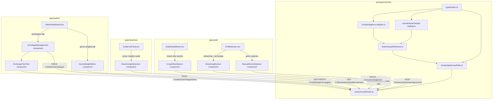

# Design Document: Crowd Vibe Insights

## Overview

Crowd Vibe Insights derives personality archetypes from real music listening data (Spotify, Apple Music) and aggregates them into live crowd profiles per venue. The system scores users across five personality dimensions based on their music genres, resolves a single archetype from an admin-managed catalog, and surfaces this data across four UI surfaces: NodeDetailSheet (consumer crowd vibe), ProfileScreen (streaming connection + archetype badge), AudiencePanel (business music analytics), and AdminDashboard (archetype catalog + genre weight editor).

The feature is built entirely on the existing mock layer for dev mode. Streaming OAuth flows, weekly sync jobs, and real backend endpoints are designed but implemented behind the mock layer first. All new types live in `packages/shared/types/index.ts`, constants in `packages/shared/constants/`, and the archetype resolver as a pure function in `packages/shared/lib/`.

### Key Design Decisions

- **Pure function archetype resolver** in `packages/shared/lib/archetypeResolver.ts` — no side effects, no API calls, easily testable. Used by both frontend (mock layer, admin test tool) and backend.
- **Genre weight matrix as a constant** in `packages/shared/constants/genre-weights.ts` — seeded with the 12×5 matrix from requirements. The admin editor updates the DB copy; the constant serves as the default/fallback.
- **Archetype catalog as a constant** in `packages/shared/constants/archetype-catalog.ts` — the 15 seed archetypes with thresholds and priorities. DB is the source of truth at runtime; the constant seeds mock data and provides defaults.
- **No CSS grid** — all new UI uses flex layouts per CLAUDE.md Rule 18.
- **No emojis** — archetype icons use `iconId` strings (e.g. `"groove-seeker"`, `"firecracker"`) that map to SVG icons per CLAUDE.md Rule 5.
- **CSS variables only** — no hardcoded hex colors per CLAUDE.md Rule 1.
- **Types in shared** — all new types added to `packages/shared/types/index.ts` per CLAUDE.md.
- **API calls through `api` singleton** — per CLAUDE.md Rule 11.
- **No `window`/`document` in packages/** — per CLAUDE.md Rule 9.
- **Max 400 lines per file** — per ENGINEERING_STANDARDS.md.

---

## Architecture



### Data Flow

1. User connects streaming service (or selects genres manually) → genres stored on user
2. `computeDimensionScores(genres, weightMatrix)` → `DimensionScoreVector`
3. `resolveArchetype(scores, archetypeCatalog)` → single `PersonalityArchetype`
4. On node detail open → `GET /v1/nodes/:nodeId/crowd-vibe` aggregates checked-in users' archetypes/genres → `CrowdVibeSnapshot`
5. Business audience panel → `GET /v1/business/me/audience/music` returns aggregated music analytics
6. Admin panel → CRUD archetypes, edit genre weights, test archetype resolution

---

## Components and Interfaces

### New Shared Library: `packages/shared/lib/archetypeResolver.ts`

Pure functions with zero side effects. No imports from `api`, `socket`, or any store.

```typescript
// packages/shared/lib/archetypeResolver.ts

import type {
  MusicGenre,
  PersonalityDimension,
  DimensionScoreVector,
  PersonalityArchetype,
  GenreWeightEntry,
} from '../types'

/**
 * Compute dimension scores by averaging genre weights across all user genres.
 * Returns null if genres array is empty.
 */
export function computeDimensionScores(
  genres: MusicGenre[],
  weightMatrix: GenreWeightEntry[],
): DimensionScoreVector | null

/**
 * Resolve the highest-priority matching archetype for a given score vector.
 * Returns "The Uncharted" for null scores, "The Eclectic" when no thresholds match.
 */
export function resolveArchetype(
  scores: DimensionScoreVector | null,
  archetypes: PersonalityArchetype[],
): PersonalityArchetype

/**
 * Check if a score vector meets all dimension thresholds for an archetype.
 */
export function matchesArchetype(
  scores: DimensionScoreVector,
  archetype: PersonalityArchetype,
): boolean
```

### New Constants

#### `packages/shared/constants/genre-weights.ts`

Exports `GENRE_WEIGHT_MATRIX: GenreWeightEntry[]` — the 12×5 seed matrix from Requirement 7.2. Also exports `MUSIC_GENRES: MusicGenre[]` as the ordered list of all 12 genres and `PERSONALITY_DIMENSIONS: PersonalityDimension[]` as the ordered list of all 5 dimensions.

#### `packages/shared/constants/archetype-catalog.ts`

Exports `ARCHETYPE_CATALOG: PersonalityArchetype[]` — the 15 seed archetypes from Requirement 9.2, each with `id`, `name`, `iconId`, `description`, `dimensionThresholds`, `priority`, and `isActive: true`.

#### `packages/shared/constants/index.ts` (updated)

Add re-exports:
```typescript
export { GENRE_WEIGHT_MATRIX, MUSIC_GENRES, PERSONALITY_DIMENSIONS } from './genre-weights'
export { ARCHETYPE_CATALOG } from './archetype-catalog'
```

### UI Components

#### 1. `apps/web/src/components/CrowdVibeSection.tsx`

Rendered inside `NodeDetailSheet` below the rewards section. Receives `CrowdVibeSnapshot` data.

- Archetype breakdown: horizontal flex row of archetype badges with icon + percentage
- Genre counts: compact flex-wrap row of genre pills with count
- Hidden when `totalCheckedIn === 0` or no users have music preferences
- Uses `rounded-2xl` cards, CSS variables, flex-only layout
- Fetches data via `api.get<CrowdVibeSnapshot>('/v1/nodes/${nodeId}/crowd-vibe')`

#### 2. `apps/web/src/components/StreamingSection.tsx`

Rendered inside `ProfileScreen`. Shows connected streaming service or connect buttons.

- When connected: shows provider name + "Disconnect" button
- When disconnected: shows "Connect Spotify" and "Connect Apple Music" buttons
- Below: archetype badge with icon, name, description
- Below: top genres list ordered by frequency
- Manual genre fallback: `ManualGenreSelector` component shown when no streaming service connected
- POPIA consent dialog shown before initiating OAuth flow

#### 3. `apps/web/src/components/ManualGenreSelector.tsx`

Multi-select control for 1–5 genres from the 12 `MusicGenre` options.

- Flex-wrap grid of genre pill buttons (toggle on/off)
- Save button sends `PATCH /v1/users/me/genres`
- Disabled state during API call per CLAUDE.md Rule 13

#### 4. `apps/business/src/components/MusicInsightsSection.tsx`

Rendered inside `AudiencePanel` below existing visitor stats.

- "Music Taste" card: horizontal bar chart of genre distribution (flex-based bars)
- "Personality Types" card: archetype breakdown with icon badges and percentages
- "Peak Personality by Time" card: time segments with dominant archetype
- All cards use `rounded-2xl`, CSS variables, flex layout
- Hidden behind minimum-data threshold (< 20 unique visitors with music prefs)
- Fetches via `api.get('/v1/business/me/audience/music')`

#### 5. `apps/admin/src/components/ArchetypeManagement.tsx`

New tab in `AdminDashboard`. Full CRUD for archetype catalog.

- List view: all archetypes with name, iconId, priority, active toggle
- Add/Edit form: name, iconId, description, dimension thresholds (5 number inputs), priority
- Active toggle per archetype
- Fetches via `api.get('/v1/admin/archetypes')`, creates via `api.post`, updates via `api.patch`

#### 6. `apps/admin/src/components/GenreWeightEditor.tsx`

New tab in `AdminDashboard`. Editable 12×5 matrix.

- Table-like flex layout: rows = genres, columns = dimensions
- Each cell is an editable number input (0.0–1.0, step 0.1)
- Save button sends `PATCH /v1/admin/genre-weights`
- Fetches via `api.get('/v1/admin/genre-weights')`

#### 7. `apps/admin/src/components/ArchetypeTestTool.tsx`

Inline tool within `ArchetypeManagement`. Accepts genre selections, shows resolved archetype.

- Genre multi-select (same as `ManualGenreSelector` pattern)
- "Test" button sends `POST /v1/admin/archetypes/test` with `{ genres }`
- Displays: computed dimension scores (5 values), resolved archetype (name + icon + description), all matching archetypes in priority order with the winner highlighted
- Empty genre selection shows "The Uncharted"

### Modified Existing Components

#### `apps/web/src/components/NodeDetailSheet.tsx`

- Import and render `CrowdVibeSection` below the rewards section, above the CTA button
- Pass `nodeId` prop; `CrowdVibeSection` handles its own data fetching
- Conditionally render only when node is open (already handled by sheet visibility)

#### `apps/web/src/screens/ProfileScreen.tsx`

- Import and render `StreamingSection` below the stat cards, above the Friends button
- `StreamingSection` reads user data from `useUserStore` and handles its own API calls

#### `apps/business/src/screens/panels/AudiencePanel.tsx`

- Import and render `MusicInsightsSection` below the existing Visitors card
- `MusicInsightsSection` handles its own data fetching and minimum-data gating

#### `apps/admin/src/screens/AdminDashboard.tsx`

- Add `'archetypes'` to the `Tab` union type
- Add `'genre-weights'` to the `Tab` union type
- Add tab labels: `archetypes: 'admin.nav.archetypes'`, `'genre-weights': 'admin.nav.genreWeights'`
- Update `getVisibleTabs` to include both new tabs for `super_admin` role
- Render `ArchetypeManagement` and `GenreWeightEditor` components for their respective tabs

---

## Data Models

### New Types in `packages/shared/types/index.ts`

```typescript
// Music genres — 12 South African-relevant genres
export type MusicGenre =
  | 'amapiano' | 'deep_house' | 'afrobeats' | 'hip_hop' | 'rnb'
  | 'kwaito' | 'gqom' | 'jazz' | 'rock' | 'pop' | 'gospel' | 'maskandi'

// Personality dimensions — 5 scoring axes
export type PersonalityDimension =
  | 'energy' | 'cultural_rootedness' | 'sophistication' | 'edge' | 'spirituality'

// Dimension score vector — maps each dimension to 0.0–1.0
export type DimensionScoreVector = Record<PersonalityDimension, number>

// Streaming provider
export type StreamingProvider = 'spotify' | 'apple_music'

// Genre weight entry — one row of the 12×5 matrix
export interface GenreWeightEntry {
  genre: MusicGenre
  weights: DimensionScoreVector
}

// Personality archetype — stored in DB, managed by admins
export interface PersonalityArchetype {
  id: string
  name: string
  iconId: string
  description: string
  dimensionThresholds: Partial<Record<PersonalityDimension, number>>
  priority: number
  isActive: boolean
}

// Crowd vibe snapshot — aggregated per node
export interface CrowdVibeSnapshot {
  genreCounts: Partial<Record<MusicGenre, number>>
  archetypePercentages: Record<string, number>
  aggregateDimensionScores: DimensionScoreVector | null
  totalCheckedIn: number
}

// Business music audience data
export interface BusinessMusicAudience {
  genreDistribution: Partial<Record<MusicGenre, number>>
  archetypeBreakdown: Record<string, number>
  peakArchetypeByTime: Array<{
    timeSegment: string
    archetypeName: string
    archetypeIconId: string
  }>
  totalWithMusicPrefs: number
}

// Archetype test result (admin tool)
export interface ArchetypeTestResult {
  dimensionScores: DimensionScoreVector | null
  resolvedArchetype: PersonalityArchetype
  allMatches: PersonalityArchetype[]
}
```

### User Type Extension

Add optional fields to the existing `User` interface in `packages/shared/types/index.ts`:

```typescript
export interface User {
  // ... existing fields ...
  musicGenres?: MusicGenre[]
  dimensionScores?: DimensionScoreVector | null
  archetypeId?: string | null
  streamingProvider?: StreamingProvider | null
}
```

### Database Schema Additions (Future — Not Mock Layer)

Two new tables for the real backend (documented here for completeness, implemented when moving past mock layer):

```sql
-- personality_archetypes table
CREATE TABLE personality_archetypes (
  id UUID PRIMARY KEY DEFAULT gen_random_uuid(),
  name TEXT NOT NULL,
  icon_id TEXT NOT NULL,
  description TEXT NOT NULL,
  dimension_thresholds JSONB NOT NULL,
  priority INTEGER NOT NULL,
  is_active BOOLEAN NOT NULL DEFAULT true,
  created_at TIMESTAMPTZ NOT NULL DEFAULT now()
);

-- genre_weight_matrix table
CREATE TABLE genre_weight_matrix (
  genre TEXT PRIMARY KEY,
  energy DOUBLE PRECISION NOT NULL,
  cultural_rootedness DOUBLE PRECISION NOT NULL,
  sophistication DOUBLE PRECISION NOT NULL,
  edge DOUBLE PRECISION NOT NULL,
  spirituality DOUBLE PRECISION NOT NULL,
  updated_at TIMESTAMPTZ NOT NULL DEFAULT now()
);
```

User table additions (future migration):
```sql
ALTER TABLE users
  ADD COLUMN music_genres TEXT[] DEFAULT '{}',
  ADD COLUMN dimension_scores JSONB,
  ADD COLUMN archetype_id UUID REFERENCES personality_archetypes(id),
  ADD COLUMN streaming_provider TEXT;
```

---

## Error Handling

### API Error Patterns

All new endpoints follow the existing `AppError` pattern. Errors return `{ error: string, message: string, statusCode: number }`.

| Scenario | Status | Error Code | Message |
|----------|--------|------------|---------|
| Node not found for crowd vibe | 404 | `not_found` | "Node not found" |
| Invalid genre in PATCH | 400 | `validation_error` | "Invalid genre: {value}" |
| More than 5 manual genres | 400 | `validation_error` | "Maximum 5 genres allowed" |
| Zero genres in manual save | 400 | `validation_error` | "At least 1 genre required" |
| Invalid weight value (not 0.0–1.0) | 400 | `validation_error` | "Weight must be between 0.0 and 1.0" |
| Streaming OAuth failure | 502 | `streaming_error` | "Failed to connect streaming service" |
| Archetype not found for update | 404 | `not_found` | "Archetype not found" |
| Unauthorized admin action | 403 | `forbidden` | "Insufficient permissions" |

### Frontend Error Handling

- **Streaming connection failure**: Display inline error below the connect button, retain previous state. No redirect.
- **Crowd vibe fetch failure**: Hide the crowd vibe section silently (non-critical data).
- **Genre save failure**: Show inline error, retain previous selections in the UI.
- **Admin CRUD failure**: Show inline error below the form, do not clear form state.
- **Network errors**: Follow existing pattern — "Unable to connect. Check your connection and try again." with retry.

### Mock Layer Error Simulation

The mock router does not simulate errors by default. All mock endpoints return success responses. Error states can be tested by temporarily modifying mock handlers.

---

## Mock Data Design

### `packages/shared/mocks/data/crowdVibe.ts`

This file contains:

1. **User genre assignments**: Each of the 15 mock users gets 2–4 random `MusicGenre` values, with category-aware biasing (nightlife users skew toward amapiano/deep_house/gqom, coffee users toward jazz/rnb).

2. **Pre-computed dimension scores and archetype IDs** for each mock user, computed using `computeDimensionScores` and `resolveArchetype` from the shared lib.

3. **`buildCrowdVibeSnapshot(nodeId)`**: Helper function that takes a node ID, looks up which mock users are "checked in" (randomized 3–8 users per node, biased by node category), and aggregates their genres/archetypes into a `CrowdVibeSnapshot`.

4. **`buildBusinessMusicAudience()`**: Helper that generates mock `BusinessMusicAudience` data with realistic distributions and time-segment peaks.

5. **Category-aware crowd composition**:
   - Nightlife nodes: skew toward Groove Seeker, Firecracker, Heritage Groover
   - Coffee nodes: skew toward Midnight Philosopher, Smooth Operator, Vibe Architect
   - Arts nodes: skew toward Soul Wanderer, Conscious Creative, Culture Curator
   - Food/retail/fitness: balanced mix

### Mock Router Additions (`packages/shared/mocks/mockRouter.ts`)

New route registrations:

```typescript
// Crowd vibe for a node
register('GET', '/v1/nodes/:nodeId/crowd-vibe', ({ pathParams }) => {
  return buildCrowdVibeSnapshot(pathParams['nodeId']!)
})

// Business music audience
register('GET', '/v1/business/me/audience/music', () => {
  return buildBusinessMusicAudience()
})

// Streaming connect (mock — instant success)
register('POST', '/v1/users/me/streaming/connect', ({ body }) => {
  const { provider } = (body ?? {}) as { provider?: string }
  // Update mock user state with streaming provider and random genres
  return { success: true, provider, genres: ['amapiano', 'deep_house', 'hip_hop'] }
})

// Streaming disconnect
register('DELETE', '/v1/users/me/streaming/disconnect', () => {
  return { success: true }
})

// Manual genre save
register('PATCH', '/v1/users/me/genres', ({ body }) => {
  const { musicGenres } = (body ?? {}) as { musicGenres?: string[] }
  // Validate and update mock user
  return { success: true, musicGenres }
})

// Admin: list archetypes
register('GET', '/v1/admin/archetypes', () => {
  return ARCHETYPE_CATALOG.sort((a, b) => b.priority - a.priority)
})

// Admin: create archetype
register('POST', '/v1/admin/archetypes', ({ body }) => {
  return { id: generateId(), ...(body as object), success: true }
})

// Admin: update archetype
register('PATCH', '/v1/admin/archetypes/:id', ({ body }) => {
  return { success: true, ...(body as object) }
})

// Admin: test archetype resolution
register('POST', '/v1/admin/archetypes/test', ({ body }) => {
  const { genres } = (body ?? {}) as { genres?: MusicGenre[] }
  const scores = computeDimensionScores(genres ?? [], GENRE_WEIGHT_MATRIX)
  const resolved = resolveArchetype(scores, ARCHETYPE_CATALOG)
  const allMatches = ARCHETYPE_CATALOG
    .filter(a => a.isActive && scores && matchesArchetype(scores, a))
    .sort((a, b) => b.priority - a.priority)
  return { dimensionScores: scores, resolvedArchetype: resolved, allMatches }
})

// Admin: get genre weights
register('GET', '/v1/admin/genre-weights', () => {
  return GENRE_WEIGHT_MATRIX
})

// Admin: update genre weights
register('PATCH', '/v1/admin/genre-weights', ({ body }) => {
  return { success: true, ...(body as object) }
})
```

### Mock Socket Enhancement

Update `startConsumerEmitter` in `packages/shared/mocks/mockSocket.ts` to include `musicGenres`, `dimensionScores`, and `archetypeId` fields in `toast:new` check-in payloads, sourced from the mock user's pre-computed crowd vibe data.

### Mock User Data Enhancement

Update `packages/shared/mocks/data/users.ts` to add `musicGenres`, `dimensionScores`, `archetypeId`, and `streamingProvider` fields to each mock user. The current user (`mock-user-4`) gets `streamingProvider: null` by default so the connect flow can be demonstrated.
