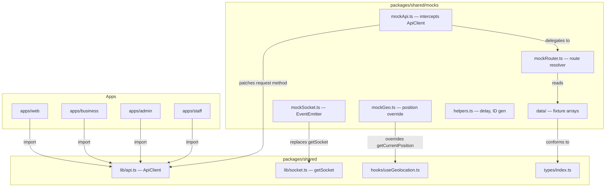
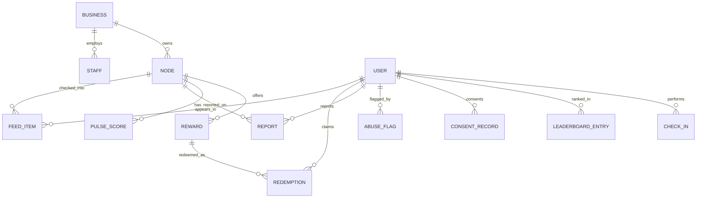

# Design Document: Dev Showcase Mock Layer

## Overview

This feature creates a comprehensive client-side mock data layer that allows all four Area Code apps (Web Consumer, Business, Admin, Staff) to run fully in dev mode without a backend. The approach intercepts the existing shared `ApiClient` at the class level, replacing its HTTP `request` method with an in-memory route resolver when `VITE_DEV_MOCK=true`. A shared mock data package (`packages/shared/mocks/`) provides typed fixture data and generators used by all apps. A mock socket emitter replaces the real Socket.io connection, and a geolocation override returns a position near the Johannesburg mock nodes.

The key design decision is to intercept at the `ApiClient` level rather than using MSW or a fetch-level proxy. This keeps the solution zero-dependency, tree-shakeable, and simple — the mock layer is a single conditional import that replaces the `api` singleton's internal `request` method with a route-matched resolver.

## Architecture



### Activation Flow

Each app's `main.tsx` conditionally calls `initDevMocks()` before rendering:

```typescript
// apps/web/src/main.tsx (and similar for business, admin, staff)
if (import.meta.env.VITE_DEV_MOCK === 'true') {
  const { initDevMocks } = await import('@area-code/shared/mocks')
  initDevMocks()
}
```

`initDevMocks()` does three things:
1. Monkey-patches the exported `api` singleton's private `request` method to route through `mockRouter`
2. Replaces the `getSocket` export with a mock `EventEmitter` that emits simulated events on timers
3. Overrides `getCurrentPosition` in `platform.ts` to return a fixed JHB position

### Tree-Shaking Safety

The dynamic `import()` ensures that when `VITE_DEV_MOCK` is not `'true'`, Vite's tree-shaking eliminates all mock data from the production bundle. The condition is a compile-time constant that Vite can statically analyze.

## Components and Interfaces

### 1. `packages/shared/mocks/index.ts` — Entry Point

```typescript
export function initDevMocks(): void
export const IS_DEV_MOCK: boolean
```

Single entry point. Calls the three patching functions and starts the socket event emitter timers.

### 2. `packages/shared/mocks/mockApi.ts` — API Interceptor

Patches the `api` singleton by replacing its private `request` method:

```typescript
export function patchApiClient(): void
```

The patched method:
1. Extracts `method` and `path` from the original call
2. Passes them to `mockRouter.resolve(method, path, body)`
3. Adds a random 100–400ms delay via `setTimeout`
4. Returns the resolved mock data

### 3. `packages/shared/mocks/mockRouter.ts` — Route Resolver

A map of `[method, pathPattern]` → handler functions:

```typescript
type RouteHandler = (params: RouteParams) => unknown
interface RouteParams {
  method: string
  path: string
  body?: unknown
  pathParams: Record<string, string>
  queryParams: Record<string, string>
}

export function resolve(method: string, path: string, body?: unknown): Promise<unknown>
```

Route patterns cover all endpoints used by the four apps:

| Method | Path Pattern | Handler |
|--------|-------------|---------|
| POST | `/v1/auth/consumer/login` | Returns `{ success: true }` |
| POST | `/v1/auth/consumer/verify-otp` | Returns tokens + userId |
| POST | `/v1/auth/consumer/signup` | Returns `{ success: true }` |
| GET | `/v1/auth/account-type` | Returns `{ accountType: 'consumer' }` |
| POST | `/v1/auth/business/login` | Returns `{ success: true }` |
| POST | `/v1/auth/business/verify-otp` | Returns tokens + businessId |
| POST | `/v1/auth/staff/login` | Returns `{ success: true }` |
| POST | `/v1/auth/staff/verify-otp` | Returns tokens + staffId + businessId + nodeName |
| POST | `/v1/auth/admin/login` | Returns tokens + adminId + role |
| GET | `/v1/nodes/:citySlug` | Returns 12 mock nodes |
| GET | `/v1/nodes/:nodeId/detail` | Returns node + rewards + who-is-here |
| GET | `/v1/nodes/search` | Filters nodes by name substring |
| POST | `/v1/check-in` | Returns success + cooldownUntil, updates pulse |
| GET | `/v1/rewards/near-me` | Returns nearby rewards with distances |
| GET | `/v1/rewards/unclaimed` | Returns unclaimed redemptions |
| POST | `/v1/rewards/:code/redeem` | Returns success + rewardTitle |
| GET | `/v1/leaderboard/:citySlug` | Returns ranked entries + userRank |
| GET | `/v1/feed` | Returns activity feed items |
| GET | `/v1/users/me` | Returns mock user profile |
| DELETE | `/v1/users/me/check-in-history` | Returns success |
| POST | `/v1/auth/logout` | Returns success |
| GET | `/v1/business/me` | Returns mock business profile |
| GET | `/v1/business/me/live-stats` | Returns live stats |
| GET | `/v1/business/me/nodes` | Returns business nodes |
| GET | `/v1/business/me/audience` | Returns audience insights |
| GET | `/v1/business/rewards` | Returns business rewards |
| POST | `/v1/business/rewards` | Creates reward, returns ID |
| GET | `/v1/business/plans` | Returns boost pricing |
| POST | `/v1/business/boost` | Returns mock checkout URL |
| GET | `/v1/business/staff` | Returns staff list |
| DELETE | `/v1/business/staff/:staffId` | Returns success |
| GET | `/v1/business/nodes/current/qr` | Returns QR URL |
| PUT | `/v1/nodes/:nodeId` | Returns success |
| GET | `/v1/admin/consumers` | Returns paginated users |
| POST | `/v1/admin/consumers/:userId/:action` | Returns success |
| GET | `/v1/admin/businesses` | Returns paginated businesses |
| POST | `/v1/admin/businesses/:businessId/:action` | Returns success |
| GET | `/v1/admin/reports` | Returns reports |
| POST | `/v1/admin/reports/:reportId/:action` | Returns success, updates status |
| GET | `/v1/admin/consent` | Returns consent records |
| GET | `/v1/admin/consent/export-reconsent` | Returns filtered list |
| GET | `/v1/admin/erasure-queue` | Returns erasure requests |
| GET | `/v1/staff/recent-redemptions` | Returns recent redemptions |

### 4. `packages/shared/mocks/mockSocket.ts` — Socket Emitter

```typescript
export function createMockSocket(): MockSocket
export function startConsumerEmitter(socket: MockSocket): () => void
export function startBusinessEmitter(socket: MockSocket, businessId: string): () => void
```

`MockSocket` implements the subset of `Socket` used by the app: `on`, `off`, `emit`, `connected`. It uses `setInterval` to emit events:

- Consumer emitter (8–20s intervals): `node:pulse_update`, `toast:new`, `node:state_change`
- Business emitter (15–45s intervals): `business:checkin`, `business:reward_claimed`

Events cycle through different mock nodes and users for variety.

### 5. `packages/shared/mocks/mockGeo.ts` — Geolocation Override

```typescript
export function patchGeolocation(): void
```

Overrides `getCurrentPosition` in `platform.ts` to return a fixed position near the centroid of the 12 JHB nodes: `{ lat: -26.15, lng: 28.04, accuracy: 15 }`.

### 6. `packages/shared/mocks/data/` — Fixture Data

Organized as separate files for each entity type:

```
packages/shared/mocks/
├── index.ts
├── mockApi.ts
├── mockRouter.ts
├── mockSocket.ts
├── mockGeo.ts
├── helpers.ts
└── data/
    ├── nodes.ts        — 12 JHB venue nodes
    ├── users.ts        — 15+ SA users
    ├── businesses.ts   — 8+ business accounts
    ├── rewards.ts      — 15+ rewards
    ├── redemptions.ts  — redemption records
    ├── staff.ts        — staff accounts
    ├── leaderboard.ts  — ranked entries
    ├── feed.ts         — activity feed items
    ├── reports.ts      — report queue items
    ├── consent.ts      — consent records
    ├── abuseFlags.ts   — abuse flag entries
    └── pulseScores.ts  — node pulse scores
```

### 7. `packages/shared/mocks/helpers.ts` — Utilities

```typescript
export function mockDelay(): Promise<void>          // 100-400ms random delay
export function generateId(): string                 // UUID-like ID
export function generateRedemptionCode(): string     // "AC-XXXXX-NNNN" format
export function hoursAgo(n: number): string          // ISO timestamp n hours ago
export function daysFromNow(n: number): string       // ISO timestamp n days from now
export function randomBetween(min: number, max: number): number
```

## Data Models

### Entity Relationships



### Mock Data ID Scheme

All mock entity IDs use a consistent prefix scheme for easy identification and cross-referencing:

| Entity | ID Pattern | Example |
|--------|-----------|---------|
| Node | `mock-node-{n}` | `mock-node-1` |
| User | `mock-user-{n}` | `mock-user-1` |
| Business | `mock-biz-{n}` | `mock-biz-1` |
| Staff | `mock-staff-{n}` | `mock-staff-1` |
| Reward | `mock-reward-{n}` | `mock-reward-1` |
| Redemption | `mock-redemption-{n}` | `mock-redemption-1` |
| Report | `mock-report-{n}` | `mock-report-1` |
| Consent | `mock-consent-{n}` | `mock-consent-1` |
| AbuseFlag | `mock-flag-{n}` | `mock-flag-1` |

### Mock Node Data (12 JHB Venues)

| ID | Name | Category | Lat | Lng | BusinessId | PulseScore | State |
|----|------|----------|-----|-----|------------|------------|-------|
| mock-node-1 | Nando's Rosebank | food | -26.14565 | 28.04325 | mock-biz-1 | 45 | buzzing |
| mock-node-2 | Father Coffee | coffee | -26.18340 | 28.01720 | mock-biz-2 | 8 | quiet |
| mock-node-3 | Kitchener's Bar | nightlife | -26.19310 | 28.03480 | mock-biz-3 | 72 | popping |
| mock-node-4 | Neighbourgoods Market | food | -26.19250 | 28.03350 | mock-biz-4 | 25 | active |
| mock-node-5 | Virgin Active Sandton | fitness | -26.10680 | 28.05280 | mock-biz-5 | 3 | quiet |
| mock-node-6 | Arts on Main | arts | -26.20480 | 28.05650 | mock-biz-6 | 55 | buzzing |
| mock-node-7 | Sandton City | retail | -26.10730 | 28.05200 | mock-biz-7 | 18 | active |
| mock-node-8 | Doubleshot Coffee | coffee | -26.18380 | 28.01680 | mock-biz-2 | 0 | dormant |
| mock-node-9 | The Grillhouse | food | -26.14680 | 28.04180 | mock-biz-1 | 38 | buzzing |
| mock-node-10 | Taboo Nightclub | nightlife | -26.10850 | 28.05720 | mock-biz-8 | 65 | popping |
| mock-node-11 | Keyes Art Mile | arts | -26.14920 | 28.04080 | mock-biz-6 | 12 | active |
| mock-node-12 | Planet Fitness Melrose | fitness | -26.13450 | 28.06850 | mock-biz-5 | 5 | quiet |

### Mock User Data (15 SA Users)

| ID | Username | Display Name | Tier | Total Check-ins | Streak |
|----|----------|-------------|------|----------------|--------|
| mock-user-1 | sipho_m | Sipho Mthembu | legend | 520 | 14 |
| mock-user-2 | thandi_n | Thandi Nkosi | institution | 210 | 8 |
| mock-user-3 | bongani_k | Bongani Khumalo | fixture | 87 | 5 |
| mock-user-4 | lerato_d | Lerato Dlamini | regular | 23 | 4 |
| mock-user-5 | neo_p | Neo Pillay | regular | 35 | 2 |
| mock-user-6 | zanele_z | Zanele Zulu | local | 6 | 1 |
| mock-user-7 | kagiso_m | Kagiso Mokoena | fixture | 62 | 3 |
| mock-user-8 | naledi_s | Naledi Sithole | institution | 180 | 11 |
| mock-user-9 | tshepo_r | Tshepo Radebe | regular | 28 | 0 |
| mock-user-10 | ayanda_n | Ayanda Ndlovu | local | 4 | 1 |
| mock-user-11 | mpho_b | Mpho Botha | fixture | 95 | 6 |
| mock-user-12 | lindiwe_m | Lindiwe Mahlangu | regular | 42 | 3 |
| mock-user-13 | siyabonga_d | Siyabonga Dube | local | 2 | 0 |
| mock-user-14 | nomsa_k | Nomsa Khumalo | legend | 550 | 21 |
| mock-user-15 | themba_j | Themba Jansen | local | 8 | 1 |

The "current user" for consumer login is `mock-user-4` (Lerato Dlamini, tier: regular, 23 check-ins, 4-day streak).

### Mock Business Data (8 SA Businesses)

| ID | Business Name | Tier | Trial Status | Nodes |
|----|--------------|------|-------------|-------|
| mock-biz-1 | Nando's SA (Pty) Ltd | pro | — | mock-node-1, mock-node-9 |
| mock-biz-2 | Father Coffee Roasters | growth | Trial ends +10 days | mock-node-2, mock-node-8 |
| mock-biz-3 | Kitchener's Hospitality | starter | — | mock-node-3 |
| mock-biz-4 | Neighbourgoods Trust | growth | — | mock-node-4 |
| mock-biz-5 | Virgin Active SA | pro | — | mock-node-5, mock-node-12 |
| mock-biz-6 | Arts on Main Collective | free | — | mock-node-6, mock-node-11 |
| mock-biz-7 | Sandton City Management | payg | Grace period +5 days | mock-node-7 |
| mock-biz-8 | Taboo Entertainment | starter | — | mock-node-10 |

The "current business" for business login is `mock-biz-2` (Father Coffee Roasters, tier: growth).

### Mutable Mock State

The mock router maintains an in-memory state object that can be mutated by POST/PUT/DELETE handlers:

```typescript
interface MockState {
  pulseScores: Record<string, number>
  currentUser: User
  rewards: Reward[]
  reports: Report[]
  consents: ConsentRecord[]
  userCheckInCount: number
  userStreak: number
}
```

This allows check-ins to increment pulse scores, reward creation to add to the list, and admin actions to update report statuses — all within the session.


## Correctness Properties

*A property is a characteristic or behavior that should hold true across all valid executions of a system — essentially, a formal statement about what the system should do. Properties serve as the bridge between human-readable specifications and machine-verifiable correctness guarantees.*

### Property 1: Mock data referential integrity

*For all* mock entities that contain foreign key references (rewards→nodes, redemptions→rewards+users, reports→users+nodes, consent→users, leaderboard→users, nodes→businesses), the referenced ID must exist in the corresponding mock data array, and for leaderboard entries the username, displayName, and tier must match the referenced user.

**Validates: Requirements 1.6, 23.2, 23.3, 23.4, 23.5, 23.6**

### Property 2: All registered mock routes resolve without error

*For all* route patterns registered in the mock router, calling `resolve(method, path)` with valid path parameters should return a defined (non-undefined, non-null) response object and should not throw an error.

**Validates: Requirements 2.2, 2.3**

### Property 3: Mock API delay is within bounds

*For all* mock API calls, the simulated network delay should be between 100ms and 400ms inclusive.

**Validates: Requirements 2.4**

### Property 4: Any phone number or credential succeeds at all auth endpoints

*For all* non-empty phone number strings, calling the consumer login, business login, or staff login mock endpoints should return a success response. *For all* non-empty email/password combinations, calling the admin login mock endpoint should return a success response. *For all* signup payloads with non-empty phone, username, and displayName, the consumer signup endpoint should return success.

**Validates: Requirements 3.1, 3.3, 10.1, 15.1, 20.1**

### Property 5: Any 6-digit OTP returns valid auth tokens

*For all* 6-digit numeric strings, calling the consumer, business, or staff OTP verification mock endpoints should return a response containing a non-empty accessToken string and the appropriate identity fields (userId for consumer, businessId for business, staffId+businessId+nodeName for staff).

**Validates: Requirements 3.2, 10.2, 20.2**

### Property 6: Node search returns only matching results

*For all* non-empty search query strings, every node returned by the mock search endpoint should contain the query as a case-insensitive substring of its name.

**Validates: Requirements 4.4**

### Property 7: Check-in updates pulse score and user count

*For all* valid mock node IDs, performing a check-in should: (a) increase the node's pulse score by exactly 5, (b) increment the user's totalCheckIns by exactly 1, and (c) return a CheckInResponse with success=true and a cooldownUntil timestamp approximately 4 hours in the future.

**Validates: Requirements 5.2, 5.3, 5.4**

### Property 8: Node detail includes only rewards belonging to that node

*For all* mock node IDs, the rewards array returned by the node detail endpoint should contain only rewards whose nodeId matches the requested node ID.

**Validates: Requirements 6.3**

### Property 9: Leaderboard is sorted by check-in count descending

*For all* consecutive pairs of entries in the leaderboard response, the first entry's checkInCount should be greater than or equal to the second entry's checkInCount.

**Validates: Requirements 7.1**

### Property 10: Feed entries are sorted by timestamp descending and within 12 hours

*For all* feed entries returned by the mock feed endpoint, the checkedInAt timestamp should be within the last 12 hours, and for all consecutive pairs, the first entry's timestamp should be more recent than or equal to the second's.

**Validates: Requirements 8.2**

### Property 11: Admin user search filters by substring match

*For all* non-empty search query strings, every user returned by the admin consumer search endpoint should have a username or phone containing the query as a case-insensitive substring.

**Validates: Requirements 16.3**

### Property 12: Mutation endpoints return success

*For all* POST/PUT/DELETE endpoints that perform state mutations (admin consumer actions, admin business actions, node updates, boost creation, reward creation), the mock router should return a response indicating success without throwing.

**Validates: Requirements 14.4, 16.4, 17.3**

### Property 13: Report status updates persist in mock state

*For all* mock report IDs with status "pending", performing an action (reviewed, dismissed, actioned) should update the report's status in the mock state, and a subsequent query should reflect the new status.

**Validates: Requirements 18.3**

### Property 14: Re-consent export returns only outdated consent versions

*For all* consent records returned by the re-consent export endpoint, the consentVersion should not equal the current version (i.e., all returned records have an outdated version).

**Validates: Requirements 19.3**

### Property 15: Staff redemption validates code length

*For all* 6-character alphanumeric strings, the redeem endpoint should return a success response. *For all* strings shorter than 6 characters, the redeem endpoint should return an error response with error type "invalid_code".

**Validates: Requirements 21.1, 21.3**

### Property 16: DEV_MODE flag correctly reads environment variable

*For all* string values of the VITE_DEV_MOCK environment variable, the IS_DEV_MOCK flag should be `true` if and only if the value is exactly `"true"`.

**Validates: Requirements 2.1**

### Property 17: Reward creation adds to mock state

*For all* reward creation payloads with a non-empty title and valid type, the mock router should return a response with a generated reward ID, and a subsequent query to the business rewards endpoint should include the newly created reward.

**Validates: Requirements 12.2**

## Error Handling

### Mock Router — Unmatched Routes

When the mock router receives a request for a path that doesn't match any registered pattern, it should log a console warning with the unmatched path and return a generic `{ error: 'not_found', message: 'Mock route not registered', statusCode: 404 }` response. This helps developers identify missing mock routes during development.

### Mock Router — Invalid Path Parameters

When a route handler receives an ID that doesn't exist in the mock data (e.g., a node ID not in the 12 mock nodes), the handler should return a `{ error: 'not_found', message: 'Entity not found', statusCode: 404 }` response, mimicking the real API behavior.

### Staff Validator — Invalid Code Format

The `/v1/rewards/:code/redeem` handler checks code length. Codes shorter than 6 characters return `{ error: 'invalid_code', message: 'Invalid code', statusCode: 400 }`. This matches the real API's validation behavior.

### Mock Socket — Graceful Degradation

If the mock socket emitter encounters an error (e.g., a handler throws), it should catch the error, log it to console, and continue emitting future events. The emitter should not crash or stop the interval.

### Geolocation Override — Fallback

If `patchGeolocation()` is called in an environment where `navigator.geolocation` doesn't exist (e.g., SSR), it should no-op silently rather than throwing.

## Testing Strategy

### Unit Tests

Unit tests should cover specific examples and edge cases:

- The 12 mock nodes have the correct names, categories, and approximate coordinates
- The mock data arrays have the required minimum counts (15 users, 8 businesses, 15 rewards, etc.)
- Pulse scores cover all 5 node states
- User tiers cover all 5 tier levels
- Business tiers cover the required distribution
- Reward slot and expiry variations exist
- The mock geolocation position is within 100m of the JHB centroid
- Specific auth endpoints return the expected response shapes
- The leaderboard includes a userRank outside the top 10
- The feed includes entries from multiple tiers and categories

### Property-Based Tests

Property-based tests should use `fast-check` (already available in the monorepo's test toolchain via Vitest) with a minimum of 100 iterations per property. Each test should be tagged with a comment referencing the design property.

Tag format: `Feature: dev-showcase-mock-layer, Property {number}: {property_text}`

Properties to implement:

1. **Referential integrity** — Generate random selections from each entity array and verify all foreign keys resolve
2. **Route resolution** — Generate the full list of registered routes and verify each resolves
3. **Mock delay bounds** — Measure delay across many calls and verify 100–400ms range
4. **Auth accepts any input** — Generate random phone numbers, emails, passwords and verify success
5. **OTP verification** — Generate random 6-digit strings and verify token responses
6. **Node search substring** — Generate random substrings of node names and verify filtered results
7. **Check-in state mutation** — Generate random node IDs from the 12 nodes and verify pulse/count updates
8. **Node detail reward filtering** — Generate random node IDs and verify reward nodeId matching
9. **Leaderboard sort order** — Verify descending checkInCount ordering
10. **Feed timestamp ordering** — Verify descending timestamp ordering within 12-hour window
11. **Admin search filtering** — Generate random substrings and verify user search results
12. **Mutation endpoint success** — Generate random mutation requests and verify success responses
13. **Report status persistence** — Generate random report actions and verify state updates
14. **Re-consent version filtering** — Verify all exported records have outdated versions
15. **Staff code length validation** — Generate strings of various lengths and verify success/error responses
16. **DEV_MODE flag** — Generate random strings and verify flag is true only for "true"
17. **Reward creation persistence** — Generate random reward payloads and verify they appear in subsequent queries

### Test Configuration

```typescript
// vitest.config.ts — property test settings
// Each property test uses fc.assert with { numRuns: 100 }
```

All property tests should import from `fast-check` and use `fc.assert(fc.property(...))` with `{ numRuns: 100 }` minimum. Tests live in `packages/shared/mocks/__tests__/`.
