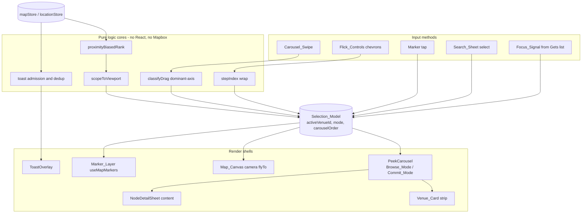
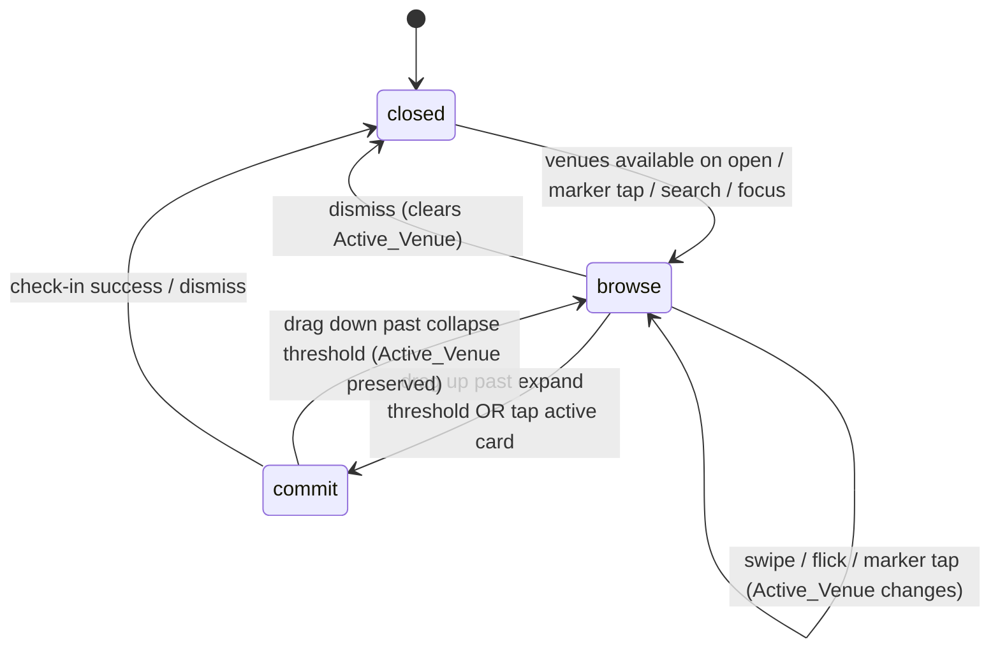

# Design Document

## Overview

This feature reframes the consumer map from a tap-one-marker detail viewer into a **browse-and-compare** surface, and hardens the full discovery journey into an auditable set of explicit states. It is delivered entirely as **client-side UI** layered on existing realtime, venue, and check-in surfaces. It introduces **no new backend service**, honours the serverless-only architecture, and keeps consumer identity as email + Cognito sub only — the signup path reachable from the map is the existing email/password + Google OAuth `SignupSheet`, with no phone-number or SMS input anywhere.

The work has two connected goals:

- **Goal 1 — Peek-Carousel.** A hybrid two-state bottom sheet replaces the prototype's in-sheet prev/next flick. A COLLAPSED **Browse_Mode** shows a horizontally swipeable strip of compact `Venue_Card`s (each driving the map's `flyTo`); an EXPANDED **Commit_Mode** is the full existing `NodeDetailSheet`. Carousel swipe, the chevron `Flick_Controls`, and marker taps all feed **one** `Selection_Model`. The live check-in count ticks inline on cards and the header from the existing `node:pulse_update` stream; toasts are reserved for ambient/passive surfacing.
- **Goal 2 — UX sweep.** Every stage of the journey (first paint, location lifecycle, marker legibility, filter/search, commit + check-in with GPS-too-far QR fallback and the unauthenticated signup path, cross-screen focus, toast coherence, onboarding/priming overlays, realtime and offline coherence) gets a defined correct behaviour and every explicit state (loading, empty, populated, error, offline, permission-denied).

### Design strategy

The central architectural move is to **extract selection out of `MapScreen`'s local React state into a single source of truth** (`Selection_Model`) and to **isolate the decidable logic into pure functions** — proximity-biased ranking, viewport scoping, gesture dominant-axis classification, flick index stepping, and toast admission. These pure cores are what make the comparison experience deterministic and testable; the React/Mapbox layers stay thin shells over them.

The existing building blocks are reused as-is wherever possible:

- `useMapInit` — map lifecycle, `flyTo`, `recenterUser` (already 60s freshness-gated), `retryMap`, 15s load timeout, reduced-motion awareness.
- `useMapMarkers` — `GLYPH_ZOOM_THRESHOLD` (12.5) / `MIN_MARKER_ZOOM` (8) presentation tiers, glyph/dot/hidden rendering, live badges.
- `mapStore` — `nodes`, `pulseScores`, `checkInCounts`, `archetypeIds`, `focusNodeId`.
- `locationStore` — `lastKnownPosition`, `capturedAt`, `permissionState`, `geoStatus`.
- `toastStore` — priority queue, cap of 3, `isBottomSheetOpen`.
- `BottomSheet`, `NodeDetailSheet`, `SearchSheet`, `SignupSheet`, `QrScannerSheet`, `NotificationPrimingSheet`, `ProximityNudgeBanner`.

## Architecture

### Layered view



### Selection_Model as single source of truth

Today `MapScreen` holds selection in four uncoordinated places (`selectedNode`, `sheetOpen`, `sheetOpenedFromFocus`, plus `handleFlick`'s ad-hoc ordering). The design collapses these into one model exposed by a `useCarouselSelection` hook backed by a small Zustand store slice (`selectionStore`). Every input method calls the same mutators; every renderer reads the same state. This is what guarantees Requirement 3's coherence ("within one render cycle") and Requirement 1.3's invariant ("exactly one Active_Venue while open").

`Selection_Model` state:

- `activeVenueId: string | null` — the single Active_Venue. Non-null whenever the carousel is open.
- `mode: 'closed' | 'browse' | 'commit'`.
- `carouselOrder: string[]` — ordered venue ids for Browse_Mode, recomputed from `proximityBiasedRank` ∘ `scopeToViewport`.
- `openedFromFocus: boolean` — drives the lighter backdrop (Requirement 15.3).

Mutators: `selectVenue(id, source)`, `step(dir)`, `enterCommit()`, `enterBrowse()`, `dismiss()`, `recomputeOrder(inputs)`.

### Camera coordination

A single `moveCameraToActive(map, node, { reducedMotion })` helper centralises the `flyTo` with `sheetFocusOffset()`. When `prefers-reduced-motion: reduce` matches, it issues a zero-duration move (effectively `jumpTo`) so no animated transition plays (Requirements 1.5, 8.5). Active_Venue change → exactly one camera move.

### Ranking and scoping pipeline

`carouselOrder` is recomputed by composing two pure functions whenever its inputs change (venue set, pulse scores, check-in counts, last-known position, category filter, map bounds):

```
scopeToViewport(  proximityBiasedRank(venues, pulse, counts, lastKnownPosition),  bounds, activeVenueId )
```

Recompute triggers are debounced map `moveend`/`zoom` events and filter changes. The Active_Venue is always re-inserted by `scopeToViewport` so a pan/zoom never silently drops it mid-selection (Requirement 6.5).

### Gesture arbitration

A pure `classifyDrag(dx, dy, threshold)` returns `'horizontal' | 'vertical' | 'indeterminate'`. The `PeekCarousel` gesture handler routes: horizontal → carousel swipe (and suppresses sheet dismiss); vertical → mode change/dismiss (and suppresses swipe); reward-chip-row horizontal in Commit_Mode → native chip scroll only; `indeterminate` → no action (Requirement 7).

## Components and Interfaces

### New modules

| Module                 | Path                                         | Responsibility                                                              |
| ---------------------- | -------------------------------------------- | --------------------------------------------------------------------------- |
| `selectionStore`       | `packages/shared/stores/selectionStore.ts`   | Zustand slice holding `Selection_Model`                                     |
| `useCarouselSelection` | `apps/web/src/hooks/useCarouselSelection.ts` | Binds inputs/renderers to `selectionStore`; orchestrates recompute + camera |
| `carouselRanking`      | `apps/web/src/lib/carouselRanking.ts`        | Pure `proximityBiasedRank`, `scopeToViewport`, `haversineMeters`            |
| `gestureClassifier`    | `apps/web/src/lib/gestureClassifier.ts`      | Pure `classifyDrag`, `stepIndex`                                            |
| `toastAdmission`       | `apps/web/src/lib/toastAdmission.ts`         | Pure `shouldEnqueueCheckInToast`, `admitToQueue`                            |
| `PeekCarousel`         | `apps/web/src/components/PeekCarousel.tsx`   | Two-state sheet host (Browse/Commit) over `BottomSheet`                     |
| `VenueCard`            | `apps/web/src/components/VenueCard.tsx`      | Compact browse card                                                         |
| `FlickControls`        | `apps/web/src/components/FlickControls.tsx`  | Accessible prev/next + aria-live announcer                                  |

### Key interfaces

```typescript
// carouselRanking.ts — pure, deterministic
export interface RankInput {
  venues: Node[]
  pulseScores: Record<string, number>
  checkInCounts: Record<string, number>
  lastKnownPosition: { lat: number; lng: number } | null
  positionFresh: boolean // capturedAt within Position_Freshness_Window
}
export function proximityBiasedRank(input: RankInput): Node[]

export interface ViewportBounds {
  west: number
  east: number
  south: number
  north: number
}
export function scopeToViewport(ranked: Node[], bounds: ViewportBounds | null, activeVenueId: string | null): Node[]

// gestureClassifier.ts — pure
export type DragAxis = 'horizontal' | 'vertical' | 'indeterminate'
export function classifyDrag(dx: number, dy: number, threshold: number): DragAxis
export function stepIndex(current: number, dir: 1 | -1, length: number): number // wraps

// selectionStore.ts
export interface SelectionState {
  activeVenueId: string | null
  mode: 'closed' | 'browse' | 'commit'
  carouselOrder: string[]
  openedFromFocus: boolean
  selectVenue: (id: string, source: 'swipe' | 'flick' | 'marker' | 'search' | 'focus') => void
  step: (dir: 1 | -1) => void
  enterCommit: () => void
  enterBrowse: () => void
  dismiss: () => void
  setOrder: (order: string[]) => void
}
```

### Selection_Model state machine



### `proximityBiasedRank` algorithm

Deterministic score per venue, sorted descending, ties broken by venue id ascending:

```
buzz(v)      = pulseScores[v.id] ?? 0  (primary)  +  checkInCounts[v.id] ?? 0  (secondary signal)
proximity(v) = positionFresh ? 1 / (1 + haversineMeters(lastKnownPosition, v) / 1000) : 0
score(v)     = buzz(v) * BUZZ_WEIGHT + proximity(v) * PROX_WEIGHT
sort by score desc, then by v.id asc   // stable, deterministic tie-break (R5.5)
```

When `positionFresh` is false, the proximity term is zero for every venue, so ordering falls back to buzz alone without error (Requirement 5.2). Because the inputs are plain data and the tie-break is total (by id), two consecutive computations on identical inputs yield an identical array (Requirement 5.3).

## Data Models

This feature adds **no persisted data** and **no new server-side records**. All new state is client-memory only. `Last_Known_Position` remains in `locationStore` (memory only, never persisted) per Requirement 20.4.

### Reused stores (unchanged shapes)

```typescript
// mapStore (existing): nodes, pulseScores, checkInCounts, archetypeIds, focusNodeId, mapInstance
// locationStore (existing): lastKnownPosition, capturedAt, accuracy, permissionState, geoStatus
// toastStore (existing): queue (priority-sorted, capped at 3), isBottomSheetOpen
```

### New client-memory model

```typescript
// selectionStore (new, ephemeral, not persisted)
interface SelectionModel {
  activeVenueId: string | null
  mode: 'closed' | 'browse' | 'commit'
  carouselOrder: string[] // venue ids, output of scopeToViewport ∘ proximityBiasedRank
  openedFromFocus: boolean
}
```

### Constants

```typescript
const POSITION_FRESHNESS_WINDOW = 60_000 // ms (existing)
const GLYPH_ZOOM_THRESHOLD = 12.5 // existing
const MIN_MARKER_ZOOM = 8 // existing
const DRAG_AXIS_THRESHOLD = 8 // px dominance margin for classifyDrag
const BUZZ_WEIGHT = 1.0
const PROX_WEIGHT = 0.5
const SHEET_FOCUS_OFFSET_RATIO = 0.3 // existing sheetFocusOffset()
```

### Venue_Card view model (derived, not stored)

```typescript
interface VenueCardVM {
  id: string
  name: string
  liveCheckInCount: number // mapStore.checkInCounts[id] ?? 0
  pulseState: NodeState // getNodeState(pulseScores[id])
  archetypeId: string // archetypeIds[id] ?? node.defaultArchetypeId ?? 'archetype-eclectic'
  isFirstIn: boolean // liveCheckInCount === 0  → "be the first in" affordance
}
```

## Correctness Properties

_A property is a characteristic or behavior that should hold true across all valid executions of a system — essentially, a formal statement about what the system should do. Properties serve as the bridge between human-readable specifications and machine-verifiable correctness guarantees._

This feature is amenable to property-based testing because its core decisions live in **pure functions** with large input spaces: proximity-biased ranking, viewport scoping, gesture dominant-axis classification, flick index stepping, toast admission/ordering, CTA-label derivation, and QR parsing. UI mount/layout behaviours (covered above as EXAMPLE/EDGE_CASE/SMOKE) are validated with example-based and render tests in the Testing Strategy, not as properties. The properties below were consolidated during prework reflection to remove redundancy.

### Property 1: Venue_Card content

_For any_ venue with a name, live check-in count, and pulse state, the rendered Venue_Card SHALL contain the venue name, display the live check-in count from `checkInCounts` when that count is greater than zero, and render the archetype glyph in the venue's Pulse_State colour.

**Validates: Requirements 1.2, 4.1**

### Property 2: Zero-count "be the first in" affordance

_For any_ venue, the Venue_Card SHALL render the "be the first in" affordance in place of a numeric count if and only if the venue's Live_Check_In_Count is zero.

**Validates: Requirements 4.6**

### Property 3: Single Active_Venue invariant

_For any_ sequence of selection operations performed while Peek*Carousel is open, the Selection_Model SHALL hold exactly one Active_Venue after each operation; and \_for any* dismiss from Browse_Mode, the Selection_Model SHALL end with no Active_Venue and a closed sheet.

**Validates: Requirements 1.3, 2.6**

### Property 4: Commit↔Browse preserves Active_Venue

_For any_ Active_Venue, entering Commit_Mode and then returning to Browse_Mode SHALL leave the same Active_Venue selected.

**Validates: Requirements 2.4**

### Property 5: Flick stepping wraps deterministically

_For any_ Carousel_Order and current index, activating a Flick_Control or swiping to an adjacent card SHALL move the Active_Venue to the position `(index + dir + length) mod length`, wrapping at both ends.

**Validates: Requirements 3.2, 3.3**

### Property 6: Selection coherence across all input sources

_For any_ selection produced by Carousel_Swipe, Flick_Controls, marker tap, Search_Sheet, or a Focus_Signal, the Selection_Model's `activeVenueId`, the active Venue_Card, and the last camera target SHALL all reference the same venue.

**Validates: Requirements 3.6, 15.4**

### Property 7: Camera move on Active_Venue change honours Reduced_Motion

_For any_ Active_Venue change, the Map_Canvas SHALL issue exactly one camera move targeting the Active_Venue's coordinates with the Sheet_Focus_Offset applied; the move SHALL be animated when Reduced_Motion is unset and zero-duration (non-animated) when Reduced_Motion is set.

**Validates: Requirements 1.4, 1.5, 8.5**

### Property 8: Proximity_Biased_Ranking is deterministic with a total tie-break

_For any_ fixed set of venues, pulse scores, check-in counts, and Last_Known_Position, two consecutive computations of `proximityBiasedRank` SHALL produce identical Carousel_Orders, and any two venues of equal rank SHALL be ordered by venue id ascending.

**Validates: Requirements 5.1, 5.3, 5.5**

### Property 9: Ranking falls back to buzz without a fresh position

_For any_ set of venues where no fresh Last_Known_Position is available, `proximityBiasedRank` SHALL order venues by buzz alone (pulse score and check-in count) and SHALL NOT raise an error.

**Validates: Requirements 5.2**

### Property 10: Carousel_Order respects category filter and viewport scope

_For any_ venue set, active Category_Filter, and Map_Canvas bounds, the recomputed Carousel_Order SHALL contain only venues matching the filter and, except for the Active_Venue, only venues whose coordinates fall within the current bounds; with no filter set it SHALL include all in-viewport venues.

**Validates: Requirements 5.4, 6.1, 6.2, 13.1, 13.2**

### Property 11: Active_Venue is never dropped on recompute

_For any_ pan or zoom while an Active_Venue is set, the recomputed Carousel_Order SHALL still include the Active_Venue even when it falls outside the new Map_Canvas bounds.

**Validates: Requirements 6.5**

### Property 12: Filter change reassigns the Active_Venue deterministically

_For any_ filter change after which the current Active_Venue no longer matches the filter, the Selection_Model SHALL set the Active_Venue to the first venue in the recomputed Carousel_Order, or clear the Active_Venue and close Peek_Carousel when the recomputed order is empty.

**Validates: Requirements 13.3**

### Property 13: Gesture dominant-axis classification

_For any_ drag displacement `(dx, dy)`, `classifyDrag` SHALL return `horizontal` when `|dx| - |dy|` exceeds the threshold, `vertical` when `|dy| - |dx|` exceeds the threshold, and `indeterminate` otherwise; the same input SHALL always yield the same classification, a horizontal result SHALL NOT trigger sheet dismiss, a vertical result SHALL NOT advance the carousel, and an indeterminate result SHALL produce no selection or state change.

**Validates: Requirements 7.1, 7.2, 7.4, 7.5**

### Property 14: Active_Venue change is announced to assistive technology

_For any_ Active_Venue change, the Peek_Carousel's aria-live region SHALL contain the new Active_Venue's name and its Live_Check_In_Count.

**Validates: Requirements 8.3**

### Property 15: Check-in CTA label is a function of Geo_Status

_For any_ combination of Geo_Status, QR-fallback flag, and pending flag, the check-in CTA's label and disabled state SHALL be the deterministic value defined by the CTA contract (pending → checking/disabled; QR fallback → scan/enabled; `requesting` → locating/disabled; `denied` → disabled; `poorAccuracy` → weak-signal/enabled; `timeout` → unavailable/enabled; acquired → ready/enabled).

**Validates: Requirements 10.6, 10.7, 14.1**

### Property 16: Recenter is gated on position freshness

_For any_ Last_Known_Position capture age, activating the Recenter_Control SHALL fly the Map_Canvas to that position at user-view zoom if and only if a position exists and its age does not exceed the Position_Freshness_Window; otherwise the control SHALL be disabled and SHALL NOT trigger a fly-to.

**Validates: Requirements 11.1, 11.2**

### Property 17: Marker presentation tier is a function of zoom

_For any_ zoom level, the Marker_Layer SHALL render each venue as a detailed archetype glyph when zoom ≥ `GLYPH_ZOOM_THRESHOLD`, as a category-coloured dot when zoom is in `[MIN_MARKER_ZOOM, GLYPH_ZOOM_THRESHOLD)`, and hidden when zoom < `MIN_MARKER_ZOOM`.

**Validates: Requirements 12.1, 12.2, 12.3**

### Property 18: Markers stay geo-anchored across transitions and updates

_For any_ sequence of zoom changes crossing rendering thresholds and any `node:pulse_update` for a rendered venue, the venue's marker SHALL retain its original coordinates (it is never detached) while its presentation and live-count badge update.

**Validates: Requirements 12.4, 18.1**

### Property 19: Active_Venue marker is visually distinguished

_For any_ set of rendered venues with one Active_Venue, exactly the Active_Venue's marker SHALL carry the active-marker styling and all non-active markers SHALL NOT.

**Validates: Requirements 12.6**

### Property 20: Valid venue QR round-trips to a check-in

_For any_ string of the form `…/qr/{nodeId}/{token}` with non-empty `nodeId` and `token`, the QR parser SHALL extract that `nodeId` and `token` and route the check-in flow for that venue.

**Validates: Requirements 14.5**

### Property 21: Invalid QR is rejected without check-in

_For any_ string that does not match the Area Code venue QR pattern, the QR handler SHALL surface an invalid-QR message and SHALL NOT perform a check-in.

**Validates: Requirements 14.6**

### Property 22: In-progress check-in prevents duplicate submissions

_For any_ number of check-in activations issued while a check-in request is already in progress, the Map_Screen SHALL perform exactly one check-in submission and keep the CTA in its pending state.

**Validates: Requirements 14.8**

### Property 23: Consumed Focus_Signal is cleared

_For any_ Focus_Signal targeting a venue present in the store, after the Map_Screen consumes it the `focusNodeId` SHALL be null so the same focus is not re-applied.

**Validates: Requirements 15.2**

### Property 24: Toast queue is priority-ordered and capped

_For any_ sequence of enqueued toasts, the Toast_System queue SHALL remain sorted by the priority map (surge highest) and SHALL never exceed three items.

**Validates: Requirements 16.1, 16.5**

### Property 25: Check_In_Toast deduplication within the auto-dismiss interval

_For any_ burst of check-in events for the same venue within a single auto-dismiss interval, the Toast_System SHALL admit at most one Check_In_Toast for that venue.

**Validates: Requirements 16.6**

### Property 26: Selection changes never enqueue a Check_In_Toast

_For any_ sequence of Active_Venue changes via Carousel_Swipe, Flick_Controls, or marker tap while browsing, the Map_Screen SHALL NOT enqueue a Check_In_Toast for the selection.

**Validates: Requirements 4.4, 16.2, 16.7**

### Property 27: Commit_Mode suppresses overlapping overlays

_For any_ state in which Commit_Mode is open, the Map_Screen SHALL render none of the Onboarding_Hint, the Proximity_Nudge_Banner, or the Notification_Priming_Sheet.

**Validates: Requirements 17.3**

### Property 28: Nudge and Location_Banner are mutually exclusive

_For any_ combination of eligibility for the Proximity_Nudge_Banner and the Location_Banner, the Map_Screen SHALL render at most one of them, choosing by the defined precedence.

**Validates: Requirements 17.4**

### Property 29: Browse_Mode order is stable during an in-progress swipe

_For any_ `node:pulse_update` events that arrive while a Carousel_Swipe is in progress, the Carousel_Order and the active index SHALL remain unchanged until the swipe settles.

**Validates: Requirements 18.3**

### Property 30: Offline check-in fails safe

_For any_ check-in attempted while offline, the Map_Screen SHALL surface a failure state and SHALL NOT report a false success.

**Validates: Requirements 19.3**

### Property 31: No phone-number or SMS input on any map auth entry

_For any_ authentication entry point reachable from the Map_Screen, the rendered surface SHALL expose only email/password and Google OAuth and SHALL NOT present any phone-number field or SMS affordance.

**Validates: Requirements 20.1**

## Error Handling

The feature degrades gracefully at every external boundary; no failure path is allowed to crash the surrounding app.

| Failure                             | Detection                              | Behaviour                                                               | Requirement |
| ----------------------------------- | -------------------------------------- | ----------------------------------------------------------------------- | ----------- |
| Map fails to initialise             | `useMapInit` catch / `map.on('error')` | `mapError` set → map-unavailable state with Retry; app stays mounted    | 9.4         |
| Map load exceeds 15s                | existing `loadTimeout`                 | map-unavailable + Retry                                                 | 9.6         |
| Venue list request fails            | React Query `error`                    | map stays interactive, render with no markers (or cache)                | 9.8, 19.1   |
| No venues for city                  | empty list                             | empty map, no error; empty Browse_Mode invite when no in-viewport venue | 9.7, 6.3    |
| Geolocation denied                  | `permissionState === 'denied'`         | Location_Banner, map fully usable, session-sticky dismiss               | 10.3, 10.8  |
| Geolocation poor/timeout            | `geoStatus`                            | CTA communicates weak-signal/unavailable; map usable                    | 10.6, 10.7  |
| Recenter with stale/absent position | `capturedAt` age check                 | control disabled, no fly-to                                             | 11.2        |
| Recenter while map not loaded       | `map.loaded()` guard                   | ignored, no exception                                                   | 11.3        |
| GPS too far for check-in            | `qrFallback` from `useCheckIn`         | offer QR_Fallback scanner                                               | 14.4        |
| Invalid QR scanned                  | regex non-match in parser              | invalid-QR message via `errorStore`, no check-in                        | 14.6        |
| Unauthenticated check-in            | `isAuthenticated` false                | open `SignupSheet` (email/password + Google only)                       | 14.3, 20.1  |
| Focus to unavailable venue          | `nodesById[id]` undefined              | clear `focusNodeId`, do not open, no error                              | 15.5        |
| Realtime connection lost            | socket disconnect                      | keep last known Pulse_State/count, no error                             | 18.4, 19.2  |
| Realtime restored                   | socket reconnect                       | apply next authoritative payload; resume without reload                 | 18.5, 19.4  |
| Check-in attempted offline          | network failure                        | failure state surfaced, never false success                             | 19.3        |

Pure functions are written total (no throws on valid-shaped input): `proximityBiasedRank` returns buzz-only order when no fresh position; `scopeToViewport` returns the active venue even with `null` bounds; `classifyDrag` returns `indeterminate` rather than guessing; `stepIndex` is defined for any non-empty length and returns the input for length ≤ 1.

## Testing Strategy

### Dual approach

- **Property-based tests** validate the 31 universal properties above against the pure logic cores. Library: **fast-check** with **Vitest** (the repo's existing test runner). Each property test runs a **minimum of 100 iterations** and is tagged with a comment referencing its design property.
- **Unit / example tests** cover the EXAMPLE, EDGE_CASE, and SMOKE criteria from the prework: map init configuration, loading/error/empty render states, banner and CTA interactions, search no-results, onboarding/priming gating, focus open, and the reconnection wiring.
- **Render tests** (Testing Library) cover the component shells: `VenueCard`, `PeekCarousel` mode transitions, `FlickControls` keyboard operation and aria-labels.

### Property test tagging

Each property-based test carries a tag comment of the form:

```
// Feature: map-discovery-experience, Property 8: Proximity_Biased_Ranking is deterministic with a total tie-break
```

### Property test placement and generators

| Property       | Module under test                                      | Key generators                                                            |
| -------------- | ------------------------------------------------------ | ------------------------------------------------------------------------- |
| 1, 2, 14, 19   | `VenueCard`, marker styling, aria-live                 | random venues (name, count ≥ 0, pulse score, archetype id), active id     |
| 3, 4, 5, 6, 12 | `selectionStore` / `useCarouselSelection`              | random venue id lists, op sequences, filters                              |
| 7, 16          | camera helper, recenter                                | random coordinates, reduced-motion flag, capturedAt ages                  |
| 8, 9, 10, 11   | `carouselRanking`                                      | random venue sets, pulse/count maps, positions, bounds, filters           |
| 13             | `gestureClassifier`                                    | random `(dx, dy)` pairs around the threshold                              |
| 15             | `getCtaInfo`                                           | enumerated/random Geo_Status × flags                                      |
| 17, 18         | `useMapMarkers` helpers (`scaleForZoom`, presentation) | random zoom levels, pulse updates                                         |
| 20, 21         | QR parser                                              | generated valid `/qr/{id}/{token}` URLs and random non-matching strings   |
| 22, 30         | check-in handler (mocked `useCheckIn`)                 | rapid activation counts; offline flag                                     |
| 24, 25, 26     | `toastAdmission` / `toastStore`                        | random toast type sequences, per-venue bursts, selection-change sequences |
| 23, 27, 28, 29 | `useCarouselSelection`, overlay coordinator            | random focus ids, overlay eligibility combos, mid-swipe update streams    |
| 31             | auth entry render                                      | render all map-reachable auth surfaces                                    |

### Mocks and isolation

- Mapbox GL is mocked with a stub exposing `flyTo`, `getBounds`, `getZoom`, `loaded`, matching the existing `MapInstance` shape, so camera and marker properties run in-memory with no network or WebGL.
- Realtime is driven by dispatching `node:pulse_update`-shaped payloads directly into `mapStore`, so realtime-coherence properties (18, 29) need no socket server.
- `useCheckIn` is mocked to assert submission counts and offline failure without hitting the backend.

### Out of scope for PBT

Map first-paint configuration (9.1), loading/error overlays (9.2–9.6), location-banner interactions (10.1–10.5, 10.8), search/filter interactions (13.4–13.6), check-in happy path and priming gating (14.2, 14.7, 17.5), focus open and backdrop (15.1, 15.3), toast positioning (16.4), onboarding render (17.1, 17.2), reconnection resume (18.5, 19.4), and the architectural/identity constraints (20.2, 20.3, 20.4) are covered by example, render, edge-case, smoke, or static dependency checks rather than properties, per the prework classification.
