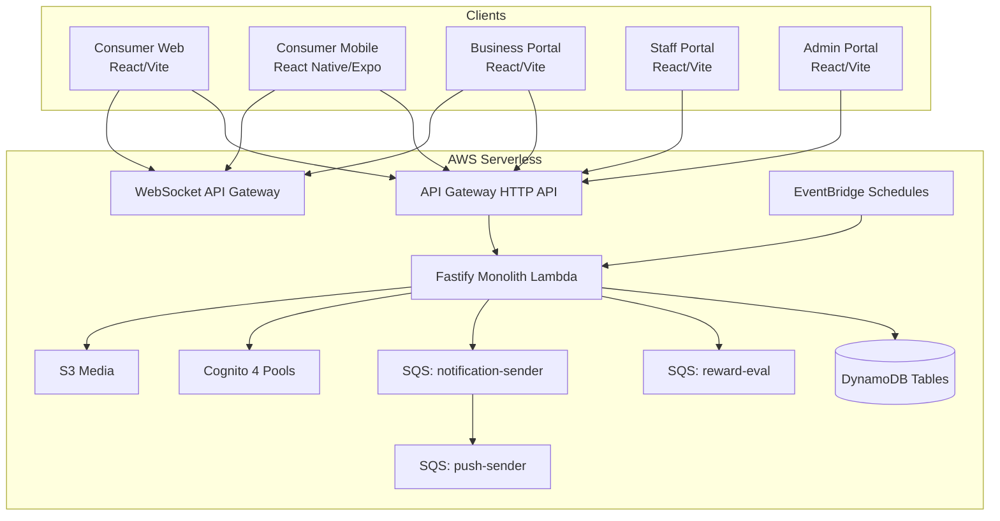
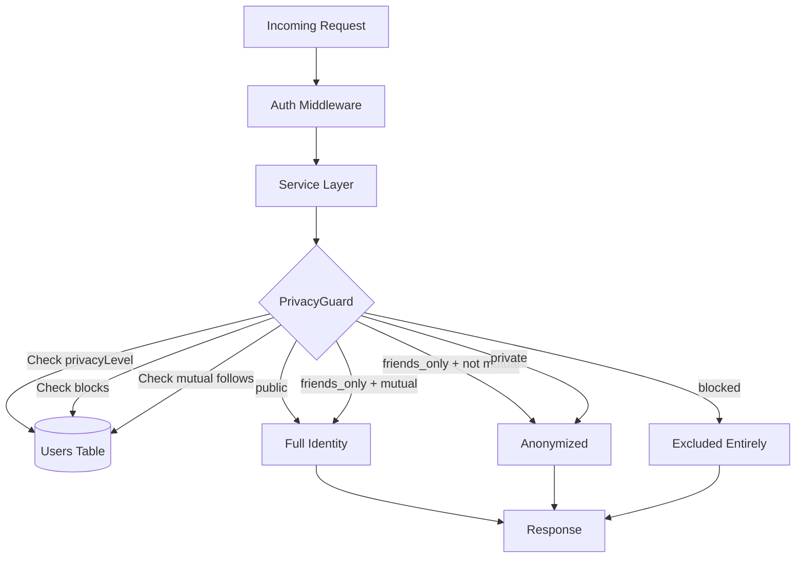
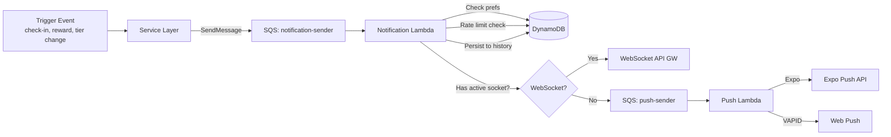

# Design Document: Platform Completeness Audit

## Overview

This design addresses 74 identified gaps across all five Area Code portals (Consumer Web/Mobile, Business, Staff, Admin) and the backend services. The platform is a South African location-based loyalty and check-in system running on a strictly serverless AWS stack: Lambda (Fastify monolith), API Gateway HTTP API, DynamoDB (PAY_PER_REQUEST), SQS, Cognito (4 pools), WebSocket API Gateway, and Amplify-hosted frontends.

The design is organized by implementation tier:

- **Tier 1 (Must-Have for Launch):** Requirements 1–22 — core user journeys, privacy model, cross-portal data flows, and notification pipeline
- **Tier 2 (Important for Scale):** Requirements 23–46 — settings, social sharing, badges, referrals, offline caching, billing, analytics
- **Tier 3 (Nice-to-Have):** Requirements 47–74 — crowd vibe, competitor benchmarks, USSD, advanced analytics

The architecture preserves the existing Fastify monolith Lambda pattern with catch-all API Gateway routing. No always-on resources are introduced. All new data lives in DynamoDB using the existing `app-data` table's single-table design (pk/sk/gsi1pk/gsi1sk) or as new attributes on existing tables.

**Key design decisions:**

1. **Privacy as a data-layer concern** — a `PrivacyGuard` middleware intercepts every data flow that exposes user activity, checking the user's `privacyLevel` before any data leaves the service layer. This is not a UI bolt-on.
2. **Notification pipeline via SQS** — a new `notification-sender` SQS queue decouples notification creation from delivery, enabling rate limiting, preference checking, and multi-channel delivery (WebSocket → push → silent drop).
3. **Incremental DynamoDB schema evolution** — new features use the existing `app-data` table's flexible pk/sk pattern. Only the `users` table gets new attributes (privacyLevel, onboardingComplete, streakStartDate).
4. **Frontend component architecture** — shared React component library in `packages/shared` with platform-specific wrappers in each app.

## Architecture

### System Context



### Privacy Enforcement Architecture

The anti-stalking privacy model (Requirement 22) is enforced at the **service layer**, not the UI. Every data flow that could expose user activity passes through a `PrivacyGuard` module.



**Data flows that pass through PrivacyGuard:**

- Activity feed (`GET /v1/social/feed`)
- Leaderboard (`GET /v1/social/leaderboard/:citySlug`)
- Who's here (`GET /v1/social/who-is-here/:nodeId`)
- Friend check-in toasts (WebSocket `toast:friend_checkin`)
- Business check-in events (WebSocket `business:checkin`) — always anonymized to display name + tier only
- Check-in history (own data only, no privacy filtering needed)

### Notification Pipeline Architecture



## Components and Interfaces

### Backend API Additions (Tier 1)

All new endpoints are added to the existing Fastify monolith Lambda. Route prefix: `/v1/`.

#### Consumer Endpoints

| Method | Path                               | Description                                            | Req |
| ------ | ---------------------------------- | ------------------------------------------------------ | --- |
| GET    | `/v1/users/me/check-in-history`    | Paginated check-in history (cursor-based)              | 1   |
| GET    | `/v1/users/me/tier-progress`       | Current tier, next tier threshold, check-ins remaining | 2   |
| GET    | `/v1/users/me/streak`              | Streak count, start date, at-risk status               | 3   |
| GET    | `/v1/nodes/search?q=`              | Text search for venues by name                         | 4   |
| POST   | `/v1/auth/consumer/otp/cancel`     | Invalidate current OTP session                         | 5   |
| POST   | `/v1/users/me/onboarding/complete` | Mark onboarding as completed                           | 6   |
| GET    | `/v1/users/me/privacy`             | Get current privacy settings                           | 22  |
| PATCH  | `/v1/users/me/privacy`             | Update privacy level (public/friends_only/private)     | 22  |
| POST   | `/v1/users/me/block/:targetUserId` | Block a user                                           | 22  |
| DELETE | `/v1/users/me/block/:targetUserId` | Unblock a user                                         | 22  |
| GET    | `/v1/users/me/blocks`              | List blocked users                                     | 22  |
| POST   | `/v1/reports`                      | Submit a report (harassment, stalking, etc.)           | 22  |

#### Business Endpoints

| Method | Path                                      | Description                              | Req   |
| ------ | ----------------------------------------- | ---------------------------------------- | ----- |
| GET    | `/v1/business/check-ins?date=&cursor=`    | Individual check-in details for business | 8, 16 |
| GET    | `/v1/business/rewards/:rewardId/metrics`  | Reward performance metrics               | 9     |
| GET    | `/v1/business/rewards/summary`            | All rewards ranked by claim rate         | 9     |
| GET    | `/v1/business/staff/:staffId/redemptions` | Redemptions by staff member              | 19    |

#### Staff Endpoints

| Method | Path                             | Description                              | Req |
| ------ | -------------------------------- | ---------------------------------------- | --- |
| POST   | `/v1/staff/redeem/scan`          | Submit scanned QR redemption code        | 10  |
| GET    | `/v1/staff/redeem/:code/preview` | Preview reward details before confirming | 11  |
| POST   | `/v1/staff/redeem/:code/confirm` | Confirm redemption after preview         | 12  |

#### Admin Endpoints

| Method | Path                                       | Description                                     | Req    |
| ------ | ------------------------------------------ | ----------------------------------------------- | ------ |
| GET    | `/v1/admin/dashboard`                      | Dashboard overview metrics                      | 13     |
| GET    | `/v1/admin/abuse-flags`                    | List unreviewed abuse flags                     | 14, 21 |
| POST   | `/v1/admin/abuse-flags/:flagId/review`     | Mark flag as reviewed                           | 14     |
| POST   | `/v1/admin/abuse-flags/:flagId/action`     | Take action on flag (disable user, reset)       | 14     |
| GET    | `/v1/admin/audit-logs`                     | Paginated audit trail                           | 15     |
| POST   | `/v1/admin/users/:userId/disable`          | Disable consumer (revoke tokens, block actions) | 18     |
| POST   | `/v1/admin/businesses/:businessId/disable` | Disable business (deactivate nodes)             | 18     |

#### Notification Endpoints

| Method | Path                                   | Description                      | Req   |
| ------ | -------------------------------------- | -------------------------------- | ----- |
| GET    | `/v1/users/me/notifications`           | Notification history (paginated) | T2-23 |
| POST   | `/v1/users/me/notifications/mark-read` | Mark notifications as read       | T2-23 |

### WebSocket Event Changes

#### New Events (Server → Client)

| Event                     | Room                    | Payload                                                 | Req            |
| ------------------------- | ----------------------- | ------------------------------------------------------- | -------------- |
| `business:checkin_detail` | `business:{businessId}` | `{ nodeId, displayName?, tier, visitCount, timestamp }` | 8, 16          |
| `notification:new`        | `user:{userId}`         | `{ id, type, title, body, data, createdAt }`            | 17, 20, 39, 40 |
| `tier:changed`            | `user:{userId}`         | `{ oldTier, newTier, benefits[] }`                      | 2, 20          |
| `abuse:new_flag`          | `admin:flags`           | `{ flagId, type, entityId, createdAt }`                 | 21             |

#### Modified Events

| Event                   | Change                                                                          | Req |
| ----------------------- | ------------------------------------------------------------------------------- | --- |
| `business:checkin`      | Add `displayName`, `tier`, `visitCount` to payload (privacy-filtered)           | 16  |
| `toast:friend_checkin`  | Only emit to mutual follows when user privacy is `public` or `friends_only`     | 22  |
| `toast:new` (city-wide) | Exclude check-in identity data when user privacy is `friends_only` or `private` | 22  |

### Frontend Component Architecture

#### Shared Components (packages/shared)

New shared UI components used across web and mobile:

- `SkeletonLoader` — configurable skeleton loading states (Req 1, 4)
- `PaginatedList` — cursor-based infinite scroll with error/retry (Req 1, 15)
- `TierBadge` — tier display with color coding (existing, extended)
- `TierProgressBar` — visual progress toward next tier (Req 2)
- `StreakDisplay` — streak count with at-risk warning indicator (Req 3)
- `SearchInput` — debounced text search with 300ms delay (Req 4)
- `ErrorBoundary` — global error boundary with recovery screen (Req 7)
- `ErrorToast` — contextual error messages with retry action (Req 7)
- `PrivacyIndicator` — shows current privacy level on profile (Req 22)
- `PrivacySettingsPicker` — three-level privacy selector (Req 22)
- `BlockUserButton` — block action accessible from profiles/lists (Req 22)
- `OnboardingFlow` — step-based onboarding carousel (Req 6)
- `QrScanner` — camera-based QR code scanner with fallback (Req 10)
- `RedemptionPreview` — reward details before confirmation (Req 11)
- `RedemptionResult` — success/failure confirmation screen (Req 12)

#### Consumer Portal (Web + Mobile)

New screens/panels:

- `CheckInHistoryScreen` — paginated history with venue name, category, timestamp
- `TierProgressionPanel` — tier ladder with thresholds and benefits
- `StreakInfoPanel` — streak explanation, current count, at-risk warning
- `OnboardingScreen` — 5-step guided flow (map, check-in, rewards, leaderboard, music)
- `PrivacySettingsScreen` — privacy level picker, blocked users list
- `VenueSearchOverlay` — search input overlaying the map screen

#### Business Portal

New panels within existing dashboard:

- `CheckInDetailPanel` — individual check-in list with real-time WebSocket updates
- `RewardMetricsPanel` — claim rate, time-to-claim, redemption rate per reward
- `StaffRedemptionPanel` — redemptions filtered by staff member

#### Staff Portal

Modified screens:

- `StaffHome` — add QR scanner button, redemption preview flow
- `RedemptionFlow` — scan → preview → confirm → result (4-step flow)

#### Admin Portal

New screens:

- `DashboardOverview` — summary metrics with auto-refresh
- `AbuseFlagDashboard` — flag list with review/action workflow
- `AuditTrailViewer` — filterable, paginated audit log

## Data Models

### Existing Table Modifications

#### Users Table (`area-code-{env}-users`)

New attributes added to existing user records:

| Attribute            | Type | Default          | Description                                             | Req   |
| -------------------- | ---- | ---------------- | ------------------------------------------------------- | ----- |
| `privacyLevel`       | S    | `"friends_only"` | Privacy visibility: `public`, `friends_only`, `private` | 22    |
| `onboardingComplete` | BOOL | `false`          | Whether consumer completed onboarding flow              | 6     |
| `streakStartDate`    | S    | `null`           | ISO date when current streak began                      | 3     |
| `isDisabled`         | BOOL | `false`          | Whether account is disabled by admin                    | 18    |
| `disabledAt`         | S    | `null`           | ISO timestamp of when account was disabled              | 18    |
| `referralCode`       | S    | `null`           | Unique referral code for consumer (Tier 2)              | T2-26 |

No new GSIs needed on the users table — privacy level is always looked up by userId (primary key).

#### Nodes Table (`area-code-{env}-nodes`)

New attributes:

| Attribute        | Type | Default  | Description                                       | Req   |
| ---------------- | ---- | -------- | ------------------------------------------------- | ----- |
| `operatingHours` | M    | `null`   | Map of day → `{ open, close }` times              | T2-30 |
| `manualStatus`   | S    | `"open"` | Manual override: `open`, `closed`, `loadshedding` | T2-31 |
| `isActive`       | BOOL | `true`   | Whether node is visible on consumer map           | 18    |

#### Rewards Table (`area-code-{env}-rewards`)

New attributes:

| Attribute        | Type | Default | Description                              | Req |
| ---------------- | ---- | ------- | ---------------------------------------- | --- |
| `claimedCount`   | N    | `0`     | Number of times reward has been claimed  | 9   |
| `firstClaimedAt` | S    | `null`  | ISO timestamp of first claim             | 9   |
| `redeemedCount`  | N    | `0`     | Number of times reward has been redeemed | 9   |

#### Check-ins Table (`area-code-{env}-checkins`)

New attributes:

| Attribute | Type | Default | Description                                     | Req |
| --------- | ---- | ------- | ----------------------------------------------- | --- |
| `staffId` | S    | `null`  | Staff member who redeemed the associated reward | 19  |

### New Data Patterns in App-Data Table

The `app-data` table uses a single-table design with `pk`/`sk` and `gsi1pk`/`gsi1sk`. New entity patterns:

#### Block Records (Req 22)

```
pk: BLOCK#{blockerId}
sk: BLOCKED#{blockedId}
gsi1pk: BLOCKED_BY#{blockedId}
gsi1sk: BLOCKER#{blockerId}
blockerId, blockedId, createdAt
```

Query patterns:

- "Who has user X blocked?" → Query pk = `BLOCK#{userId}`
- "Who has blocked user X?" → Query GSI1 gsi1pk = `BLOCKED_BY#{userId}`

#### Report Records (Req 22 — harassment reports)

```
pk: REPORT#{reportId}
sk: REPORT#{createdAt}
gsi1pk: REPORT_QUEUE
gsi1sk: {priority}#{createdAt}
reporterId, reportedUserId, category (harassment_report, stalking, other),
description, status (pending, reviewed, actioned), priority (high, normal),
createdAt
```

Query patterns:

- "Get report queue sorted by priority" → Query GSI1 gsi1pk = `REPORT_QUEUE`, ScanIndexForward = false

#### Notification History (Req 17, 20, 39, 40, T2-23)

```
pk: NOTIF#{userId}
sk: NOTIF#{createdAt}
gsi1pk: NOTIF_USER#{userId}
gsi1sk: {createdAt}
notifId, userId, type (reward_new, tier_change, reward_code, leaderboard_reset, badge_earned),
title, body, data (JSON), isRead (BOOL), deliveryChannel (socket, push, none),
createdAt, ttl (90 days)
```

Query patterns:

- "Get user's notification history" → Query pk = `NOTIF#{userId}`, ScanIndexForward = false

#### Business Check-In Detail Cache (Req 8, 16)

```
pk: BIZ_CHECKIN#{businessId}#{date}
sk: CHECKIN#{timestamp}#{checkInId}
displayName (privacy-filtered), tier, visitCount, nodeId, nodeName, timestamp
ttl (30 days)
```

Query patterns:

- "Get today's check-ins for business" → Query pk = `BIZ_CHECKIN#{businessId}#{today}`
- "Get check-ins for date range" → Multiple queries by date

#### Reward Metrics (Req 9)

Computed on read from existing rewards and check-ins data. No separate storage needed — the `claimedCount`, `firstClaimedAt`, and `redeemedCount` attributes on the rewards table provide the raw data. Claim rate = `claimedCount / totalSlots`. Time-to-claim = `firstClaimedAt - createdAt`. Redemption rate = `redeemedCount / claimedCount`.

#### Admin Dashboard Metrics (Req 13)

```
pk: METRICS#DAILY
sk: METRICS#{date}
totalConsumers, totalBusinesses, totalCheckInsAllTime, totalCheckInsToday,
activeRewards, pendingReports, pendingErasures, date, computedAt
```

Computed by a new EventBridge-triggered Lambda running every 60 seconds (or on-demand via API with 60s cache in KV store).

#### Audit Log (Req 15 — already exists, needs filtering support)

Existing pattern: `pk: AUDIT#{logId}`, `sk: AUDIT#{createdAt}`, `gsi1pk: AUDIT_LOGS`, `gsi1sk: {createdAt}`

New GSI needed for filtering by admin:

```
gsi1pk: AUDIT_ADMIN#{adminId}
gsi1sk: {createdAt}
```

This reuses the existing GSI1 by adding a new gsi1pk pattern. Filtering by action type is done client-side on the paginated results (DynamoDB FilterExpression).

#### Notification Rate Limiting (Req 17, 39)

Uses existing KV pattern:

```
pk: KV#notif:daily:{userId}:{type}
sk: VALUE
value: count (number), ttl: end of day
```

#### Redemption Records (Req 19 — staff attribution)

Existing redemption records in the rewards flow gain a `staffId` attribute. The reward evaluator Lambda and the `redeemReward` service function already accept `staffId` — it just needs to be persisted and returned in queries.

### DynamoDB Capacity Considerations

All tables remain `PAY_PER_REQUEST`. The new data patterns add:

- Block records: O(blocks per user) — typically < 100 per user
- Notification history: O(notifications per user) with 90-day TTL — self-cleaning
- Business check-in cache: O(check-ins per day per business) with 30-day TTL
- Admin metrics: 1 record per day — negligible

No new DynamoDB tables are needed. All new entities use the existing `app-data` table's single-table design.

## Correctness Properties

_A property is a characteristic or behavior that should hold true across all valid executions of a system — essentially, a formal statement about what the system should do. Properties serve as the bridge between human-readable specifications and machine-verifiable correctness guarantees._

### Property 1: Pagination preserves ordering and completeness

_For any_ set of check-in records and any page size, paginating through the full set using cursor-based pagination SHALL return every record exactly once, in descending date order, with no duplicates and no omissions.

**Validates: Requirements 1.1, 1.3**

### Property 2: Check-in history entries contain required fields

_For any_ check-in record returned by the history API, the response entry SHALL contain a non-null venue name, category, and timestamp.

**Validates: Requirements 1.2**

### Property 3: Tier computation is correct for any check-in count

_For any_ non-negative check-in count, the computed tier SHALL match the expected tier based on the threshold table (0–9 → local, 10–49 → regular, 50–149 → fixture, 150–499 → institution, 500+ → legend), and the "remaining check-ins to next tier" SHALL equal max(0, nextThreshold - currentCount).

**Validates: Requirements 2.4, 2.5**

### Property 4: Streak at-risk detection

_For any_ consumer with a streak count > 0 and a last check-in date, the at-risk flag SHALL be true if and only if the last check-in date (in SAST) is before today's date (in SAST).

**Validates: Requirements 3.3**

### Property 5: Venue search returns only matching results

_For any_ list of venues and any search query of two or more characters, every venue in the search results SHALL have a name that contains the query string (case-insensitive), and no venue whose name contains the query string SHALL be excluded from the results.

**Validates: Requirements 4.2**

### Property 6: Visit frequency computation

_For any_ consumer and node, the visit count returned in the business check-in event SHALL equal the total number of check-in records for that consumer at that specific node.

**Validates: Requirements 8.2, 16.3**

### Property 7: Business check-in events contain only privacy-safe fields

_For any_ consumer profile (regardless of privacy level), the business check-in event payload SHALL contain at most `displayName` and `tier`. The payload SHALL NEVER contain `phone`, `email`, `userId`, `cognitoSub`, `lat`, `lng`, or any field that could enable tracking an individual's movement pattern.

**Validates: Requirements 8.5, 16.4, 22.6**

### Property 8: Reward rate metrics are correctly bounded

_For any_ reward with totalSlots > 0, the claim rate (claimedCount / totalSlots) SHALL be between 0.0 and 1.0 inclusive. _For any_ reward with claimedCount > 0, the redemption rate (redeemedCount / claimedCount) SHALL be between 0.0 and 1.0 inclusive.

**Validates: Requirements 9.1, 9.3**

### Property 9: Reward summary is sorted by claim rate

_For any_ set of active rewards, the summary comparison SHALL return rewards sorted by claim rate in descending order.

**Validates: Requirements 9.5**

### Property 10: Abuse flags are ordered by creation date descending

_For any_ set of unreviewed abuse flags, the API SHALL return them in descending creation date order.

**Validates: Requirements 14.1**

### Property 11: Audit log filtering returns only matching entries

_For any_ set of audit log entries and any combination of filters (adminId, action type, date range), every returned entry SHALL match all active filter criteria, and no matching entry SHALL be excluded.

**Validates: Requirements 15.3**

### Property 12: Audit log pagination preserves completeness

_For any_ set of audit log entries and any page size, paginating through the full set SHALL return every entry exactly once with no duplicates.

**Validates: Requirements 15.5**

### Property 13: Notification recipient targeting within time window

_For any_ node and any set of check-in records, the notification recipients for a new reward at that node SHALL be exactly the set of consumers who have at least one check-in at that node within the past 30 days.

**Validates: Requirements 17.1**

### Property 14: Notification preference enforcement

_For any_ consumer and any notification type, the notification SHALL only be delivered if the consumer's corresponding notification preference is enabled. If the preference is disabled, the notification SHALL be silently dropped.

**Validates: Requirements 17.3**

### Property 15: Notification rate limiting

_For any_ consumer and any day, the total number of reward-related notifications delivered SHALL not exceed 2.

**Validates: Requirements 17.4**

### Property 16: Notification channel selection

_For any_ notification delivery attempt, if the target consumer has an active WebSocket connection, the delivery channel SHALL be "socket". If the consumer has no active WebSocket connection but has valid push tokens, the delivery channel SHALL be "push". If neither is available, the delivery status SHALL be "no_tokens".

**Validates: Requirements 17.5, 20.2, 20.3**

### Property 17: Disabled user is blocked from check-in and reward claims

_For any_ consumer with `isDisabled = true`, all check-in attempts and reward claim attempts SHALL be rejected with an appropriate error.

**Validates: Requirements 18.2**

### Property 18: Disabling a business deactivates all its nodes

_For any_ business with N nodes (N ≥ 0), disabling the business SHALL result in all N nodes having `isActive = false`.

**Validates: Requirements 18.3**

### Property 19: Every admin action produces an audit log entry

_For any_ admin action (disable user, disable business, review flag, reset flags, extend trial, etc.), an audit log entry SHALL be created with the correct adminId, action type, target entity, and timestamp.

**Validates: Requirements 18.4**

### Property 20: Staff attribution on redemption

_For any_ reward redemption performed by a staff member, the persisted redemption record SHALL contain the staff member's identifier.

**Validates: Requirements 19.1**

### Property 21: Tier change notification contains correct data

_For any_ tier change event (oldTier → newTier), the notification payload SHALL contain the new tier name and the complete list of benefits associated with the new tier.

**Validates: Requirements 20.1**

### Property 22: New accounts default to friends_only privacy

_For any_ newly created consumer account, the `privacyLevel` attribute SHALL be `"friends_only"`.

**Validates: Requirements 22.1**

### Property 23: Privacy level controls visibility in social queries

_For any_ consumer with `privacyLevel = "private"`, their check-ins SHALL NOT appear in the activity feed, leaderboard, or "who's here" list for any other consumer. _For any_ consumer with `privacyLevel = "friends_only"`, their check-ins SHALL only appear to consumers who are mutual follows.

**Validates: Requirements 22.3, 22.4**

### Property 24: No GPS coordinates in consumer-facing responses

_For any_ API response that returns data about other consumers (feed, leaderboard, who's here, search), the response SHALL NOT contain `lat` or `lng` fields associated with any consumer's check-in activity.

**Validates: Requirements 22.5**

### Property 25: Block enforcement across all social queries

_For any_ pair of consumers where A has blocked B, all social queries made by B (feed, leaderboard, who's here, search, profile) SHALL NOT return any data about A. Additionally, A SHALL NOT appear in any WebSocket events delivered to B.

**Validates: Requirements 22.7**

### Property 26: Harassment reports create high-priority abuse flags

_For any_ report submitted with category "harassment_report" or "stalking", the system SHALL create an abuse flag with `type = "harassment_report"` and `priority = "high"` that appears at the top of the admin abuse flag queue.

**Validates: Requirements 22.9**

### Property 27: WebSocket privacy enforcement for non-public users

_For any_ check-in by a consumer with `privacyLevel` set to `"friends_only"` or `"private"`, the check-in SHALL NOT be included in any city-wide WebSocket event (`toast:new`) with identity information. Friend-specific toasts (`toast:friend_checkin`) SHALL only be emitted to the consumer's mutual follows.

**Validates: Requirements 22.10**

## Error Handling

### API Error Strategy

The existing `AppError` class and Fastify error handler provide a solid foundation. The design extends this with:

#### Consumer-Facing Errors

| Scenario                       | HTTP Status | Error Code         | User Message                                             |
| ------------------------------ | ----------- | ------------------ | -------------------------------------------------------- |
| Check-in history empty         | 200         | —                  | Empty state with "No check-ins yet"                      |
| Venue search no results        | 200         | —                  | Empty state with "No venues found"                       |
| OTP session expired on cancel  | 404         | `otp_not_found`    | "No active OTP session"                                  |
| Privacy update invalid level   | 400         | `validation_error` | "Privacy level must be public, friends_only, or private" |
| Block self                     | 400         | `bad_request`      | "Cannot block yourself"                                  |
| Block already blocked user     | 409         | `conflict`         | "User already blocked"                                   |
| Report missing required fields | 400         | `validation_error` | "Report description is required"                         |
| Disabled account check-in      | 403         | `account_disabled` | "Your account has been suspended"                        |
| Disabled account reward claim  | 403         | `account_disabled` | "Your account has been suspended"                        |

#### Business-Facing Errors

| Scenario                            | HTTP Status | Error Code  | User Message                                    |
| ----------------------------------- | ----------- | ----------- | ----------------------------------------------- |
| Check-in details for non-owned node | 403         | `forbidden` | "You do not own this node"                      |
| Reward metrics for non-owned reward | 403         | `forbidden` | "You do not own this reward"                    |
| Staff redemption for wrong business | 403         | `forbidden` | "Staff member does not belong to your business" |

#### Staff-Facing Errors

| Scenario                 | HTTP Status | Error Code         | User Message                                    |
| ------------------------ | ----------- | ------------------ | ----------------------------------------------- |
| Invalid redemption code  | 400         | `invalid_code`     | "Redemption code not recognized"                |
| Already redeemed         | 400         | `already_redeemed` | "This reward has already been redeemed"         |
| Expired code             | 400         | `expired_code`     | "This redemption code has expired"              |
| Camera permission denied | —           | —                  | Graceful fallback to manual entry (client-side) |
| Invalid QR format        | —           | —                  | "Unrecognized QR code format" (client-side)     |

#### Admin-Facing Errors

| Scenario                       | HTTP Status | Error Code  | User Message                          |
| ------------------------------ | ----------- | ----------- | ------------------------------------- |
| Insufficient permissions       | 403         | `forbidden` | "Role {role} cannot perform {action}" |
| User not found for disable     | 404         | `not_found` | "User not found"                      |
| Business not found for disable | 404         | `not_found` | "Business not found"                  |
| Abuse flag already reviewed    | 409         | `conflict`  | "Flag already reviewed"               |

### Frontend Error Handling

#### Global Error Boundary (Req 7)

Each portal app wraps its root component in an `ErrorBoundary` that:

1. Catches unhandled React errors
2. Logs the error to Sentry (existing integration)
3. Displays a recovery screen with "Reload" button
4. Preserves the error message for debugging

#### API Error Interceptor

A shared Axios/fetch interceptor handles:

- **Network errors** → "Connection lost. Check your internet and try again." + retry button
- **HTTP 5xx** → "Something went wrong. Please try again." + retry button
- **HTTP 4xx** → Extract `message` from response body and display it
- **HTTP 429** → Extract `cooldownUntil` and display countdown timer

#### WebSocket Reconnection

The existing Socket.IO client handles reconnection automatically. New behavior:

- On reconnect, re-subscribe to all active rooms (city, user, business, node)
- Display a "Reconnecting..." banner during disconnection
- Queue missed events are not replayed (eventual consistency via API polling)

### Notification Delivery Failures

| Failure                                       | Handling                                                                   |
| --------------------------------------------- | -------------------------------------------------------------------------- |
| Expo push token invalid (DeviceNotRegistered) | Deactivate token, mark as `invalid`                                        |
| Web push subscription expired (410 Gone)      | Deactivate token, mark as `invalid`                                        |
| Push delivery timeout                         | Retry once via SQS dead-letter queue                                       |
| WebSocket room empty                          | Fall through to push delivery                                              |
| No push tokens and no socket                  | Record as `no_tokens`, notification persisted to history but not delivered |

### Privacy Guard Error Handling

The `PrivacyGuard` module fails **closed** — if privacy settings cannot be loaded (DynamoDB error), the user is treated as `private` (most restrictive). This ensures that a service outage never accidentally exposes private data.

## Testing Strategy

### Property-Based Testing

This feature is suitable for property-based testing. The privacy enforcement logic, notification pipeline, pagination, and data filtering all have clear universal properties that benefit from randomized input testing.

**Library:** [fast-check](https://github.com/dubzzz/fast-check) (TypeScript PBT library)

**Configuration:**

- Minimum 100 iterations per property test
- Each property test references its design document property
- Tag format: `Feature: platform-completeness-audit, Property {number}: {property_text}`

**Property tests to implement (27 properties from Correctness Properties section):**

The properties are grouped into testable modules:

1. **Pagination module** (Properties 1, 12): Test cursor-based pagination with random record sets
2. **Tier computation module** (Property 3): Test tier assignment and remaining count for random check-in counts
3. **Streak module** (Property 4): Test at-risk detection with random streak states and dates
4. **Search module** (Property 5): Test venue search filtering with random venue lists and queries
5. **Privacy Guard module** (Properties 7, 22, 23, 24, 25, 27): Test privacy enforcement with random user profiles, privacy levels, follow graphs, and block lists — this is the highest-value PBT target
6. **Notification module** (Properties 13, 14, 15, 16): Test recipient targeting, preference enforcement, rate limiting, and channel selection
7. **Reward metrics module** (Properties 8, 9): Test rate computation and sorting
8. **Admin module** (Properties 10, 11, 19): Test ordering, filtering, and audit log creation
9. **Disable cascade module** (Properties 17, 18): Test disabled user/business enforcement
10. **Data integrity module** (Properties 2, 6, 20, 21, 26): Test field presence and data correctness

### Unit Tests (Example-Based)

Unit tests cover specific examples, edge cases, and UI interactions not suitable for PBT:

- **OTP cancellation** (Req 5): Verify session is deleted from KV store
- **Onboarding flow** (Req 6): Verify step progression and skip behavior
- **Error boundary** (Req 7): Verify error catch and recovery screen render
- **QR scanner fallback** (Req 10): Verify camera permission denial triggers manual entry
- **Redemption preview flow** (Req 11): Verify 4-step flow (scan → preview → confirm → result)
- **Success confirmation timer** (Req 12): Verify 3-second minimum display
- **Admin dashboard auto-refresh** (Req 13): Verify 60-second polling interval
- **Abuse flag badge count** (Req 14): Verify badge matches unreviewed count
- **Block self prevention** (Req 22): Verify 400 error when blocking own userId

### Integration Tests

Integration tests verify cross-service data flows:

- **Check-in → Business WebSocket event**: Verify check-in triggers `business:checkin_detail` event with correct payload
- **Check-in → Tier change → Notification**: Verify tier change triggers notification via SQS
- **Abuse flag creation → Admin visibility**: Verify abuse flags appear in admin API within 60 seconds
- **Admin disable → Cognito token revocation**: Verify `AdminUserGlobalSignOut` is called
- **Report submission → High-priority flag**: Verify harassment report creates high-priority abuse flag
- **Reward creation → Notification targeting**: Verify notifications sent to correct recipients via SQS

### Test Organization

```
backend/src/__tests__/
├── properties/
│   ├── pagination.property.test.ts
│   ├── tier-computation.property.test.ts
│   ├── streak.property.test.ts
│   ├── venue-search.property.test.ts
│   ├── privacy-guard.property.test.ts      ← highest priority
│   ├── notification-pipeline.property.test.ts
│   ├── reward-metrics.property.test.ts
│   ├── admin-ordering.property.test.ts
│   ├── disable-cascade.property.test.ts
│   └── data-integrity.property.test.ts
├── unit/
│   ├── otp-cancel.test.ts
│   ├── onboarding.test.ts
│   ├── redemption-flow.test.ts
│   └── error-handling.test.ts
└── integration/
    ├── checkin-business-event.test.ts
    ├── tier-change-notification.test.ts
    ├── abuse-flag-visibility.test.ts
    └── admin-disable-cascade.test.ts
```

### Testing Priority

1. **Privacy Guard properties** (Properties 7, 22–27) — highest risk, highest value. A privacy bug is a safety issue.
2. **Notification pipeline properties** (Properties 13–16) — user-facing, rate limiting correctness matters.
3. **Pagination and ordering properties** (Properties 1, 10, 11, 12) — data correctness.
4. **Tier and streak computation** (Properties 3, 4) — core game mechanics.
5. **Reward metrics** (Properties 8, 9) — business-facing analytics.
6. **Admin and disable cascade** (Properties 17–21) — moderation correctness.
