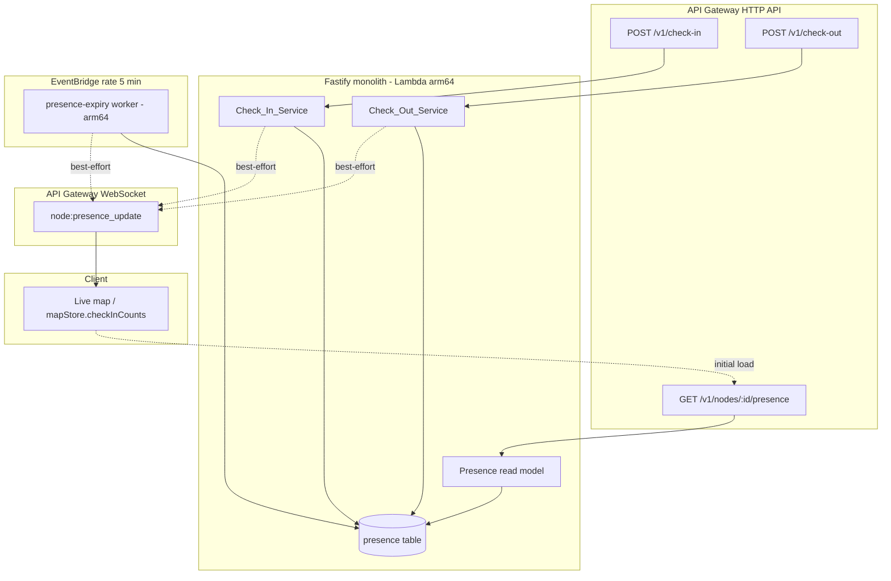

# Design Document

## Overview

Presence Integrity makes Area Code's live signal honest. Today a venue's "live count"
is `checkin:today:<nodeId>` — a 24-hour accumulating tally of everyone who checked in,
surfaced as `checkInCount` on the `node:pulse_update` socket event and stored in
`mapStore.checkInCounts`. It only ever counts up (until the daily TTL resets it) and there
is no way to leave a venue. A room that emptied at 19:00 can still read "buzzing" at 23:00.

This feature introduces the missing half of the model:

- A durable **Presence_Record** per `(userId, nodeId)` that represents "this person is
  here now", created/refreshed on check-in and ended by check-out or expiry.
- A new authenticated **`POST /v1/check-out`** action that ends a consumer's open
  presence, mirroring the existing check-in pipeline gate ordering.
- **Presence_Expiry**, a serverless `arm64` EventBridge Lambda (mirroring `pulse-decay`'s
  5-minute cadence and SAST peak window) plus a DynamoDB TTL backstop, that transitions
  stale `present` records to `expired` so nobody stays "here" forever.
- An **honest read model**: a venue's live count is the number of `present` records whose
  `expiresAt` is still in the future — computed from records, never a historical tally.
- A **Presence_Event** (`node:presence_update`) broadcast over the existing WebSocket
  transport carrying the new count and a cause, consumed by the same client store.
- **Dwell_Time** capture on every record end (true dwell on check-out, bounded dwell on
  expiry), persisted as anonymised per-venue aggregate rows for later business intelligence.

This is the **data foundation only**. Discovery "pull" copy (belonging, momentum,
taste-match) is out of scope. Distance-based **automatic** check-out is deferred and the
foundation does not depend on it (Requirement 11).

### Scope and guiding constraints

- **Serverless-only.** New table is DynamoDB `PAY_PER_REQUEST`; the expiry worker is an
  `arm64` Lambda on an EventBridge schedule. No always-on process, container, ALB, RDS, or
  cache. (Requirements 1.5, 6.1, 6.5)
- **No phone / no SMS.** Check-out is authenticated by the existing consumer JWT
  (Cognito sub). No phone number is read, required, or persisted. (Requirement 2.7)
- **Honest presence.** The count reflects current presence only, expires, and reads 0
  honestly. It is never the multiplicatively-decayed `Pulse_Score`. (Requirements 7, 8)
- **POPIA.** Proximity is evaluated then discarded; no lat/lng on any presence or dwell
  record; no per-user movement trail; business surfaces see anonymised aggregates only.
  (Requirement 10)

## Architecture

### How presence flows through the system



### Where the code lives

| Concern | Location | New / Changed |
| --- | --- | --- |
| Check-out HTTP route | `backend/src/features/check-out/handler.ts` | New |
| Check-out service | `backend/src/features/check-out/service.ts` | New |
| Check-out body schema / types | `backend/src/features/check-out/types.ts` | New |
| Presence repository (records + counter + read model) | `backend/src/features/presence/repository.ts` | New |
| Pure presence reducer (state machine) | `backend/src/features/presence/reducer.ts` | New |
| Expiry-window helper (peak/off-peak) | `backend/src/features/presence/window.ts` | New |
| Presence increment on check-in | `backend/src/features/check-in/service.ts` | Changed |
| Expiry worker | `backend/src/workers/presence-expiry.ts` | New |
| Presence read API | `backend/src/features/nodes/...` (existing nodes feature) | Changed |
| Realtime event (`node:presence_update`) | `backend/src/shared/socket/events.ts`, `types.ts`, `shared/websocket/broadcast.ts` | Changed |
| Client consumption | `packages/shared/hooks/useNodePulse.ts`, `mapStore` | Changed |
| Presence DynamoDB table + expiry schedule | `infra/environments/{dev,prod}/main.tf` | New |

### Two layers, one honest number

The design separates the **fast cache** from the **authoritative truth** so that honesty
never depends on a background job running on time:

1. **Authoritative read model (records).** A venue's Live_Presence_Count is *defined* as
   the count of Presence_Records for that `nodeId` with `presenceState = 'present'` **and**
   `expiresAt > now`. The read API computes this directly, so it is correct even if the
   expiry worker has not yet run (Requirement 6.4). This is the number that wins on any
   "people here now" surface (Requirement 8.3).
2. **Maintained counter (cache).** A per-venue counter is incremented/decremented by
   conditional writes for an O(1) value to carry on the realtime event. It is treated as a
   best-effort cache: every expiry cycle reconciles it back to the authoritative computed
   value, and the read API never trusts it over the record query. This keeps the event
   payload cheap without ever letting a lagging sweep or an orphaned check-in (Requirement
   4.5) produce a permanent over-count.

The atomicity guarantees (at-most-once end, count never below zero, dwell recorded once)
come from **DynamoDB conditional writes on the Presence_Record itself**, not from the
counter — see Components and Interfaces.

### Relationship to existing pulse decay

`Pulse_Score` (weighted aliveness, multiplicatively decayed every 5 min by `pulse-decay`)
and `Live_Presence_Count` (raw current headcount) stay distinct values with distinct
meanings. This spec does not remove or alter `pulse-decay`. The presence count is governed
solely by check-in / check-out / expiry and is never multiplied by a decay factor
(Requirements 8.1, 8.2). When presence reaches 0 while a residual `Pulse_Score` is still
non-zero, the live count reads 0 and takes precedence on "people are here now" surfaces
(Requirement 8.3).

## Components and Interfaces

### 1. Check_Out_Service — `POST /v1/check-out`

Registered in the Fastify monolith with the **same preHandler ordering as check-in**
(Requirement 2.1):

```
requireAuth('consumer')                                  // JWT verify, consumer role
  -> rateLimitMiddleware({ key: 'check-out', max: 10, windowSeconds: 60 })
  -> validate({ body: checkOutBodySchema })
  -> service.processCheckOut(auth.userId, body)
```

Body schema (Requirement 2.4):

```ts
export const checkOutBodySchema = z.object({
  nodeId: z.string().min(1).max(128),
})
```

Success response (Requirement 1.4, 3.1):

```ts
interface CheckOutResponse {
  nodeId: string
  presenceState: 'checked_out' | 'no_active_presence'
  dwellSeconds: number | null   // whole seconds when an active record was ended; null on no-op
}
```

Service algorithm:

1. Load user; if `isDisabled` → `403 account_disabled`, no state change (Requirement 2.3).
2. Attempt the **conditional end transition** on the Presence_Record keyed by
   `(userId, nodeId)`:

   ```
   UpdateItem
     Key: { userId, nodeId }
     ConditionExpression: presenceState = 'present' AND expiresAt > :now
     UpdateExpression: SET presenceState = 'checked_out',
                           endedAt = :now,
                           dwellSeconds = :now - checkedInAt,
                           dwellTermination = 'checkout_terminated'
     ReturnValues: ALL_NEW
   ```

   - **Condition succeeds** → the caller is the unique winner. Decrement the venue counter
     with a guarded `value > 0` update, emit a dwell aggregate row, emit a Presence_Event,
     and return `{ checked_out, dwellSeconds }`. (Requirements 1.2, 1.3, 9.1)
   - **`ConditionalCheckFailedException`** → there is no live record to end (never checked
     in, already checked out, already expired, or expired-but-not-yet-swept). This is a
     **successful no-op**: return `{ no_active_presence, dwellSeconds: null }`, no counter
     change, no dwell row. (Requirements 3.1, 3.3)

   Because the state-changing write is a single conditional update, two concurrent
   check-outs cannot both satisfy `presenceState = 'present'`: exactly one transitions the
   record, the other gets `ConditionalCheckFailedException` and no-ops. This yields
   at-most-once end, at-most-one decrement, and dwell recorded exactly once, for free
   (Requirements 3.2, 3.5).

Per Requirement 13.2 (founder flag), check-out grants **no tangible reward** in this
release; the service exposes no reward coupling. The candidate decision is recorded in the
Founder Decisions section.

### 2. Check_In_Service changes — presence increment

After all existing validations pass (account, node, proximity-or-QR, abuse, cooldown) and
the check-in row is inserted (Requirement 4.4), the service opens or refreshes a
Presence_Record. This applies to **both** `type = 'presence'` and `type = 'reward'`
(Requirement 4.3):

```
const expiresAt = now + expiryWindowSeconds(now)   // peak/off-peak, see window.ts
UpdateItem
  Key: { userId, nodeId }
  // create-or-refresh in one call
  UpdateExpression: SET checkedInAt = if_not_exists(checkedInAt, :now),
                        expiresAt = :expiresAt,
                        presenceState = :present,
                        ttl = :expiresAt + GRACE
  // detect whether this opened a NEW presence vs refreshed a live one
  ConditionExpression: attribute_not_exists(userId)
                       OR presenceState IN ('checked_out','expired')
                       OR expiresAt <= :now            // stale/expired-not-swept => reopen
```

Two outcomes:

- **New or reopened presence** (condition holds) → also increment the venue counter by 1.
  The consumer now counts once. (Requirement 4.1)
- **Already `present` and live** (condition fails) → do a second unconditional update that
  only refreshes `expiresAt`/`ttl`, and **do not** increment the counter. A consumer counts
  at most once per venue (Requirement 4.2, 5.5).

Failure isolation (Requirement 4.5): the presence open/increment runs inside a
`try/catch`. If it throws after the check-in itself succeeded, the service logs the failure
and still returns a successful check-in response. The orphaned check-in does not create a
permanent over-count because the counter is only incremented on a successful conditional
open, and the authoritative read model counts records (not the check-in tally); any drift
self-heals on the next expiry reconciliation.

### 3. Presence_Expiry worker — `backend/src/workers/presence-expiry.ts`

An `arm64` Lambda on an EventBridge `rate(5 minutes)` schedule, aligned with the existing
`pulse-decay` cadence (Requirements 6.3, 6.5). It mirrors `pulse-decay`'s structure
(iterate active nodes per city) and the same `isPeakHour()` SAST 18:00–23:59 boundary.

Per node, query the `NodeIndex` GSI for records that are due to expire:

```
Query NodeIndex
  KeyConditionExpression: nodeId = :n AND expiresAt <= :now
  FilterExpression: presenceState = 'present'
```

For each due record, perform the **conditional expire transition** (same shape as
check-out, different terminal state and termination flag):

```
UpdateItem
  Key: { userId, nodeId }
  ConditionExpression: presenceState = 'present' AND expiresAt <= :now
  UpdateExpression: SET presenceState = 'expired',
                        endedAt = expiresAt,            // bounded by the window, not "now"
                        dwellSeconds = expiresAt - checkedInAt,
                        dwellTermination = 'expiry_terminated'
```

On success: decrement the venue counter (guarded `> 0`), write a dwell aggregate row
flagged `expiry_terminated`, emit a Presence_Event with cause `expiry`. The conditional
guarantees the worker never re-transitions a `checked_out` or already-`expired` record
(Requirement 5.6) and never double-decrements if it races with a manual check-out
(Requirement 3.3). After processing a node, **reconcile** the cached counter to the freshly
computed authoritative count (present AND `expiresAt > now`).

The recorded expiry dwell is bounded by the Expiry_Window because `endedAt` is set to
`expiresAt` (= `checkedInAt + window`), not wall-clock now (Requirements 5.2, 9.2).

A record can sit `present` past its `expiresAt` for at most one schedule interval
(Requirement 5.3), but the read model already excludes it the instant `expiresAt` passes
(Requirement 6.4), so users never see an inflated count in the meantime.

**DynamoDB TTL** is enabled on the presence table using `ttl = expiresAt + GRACE` (e.g.
24h) purely for **physical row cleanup**. TTL deletion timing is never used for count
correctness — the `present`/`expired` decision is always `expiresAt` vs now (Requirement
6.2).

### 4. Presence read model — `GET /v1/nodes/:nodeId/presence`

Returns the honest count for one venue (Requirements 7.1, 7.6, 7.7):

```ts
interface PresenceReadResponse {
  nodeId: string
  livePresenceCount: number   // count of present records with expiresAt > now; 0 reads as 0
}
```

Implementation: query `NodeIndex` for `nodeId` with `expiresAt > :now`, filter
`presenceState = 'present'`, return the count. This is the authoritative value; it excludes
expired-but-unswept records (Requirement 6.4) and returns 0 with no decayed/historical
substitution (Requirement 7.7). The map's initial load uses this; live updates arrive via
the Presence_Event.

### 5. Presence_Event realtime broadcast

**Founder decision (Requirements 8.4, 13.4):** add a **dedicated event** with an
**explicit presence field** rather than silently repurposing `checkInCount` on
`node:pulse_update`. This guarantees no existing consumer keeps reading the old cumulative
tally as if it were presence.

New event over the **existing** WebSocket transport (no new transport — Requirement 7.3):

```ts
// shared/socket/types.ts — added to ServerToClientEvents
'node:presence_update': (payload: {
  nodeId: string
  livePresenceCount: number
  cause: 'check_in' | 'check_out' | 'expiry'
}) => void
```

- Emitted whenever a check-in, check-out, or expiry changes a venue's count (Requirement
  7.2). Carries only `nodeId`, the new count, and the cause — **no consumer identity**
  (Requirements 7.4, 10.4).
- Delivered via `emitPresenceUpdate` (Socket.io path) and `broadcastPresenceUpdate`
  (API Gateway WebSocket path), mirroring the existing `emitPulseUpdate` /
  `broadcastPulseUpdate` pair.
- **Best-effort**: emission is wrapped so a fan-out failure is logged and never rolls back
  the committed check-in / check-out / expiry (Requirement 7.5), consistent with existing
  socket behaviour.
- Client: `useNodePulse` subscribes to `node:presence_update` and writes
  `payload.livePresenceCount` into `mapStore.checkInCounts[nodeId]`, so the map reflects
  honest presence. `node:pulse_update.checkInCount` is left in place but the map's "people
  here now" surface is driven by `livePresenceCount`.

### 6. Dwell aggregate sink

On every successful record end (check-out or expiry), an anonymised dwell row is written to
the `app-data` table (Requirement 9.4) for later aggregation (Requirement 12):

- No `userId`, `cognitoSub`, identity, or coordinates on the row (Requirements 9.5, 10.3).
  The at-most-once guarantee for dwell lives on the Presence_Record's conditional
  transition, so the aggregate row does not need a consumer reference.
- `durationSeconds` is a non-negative integer (Requirement 9.3).
- `termination` distinguishes `checkout_terminated` from `expiry_terminated`
  (Requirement 12.2).

### 7. Business dwell intelligence (Requirement 12)

A per-venue aggregation reads dwell rows for a venue and time band and returns
Anonymised_Aggregate metrics (average, median, distribution), split by termination type
(Requirement 12.2), with **minimum-sample suppression**: when fewer than `MIN_DWELL_SAMPLE`
records exist for a venue+period, the aggregate is suppressed and an "insufficient data"
indicator is returned instead of a figure (Requirement 12.3). Output carries no identity or
coordinates (Requirement 12.4). Per Requirement 13.3, surfacing this in business reports is
a founder flag; **Dwell_Time capture (Requirement 9) proceeds regardless** in this release,
and the business surface is gated behind the founder decision.

## Data Models

### Presence_Record — new `area-code-{env}-presence` table

```
Table: area-code-{env}-presence   (billing_mode = PAY_PER_REQUEST)
  PK  userId      (S)
  SK  nodeId      (S)
  GSI NodeIndex:  hash = nodeId (S), range = expiresAt (N), projection = ALL
  TTL attribute:  ttl   (N)  -- physical cleanup only, NOT authoritative

Attributes:
  userId            string        -- Cognito-backed consumer id (no phone, no email here)
  nodeId            string
  presenceState     'present' | 'checked_out' | 'expired'
  checkedInAt       number   (epoch seconds, server time)
  expiresAt         number   (epoch seconds = checkedInAt + Expiry_Window at last check-in)
  endedAt           number?  (epoch seconds; checkout time, or expiresAt on expiry)
  dwellSeconds      number?  (non-negative integer; set once when the record ends)
  dwellTermination  'checkout_terminated' | 'expiry_terminated' | null
  ttl               number   (= expiresAt + GRACE_SECONDS)
```

Keying by `(userId, nodeId)` enforces **at most one record per consumer per venue**
structurally; the create-or-refresh conditional update keeps that record's lifecycle
correct. `NodeIndex` ranged on `expiresAt` powers both the read model
(`expiresAt > now`) and the expiry sweep (`expiresAt <= now`) without scans. No latitude or
longitude is ever stored (Requirements 10.1, 10.2).

### Live_Presence_Count cache — `app-data` KV row

```
pk = KV#presence:count:<nodeId>   sk = VALUE   value = <integer>
```

Maintained via the existing atomic KV helpers (`kvIncr` / a guarded decrement). Treated as
a cache; the authoritative value is the `NodeIndex` record query. Reconciled to the
computed count each expiry cycle. Never allowed below 0 (guarded decrement + read-model
clamp).

### Dwell aggregate row — `app-data` table

```
pk = DWELL#<nodeId>#<yyyy-mm-dd>          -- partition per venue per SAST day
sk = DWELL#<endedAtEpoch>#<recordId>
Attributes:
  nodeId          string
  durationSeconds number   (non-negative integer)
  termination     'checkout_terminated' | 'expiry_terminated'
  timeBand        'peak' | 'off_peak'    (SAST 18:00–23:59 = peak)
  endedAt         number   (epoch seconds)
  ttl             number?  (retention horizon for raw rows)
-- NO userId, cognitoSub, displayName, email, phone, avatarUrl, lat, lng
```

### Expiry_Window — `backend/src/features/presence/window.ts`

```ts
// Founder-flagged candidate values (Requirement 13.1) — single source of truth.
const OFF_PEAK_WINDOW_SECONDS = 90 * 60   // 5400
const PEAK_WINDOW_SECONDS     = 180 * 60  // 10800  (SAST 18:00–23:59)

// isPeakHour() reuses the exact SAST boundary from pulse-decay.ts.
export function expiryWindowSeconds(nowEpoch: number): number {
  return isPeakHour(nowEpoch) ? PEAK_WINDOW_SECONDS : OFF_PEAK_WINDOW_SECONDS
}
```

### Pure reducer model — `backend/src/features/presence/reducer.ts`

To make the concurrency and counting rules unit- and property-testable without DynamoDB, a
pure reducer expresses the same state machine the conditional writes implement. The
repository is a thin adapter that maps each operation to the corresponding conditional
update; the reducer is the executable specification of correctness.

```ts
type PState = 'present' | 'checked_out' | 'expired' | 'absent'
interface Record { state: PState; checkedInAt: number; expiresAt: number; dwellSeconds: number | null }
type Op =
  | { kind: 'check_in'; now: number; window: number }
  | { kind: 'check_out'; now: number }
  | { kind: 'expire'; now: number }

// applyOp(record, op) -> { record, countDelta, dwellRecorded }
// Invariants the reducer guarantees (mirrored by the DynamoDB conditionals):
//  - count delta is +1 only when an absent/ended/stale record becomes present
//  - count delta is -1 only on a present->checked_out or present->expired transition
//  - a refresh of a live present record yields countDelta 0 and only moves expiresAt
//  - dwellRecorded is true exactly once per record end
```

A venue's count is then `sum of countDelta` over any operation sequence, and the read-model
value is `records.filter(r => r.state==='present' && r.expiresAt > now).length` — which the
properties below pin down.

## Correctness Properties

*A property is a characteristic or behavior that should hold true across all valid
executions of a system — essentially, a formal statement about what the system should do.
Properties serve as the bridge between human-readable specifications and machine-verifiable
correctness guarantees.*

These properties are expressed against the pure presence reducer (`reducer.ts`) and the
pure read-model / window / aggregate functions, which are exact specifications of what the
DynamoDB conditional writes and the expiry worker implement. Many acceptance criteria
collapse into a small number of comprehensive properties (see the prework reflection):
the count-conservation state machine subsumes the per-transition increment/decrement
criteria, and the honest-read property subsumes the several "read reflects current
presence" criteria.

### Property 1: Count conservation and at-most-once transitions over any operation sequence

*For any* sequence of operations — each a `check_in` (type `presence` or `reward`, with any
non-negative timestamp and applicable window), `check_out`, or `expire`, applied in any
order to a set of `(userId, nodeId)` keys — the venue's Live_Presence_Count obtained by
summing the reducer's count deltas (a) never goes below 0, (b) equals the number of records
in state `present` with `expiresAt > now`, (c) increases by exactly 1 only when an
absent / ended / stale record becomes present, (d) never increases on a re-check-in of an
already-live `present` record, and (e) ends each record at most once (two concurrent
check-outs, or an expiry followed by a check-out, together produce a net delta of exactly
-1, never -2).

**Validates: Requirements 1.3, 3.2, 3.3, 3.4, 4.1, 4.2, 4.3, 5.6**

### Property 2: Record end records dwell exactly once, correctly valued and flagged

*For any* `present` record that ends — by `check_out` at any `now >= checkedInAt`, or by
`expire` — exactly one Dwell_Time is recorded for that record regardless of how many
duplicate end operations are applied; the recorded `dwellSeconds` is a non-negative integer;
for a check-out it equals `floor(now - checkedInAt)` and is flagged `checkout_terminated`;
for an expiry it equals `expiresAt - checkedInAt`, is flagged `expiry_terminated`, and is
bounded above by the applicable Expiry_Window.

**Validates: Requirements 1.2, 3.5, 5.1, 5.2, 9.1, 9.2, 9.3**

### Property 3: Honest read model reflects only current presence

*For any* set of presence records and any `now`, the read-model count for a venue equals the
number of its records with state `present` **and** `expiresAt > now`; it excludes records
whose `expiresAt` has passed even if they are still physically in state `present` (not yet
swept and not yet TTL-deleted); and it is exactly 0 when no record is live-present, with no
decayed or historical value substituted.

**Validates: Requirements 6.2, 6.4, 7.1, 7.6, 7.7, 8.3**

### Property 4: Presence_Event count agrees with the authoritative read model

*For any* operation that changes a venue's count, the Presence_Event emitted for that venue
carries a `livePresenceCount` equal to the authoritative read-model count (Property 3)
recomputed immediately after the operation, and a `cause` of `check_in`, `check_out`, or
`expiry` matching the operation that triggered it.

**Validates: Requirements 7.2, 7.6**

### Property 5: Presence_Event payload carries no consumer identity

*For any* generated Presence_Event, the serialized payload contains exactly the keys
`nodeId`, `livePresenceCount`, and `cause`, and contains none of `userId`, `cognitoSub`,
`displayName`, `email`, `phone`, `avatarUrl`, or any latitude/longitude field.

**Validates: Requirements 7.4, 10.4**

### Property 6: Expiry_Window selection follows the SAST peak boundary

*For any* timestamp, `expiryWindowSeconds` returns the peak window value if and only if the
SAST (UTC+2) hour is in the range 18:00–23:59 (the exact boundary used by the pulse-decay
worker), and otherwise returns the off-peak window value.

**Validates: Requirements 5.4, 5.5**

### Property 7: Live_Presence_Count is independent of pulse decay

*For any* presence state, applying a pulse-decay tick (the multiplicative decay of
`Pulse_Score`) leaves the Live_Presence_Count unchanged; the count is moved only by
`check_in`, `check_out`, and `expire`.

**Validates: Requirements 8.2**

### Property 8: No coordinates and at most one record per consumer-venue

*For any* sequence of check-in / check-out / expiry operations (each carrying arbitrary
supplied latitude/longitude on check-in), the persisted presence storage holds at most one
record per `(userId, nodeId)`, and no presence record or dwell record contains any
latitude, longitude, or location-trail field.

**Validates: Requirements 9.5, 10.1, 10.2**

### Property 9: Anonymised aggregate output contains no identity or coordinates

*For any* set of dwell records, the business/analytics aggregate computed from them contains
none of `userId`, `cognitoSub`, `displayName`, `email`, `phone`, `avatarUrl`, or any
latitude/longitude field.

**Validates: Requirements 10.3, 12.4**

### Property 10: Dwell aggregate statistics match a reference computation

*For any* non-empty set of dwell records for a venue and period, the computed average and
median dwell equal an independent reference implementation over the same `durationSeconds`
values.

**Validates: Requirements 12.1**

### Property 11: Aggregates partition cleanly by termination type

*For any* set of dwell records, the `checkout_terminated` and `expiry_terminated` buckets of
the aggregate are disjoint and their counts sum to the total number of input records, so no
record is double-counted or dropped when splitting the business signal.

**Validates: Requirements 12.2**

### Property 12: Minimum-sample suppression

*For any* venue and period, when the number of dwell records is below `MIN_DWELL_SAMPLE` the
aggregate is suppressed and reports insufficient data; when it is at or above the threshold a
numeric aggregate is returned.

**Validates: Requirements 12.3**

## Error Handling

| Condition | Handling | Requirement |
| --- | --- | --- |
| Missing/invalid consumer JWT on check-out | Reject `401` before any state change | 2.2 |
| Disabled account on check-out | Reject `403 account_disabled` before any state change | 2.3 |
| Body fails schema (`nodeId` length not 1–128) | Reject `422` validation error before service processing | 2.4 |
| Rate limit exceeded (>10 / 60s) | Reject `429 too_many_requests`, no state change | 2.6 |
| Check-out with no live presence (absent / already checked-out / expired / expired-but-unswept) | Conditional update fails → **successful no-op** response, no counter change, no dwell row | 3.1, 3.3 |
| Concurrent check-outs | One conditional update wins; the loser gets `ConditionalCheckFailedException` and no-ops | 3.2, 3.5 |
| Presence open/increment throws after check-in committed | Log and still return successful check-in; orphan reconciled by the expiry sweep, never a permanent over-count | 4.5 |
| Counter decrement would go below 0 | Guarded `value > 0` decrement; read model clamps and recomputes from records | 3.4 |
| Expiry worker races a manual check-out on the same record | Conditional `presenceState = 'present'` ensures only one transition; no double decrement | 3.3, 5.6 |
| Presence_Event emission failure (Socket.io or API GW WebSocket) | Caught and logged; underlying check-in / check-out / expiry is **not** rolled back | 7.5 |
| Stale background sweep has not run yet | Read model excludes `expiresAt <= now` records, so the count is honest regardless | 6.4 |
| Dwell aggregate below minimum sample | Suppress figure, return insufficient-data indicator | 12.3 |

All error responses reuse the existing `AppError` helpers and HTTP semantics already used by
the check-in pipeline, so the new action behaves consistently with the rest of the platform.

## Testing Strategy

### Property-based tests

PBT applies to this feature because its core is pure state-machine and data-transformation
logic with universal invariants over large input spaces (operation sequences, timestamps,
record sets). Tests use **fast-check** with **Vitest**, matching the existing property suites
in `backend/src/__tests__/properties/` (e.g. `tier-computation.property.test.ts`,
`data-integrity.property.test.ts`).

- One property-based test per Correctness Property above (Properties 1–12).
- Each runs a **minimum of 100 iterations** (`{ numRuns: 100 }` or more).
- Each test is tagged with a comment referencing the design property, in the format:
  `// Feature: presence-integrity, Property {number}: {property text}`.
- The reducer (`reducer.ts`), window helper (`window.ts`), read-model count function, and
  dwell-aggregate functions are pure and tested directly. Generators produce random
  operation sequences (`check_in`/`check_out`/`expire` with `presence`/`reward` types,
  arbitrary timestamps and supplied lat/lng), random record sets, and random dwell sets,
  including edge cases (empty sequences, duplicate ends, expiry-then-checkout races,
  `now` exactly at `expiresAt`, all-whitespace/boundary `nodeId` lengths, non-ASCII).

### Unit tests (examples, edge cases, error conditions)

- Check-out route returns the documented response shape on success (1.4); schema rejects
  `nodeId` length 0 and 129 and accepts 1 and 128 (2.4, edge cases).
- PreHandler ordering matches check-in: auth → rate limit → validation → service (2.1).
- Missing JWT → 401 (2.2); disabled account → 403 (2.3); 11th request in window → 429 (2.6),
  each asserting no state change.
- Check-out schema contains only `nodeId`; service references no phone/SMS path (2.7).
- Failed check-in validation writes no presence record (4.4); injected presence-write
  failure still returns a successful check-in (4.5).
- Presence_Event emission failure (mocked throw) leaves the committed transition intact and
  returns success (7.5).
- Dwell row schema has `nodeId`, `durationSeconds`, `termination`, `timeBand` (9.4).
- Foundation uses only manual check-out + expiry with no Auto_Check_Out reference
  (11.1, 11.2).

### Integration tests (1–3 examples)

- Emitting `node:presence_update` over the existing WebSocket reaches the client store that
  backs `mapStore.checkInCounts` (7.3).
- The expiry worker, on a seeded set of due records, transitions them, decrements, writes
  dwell rows, and emits events end-to-end against a local DynamoDB.

### Infrastructure / smoke checks

- The `presence` table and `app-data` dwell rows use `billing_mode = "PAY_PER_REQUEST"`
  (1.5, 6.5, 9.4); the `presence-expiry` Lambda is `arm64` (6.5).
- The `presence-expiry` EventBridge schedule is `rate(5 minutes)`, aligned with pulse-decay
  (6.3); no ECS/RDS/ALB/cache is introduced (6.1).
- DynamoDB TTL is enabled on the presence table for cleanup only; the read path never
  depends on TTL timing (6.2).
- `node:presence_update` event/field is added rather than silently repurposing
  `checkInCount` (8.4).

## Founder Decisions (Requirement 13)

These are surfaced for confirmation before the corresponding values are locked. The design
uses the candidate answers as defaults from a single source of truth so a change is a
one-line edit.

| # | Decision | Candidate (design default) | Where it lives |
| --- | --- | --- | --- |
| 13.1 | Expiry_Window durations | Off-peak **90 min** (5400s), peak (SAST 18:00–23:59) **180 min** (10800s), measured from most recent check-in | `presence/window.ts` constants |
| 13.2 | Reward coupling for manual check-out | **No tangible reward** this release; eligible for a future trust/streak signal | Check_Out_Service exposes no reward path |
| 13.3 | Dwell business surface timing | **Capture now** (Requirement 9), surface aggregate in a later reporting release | Capture built; business surface gated |
| 13.4 | Realtime field decision | **Add a dedicated `node:presence_update` event with an explicit `livePresenceCount` field** rather than repurposing `checkInCount` | `shared/socket` + `shared/websocket` |

## Deferred — Auto_Check_Out (Requirement 11, FUTURE)

Distance-based automatic check-out is **not** built here and the honest-presence foundation
does not depend on it. Manual check-out plus serverless expiry keep Live_Presence_Count
honest on web/PWA where background geolocation is unavailable. If Auto_Check_Out is later
enabled (a separate spec), it will be mobile-only, explicitly consent-gated to background
("Always") location, evaluate device-to-venue distance then discard the location with no
trail persisted, and must not degrade presence honesty for non-consenting users. These are
candidate criteria for founder review and are recorded here only so the foundation never
silently assumes them.
