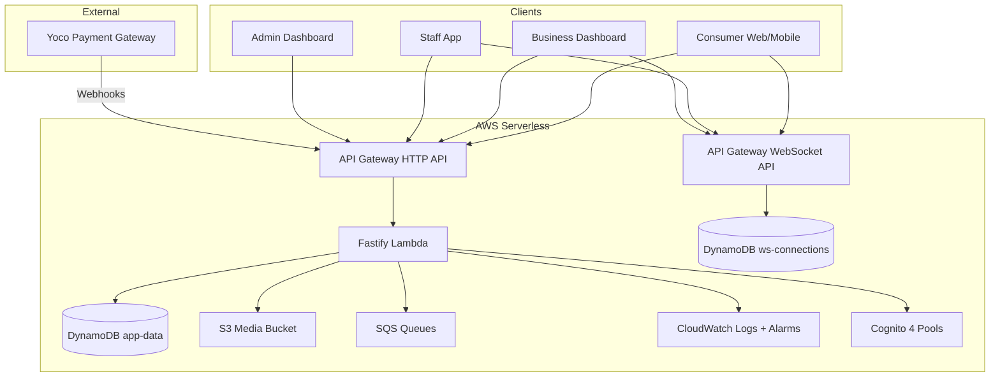
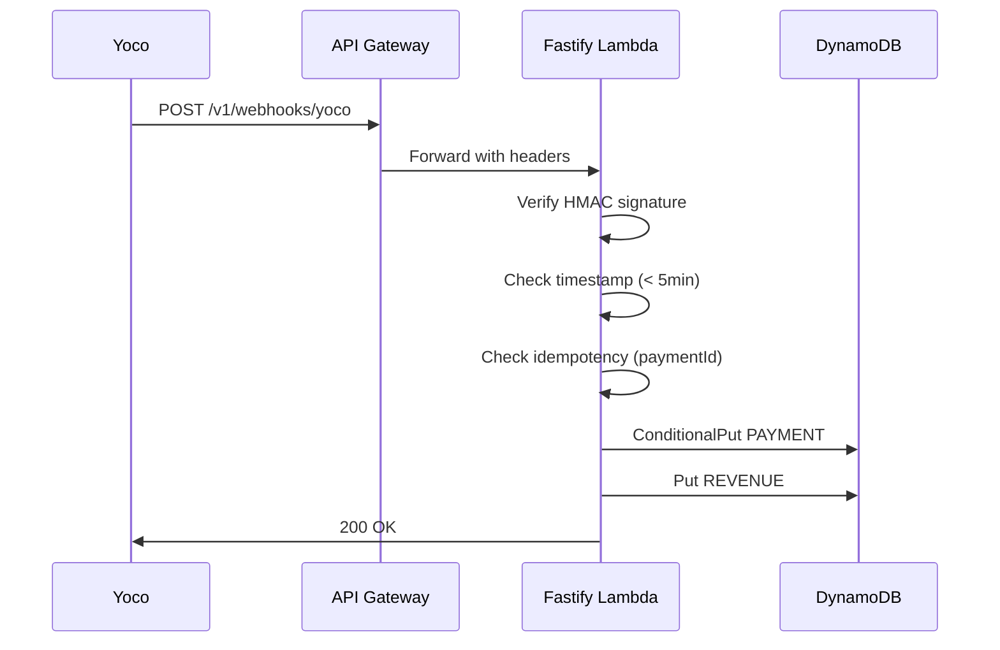
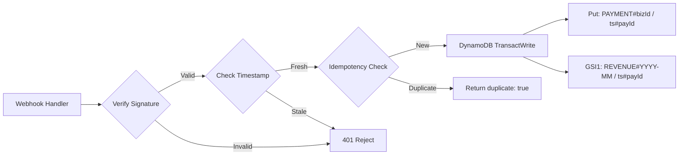

# Design Document: Production Hardening Sprint

## Overview

This design covers the production hardening of the Area Code platform — a map-first venue intelligence platform for South African cities. The sprint addresses 31 requirements spanning revenue visibility, dynamic map markers, staff tooling, proximity notifications, billing, error resilience, observability, shared UI components, and UX polish.

All additions remain strictly serverless: Lambda, API Gateway HTTP API, DynamoDB (PAY_PER_REQUEST), SQS, S3, Cognito, and Amplify. No always-on resources are introduced.

### Key Design Decisions

1. **Dual-write payment pattern** over GSI-based queries — enables both per-business billing and per-month revenue aggregation without table scans
2. **Client-side search** over backend search service — leverages already-cached node data, avoids OpenSearch/ElastiCache costs
3. **Client-side proximity** over server-side geofencing — POPIA compliance, no GPS sent to backend
4. **Shared component library** over per-app duplication — single source of truth for UI primitives with token-based theming
5. **Animation budget system** over unlimited animations — ensures smooth performance on mid-range devices
6. **Structured JSON logging** over unstructured logs — enables CloudWatch Insights queries and correlation tracing

## Architecture

### System Context



### New Components Integration

| Component | Layer | Integrates With |
|-----------|-------|-----------------|
| Payment Storage Service | Backend service | Yoco webhook handler, DynamoDB dual-write |
| Revenue Aggregation Service | Backend service | DynamoDB REVENUE# partition queries |
| Billing Handler | Backend route | Payment records, business auth |
| Staff Store (Zustand) | Frontend store | WebSocket events, staff app UI |
| Proximity Module | Frontend module | Geolocation API, cached node data, Service Worker |
| Boost ROI Service | Backend service | Check-in history, boost records |
| Image Processing | Backend service | S3, sharp/WebP conversion |
| Shared UI Components | Package | All frontend apps |
| Map Marker Renderer | Frontend component | Pulse scores, boost state, viewport observer |
| Structured Logger | Backend utility | All handlers, CloudWatch |
| WebSocket Health | Backend + Admin | Connection table, health endpoint |

### Request Flow (Payment Example)



## Components and Interfaces

### Backend Services (New/Modified)

#### Payment Service (`backend/src/features/business/payment-service.ts`)

```typescript
interface PaymentService {
  processPaymentEvent(event: YocoPaymentEvent, rawBody: string, signature: string): Promise<{ duplicate: boolean }>
  processRefundEvent(event: YocoRefundEvent): Promise<void>
  processFailedPayment(event: YocoPaymentEvent): Promise<void>
  getBusinessBilling(businessId: string, cursor?: string, limit?: number): Promise<PaginatedResponse<PaymentRecord>>
}
```

#### Revenue Service (`backend/src/features/admin/revenue-service.ts`)

```typescript
interface RevenueService {
  getMRR(): Promise<number>
  getBoostRevenue(startDate: string, endDate: string): Promise<number>
  getSubscriptionCounts(): Promise<Record<BusinessTier, number>>
  getTrialConversionRate(): Promise<number>
  getFlexDailyRevenue(startDate: string, endDate: string): Promise<number>
  getPerBusinessBreakdown(startDate: string, endDate: string): Promise<BusinessRevenueRow[]>
}
```

#### Image Processing Service (`backend/src/features/nodes/image-service.ts`)

```typescript
interface ImageService {
  generateUploadUrl(nodeId: string, contentType: string): Promise<{ uploadUrl: string; objectKey: string }>
  processUploadedImage(objectKey: string): Promise<{ processedKey: string }>
  deleteImage(objectKey: string): Promise<void>
}
```

#### Structured Logger (`backend/src/shared/monitoring/logger.ts`)

```typescript
interface StructuredLogger {
  info(message: string, metadata?: Record<string, unknown>): void
  warn(message: string, metadata?: Record<string, unknown>): void
  error(message: string, metadata?: Record<string, unknown>): void
  child(context: { service: string; requestId?: string; correlationId?: string }): StructuredLogger
}
```

### Frontend Modules (New)

#### Staff Store (`packages/shared/stores/staffStore.ts`)

```typescript
interface StaffState {
  liveQueue: StaffCheckInEvent[]
  recentRedemptions: StaffRedemptionRecord[]
  todayStats: { checkIns: number; redemptions: number; pulseState: NodeState }
  wsStatus: 'connected' | 'disconnected' | 'reconnecting'
}

interface StaffActions {
  addCheckIn(event: StaffCheckInEvent): void
  addRedemption(record: StaffRedemptionRecord): void
  updateStats(stats: Partial<StaffState['todayStats']>): void
  setWsStatus(status: StaffState['wsStatus']): void
  reset(): void
}
```

#### Proximity Module (`packages/shared/lib/proximity.ts`)

```typescript
interface ProximityModule {
  evaluate(userLat: number, userLng: number, nodes: CachedNode[]): ProximityAlert[]
  shouldNotify(nodeId: string, lastNotifiedMap: Record<string, number>): boolean
  isOptedIn(): boolean
}

interface ProximityAlert {
  nodeId: string
  nodeName: string
  pulseState: NodeState
  distanceMetres: number
}
```

#### Map Marker Renderer (`packages/shared/components/MapMarker.tsx`)

```typescript
interface MarkerRenderProps {
  pulseScore: number
  boostUntil: string | null
  category: NodeCategory
  isInViewport: boolean
  animationBudgetExhausted: boolean
  prefersReducedMotion: boolean
  isLowEndDevice: boolean
}

interface ComputedMarkerStyle {
  radius: number        // 8-28px
  touchTarget: number   // always >= 44px
  glowIntensity: number // 0-1
  hasAnimation: boolean
  animationType: 'none' | 'breathing' | 'pulsing'
  zIndex: number
  ringColor: string | null  // gold for boosted
}
```

### Shared UI Component Library (`packages/shared/components/`)

New exports:

| Component | Variants | Key Props |
|-----------|----------|-----------|
| `Button` | primary, secondary, ghost, danger | size, loading, disabled, onClick |
| `Card` | default | header, footer, className |
| `Input` | text, password, search, code | label, error, helperText |
| `Select` | default | options, value, onChange |
| `Badge` | status, tier, pulse-state | variant, label |
| `Alert` | info, success, warning, error | title, message, dismissible |
| `MetricCard` | default | value, label, trend, loading |
| `DataTable` | default | columns, data, pagination, emptyState |
| `Tabs` | horizontal pill | items, activeKey, onChange |
| `SheetHeader` | default | title, subtitle, onClose, dragHandle |
| `ActionRow` | default | icon, label, onClick, chevron |

### New API Endpoints

| Method | Path | Auth | Description |
|--------|------|------|-------------|
| GET | `/v1/business/me/billing` | business | Paginated billing history |
| GET | `/v1/business/me/boosts/roi` | business | Boost ROI data for owned nodes |
| GET | `/v1/admin/revenue` | admin | Revenue metrics with date range |
| GET | `/v1/admin/revenue/breakdown` | admin | Per-business revenue breakdown |
| GET | `/v1/health/websocket` | none | WebSocket connection stats |
| POST | `/v1/business/nodes/:nodeId/image/upload-url` | business | Generate presigned upload URL |
| DELETE | `/v1/business/nodes/:nodeId/image` | business | Delete header image |
| PUT | `/v1/business/nodes/:nodeId/instagram` | business | Set Instagram handle |

### WebSocket Events (New)

| Event | Direction | Room | Payload |
|-------|-----------|------|---------|
| `staff:checkin` | Server→Client | `business:<businessId>` | `{ nodeId, consumerName, tier, timestamp }` |
| `staff:redemption` | Server→Client | `business:<businessId>` | `{ code, rewardTitle, status, timestamp }` |
| `staff:stats_update` | Server→Client | `business:<businessId>` | `{ checkIns, redemptions, pulseState }` |

## Data Models

### DynamoDB Schema (New Items in `app-data` Table)

#### Payment Record (Primary — Per-Business)

| Field | Key | Value |
|-------|-----|-------|
| pk | Partition | `PAYMENT#<businessId>` |
| sk | Sort | `<ISO-timestamp>#<paymentId>` |
| gsi1pk | GSI1 Partition | `REVENUE#<YYYY-MM>` (SAST timezone) |
| gsi1sk | GSI1 Sort | `<ISO-timestamp>#<paymentId>` |
| paymentId | Attribute | Yoco payment ID (idempotency key) |
| businessId | Attribute | Business UUID |
| amount | Attribute | Amount in ZAR cents (integer) |
| type | Attribute | `"subscription"` or `"boost"` |
| planTier | Attribute | `"starter"` \| `"growth"` \| `"pro"` \| `"flex_daily"` |
| nodeId | Attribute | Node UUID (for boosts, null for subscriptions) |
| status | Attribute | `"succeeded"` \| `"failed"` \| `"refunded"` \| `"pending"` |
| paymentProvider | Attribute | `"yoco"` |
| currency | Attribute | `"ZAR"` |
| description | Attribute | Human-readable description |
| createdAt | Attribute | ISO timestamp |
| ttl | Attribute | None (payments retained indefinitely) |

**Idempotency**: Use `ConditionExpression: 'attribute_not_exists(pk) AND attribute_not_exists(sk)'` on the primary write. If condition fails, it's a duplicate — return `{ duplicate: true }`.

#### Revenue Aggregation Query Pattern

Query `gsi1pk = REVENUE#2025-01` with `gsi1sk BETWEEN <start> AND <end>` for date-range revenue. No secondary item needed — the GSI on the primary payment record serves both purposes.

#### Staff Check-In Event (Ephemeral — in Staff Store only)

Not persisted to DynamoDB. Delivered via WebSocket and held in client-side Zustand store (max 20 items).

#### Node Record Extensions

| New Field | Type | Description |
|-----------|------|-------------|
| headerImageKey | string \| null | S3 object key for header image |
| instagramHandle | string \| null | Instagram handle (without @) |

### Dual-Write Pattern Detail



Note: Since the payment record has both `pk/sk` for per-business queries AND `gsi1pk/gsi1sk` for revenue queries on the same item, this is actually a **single write with a GSI** — not a literal dual-write of two separate items. The GSI provides the revenue aggregation view automatically.

### Currency and Timezone Rules

- All monetary amounts stored as **integer ZAR cents** (e.g., R150.00 = 15000)
- All date-based partition keys use **Africa/Johannesburg** (UTC+2) for date boundaries
- Display formatting: `(amount / 100).toLocaleString('en-ZA', { style: 'currency', currency: 'ZAR' })`

## Correctness Properties

*A property is a characteristic or behavior that should hold true across all valid executions of a system — essentially, a formal statement about what the system should do. Properties serve as the bridge between human-readable specifications and machine-verifiable correctness guarantees.*

### Property 1: Payment Record Completeness and Idempotency

*For any* valid Yoco payment event processed N times (N >= 1), exactly one payment record SHALL exist in DynamoDB with all required fields (amount, type, planTier, businessId, paymentProvider="yoco", currency="ZAR", status), and the result of processing it N times SHALL be identical to processing it once.

**Validates: Requirements 1.1, 1.3, 1.4**

### Property 2: Revenue Aggregation Correctness

*For any* set of payment records with mixed statuses (succeeded, failed, refunded, pending), the MRR computation SHALL equal the sum of only those payments where `status === "succeeded"` AND `type === "subscription"`, normalized to monthly values. Boost revenue for a date range SHALL equal the sum of succeeded boost payments within that range. Failed and refunded payments SHALL never contribute to revenue totals.

**Validates: Requirements 2.1, 2.2, 2.5, 21.3, 21.4, 21.5**

### Property 3: Revenue Query Filtering and Grouping

*For any* date range and set of payment records, the per-business breakdown totals SHALL sum to the overall revenue total for that range, and subscription counts grouped by tier SHALL equal the actual count of distinct active businesses per tier.

**Validates: Requirements 2.3, 2.7**

### Property 4: Trial Conversion Rate Computation

*For any* set of business accounts with various creation dates and tier histories, the trial conversion rate SHALL equal (count of businesses that upgraded from starter to a paid tier within 30 days of creation) / (total businesses that started on starter tier) * 100.

**Validates: Requirements 2.4**

### Property 5: Marker Rendering Invariants

*For any* node with pulse score S >= 0 and boost state B (active or inactive):
- Visual radius SHALL equal `8 + (Math.min(S / 200, 1) * 20)` pixels, clamped to [8, 28]
- IF B is active, radius SHALL be `max(computed_radius, 18)`
- Touch target SHALL always be >= 44px regardless of visual radius
- Glow intensity SHALL equal `Math.min(S / 200, 1)` (0 at score 0, 1.0 at score >= 200)

**Validates: Requirements 3.1, 3.2, 3.3, 3.5**

### Property 6: Marker Z-Ordering

*For any* set of markers rendered on the map, their z-index values SHALL be monotonically non-decreasing with pulse score — a marker with higher pulse score SHALL never render below a marker with lower pulse score.

**Validates: Requirements 3.6**

### Property 7: Staff Queue Bounds and Ordering

*For any* sequence of N check-in events added to the staff store, the live queue SHALL contain at most 20 items, ordered by timestamp descending (most recent first). For any sequence of M redemptions, the recent redemptions list SHALL contain at most 50 items. Filtering by status SHALL return exactly the subset matching that status.

**Validates: Requirements 4.3, 5.6**

### Property 8: Redemption Code Validation

*For any* string input to the staff manual code entry, the input SHALL be accepted if and only if it is exactly 32 characters long and every character is a valid hexadecimal digit (0-9, a-f, A-F).

**Validates: Requirements 5.2**

### Property 9: Exponential Backoff Calculation

*For any* retry attempt number N (0-indexed), the reconnection delay SHALL equal `min(1000 * 2^N + jitter, 30000)` where jitter is a random value in [0, 1000). The delay SHALL never exceed 30 seconds and SHALL always be >= 1 second.

**Validates: Requirements 6.3, 12.1**

### Property 10: Proximity Notification Trigger

*For any* consumer location, set of cached nodes, and notification opt-in state: a proximity alert SHALL fire for a node if and only if ALL of the following hold: (a) haversine distance <= 500 metres, (b) node pulse state is "buzzing" or "popping", (c) consumer has opted in to notifications, (d) the same node has not triggered a notification within the last 15 minutes.

**Validates: Requirements 7.2, 7.3, 7.4**

### Property 11: Boost ROI Computation

*For any* boost window with check-in count C and historical data of at least 2 weeks, the baseline SHALL equal the arithmetic mean of check-in counts for the same time window across the prior 4 available weeks, and uplift SHALL equal `((C - baseline) / baseline) * 100`. If fewer than 2 weeks of data exist, the system SHALL return an "insufficient data" indicator instead of a numeric uplift.

**Validates: Requirements 8.2, 8.3, 8.4**

### Property 12: Billing Pagination and Sorting

*For any* set of payment records belonging to a business, the billing endpoint SHALL return at most 20 records per page, sorted by date descending, and the union of all pages SHALL equal the complete set of that business's payment records (no duplicates, no omissions).

**Validates: Requirements 9.2**

### Property 13: Client-Side Search Filtering and Sorting

*For any* query string Q and set of cached nodes, search results SHALL include exactly those nodes where `name.toLowerCase().includes(Q.toLowerCase())` OR `category.toLowerCase().includes(Q.toLowerCase())`. When user location is available, results SHALL be sorted by haversine distance ascending.

**Validates: Requirements 13.1, 13.2, 23.3**

### Property 14: Webhook Signature Verification

*For any* request body B and HMAC signature S computed with the Yoco webhook secret, the verification SHALL accept if and only if the computed HMAC of B matches S. Additionally, for any event with timestamp T and current server time NOW, the event SHALL be rejected if `NOW - T > 5 minutes`.

**Validates: Requirements 21.1, 21.2**

### Property 15: Resource Ownership Enforcement

*For any* authenticated business B and resource R (node, reward, boost, billing record, boost ROI), the API SHALL return the resource if and only if `R.businessId === B.id`. For any staff member S and node N, access SHALL be granted if and only if `S.businessId === N.businessId`. Violations SHALL return HTTP 403.

**Validates: Requirements 22.1, 22.2, 22.3, 22.4**

### Property 16: Admin Role Authorization

*For any* admin user with role R and action A requiring minimum role level L, access SHALL be granted if and only if `roleLevel(R) >= roleLevel(L)` where roleLevel(super_admin) > roleLevel(support_agent) > roleLevel(content_moderator).

**Validates: Requirements 22.5**

### Property 17: Image Processing Invariants

*For any* uploaded image with dimensions W×H, the processed output SHALL have width <= 1200px with aspect ratio preserved (height = H * (outputWidth / W)), format SHALL be WebP, and EXIF metadata SHALL be completely stripped (zero EXIF tags in output).

**Validates: Requirements 23.1, 23.2**

### Property 18: Timezone Partition Key Correctness

*For any* UTC timestamp, the date portion used in partition keys (e.g., `REVENUE#2025-01`) SHALL be computed using Africa/Johannesburg timezone (UTC+2), not UTC. Specifically, a payment at 2025-01-31T23:30:00Z SHALL produce partition key `REVENUE#2025-02` (because it's 2025-02-01T01:30:00 in SAST).

**Validates: Requirements 23.6**

### Property 19: Animation Budget Enforcement

*For any* set of N visible markers in the viewport and device hardware concurrency C:
- Maximum simultaneous animations SHALL be `C <= 4 ? 4 : 8`
- Animations SHALL be assigned to the N markers with highest pulse scores
- Markers outside the viewport SHALL have zero active animations
- When `prefers-reduced-motion` is enabled, ALL markers SHALL have zero animations

**Validates: Requirements 30.1, 30.2, 30.5, 30.6**

### Property 20: Map Clustering Logic

*For any* set of visible markers where count > 30, markers with pulse score < 11 (dormant/quiet) that are within clustering distance of each other SHALL be merged into cluster indicators showing count. Markers with pulse score >= 11 (active/buzzing/popping) SHALL always remain individually visible regardless of count.

**Validates: Requirements 30.3**

### Property 21: Instagram Handle Validation

*For any* string input to the Instagram handle field, the input SHALL be accepted if and only if it matches the pattern `/^[a-zA-Z0-9_.]{1,30}$/` (after stripping a leading @ if present). The stored value SHALL never contain the @ prefix.

**Validates: Requirements 18.1, 18.2**

### Property 22: Structured Error Response

*For any* error thrown within a request handler, the HTTP response SHALL contain fields `error` (string code), `message` (human-readable), and `statusCode` (number), and SHALL NOT contain stack traces, internal file paths, or raw exception details.

**Validates: Requirements 11.8**

## Error Handling

### Strategy

All error handling follows the existing `AppError` class pattern with these additions:

1. **Webhook Errors**: Signature failures return 401 immediately. Timestamp violations return 401. Processing errors return 500 but are idempotent (safe to retry).

2. **Authorization Errors**: All tenancy violations return 403 with `error: "forbidden"` and log the attempt with user ID, resource, and timestamp.

3. **Validation Errors**: All inputs validated with Zod schemas. Invalid inputs return 400 with `error: "validation_error"` and field-level details (no internal schema exposure).

4. **Rate Limiting**: Applied to all public endpoints. Returns 429 with `Retry-After` header.

5. **DynamoDB Errors**: Wrapped in try/catch, logged at error level with correlation ID, returned as 500 `internal_error` to client.

6. **WebSocket Errors**: Connection failures trigger client-side exponential backoff. Server-side stale connections cleaned up via TTL + heartbeat check.

7. **Image Processing Errors**: Invalid file type/size rejected at validation layer (400). Processing failures (corrupt image) return 422 `unprocessable_entity`.

### Error Response Format

```typescript
interface ErrorResponse {
  error: string       // Machine-readable error code
  message: string     // Human-readable message (i18n key in future)
  statusCode: number  // HTTP status code
  requestId?: string  // For support correlation
}
```

### Structured Logging Format

```typescript
interface LogEntry {
  timestamp: string
  level: 'info' | 'warn' | 'error'
  requestId: string
  correlationId: string
  service: string
  message: string
  metadata?: Record<string, unknown>
}
```

### CloudWatch Alarms

| Alarm | Condition | Action |
|-------|-----------|--------|
| Lambda Error Rate | > 5% over 5 minutes | SNS notification |
| DLQ Depth | > 0 messages | SNS notification |
| Yoco Webhook Errors | > 1% over 15 minutes | SNS notification |

## Testing Strategy

### Dual Testing Approach

This feature set is well-suited for property-based testing in the backend logic layer (payment processing, revenue computation, marker sizing, search filtering, authorization) combined with example-based tests for UI components and integration tests for external service interactions.

### Property-Based Testing

**Library**: `fast-check` (TypeScript, integrates with Vitest)

**Configuration**:
- Minimum 100 iterations per property test
- Each test tagged with: `Feature: production-hardening-sprint, Property {N}: {title}`

**Properties to implement** (22 total, covering Requirements 1-3, 5-9, 11-13, 18, 21-23, 30):

| Property | Module Under Test | Generator Strategy |
|----------|-------------------|-------------------|
| 1: Payment completeness + idempotency | payment-service | Random valid Yoco events, process 1-5 times |
| 2: Revenue aggregation | revenue-service | Random payment sets with mixed statuses |
| 3: Revenue filtering/grouping | revenue-service | Random payments + date ranges |
| 4: Trial conversion | revenue-service | Random business histories |
| 5: Marker rendering | MapMarker utils | Random pulse scores [0, 500] + boost states |
| 6: Z-ordering | MapMarker utils | Random marker arrays |
| 7: Staff queue bounds | staffStore | Random event sequences |
| 8: Code validation | staff validation | Random strings (hex and non-hex) |
| 9: Backoff calculation | reconnection util | Random retry counts [0, 20] |
| 10: Proximity trigger | proximity module | Random locations + node sets |
| 11: Boost ROI | boost-roi-service | Random check-in histories |
| 12: Billing pagination | billing handler | Random payment sets |
| 13: Search filtering | search util | Random queries + node sets |
| 14: Webhook verification | webhook handler | Random bodies + signatures |
| 15: Ownership enforcement | auth middleware | Random business/resource pairs |
| 16: Admin role auth | auth middleware | Random role/action pairs |
| 17: Image processing | image-service | Random dimensions |
| 18: Timezone partition | date utils | Random UTC timestamps near midnight |
| 19: Animation budget | marker renderer | Random marker counts + device specs |
| 20: Clustering | map clustering | Random marker sets (30-200 items) |
| 21: Instagram validation | input validation | Random strings |
| 22: Error response format | error handler | Random AppError instances |

### Unit Tests (Example-Based)

- UI component rendering (shared components, staff app screens, admin dashboard)
- Onboarding flow step progression
- Payment confirmation flow states
- Bottom sheet gesture handling
- Search UI states (empty, loading, results, error)
- Direction URL construction for each map app

### Integration Tests

- Yoco webhook end-to-end (signature → storage → response)
- WebSocket event delivery (check-in → staff notification)
- S3 presigned URL generation and image upload flow
- DynamoDB query patterns (billing pagination, revenue aggregation)

### Smoke Tests

- TypeScript compilation (`pnpm typecheck`)
- All app builds succeed
- No ScanCommand in production code
- No raw `throw new Error()` statements
- All routes have rate limiting middleware
- CORS configuration matches allowed origins
- Helmet security headers present
