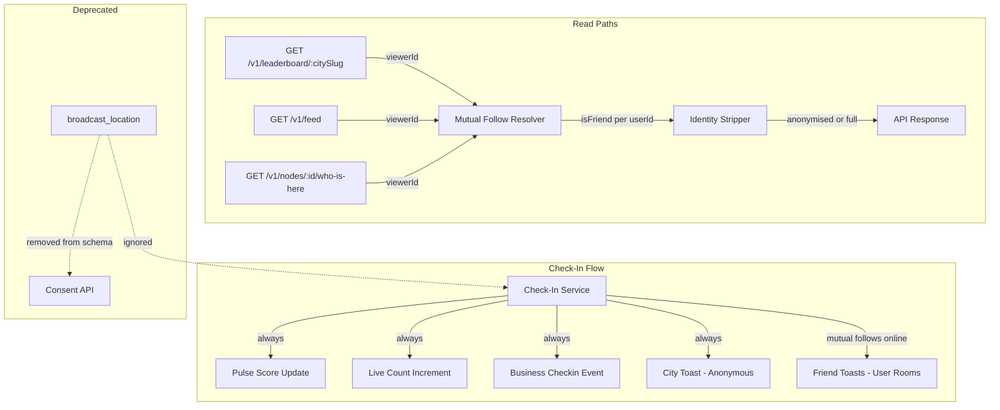

# Design Document: Tiered Visibility

## Overview

This feature replaces the opt-in `broadcast_location` privacy toggle with a structural, platform-level identity model: your name is only visible to mutual follows (friends). Non-friends see the vibe — check-in counts, tier distribution, crowd metadata — but never individual identities. Every check-in always fully contributes to pulse scores, live counts, and business analytics regardless of viewer relationship.

The change touches six backend surfaces (check-in toasts, leaderboard, activity feed, who-is-here, consent schema, nearby-recent), two frontend screens (profile, signup), shared types, and mock data. The single biggest new piece of engineering is a batch mutual-follow resolution query that avoids N+1 lookups when rendering lists of users.

### Design Decisions

1. **Server-side filtering, not client-side** — The API returns `isFriend: boolean` per entry and strips identity fields for non-friends before sending the response. The client never receives names it shouldn't display. This prevents leaks from devtools inspection or API scraping.
2. **Single batch query for mutual follows** — Rather than checking each user pair individually, we resolve all mutual-follow relationships for a viewer against a batch of user IDs in one SQL query using a self-join on `user_follows`.
3. **No schema migration needed for the DB column** — `broadcast_location` stays in the `consent_records` table as a deprecated column. We stop writing it and stop reading it. A future migration can drop it. This avoids a risky ALTER TABLE on a production table.
4. **Toast split: city room (anonymous) + user rooms (friend-specific)** — City room toasts never contain identity. Friend toasts are emitted individually to each online mutual follow's user room.

## Architecture



### Component Interaction

1. **Check-in service** — On every check-in: update pulse, increment counters, emit anonymous city toast, look up the user's mutual follows who are currently online, emit personalised friend toasts to their user rooms.
2. **Leaderboard service** — Accepts `viewerId` (from auth). After fetching top-50 profiles, calls `getMutualFollowIds(viewerId, userIds)` to get the set of friends. Returns entries with `isFriend` flag; non-friend entries have `displayName`, `username`, and `avatarUrl` nulled out.
3. **Activity feed repository** — Currently joins on one-way `followers`. Changes to join on mutual follows only (both directions exist). Returns full identity since all feed entries are friends by definition.
4. **Who-is-here endpoint** — New endpoint `GET /v1/nodes/:id/who-is-here`. Returns recent check-in users at a node, with identity stripped for non-friends. Always returns total count and tier distribution for all viewers.

## Components and Interfaces

### 1. Mutual Follow Batch Resolver

The core new utility. Lives in `backend/src/features/social/repository.ts`.

```typescript
/**
 * Given a viewer and a list of candidate user IDs, returns the subset
 * that are mutual follows of the viewer.
 *
 * Uses a single query with a self-join on user_follows:
 *   SELECT uf1.following_id
 *   FROM user_follows uf1
 *   JOIN user_follows uf2
 *     ON uf1.following_id = uf2.follower_id
 *     AND uf2.following_id = uf1.follower_id
 *   WHERE uf1.follower_id = $viewerId
 *     AND uf1.following_id IN ($candidateIds)
 */
async function getMutualFollowIds(viewerId: string, candidateIds: string[]): Promise<Set<string>>
```

Returns a `Set<string>` of user IDs that are mutual follows of the viewer. O(1) query regardless of candidate list size (up to reasonable limits — leaderboard is capped at 50, feed at 20).

### 2. Identity Stripper Utility

A pure function that takes a list of entries with user identity fields and a `Set<string>` of friend IDs, and returns entries with identity stripped for non-friends.

```typescript
interface IdentityFields {
  userId: string
  displayName: string
  username: string
  avatarUrl: string | null
}

function applyFriendVisibility<T extends IdentityFields>(
  entries: T[],
  friendIds: Set<string>,
  viewerId: string,
): Array<T & { isFriend: boolean }>
```

Rules:

- If `entry.userId === viewerId` → always show identity, `isFriend: true`
- If `friendIds.has(entry.userId)` → show identity, `isFriend: true`
- Otherwise → null out `displayName`, `username`, `avatarUrl`, set `isFriend: false`

This function is idempotent: applying it twice produces the same result.

### 3. Updated Leaderboard Service

`getCityLeaderboard(citySlug: string, viewerId?: string)` changes:

- After fetching profiles, if `viewerId` is provided, call `getMutualFollowIds(viewerId, userIds)`.
- Map entries through `applyFriendVisibility`.
- Return entries with `isFriend` field.
- Anonymous viewers (no auth) see all entries anonymised except tier + rank + checkInCount.

### 4. Updated Activity Feed

`getActivityFeed(userId, cursor, limit)` changes:

- The Prisma `where` clause changes from one-way follow to mutual follow:
  ```
  user: {
    followers: { some: { followerId: userId } },
    following: { some: { followingId: userId } },
  }
  ```
- Since the feed now only contains mutual follows by definition, all entries show full identity. No stripping needed.
- The `isFriend` field is always `true` for feed entries.

### 5. Updated Check-In Toast Emission

`processCheckIn` in `backend/src/features/check-in/service.ts` changes:

- Remove the `shouldBroadcast(userId)` call entirely.
- Always emit an anonymous toast to the city room:
  ```typescript
  emitToast(citySlug, {
    type: 'checkin',
    message: `${node.name} is heating up — ${dailyCount} check-ins`,
    nodeId: input.nodeId,
    nodeLat: node.lat,
    nodeLng: node.lng,
    // NO avatarUrl, NO username, NO displayName
  })
  ```
- After the city toast, look up the user's mutual follows and emit personalised friend toasts to each friend's user room:
  ```typescript
  const friendIds = await getMutualFollowIds(userId, onlineFriendCandidates)
  for (const friendId of friendIds) {
    emitFriendToast(friendId, {
      type: 'checkin',
      message: `${user.displayName} just checked in at ${node.name}`,
      nodeId: input.nodeId,
      avatarUrl: user.avatarUrl,
    })
  }
  ```

### 6. New Who-Is-Here Endpoint

`GET /v1/nodes/:id/who-is-here`

Response shape:

```typescript
interface WhoIsHereResponse {
  totalCount: number
  tierDistribution: Record<Tier, number> // e.g. { fixture: 3, local: 7 }
  friends: Array<{
    userId: string
    displayName: string
    username: string
    avatarUrl: string | null
    tier: Tier
    checkedInAt: string
  }>
}
```

- `totalCount` and `tierDistribution` are always returned (all viewers).
- `friends` array only contains users who are mutual follows of the viewer. Anonymous viewers get an empty `friends` array.

### 7. New Socket Event: `emitFriendToast`

Added to `backend/src/shared/socket/events.ts`:

```typescript
function emitFriendToast(
  userId: string,
  payload: {
    type: ToastType
    message: string
    nodeId?: string
    avatarUrl?: string
  },
): void
```

Emits to `userRoom(userId)` only. Never touches the city room.

### 8. Consent Schema Changes

- `consentBodySchema` removes `broadcastLocation` field.
- `ConsentRecord` interface removes `broadcastLocation` field.
- `getUserConsent()` stops returning `broadcastLocation`. Returns `{ analyticsOptIn: boolean }` only.
- `updateConsent()` stops accepting `broadcastLocation` parameter.
- The `shouldBroadcast()` function in check-in service is deleted.
- The `userConsent` Redis key continues to cache `{ analyticsOptIn }` only.

### 9. Nearby-Recent Query Update

`getNearbyRecentEvent` in `backend/src/features/social/repository.ts` currently joins on `consent_records.broadcast_location = true`. This join condition is removed — the query returns anonymised data (node name + distance + time) without any user identity, so no friend check is needed. The `username` field is removed from the response.

### 10. UI Changes

**ProfileScreen** — Remove the privacy toggle checkbox. Replace with static text:

```
"Your name is only visible to people you both follow. Everyone else sees the vibe, not who."
```

**ConsumerSignup** — Remove the `consentBroadcast` checkbox and state. Replace with a non-interactive explanation paragraph using the same text.

**LeaderboardScreen** — Use `isFriend` flag from API response. For non-friend entries, show tier badge and rank but replace name with anonymised placeholder (e.g. "Area Code Explorer").

**FeedScreen** — No structural change needed since the API now only returns mutual-follow entries. All entries show full identity.

## Data Models

### Modified Types

#### `LeaderboardEntry` (packages/shared/types/index.ts)

```typescript
export interface LeaderboardEntry {
  userId: string
  username: string | null // null for non-friends
  displayName: string | null // null for non-friends
  avatarUrl: string | null // null for non-friends
  tier: Tier // always visible
  rank: number // always visible
  checkInCount: number // always visible
  isFriend: boolean // NEW — drives frontend rendering
}
```

#### `ConsentRecord` (packages/shared/types/index.ts)

```typescript
export interface ConsentRecord {
  id: string
  userId: string
  consentVersion: string
  analyticsOptIn: boolean
  // broadcastLocation: boolean  ← REMOVED
  consentedAt: string
}
```

#### `Toast` payload (packages/shared/types/index.ts)

No structural change. The `avatarUrl` field on the `toast:new` event type remains optional. City room toasts simply never populate it. The `ServerToClientEvents['toast:new']` type stays the same.

#### New: `FriendToast` event

Add to `ServerToClientEvents`:

```typescript
'toast:friend_checkin': (payload: {
  type: 'checkin'
  message: string
  nodeId: string
  avatarUrl?: string
}) => void
```

#### `consentBodySchema` (backend/src/features/auth/types.ts)

```typescript
export const consentBodySchema = z.object({
  consentVersion: z.string().min(1),
  analyticsOptIn: z.boolean(),
  // broadcastLocation removed
})
```

### Database

No schema migration required. The `broadcast_location` column in `consent_records` remains but is no longer written to or read from. New consent records will have it set to its default value (`true`). A future cleanup migration can drop the column.

The `user_follows` table already has the indexes needed for the mutual-follow batch query:

- `@@index([followerId])`
- `@@index([followingId])`
- `@@unique([followerId, followingId])`

### Redis

- `user:consent:{userId}` cache value changes from `{ broadcastLocation, analyticsOptIn }` to `{ analyticsOptIn }`.
- All existing consent cache keys must be invalidated on deployment (a one-time `SCAN` + `DEL` or simply set TTL to expire naturally within 1 hour).

### Mock Data Updates

#### `packages/shared/mocks/data/consent.ts`

- Remove `broadcastLocation` field from all `MOCK_CONSENT` entries.

#### `packages/shared/mocks/data/leaderboard.ts`

- Add `isFriend: boolean` to each entry. Mark some as `true`, others as `false`.
- For `isFriend: false` entries, set `displayName: null`, `username: null`, `avatarUrl: null`.

#### `packages/shared/mocks/data/feed.ts`

- Add `isFriend: true` to all entries (feed is friends-only by definition).

#### Dev mode fallbacks

- Update `getCityLeaderboard` DEV_MODE block to include `isFriend` field.
- Update `getActivityFeed` DEV_MODE block — no identity stripping needed since all entries are friends.
- Update `shouldBroadcast` → delete entirely.

## Correctness Properties

_A property is a characteristic or behavior that should hold true across all valid executions of a system — essentially, a formal statement about what the system should do. Properties serve as the bridge between human-readable specifications and machine-verifiable correctness guarantees._

### Property 1: Check-in always contributes

_For any_ check-in by any user at any node, the pulse score must be recalculated, the `checkin:today:{nodeId}` counter must increment, the user must be added to `node:unique_users:{nodeId}`, and the `node:pulse_update` socket event must be emitted to the city room. No user relationship, consent value, or setting can suppress any of these updates.

**Validates: Requirements 1.1, 1.2, 1.3, 1.4, 1.5, 9.1**

### Property 2: City toast never contains identity

_For any_ toast payload emitted to a city room (`toast:new` event), the payload must not contain a `displayName`, `username`, or non-null `avatarUrl` field. The message string must not contain any user's displayName or username.

**Validates: Requirements 1.8, 4.1, 4.2, 9.4, 9.6**

### Property 3: Identity filter — friends see names, non-friends don't

_For any_ list of user entries and any viewer, applying `applyFriendVisibility` must produce entries where: (a) if the entry's userId is a mutual follow of the viewer OR is the viewer themselves, then `displayName`, `username`, and `avatarUrl` are preserved and `isFriend` is `true`; (b) if the entry's userId is NOT a mutual follow and is not the viewer, then `displayName` is `null`, `username` is `null`, `avatarUrl` is `null`, and `isFriend` is `false`. The function must not consult any `broadcastLocation` value.

**Validates: Requirements 2.1, 2.2, 2.5, 2.6, 7.1, 9.2, 9.3**

### Property 4: Feed only contains mutual follows

_For any_ activity feed response for a viewer, every entry's user must be a mutual follow of the viewer. There must be no entry where only a one-way follow exists.

**Validates: Requirements 2.3, 2.4**

### Property 5: Crowd metadata always present

_For any_ who-is-here API response, regardless of whether the viewer is authenticated, a friend, or anonymous, the response must contain `totalCount` (a non-negative integer) and `tierDistribution` (a record mapping tier names to counts). These fields must never be omitted or filtered based on viewer identity.

**Validates: Requirements 3.1, 3.2, 3.3, 3.5**

### Property 6: Friend toasts route to user rooms only

_For any_ personalised friend check-in toast, the toast must be emitted to the friend's user room (`user:{friendId}`) and must never be emitted to any city room. The friend toast payload must contain the checking-in user's displayName.

**Validates: Requirements 4.3, 4.4**

### Property 7: Mutual follow is bidirectional

_For any_ two users A and B, `getMutualFollowIds(A, [B])` returns B in the result set if and only if both a row `(follower_id=A, following_id=B)` and a row `(follower_id=B, following_id=A)` exist in `user_follows`. If only one direction exists, B must not be in the result.

**Validates: Requirements 5.1**

### Property 8: Consent schema rejects broadcastLocation

_For any_ consent update payload that includes a `broadcastLocation` field, the `consentBodySchema` validation must reject it (Zod `.strict()` or explicit rejection). Only `consentVersion` and `analyticsOptIn` are accepted.

**Validates: Requirements 7.4, 8.2**

### Property 9: Identity filter is idempotent

_For any_ list of user entries, any viewer, and any set of friend IDs, applying `applyFriendVisibility` twice with the same parameters must produce the same result as applying it once. Formally: `applyFriendVisibility(applyFriendVisibility(entries, friends, viewer), friends, viewer)` equals `applyFriendVisibility(entries, friends, viewer)`.

**Validates: Requirements 9.5**

## Error Handling

### Mutual Follow Resolution Failure

If the `getMutualFollowIds` query fails (database timeout, connection error), the system falls back to treating all users as non-friends. This means:

- Leaderboard entries are all anonymised (safe default).
- Who-is-here returns only `totalCount` and `tierDistribution` with an empty `friends` array.
- Activity feed returns an empty list (since the mutual-follow join would fail).
- The error is logged but not surfaced to the user — they see a degraded but safe view.

### Toast Emission Failure

If emitting friend toasts fails (socket error), the city toast has already been sent. Friend toast failures are logged but do not affect the check-in response. The check-in is still successful.

### Consent Cache Invalidation

If Redis is unavailable when reading consent, the system falls back to the database. Since `broadcastLocation` is no longer consulted, the fallback path is simpler — it only needs `analyticsOptIn`.

### Schema Validation

The `consentBodySchema` uses Zod's `.strict()` mode to reject unknown fields. If a client sends `broadcastLocation` after the transition, they receive HTTP 400 with a clear error message. During a transition period, the field can be silently ignored instead of rejected (configurable via feature flag).

## Testing Strategy

### Property-Based Testing

Use `fast-check` as the property-based testing library (already available in the Node.js ecosystem, works with Vitest).

Each property test must:

- Run a minimum of 100 iterations.
- Be tagged with a comment referencing the design property.
- Generate random inputs using `fast-check` arbitraries.

Key generators needed:

- `arbUserId`: Random UUID strings.
- `arbUserEntry`: Random `{ userId, displayName, username, avatarUrl, tier }` objects.
- `arbFollowPairs`: Random sets of `(followerId, followingId)` tuples to simulate the `user_follows` table.
- `arbFriendSet`: A `Set<string>` of user IDs derived from `arbFollowPairs` that are mutual.
- `arbToastPayload`: Random toast payloads.

Property tests to implement (one test per property):

1. **Feature: tiered-visibility, Property 1: Check-in always contributes** — Generate random check-in inputs, mock Redis/socket, verify all counters and events fire.
2. **Feature: tiered-visibility, Property 2: City toast never contains identity** — Generate random toast payloads from the check-in flow, verify no identity fields.
3. **Feature: tiered-visibility, Property 3: Identity filter — friends see names, non-friends don't** — Generate random entry lists and friend sets, apply `applyFriendVisibility`, verify friend/non-friend output.
4. **Feature: tiered-visibility, Property 4: Feed only contains mutual follows** — Generate random follow graphs, query the feed, verify all returned users are mutual follows.
5. **Feature: tiered-visibility, Property 5: Crowd metadata always present** — Generate random who-is-here responses, verify `totalCount` and `tierDistribution` always present.
6. **Feature: tiered-visibility, Property 6: Friend toasts route to user rooms only** — Generate random check-ins with mutual follows, verify toast routing.
7. **Feature: tiered-visibility, Property 7: Mutual follow is bidirectional** — Generate random follow graphs, verify `getMutualFollowIds` returns only bidirectional pairs.
8. **Feature: tiered-visibility, Property 8: Consent schema rejects broadcastLocation** — Generate random consent payloads with `broadcastLocation` field, verify Zod rejects them.
9. **Feature: tiered-visibility, Property 9: Identity filter is idempotent** — Generate random inputs, apply filter twice, verify equality with single application.

### Unit Tests

Unit tests complement property tests for specific examples and edge cases:

- **Edge case**: Viewer is in the leaderboard — their own entry always shows identity.
- **Edge case**: Empty friend set — all entries anonymised.
- **Edge case**: All entries are friends — all entries show identity.
- **Edge case**: User follows someone who doesn't follow back — one-way follow is NOT a friend.
- **Example**: `consentBodySchema` rejects `{ consentVersion: "v2.0", analyticsOptIn: true, broadcastLocation: true }`.
- **Example**: `getUserConsent()` returns `{ analyticsOptIn: boolean }` without `broadcastLocation`.
- **Example**: Mutual follow lookup DB error → fallback to anonymised display.
- **Example**: City toast for a check-in at "Truth Coffee" contains node name but no user identity.
- **Example**: Friend toast for mutual follow contains displayName and routes to user room.
- **Integration**: Full check-in flow emits both city toast and friend toasts with correct payloads.
