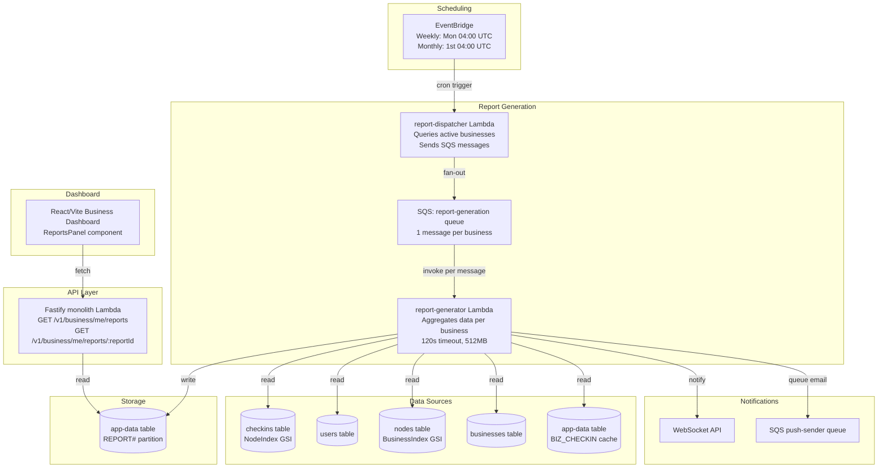

# Design Document: Venue Intelligence Reports

## Overview

Venue Intelligence Reports transforms Area Code's existing check-in, tier, music preference, and reward data into automated weekly and monthly intelligence reports for business owners. The system runs entirely serverless: an EventBridge-triggered Lambda aggregates anonymized check-in data from DynamoDB, computes metrics (peak hours, crowd composition, music profiles, repeat visitor rates, trend deltas, competitive benchmarks, cross-venue journeys), generates plain-language recommendations, and stores the resulting JSON report in the `app-data` table. The existing Fastify monolith Lambda serves report data via new API routes, gated by business tier. The React/Vite business dashboard renders reports with charts and trend indicators.

All consumer data is anonymized at the aggregation boundary — the report generator never writes PII into report documents, and a post-generation PII scan rejects any report that fails verification. This ensures POPIA compliance by design.

### Key Design Decisions

1. **Single dedicated Lambda for report generation** rather than adding to the monolith — report generation is a batch job that may run up to 120s per business, which doesn't fit the request/response pattern of the API Lambda. A separate Lambda with higher timeout and memory avoids cold-start impact on API routes.

2. **Store reports in `app-data` table** using the existing pk/sk pattern — avoids creating a new DynamoDB table and leverages the existing GSI1 index for listing reports by business.

3. **Compute-on-write, serve-on-read** — all metrics are pre-computed during generation. The API simply reads and returns stored JSON. This keeps API response times fast and avoids expensive on-demand aggregation.

4. **Tier gating at the API layer** — full reports are always generated and stored for every business. The API filters the response based on the business's current tier. This means upgrading instantly unlocks historical reports without re-generation.

5. **Fan-out via SQS** — EventBridge triggers a dispatcher Lambda that queries active businesses and sends one SQS message per business. A worker Lambda processes each message independently, providing natural parallelism and retry isolation.

## Architecture



### Fan-Out Strategy

The dispatcher Lambda runs first, queries all businesses with active nodes, and publishes one SQS message per business containing `{ businessId, periodType, periodStart, periodEnd }`. The worker Lambda processes each message independently with a 120-second timeout. If a single business fails, the message goes to the DLQ after 2 retries — other businesses are unaffected.

This approach:
- Avoids a single Lambda timing out when processing many businesses
- Provides automatic retry via SQS visibility timeout
- Scales naturally with business count (Lambda concurrency)
- Keeps per-invocation cost low (each worker processes one business)

## Components and Interfaces

### 1. Report Dispatcher Lambda (`backend/src/features/reports/dispatcher.ts`)

Triggered by EventBridge on schedule. Queries businesses with active nodes and publishes SQS messages.

```typescript
interface DispatchEvent {
  source: 'eventbridge'
  periodType: 'weekly' | 'monthly'
}

// Handler: queries businesses table, filters to those with nodes,
// sends one SQS message per business
```

### 2. Report Generator Lambda (`backend/src/features/reports/generator.ts`)

SQS-triggered worker that generates a single report for one business.

```typescript
interface GenerateReportMessage {
  businessId: string
  periodType: 'weekly' | 'monthly'
  periodStart: string  // ISO 8601
  periodEnd: string    // ISO 8601
}
```

### 3. Analyzer Modules

Pure functions that compute specific report sections from raw check-in data. Each module receives anonymized input and returns a typed result.

```typescript
// backend/src/features/reports/analyzers/peak-hours.ts
interface PeakHoursResult {
  hourlyDistribution: Record<number, number>  // hour (0-23) -> count
  dailyDistribution: Record<string, number>   // day name -> count
  topWindows: Array<{ startHour: number; endHour: number; count: number }>  // top 3
  peakDay: string
}
function analyzePeakHours(checkIns: AnonymizedCheckIn[]): PeakHoursResult

// backend/src/features/reports/analyzers/crowd-composition.ts
interface CrowdCompositionResult {
  tierPercentages: Record<string, number>  // tier -> percentage
  tierUniqueCounts: Record<string, number> // tier -> unique visitor count
  totalUniqueVisitors: number
}
function analyzeCrowdComposition(checkIns: AnonymizedCheckIn[]): CrowdCompositionResult

// backend/src/features/reports/analyzers/music-profile.ts
interface MusicProfileResult {
  archetypeDimensions: Record<string, number>  // dimension -> avg score
  topGenres: Array<{ genre: string; visitorCount: number }>  // top 5
  hasInsufficientData: boolean
}
function analyzeMusicProfile(
  visitorIds: string[],  // hashed tokens
  musicPrefsMap: Map<string, MusicPrefs>
): MusicProfileResult

// backend/src/features/reports/analyzers/repeat-visitors.ts
interface RepeatVisitorResult {
  repeatRate: number           // 0-100 percentage
  firstTimeVisitorCount: number
  totalUniqueVisitors: number
}
function analyzeRepeatVisitors(
  currentPeriodVisitors: Set<string>,  // hashed tokens
  previousPeriodVisitors: Set<string>
): RepeatVisitorResult

// backend/src/features/reports/analyzers/trends.ts
interface TrendResult {
  metrics: Record<string, TrendDelta>
  hasPriorData: boolean
}
interface TrendDelta {
  current: number
  previous: number
  percentChange: number
  direction: 'up' | 'down' | 'flat'
}
function analyzeTrends(
  currentMetrics: ReportMetrics,
  previousMetrics: ReportMetrics | null
): TrendResult

// backend/src/features/reports/analyzers/benchmarks.ts
interface BenchmarkResult {
  metrics: Record<string, BenchmarkComparison>
  hasInsufficientData: boolean  // fewer than 3 venues in category
}
interface BenchmarkComparison {
  venueValue: number
  benchmarkAverage: number
  percentAboveBelow: number
}
function analyzeBenchmarks(
  venueMetrics: ReportMetrics,
  categoryVenueMetrics: ReportMetrics[]
): BenchmarkResult

// backend/src/features/reports/analyzers/journey.ts
interface JourneyResult {
  topOverlapVenues: Array<{
    venueName: string
    overlapPercentage: number
    overlapCount: number
  }>  // top 5
  partnershipSuggestions: string[]  // up to 2
  hasInsufficientData: boolean      // fewer than 10 unique visitors
}
function analyzeJourney(
  venueVisitorTokens: Set<string>,
  allVenueVisitorMap: Map<string, { name: string; visitors: Set<string> }>
): JourneyResult

// backend/src/features/reports/analyzers/recommendations.ts
interface RecommendationResult {
  recommendations: Array<{
    type: 'peak_hours' | 'music' | 'retention' | 'benchmark' | 'general'
    text: string
  }>  // 1-5 items
}
function generateRecommendations(report: ReportSections): RecommendationResult
```

### 4. PII Scanner (`backend/src/features/reports/pii-scanner.ts`)

Post-generation verification that scans the serialized report JSON for PII patterns.

```typescript
interface PiiScanResult {
  clean: boolean
  violations: string[]  // field paths containing PII
}
function scanForPii(reportJson: string): PiiScanResult
```

### 5. Report API Routes (`backend/src/features/reports/handler.ts`)

Added to the Fastify monolith. Requires business Cognito auth.

```typescript
// GET /v1/business/me/reports?cursor=...&period=weekly|monthly
// Returns paginated list of report summaries

// GET /v1/business/me/reports/:reportId
// Returns full report content (or teaser based on tier)
```

### 6. Report Types (`backend/src/features/reports/types.ts`)

Zod schemas for validation and TypeScript types for the report structure.

```typescript
interface Report {
  reportId: string
  businessId: string
  schemaVersion: 'v1'
  periodType: 'weekly' | 'monthly'
  periodStart: string
  periodEnd: string
  generatedAt: string
  nodes: Array<{ nodeId: string; nodeName: string }>

  // Sections
  summary: ReportSummary
  peakHours: PeakHoursResult
  crowdComposition: CrowdCompositionResult
  musicProfile: MusicProfileResult | null
  repeatVisitors: RepeatVisitorResult
  trends: TrendResult
  benchmarks: BenchmarkResult | null
  journeyInsights: JourneyResult | null
  recommendations: RecommendationResult
}

interface TeaserReport {
  reportId: string
  businessId: string
  schemaVersion: 'v1'
  periodType: 'weekly' | 'monthly'
  periodStart: string
  periodEnd: string
  generatedAt: string
  summary: ReportSummary
  upgradeMessage: string
}

interface ReportSummary {
  totalCheckIns: number
  pulseState: string
  topGenre: string | null
  headlineRecommendation: string
}
```

### 7. Dashboard ReportsPanel (`apps/business/src/screens/panels/ReportsPanel.tsx`)

New lazy-loaded panel in the business dashboard. Uses recharts (already a common choice for React charting) for bar charts, pie charts, and radar charts.

```typescript
// Renders:
// - Report selector (weekly/monthly toggle, date picker)
// - Summary cards (total check-ins, pulse, top genre)
// - Peak hours bar chart
// - Crowd composition donut chart
// - Music profile radar chart
// - Trend comparison with directional arrows
// - Recommendations list
// - Journey insights (if available)
// - Teaser overlay for starter/payg tiers
```

## Data Models

### Report Document (app-data table)

```
pk: REPORT#<businessId>
sk: <periodType>#<periodStart>  (e.g., "weekly#2025-01-06" or "monthly#2025-01")
gsi1pk: REPORTS#<businessId>
gsi1sk: <generatedAt>  (ISO 8601, for listing reports sorted by date)
ttl: <generatedAt + 365 days>  (12-month retention)

data: <full Report JSON>
schemaVersion: "v1"
periodType: "weekly" | "monthly"
periodStart: "2025-01-06"
periodEnd: "2025-01-12"
generatedAt: "2025-01-13T04:02:15.000Z"
totalCheckIns: 142  (denormalized for list view)
```

### Anonymized Check-In (internal processing type, never stored)

```typescript
interface AnonymizedCheckIn {
  visitorToken: string   // SHA-256 hash of userId, rotated per period
  nodeId: string
  tier: string
  checkedInAt: string    // ISO 8601
  hourOfDay: number      // 0-23 SAST
  dayOfWeek: string      // Monday-Sunday
}
```

The `visitorToken` is a one-way hash: `SHA-256(userId + periodStart + salt)`. This allows counting unique visitors and computing repeat rates across periods without storing userId in the report. The salt is an environment variable, and the periodStart component ensures tokens cannot be correlated across arbitrary time ranges.

### DynamoDB Access Patterns

| Operation | Table | Key/Index | Pattern |
|-----------|-------|-----------|---------|
| List businesses with nodes | nodes | BusinessIndex GSI | Scan BusinessIndex, group by businessId |
| Get check-ins for node in period | checkins | NodeIndex GSI | Query nodeId, filter by timestamp range |
| Get user tier | users | Primary key | BatchGetItem for unique userIds |
| Get user music prefs | users | Primary key | Same BatchGetItem (musicGenres field) |
| Get business details | businesses | Primary key | GetItem |
| Get previous report | app-data | Primary key | GetItem with REPORT#businessId + previous period SK |
| Store report | app-data | Primary key | PutItem |
| List reports for business | app-data | GSI1 | Query REPORTS#businessId, ScanIndexForward=false |
| Get single report | app-data | Primary key | GetItem |
| Get category venues for benchmarks | nodes | LocationIndex GSI | Query by location (city), filter by category |


## Correctness Properties

*A property is a characteristic or behavior that should hold true across all valid executions of a system — essentially, a formal statement about what the system should do. Properties serve as the bridge between human-readable specifications and machine-verifiable correctness guarantees.*

### Property 1: Business Activity Filtering

*For any* set of businesses with varying check-in activity across their nodes, the report dispatcher SHALL produce generation messages for exactly the businesses that have at least one check-in in the reporting period, and SHALL produce no messages for businesses with zero check-ins.

**Validates: Requirements 1.1, 1.2, 1.4**

### Property 2: Peak Hours Distribution and Aggregation Invariant

*For any* set of check-ins across one or more nodes, the sum of the hourly distribution (hours 0–23) SHALL equal the total check-in count, the sum of the daily distribution (Monday–Sunday) SHALL equal the total check-in count, the reported peak day SHALL be the day with the maximum count in the daily distribution, and when multiple nodes exist, the aggregate hourly counts SHALL equal the sum of the corresponding per-node hourly counts.

**Validates: Requirements 2.1, 2.3, 2.4**

### Property 3: Peak Hours Top Windows Correctness

*For any* hourly distribution with at least one check-in, the top 3 contiguous hour windows returned by the Peak_Hours_Analyzer SHALL each have a combined count greater than or equal to any other contiguous window of the same length not in the top 3.

**Validates: Requirements 2.2**

### Property 4: Crowd Composition Invariant

*For any* set of check-ins with tier data, the tier percentages SHALL sum to 100 (within ±1% rounding tolerance), each tier percentage SHALL equal (tier check-in count / total check-in count) × 100, and the sum of unique visitor counts per tier SHALL equal the total unique visitor count.

**Validates: Requirements 3.1, 3.2**

### Property 5: PII Scanner Correctness

*For any* JSON document, if the document contains a value matching a known PII pattern (UUID userId, cognitoSub, displayName string, phone number, email address, or avatarUrl), the PII scanner SHALL report it as not clean. Conversely, if the document contains only anonymized aggregated data (hashed tokens, counts, percentages, venue names), the scanner SHALL report it as clean.

**Validates: Requirements 3.3, 5.3, 13.1, 13.2**

### Property 6: Music Profile Aggregation Correctness

*For any* set of visitor music preferences with at least 5 visitors, each archetype dimension in the output SHALL equal the average of that dimension across all input visitors, and the top genres list SHALL be sorted by visitor count descending with length at most 5. When fewer than 5 visitors have music preferences, the result SHALL indicate insufficient data.

**Validates: Requirements 4.1, 4.2, 4.3**

### Property 7: Repeat Visitor Rate Computation

*For any* two sets of visitor tokens (current period and previous period), the repeat visitor rate SHALL equal |intersection(current, previous)| / |current| × 100, and the first-time visitor count SHALL equal |current| − |intersection(current, previous)|.

**Validates: Requirements 5.1, 5.2**

### Property 8: Trend Computation Correctness

*For any* pair of current and previous metric values where previous > 0, the percentage change SHALL equal (current − previous) / previous × 100, and the direction label SHALL be "up" when percentChange > 1, "down" when percentChange < −1, and "flat" when −1 ≤ percentChange ≤ 1. When previous metrics are null, hasPriorData SHALL be false.

**Validates: Requirements 6.1, 6.2, 6.3**

### Property 9: Benchmark Computation Correctness

*For any* list of 3 or more venue metric sets, the benchmark average for each metric SHALL equal the sum of that metric across all venues divided by the venue count, and the venue's percentAboveBelow SHALL equal (venueValue − average) / average × 100. When fewer than 3 venues exist, the result SHALL indicate insufficient data.

**Validates: Requirements 7.1, 7.2, 7.4**

### Property 10: Recommendation Generation Bounds and Conditions

*For any* complete set of report sections, the recommendation engine SHALL produce between 1 and 5 recommendations inclusive, each recommendation SHALL be a single sentence containing at least one numeric value, a peak-hours recommendation SHALL be present when the top hour window count exceeds 2× the average hourly count, and a retention alert SHALL be present when the repeat visitor rate drops by more than 10 percentage points.

**Validates: Requirements 8.1, 8.2, 8.4, 8.5**

### Property 11: Journey Analysis Correctness

*For any* venue with at least 10 unique visitors and a map of other venues' visitor sets, the top overlap venues SHALL be sorted by overlap count descending with length at most 5, each overlap percentage SHALL equal overlapCount / venueUniqueVisitors × 100, and partnership suggestions SHALL have length at most 2. When fewer than 10 unique visitors exist, the result SHALL indicate insufficient data.

**Validates: Requirements 9.1, 9.2, 9.4, 9.5**

### Property 12: Tier Gating Correctness

*For any* full Report and business tier, when the tier is "growth" or "pro" the API response SHALL contain all report sections (peakHours, crowdComposition, musicProfile, repeatVisitors, trends, benchmarks, recommendations, journeyInsights), and when the tier is "starter" or "payg" the response SHALL contain only the summary fields (totalCheckIns, pulseState, topGenre, headlineRecommendation) plus an upgradeMessage.

**Validates: Requirements 10.1, 10.2, 10.3**

### Property 13: Report Serialization Round-Trip

*For any* valid Report object conforming to the v1 schema, serializing to JSON and then parsing back SHALL produce an object deeply equal to the original.

**Validates: Requirements 14.1, 14.4**

## Error Handling

### Report Generation Errors

| Error Scenario | Handling | Recovery |
|---|---|---|
| EventBridge trigger fails | CloudWatch alarm on missed schedule | Manual trigger via AWS console or CLI |
| Dispatcher Lambda fails | DLQ on SQS, CloudWatch error metric | Retry via DLQ redrive |
| Worker Lambda timeout (>120s) | SQS message returns to queue, retried up to 2 times | After 2 retries, message goes to DLQ |
| DynamoDB read throttling | AWS SDK automatic retry with exponential backoff | Built into SDK |
| PII scan failure (PII detected) | Report rejected, error logged to CloudWatch, business skipped | Alert triggers investigation, manual re-run after fix |
| No check-in data for business | Business skipped silently (not an error) | N/A |
| Previous period report not found | Trend section shows "no_prior_data", benchmarks may be limited | N/A — expected for new businesses |

### API Errors

| Error Scenario | HTTP Status | Response |
|---|---|---|
| Unauthenticated request | 401 | `{ error: "unauthorized", message: "Authentication required" }` |
| Report not found | 404 | `{ error: "not_found", message: "Report not found" }` |
| Report belongs to different business | 403 | `{ error: "forbidden", message: "Access denied" }` |
| Invalid reportId format | 400 | `{ error: "validation_error", message: "Invalid report ID" }` |
| Internal error during report retrieval | 500 | `{ error: "internal_error", message: "Internal server error" }` |

### Notification Errors

| Error Scenario | Handling |
|---|---|
| WebSocket delivery fails | Log warning, rely on email fallback (no retry) |
| Email queue (SQS) send fails | SQS retry with backoff, DLQ after max retries |
| Business has no notification preferences | Skip notification silently |

### Data Integrity Safeguards

- **Idempotent report generation**: If a report for the same business + period already exists, the generator overwrites it (PutItem). Running the generator twice produces the same result.
- **TTL-based cleanup**: Reports auto-expire after 12 months via DynamoDB TTL, preventing unbounded storage growth.
- **Anonymization boundary**: PII is stripped at the earliest possible point (when check-ins are loaded into the analyzer pipeline). The PII scanner is a defense-in-depth check on the final output.

## Testing Strategy

### Property-Based Testing

Property-based tests are the primary correctness verification for the analyzer modules. Each analyzer is a pure function with clear input/output behavior, making them ideal PBT candidates.

**Library**: [fast-check](https://github.com/dubzzz/fast-check) (TypeScript PBT library, well-maintained, integrates with Vitest)

**Configuration**:
- Minimum 100 iterations per property test
- Each test tagged with: `Feature: venue-intelligence-reports, Property {N}: {title}`
- Custom arbitraries for `AnonymizedCheckIn`, `MusicPrefs`, `ReportMetrics`, `Report`

**Property tests to implement** (one test per property from the Correctness Properties section):

| Property | Module Under Test | Key Generators |
|---|---|---|
| P1: Business activity filtering | `dispatcher.ts` | Random business lists with varying node/check-in counts |
| P2: Peak hours distribution invariant | `analyzers/peak-hours.ts` | Random check-ins with timestamps across hours/days/nodes |
| P3: Peak hours top windows | `analyzers/peak-hours.ts` | Random hourly distributions (Record<number, number>) |
| P4: Crowd composition invariant | `analyzers/crowd-composition.ts` | Random check-ins with tier assignments |
| P5: PII scanner correctness | `pii-scanner.ts` | Random JSON with/without injected PII patterns |
| P6: Music profile aggregation | `analyzers/music-profile.ts` | Random visitor music preference maps |
| P7: Repeat visitor rate | `analyzers/repeat-visitors.ts` | Random pairs of visitor token sets |
| P8: Trend computation | `analyzers/trends.ts` | Random pairs of ReportMetrics |
| P9: Benchmark computation | `analyzers/benchmarks.ts` | Random arrays of ReportMetrics (3+ items) |
| P10: Recommendation bounds | `analyzers/recommendations.ts` | Random complete ReportSections |
| P11: Journey analysis | `analyzers/journey.ts` | Random venue-visitor maps |
| P12: Tier gating | `handler.ts` (filterByTier) | Random Reports × random tiers |
| P13: Serialization round-trip | `types.ts` (Zod schema) | Random valid Report objects via Zod arbitrary |

### Unit Tests (Example-Based)

Unit tests complement property tests for specific examples, edge cases, and integration points:

- **Edge cases**: Empty check-in lists, single check-in, all check-ins in same hour, all visitors same tier, exactly 5 music visitors (boundary), exactly 3 benchmark venues (boundary), exactly 10 journey visitors (boundary)
- **Recommendation triggers**: Specific scenarios that should/shouldn't trigger each recommendation type
- **Tier gating**: Verify teaser report structure, upgrade message content, specific field presence/absence
- **PII scanner**: Known PII patterns (UUID, email regex, phone regex, URL patterns)
- **Date handling**: SAST timezone conversion, week boundaries (Monday 00:00 SAST), month boundaries, leap years

### Integration Tests

- **API routes**: Test `/v1/business/me/reports` and `/v1/business/me/reports/:reportId` with mock DynamoDB, verify auth, pagination, tier gating
- **Report storage**: Verify DynamoDB pk/sk format, TTL attribute, GSI1 keys
- **Notification dispatch**: Verify WebSocket event emission and SQS email queue message format
- **End-to-end generation**: Seed check-in data, trigger generator, verify stored report structure

### Test Organization

```
backend/src/features/reports/
├── __tests__/
│   ├── analyzers/
│   │   ├── peak-hours.property.test.ts
│   │   ├── crowd-composition.property.test.ts
│   │   ├── music-profile.property.test.ts
│   │   ├── repeat-visitors.property.test.ts
│   │   ├── trends.property.test.ts
│   │   ├── benchmarks.property.test.ts
│   │   ├── journey.property.test.ts
│   │   └── recommendations.property.test.ts
│   ├── pii-scanner.property.test.ts
│   ├── tier-gating.property.test.ts
│   ├── report-serialization.property.test.ts
│   ├── dispatcher.property.test.ts
│   ├── handler.integration.test.ts
│   └── generator.integration.test.ts
```
