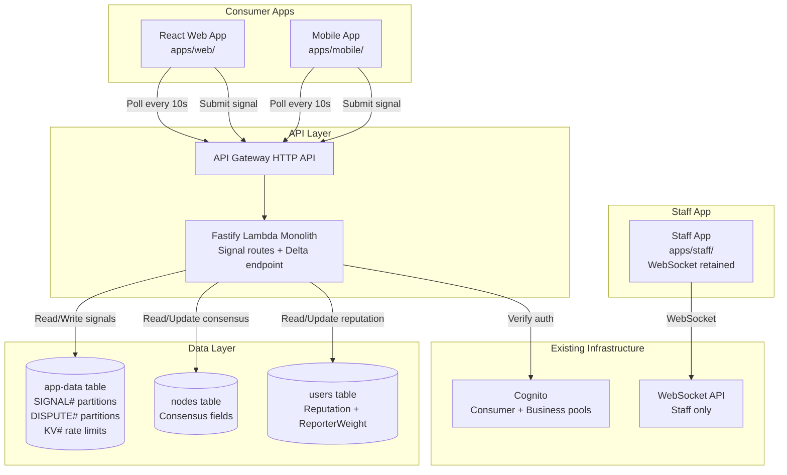
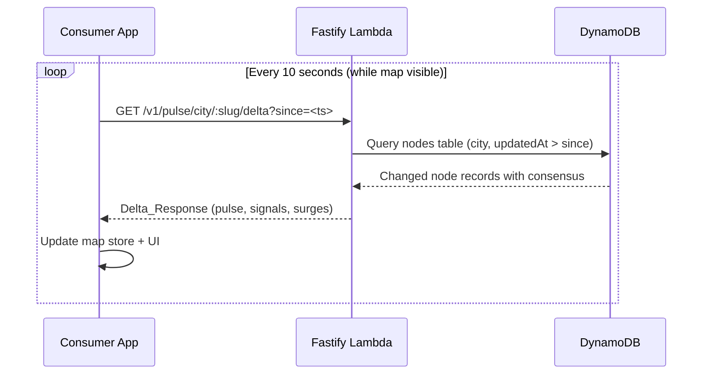
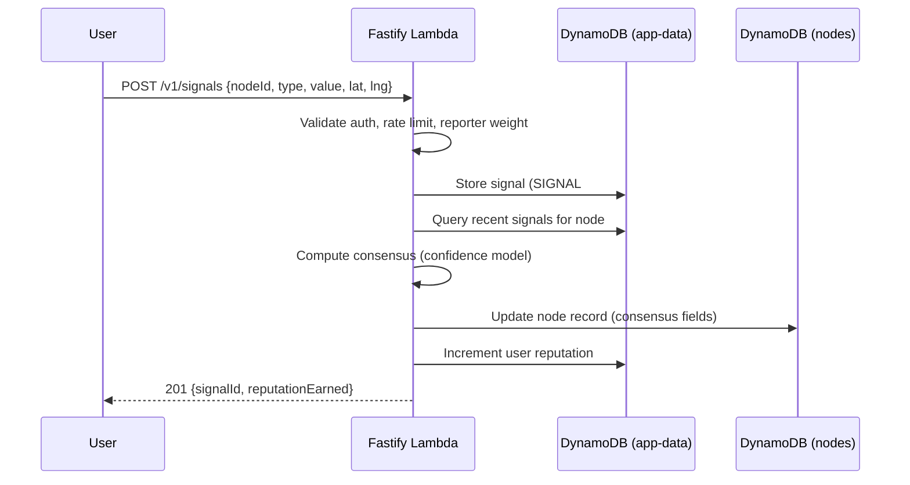

# Design Document: Venue Live Signals

## Overview

Venue Live Signals introduces a Waze-style crowd-sourced signal system where authenticated users report the genre currently playing and queue length at venues. The system replaces WebSocket-based real-time updates on consumer apps with a lightweight 10-second polling mechanism, while the staff app retains its existing WebSocket infrastructure unchanged.

The architecture is fully serverless: signals are submitted via new Fastify API routes on the existing Lambda monolith, stored in the `app-data` DynamoDB table, and aggregated into consensus scores using a confidence model that weighs recency, report volume, reporter tier, GPS proximity, and contradictions. Consensus data is denormalized onto node records for efficient retrieval by a new delta polling endpoint. Genre glyphs appear on map markers, and when no live signal exists, the system falls back to the existing CrowdVibeSnapshot taste profile with a "predicted" visual indicator.

Venue owners can submit badged signals and dispute crowd signals they believe are incorrect. An admin review queue handles disputed signals. Anti-abuse mechanisms include rate limiting, reporter weight decay, and daily submission caps — intentionally lenient in V1 to prioritise participation over enforcement. Users earn Reputation points for contributing signals, displayed as a separate stat from tier progression.

### V1 Launch Philosophy

V1 thresholds are intentionally lenient to avoid punishing early adopters and to grow the contributor base. Key differences from the eventual hardened state:

- **Daily cap**: 50 signals/day (Phase 2: 20)
- **Contradiction threshold**: 10 flags in 7 days triggers penalty (Phase 2: 5)
- **Soft-ban**: Reporter weight floors at 0.1 (signals accepted but minimally weighted) instead of hard-ban at 0.0
- **Correction window**: 2-minute overwrite allowed after submission
- **Display threshold**: 0.15 confidence (Phase 2: 0.3)
- **Rate limit**: 5 minutes per type/node (Phase 2: 10 minutes)

### Key Design Decisions

1. **Polling over WebSocket for consumer apps** — Mobile networks in South Africa are unreliable for persistent connections. A 10-second poll is simpler, more resilient, and eliminates the need for reconnection logic. The delta endpoint returns only changes since the last poll, keeping payloads small.

2. **Consensus stored on node record** — Rather than computing consensus on every read, we recompute and store it on each new signal submission. The polling endpoint simply reads node records that changed, avoiding expensive aggregation at query time.

3. **Single `app-data` table for signals** — Signals use the existing single-table design with `SIGNAL#<nodeId>` partition keys. DynamoDB TTL handles automatic cleanup after 24 hours. No new tables needed.

4. **Confidence model as a pure function** — The scoring algorithm (recency decay, proximity weighting, tier multipliers, contradiction penalties) is implemented as a pure function, making it highly testable with property-based tests.

5. **Reporter weight in user record** — Rather than a separate table, reporter weight is stored as a field on the user record in the DynamoDB `users` table (accessed via `@aws-sdk/lib-dynamodb`), keeping lookups efficient during signal submission. Writes use UpdateItem with ADD/SET expressions for atomic updates.

6. **KV helper for rate limits and counters** — Rate limits, daily caps, contradiction counters, and correction windows use the existing `kvGet/kvSet/kvIncr/kvTtl` helper in `backend/src/shared/kv/dynamodb-kv.ts`, which transparently routes to Redis (when `REDIS_URL` is set) or DynamoDB `app-data` table (otherwise). No new infrastructure required.

7. **Staff app unchanged** — The staff WebSocket infrastructure (`backend/src/lambdas/websocket.ts`, `backend/src/shared/websocket/`, `backend/src/shared/socket/`) remains untouched. A codebase audit for any consumer WebSocket hooks will determine whether removal tasks are needed; if no such hooks exist, removal is a no-op.

## Architecture



### Polling Flow



### Signal Submission Flow



## Components and Interfaces

### 1. Signal Routes (`backend/src/features/signals/handler.ts`)

New Fastify route module registered in `app.ts`.

```typescript
// POST /v1/signals — Submit a signal
// GET /v1/signals/:nodeId — Get active signals for a node
// POST /v1/signals/:signalId/dispute — Dispute a signal (business auth)
```

### 2. Signal Service (`backend/src/features/signals/service.ts`)

Business logic for signal submission, validation, and aggregation orchestration.

```typescript
interface SubmitSignalInput {
  userId: string
  nodeId: string
  type: 'genre_playing' | 'queue_length'
  value: string
  lat?: number
  lng?: number
  isOwner: boolean
}

interface SubmitSignalResult {
  signalId: string
  reputationEarned: number
  isProximityReport: boolean
}

function submitSignal(input: SubmitSignalInput): Promise<SubmitSignalResult>
function correctSignal(input: SubmitSignalInput): Promise<SubmitSignalResult> // overwrite within 2-min window
function getActiveSignals(nodeId: string): Promise<SignalConsensus>
function disputeSignal(signalId: string, businessId: string, reason: string): Promise<void>
```

### 3. Signal Aggregator (`backend/src/features/signals/aggregator.ts`)

Pure functions for confidence scoring and consensus computation.

```typescript
interface SignalRecord {
  signalId: string
  nodeId: string
  userId: string
  type: 'genre_playing' | 'queue_length'
  value: string
  reporterWeight: number
  isProximity: boolean
  isOwner: boolean
  createdAt: string // ISO 8601
}

interface ConsensusResult {
  consensusValue: string | null
  confidenceScore: number // 0.0 - 1.0
  reportCount: number
  lastUpdatedAt: string
}

function computeConfidence(signal: SignalRecord, now: Date): number
function computeConsensus(signals: SignalRecord[], type: 'genre_playing' | 'queue_length', now: Date): ConsensusResult
function getReporterWeight(tier: Tier): number
```

### 4. Signal Repository (`backend/src/features/signals/repository.ts`)

DynamoDB access layer for signal CRUD operations.

```typescript
function storeSignal(signal: SignalRecord): Promise<void>
function getSignalsForNode(nodeId: string, type: string, since: Date): Promise<SignalRecord[]>
function storeDispute(dispute: DisputeRecord): Promise<void>
function getDisputesForBusiness(businessId: string, since: Date): Promise<DisputeRecord[]>
function updateSignalConfidence(signalId: string, nodeId: string, multiplier: number): Promise<void>
```

### 5. Delta Polling Endpoint (`backend/src/features/nodes/delta-handler.ts`)

New route added to the nodes feature module.

```typescript
// GET /v1/pulse/city/:slug/delta?since=<ISO timestamp>
// Returns nodes that changed since the given timestamp

interface DeltaResponse {
  nodes: DeltaNode[]
  serverTime: string // ISO 8601, client uses as next `since` value
}

interface DeltaNode {
  nodeId: string
  pulseScore?: number
  state?: NodeState
  checkInCount?: number
  consensusGenre?: string | null
  consensusGenreConfidence?: number
  consensusQueue?: 'none' | 'short' | 'long' | null
  consensusQueueConfidence?: number
  signalReportCount?: number
  lastSignalAt?: string
  isOwnerReport?: boolean
}
```

### 6. Polling Hook (`packages/shared/hooks/useDeltaPoll.ts`)

Replaces the WebSocket hooks for consumer apps.

```typescript
function useDeltaPoll(
  citySlug: string,
  token: string | undefined,
  options?: {
    intervalMs?: number // default 10000
    enabled?: boolean // default true, set false when map not visible
  },
): void
```

### 7. Signal Display UI Components

```typescript
// packages/shared/components/GenreGlyph.tsx
// REPLACES the standard pulsing circle marker when a live signal exists.
// The glyph itself pulses based on pulseScore (same sizing/animation logic as MapMarker).
// Three states:
//   - Live signal (confidence > 0.15): genre icon with pulse animation
//   - Predicted (no live signal, has CrowdVibeSnapshot): genre icon, muted/faded, no pulse
//   - No data: falls back to standard MapMarker circle (GenreGlyph not rendered)
// Handles confidence thresholds and accessibility (44px touch target)

// packages/shared/components/GenreLegend.tsx
// Accessible from map view via a legend button
// Displays all 12 genre icons with their corresponding genre names
// Helps users learn what each glyph represents

// packages/shared/components/SignalReportSheet.tsx
// Bottom sheet with genre chips (12) and queue chips (3)
// Handles GPS permission, submission, correction window, and confirmation

// packages/shared/components/SignalDetail.tsx
// Node detail sheet section showing active signals
// Confidence indicator, time since report, owner badge
```

### 8. Reputation Display (`packages/shared/components/ReputationStat.tsx`)

Profile section showing reputation points and city leaderboard link.

### 9. Admin Dispute Queue (`apps/admin/src/screens/SignalDisputeQueue.tsx`)

Admin panel for reviewing and resolving signal disputes.

## Data Models

### Signal Record (app-data table)

```
pk: SIGNAL#<nodeId>
sk: <ISO timestamp>#<userId>
type: "genre_playing" | "queue_length"
value: "amapiano" | "deep_house" | ... | "none" | "short" | "long"
userId: <userId>
reporterWeight: 1.5
isProximity: true
isOwner: false
lat: -26.2041
lng: 28.0473
disputeMultiplier: 1.0  (reduced to 0.5 when disputed)
createdAt: "2025-01-15T22:30:00.000Z"
ttl: <createdAt + 24 hours as epoch seconds>
```

### Node Consensus Fields (nodes DynamoDB table, added to existing node record)

```
# Existing nodes table uses hash_key = nodeId (no sort key)
nodeId: <nodeId>  // hash key

// New fields added to existing node record via UpdateItem:
consensusGenre: "amapiano" | null
consensusGenreConfidence: 0.82
consensusQueue: "short" | null
consensusQueueConfidence: 0.65
signalReportCount: 7
lastSignalAt: "2025-01-15T22:30:00.000Z"
lastSignalIsOwner: false
signalUpdatedAt: "2025-01-15T22:30:00.000Z"  // used by delta endpoint
cityId: <cityId>  // required for GSI; may already exist on record
```

**Note:** The existing nodes table has hash_key=`nodeId` only, with GSIs `BusinessIndex` (businessId) and `LocationIndex` (location). The new `CityUpdatedIndex` GSI below supplements these without modifying existing ones.

### Dispute Record (app-data table)

```
pk: DISPUTE#<nodeId>
sk: <ISO timestamp>#<businessId>
signalId: "<timestamp>#<userId>"
businessId: <businessId>
reason: "We are playing deep house, not amapiano"
status: "pending" | "upheld" | "dismissed" | "expired"
createdAt: "2025-01-15T23:00:00.000Z"
resolvedAt: null
resolvedBy: null
ttl: <createdAt + 30 days as epoch seconds>
```

### User Record Extensions (users DynamoDB table)

The users table uses hash_key=`userId` with GSIs `EmailIndex` and `CognitoIndex`. Adding fields requires no schema change (DynamoDB is schemaless).

```
userId: <userId>  // hash key

// New fields added to existing user record via UpdateItem (ADD/SET):
reputation: 42
reporterWeight: 1.5  // based on tier, reduced by contradictions, floors at 0.1 in V1
reporterWeightUpdatedAt: "2025-01-15T00:00:00.000Z"
```

### Daily Signal Counter (app-data table, KV pattern)

```
pk: KV#signal-daily:<userId>:<YYYY-MM-DD>
sk: VALUE
value: 15  // current count
ttl: <end of day + 1 hour as epoch seconds>
```

### Signal Rate Limit (app-data table, KV pattern)

```
pk: KV#signal-rate:<userId>:<nodeId>:<type>
sk: VALUE
value: 1
ttl: <now + 300 seconds>
```

### Signal Correction Window (app-data table, KV pattern)

```
pk: KV#signal-correction:<userId>:<nodeId>:<type>
sk: VALUE
value: "<signalSortKey>"  // reference to the signal that can be overwritten
ttl: <now + 120 seconds>
```

### Contradiction Counter (app-data table, KV pattern)

```
pk: KV#signal-contradictions:<userId>
sk: VALUE
value: 3  // count in current 7-day window
ttl: <window start + 7 days as epoch seconds>
```

### DynamoDB Access Patterns

| Operation                   | Table            | Key/Index                                                  | Pattern                                               |
| --------------------------- | ---------------- | ---------------------------------------------------------- | ----------------------------------------------------- |
| Store signal                | app-data         | pk=SIGNAL#nodeId, sk=ts#userId                             | PutItem                                               |
| Get recent signals for node | app-data         | pk=SIGNAL#nodeId                                           | Query, ScanIndexForward=false, filter by type and TTL |
| Store dispute               | app-data         | pk=DISPUTE#nodeId, sk=ts#bizId                             | PutItem                                               |
| Get disputes for admin      | app-data         | GSI1 (gsi1pk=DISPUTES#pending)                             | Query                                                 |
| Get daily signal count      | app-data         | pk=KV#signal-daily:userId:date                             | GetItem (via kvIncr)                                  |
| Check rate limit            | app-data         | pk=KV#signal-rate:userId:nodeId:type                       | GetItem (via kvIncr)                                  |
| Update node consensus       | nodes (DynamoDB) | nodeId                                                     | UpdateItem on the existing node record                |
| Delta query (changed nodes) | nodes (DynamoDB) | GSI: CityUpdatedIndex (cityId hash, signalUpdatedAt range) | Query with cityId=:city AND signalUpdatedAt > :since  |
| Update user reputation      | users            | pk=USER#userId                                             | UpdateItem (ADD reputation)                           |
| Update reporter weight      | users            | pk=USER#userId                                             | UpdateItem (SET reporterWeight)                       |
| Get user reporter weight    | users            | pk=USER#userId                                             | GetItem (projection: reporterWeight, tier)            |

### GSI Addition: CityUpdatedIndex (nodes DynamoDB table)

The existing nodes table uses `hash_key = nodeId` with GSIs `BusinessIndex` (businessId hash) and `LocationIndex` (location hash). Both use `projection_type = "ALL"` and `billing_mode = "PAY_PER_REQUEST"`.

Add a new GSI to support the delta polling endpoint efficiently:

```
Hash key: cityId
Sort key: signalUpdatedAt (ISO timestamp string)
Projection type: ALL
```

This is added via Terraform in `infra/environments/{dev,prod}/main.tf` within the existing `aws_dynamodb_table.nodes` resource. No new attributes need to be declared at table level beyond `cityId` (already on node records) and `signalUpdatedAt` (new, string type).

The delta endpoint queries: `cityId = :city AND signalUpdatedAt > :since` to find only nodes that changed since the last poll.

## Correctness Properties

_A property is a characteristic or behavior that should hold true across all valid executions of a system — essentially, a formal statement about what the system should do. Properties serve as the bridge between human-readable specifications and machine-verifiable correctness guarantees._

### Property 1: Delta Response Completeness and Precision

_For any_ set of node records with varying `signalUpdatedAt` timestamps and any `since` timestamp, the delta endpoint SHALL return exactly those nodes whose `signalUpdatedAt` is strictly greater than `since`, and SHALL not include any node whose `signalUpdatedAt` is less than or equal to `since`.

**Validates: Requirements 1.6, 12.4**

### Property 2: Signal Value Validation

_For any_ signal submission, if the type is `genre_playing` then the value SHALL be accepted if and only if it is one of the 12 defined MusicGenre values; if the type is `queue_length` then the value SHALL be accepted if and only if it is one of `none`, `short`, or `long`. All other values SHALL be rejected.

**Validates: Requirements 2.2, 2.3**

### Property 3: Proximity Classification

_For any_ signal submission with user coordinates (lat, lng) and a node's coordinates, the signal SHALL be classified as a Proximity_Report if and only if the haversine distance between the two points is less than or equal to 150 metres. When no coordinates are provided, the signal SHALL always be classified as a Remote_Report.

**Validates: Requirements 2.5, 2.6**

### Property 4: Confidence Score Bounds and Monotonicity

_For any_ valid signal record, the computed Confidence_Score SHALL be between 0.0 and 1.0 inclusive. Furthermore, for two signals that are identical except for recency, the more recent signal SHALL have a higher or equal confidence score. For two signals identical except for proximity, the Proximity_Report SHALL have a higher or equal confidence score than the Remote_Report.

**Validates: Requirements 5.1**

### Property 5: Decay Function TTL Enforcement

_For any_ Genre*Signal with age >= 60 minutes, the decay function SHALL produce a confidence contribution of zero. \_For any* Queue*Signal with age >= 30 minutes, the decay function SHALL produce a confidence contribution of zero. \_For any* signal with age < its TTL, the decay function SHALL produce a positive confidence contribution.

**Validates: Requirements 5.2, 5.3**

### Property 6: Consensus Selection Correctness

_For any_ set of signals for the same node and type, the consensus value SHALL be the value with the highest aggregate weighted score. When the highest aggregate weighted score produces a confidence below 0.15, the consensus SHALL be null (no active signal).

**Validates: Requirements 5.4, 5.5**

### Property 7: Reputation Increment Correctness

_For any_ valid signal submission, the user's reputation SHALL increase by exactly 2 if the signal is a Proximity_Report, and by exactly 1 if it is a Remote_Report. The reputation change SHALL be independent of signal type, value, or node.

**Validates: Requirements 6.1, 6.2**

### Property 8: Owner Report Tagging and Weight

_For any_ signal submission where the authenticated user is the business owner of the node, the signal SHALL be tagged as an Owner_Report. Owner_Reports SHALL receive the same effective weight in the confidence calculation as a fixture-tier (1.5) Proximity_Report (1.5× multiplier), regardless of the owner's actual tier.

**Validates: Requirements 7.1, 7.2**

### Property 9: Dispute Ownership Verification

_For any_ dispute submission, the dispute SHALL be accepted if and only if the authenticated business owns the node associated with the disputed signal. Disputes from non-owning businesses SHALL be rejected.

**Validates: Requirements 8.2**

### Property 10: Dispute Confidence Round-Trip

_For any_ signal with confidence weight W, when a dispute is filed the effective weight SHALL become W × 0.5. When the dispute is subsequently dismissed, the effective weight SHALL be restored to W. The round-trip (dispute then dismiss) SHALL preserve the original weight.

**Validates: Requirements 8.4, 9.4**

### Property 11: Reporter Weight Penalty

_For any_ reporter with weight W, when an admin upholds a dispute against their signal, the reporter's weight SHALL become max(0.1, W − 0.1). The weight SHALL never go below 0.1 in V1 (soft-ban floor).

**Validates: Requirements 9.3, 10.3**

### Property 12: Tier-to-Weight Mapping

_For any_ user tier, the assigned Reporter_Weight SHALL match the defined mapping: legend=2.0, institution=1.8, fixture=1.5, regular=1.2, local=1.0. No other weight values SHALL be assigned based on tier alone.

**Validates: Requirements 10.1**

### Property 13: Single-User Confidence Cap

_For any_ set of signals where all reports come from a single user (regardless of count, tier, or proximity), the resulting Confidence_Score SHALL never reach or exceed 0.7. At least 2 agreeing reports from different users SHALL be required to achieve high confidence (>= 0.7).

**Validates: Requirements 10.6**

### Property 14: Fallback Genre Selection

_For any_ CrowdVibeSnapshot with non-empty genreCounts, the fallback genre SHALL be the genre with the highest count. When multiple genres are tied for highest count, the selection SHALL be deterministic (alphabetical tiebreak).

**Validates: Requirements 11.1**

### Property 15: Contradiction Detection

_For any_ signal submission where 3 or more existing reports from different users agree on a different value for the same node and type, the new signal SHALL be flagged as a contradiction. When fewer than 3 reports agree on a different value, the signal SHALL NOT be flagged.

**Validates: Requirements 10.2**

## Error Handling

### Signal Submission Errors

| Error Scenario                | HTTP Status | Response                                                                               |
| ----------------------------- | ----------- | -------------------------------------------------------------------------------------- |
| Unauthenticated request       | 401         | `{ error: "unauthorized", message: "Authentication required" }`                        |
| Invalid signal type           | 400         | `{ error: "validation_error", message: "Type must be genre_playing or queue_length" }` |
| Invalid genre value           | 400         | `{ error: "validation_error", message: "Invalid genre value" }`                        |
| Invalid queue value           | 400         | `{ error: "validation_error", message: "Invalid queue value" }`                        |
| Node not found                | 404         | `{ error: "not_found", message: "Node not found" }`                                    |
| Reporter banned (weight = 0)  | 403         | `{ error: "forbidden", message: "Signal submissions suspended" }`                      |
| Rate limit (per type/node)    | 429         | `{ error: "too_many_requests", message: "Wait 5 minutes between reports" }`            |
| Daily limit exceeded (50/day) | 429         | `{ error: "too_many_requests", message: "Daily signal limit reached" }`                |

### Dispute Errors

| Error Scenario               | HTTP Status | Response                                                                            |
| ---------------------------- | ----------- | ----------------------------------------------------------------------------------- |
| Not business authenticated   | 401         | `{ error: "unauthorized", message: "Business authentication required" }`            |
| Business doesn't own node    | 403         | `{ error: "forbidden", message: "You can only dispute signals on your own venue" }` |
| Signal not found             | 404         | `{ error: "not_found", message: "Signal not found" }`                               |
| Reason too long (>500 chars) | 400         | `{ error: "validation_error", message: "Reason must be 500 characters or fewer" }`  |
| Daily dispute limit (5/day)  | 429         | `{ error: "too_many_requests", message: "Daily dispute limit reached" }`            |

### Delta Polling Errors

| Error Scenario          | HTTP Status | Response                                                             |
| ----------------------- | ----------- | -------------------------------------------------------------------- |
| Invalid city slug       | 404         | `{ error: "not_found", message: "City not found" }`                  |
| Invalid since timestamp | 400         | `{ error: "validation_error", message: "Invalid ISO timestamp" }`    |
| Missing since parameter | 400         | `{ error: "validation_error", message: "since parameter required" }` |

### Admin Dispute Resolution Errors

| Error Scenario            | HTTP Status | Response                                                                              |
| ------------------------- | ----------- | ------------------------------------------------------------------------------------- |
| Not admin authenticated   | 401         | `{ error: "unauthorized", message: "Admin authentication required" }`                 |
| Insufficient admin role   | 403         | `{ error: "forbidden", message: "Requires support_agent or super_admin role" }`       |
| Dispute not found         | 404         | `{ error: "not_found", message: "Dispute not found" }`                                |
| Invalid resolution action | 400         | `{ error: "validation_error", message: "Action must be dismiss, uphold, or expire" }` |
| Dispute already resolved  | 409         | `{ error: "conflict", message: "Dispute already resolved" }`                          |

### Data Integrity Safeguards

- **Idempotent consensus computation**: Recomputing consensus from the same set of signals always produces the same result. The aggregator is a pure function of current signal state.
- **TTL-based cleanup**: Individual signals auto-expire after 24 hours via DynamoDB TTL. Disputes expire after 30 days. Rate limit keys expire naturally.
- **Atomic reputation updates**: Reputation increments use DynamoDB `ADD` operation for atomic updates, preventing race conditions from concurrent signal submissions.
- **Optimistic locking on consensus**: Node consensus updates use a condition expression on `signalUpdatedAt` to prevent stale writes from concurrent signal submissions.

## Testing Strategy

### Property-Based Testing

Property-based tests are the primary correctness verification for the signal aggregator, confidence model, and validation logic. These are pure functions with clear input/output behavior, making them ideal PBT candidates.

**Library**: [fast-check](https://github.com/dubzzz/fast-check) (TypeScript PBT library, integrates with Vitest)

**Configuration**:

- Minimum 100 iterations per property test
- Each test tagged with: `Feature: venue-live-signals, Property {N}: {title}`
- Custom arbitraries for `SignalRecord`, `MusicGenre`, `QueueValue`, `Tier`, coordinate pairs

**Property tests to implement** (one test per property from the Correctness Properties section):

| Property                           | Module Under Test                             | Key Generators                                           |
| ---------------------------------- | --------------------------------------------- | -------------------------------------------------------- |
| P1: Delta response completeness    | `delta-handler.ts` (filter logic)             | Random node arrays with timestamps, random since values  |
| P2: Signal value validation        | `signals/types.ts` (Zod schemas)              | Random strings, valid/invalid genre and queue values     |
| P3: Proximity classification       | `signals/service.ts` (classifyProximity)      | Random coordinate pairs at varying distances             |
| P4: Confidence score bounds        | `signals/aggregator.ts` (computeConfidence)   | Random SignalRecords with varying recency/proximity/tier |
| P5: Decay function TTL             | `signals/aggregator.ts` (decayFunction)       | Random time offsets × signal types                       |
| P6: Consensus selection            | `signals/aggregator.ts` (computeConsensus)    | Random signal sets with multiple genres/values           |
| P7: Reputation increment           | `signals/service.ts` (calculateReputation)    | Random signals with proximity/remote classification      |
| P8: Owner report weight            | `signals/aggregator.ts`                       | Random owner signals vs fixture proximity signals        |
| P9: Dispute ownership              | `signals/service.ts` (verifyDisputeOwnership) | Random business/node ownership combinations              |
| P10: Dispute confidence round-trip | `signals/aggregator.ts`                       | Random weights, apply dispute then dismiss               |
| P11: Reporter weight penalty       | `signals/service.ts` (applyPenalty)           | Random reporter weights, apply penalty                   |
| P12: Tier-to-weight mapping        | `signals/aggregator.ts` (getReporterWeight)   | All 5 tier values                                        |
| P13: Single-user confidence cap    | `signals/aggregator.ts` (computeConsensus)    | Single-user signal sets with max weight/proximity        |
| P14: Fallback genre selection      | UI logic or shared util                       | Random CrowdVibeSnapshot genreCounts                     |
| P15: Contradiction detection       | `signals/service.ts` (detectContradiction)    | Random signal sets with varying agreement levels         |

### Unit Tests (Example-Based)

Unit tests complement property tests for specific examples, edge cases, and UI components:

- **Edge cases**: Empty signal sets, single signal, all signals expired, all signals from same user, exactly 150m distance (boundary), reporter weight at exactly 0.1 (soft-ban floor), exactly 10 contradictions in 7 days, correction within 2-minute window
- **Rate limiting**: Verify per-type/node/user 5-minute limit, daily 50-signal cap, owner 30-minute limit, dispute 5/day limit, 2-minute correction overwrite
- **UI components**: GenreGlyph renders correct icon per genre, PredictedIndicator styling, owner badge, confidence indicator thresholds (high/medium/low), disabled button state after submission
- **Polling hook**: Interval setup/teardown, visibility-based enable/disable, store updates on delta response

### Integration Tests

- **Signal submission flow**: Submit signal → verify storage → verify consensus update → verify reputation increment
- **Dispute flow**: Submit dispute → verify confidence reduction → admin resolve → verify weight restoration/penalty
- **Delta endpoint**: Seed nodes with various timestamps → query with since → verify correct subset returned
- **Auth flows**: Consumer token accepted, business token accepted for owner signals, unauthenticated rejected
- **Anti-abuse**: Verify contradiction detection → weight reduction → eventual ban at weight 0

### Test Organization

```
backend/src/features/signals/
├── __tests__/
│   ├── aggregator.property.test.ts      (P4, P5, P6, P8, P10, P12, P13)
│   ├── validation.property.test.ts      (P2)
│   ├── proximity.property.test.ts       (P3)
│   ├── reputation.property.test.ts      (P7)
│   ├── contradiction.property.test.ts   (P15)
│   ├── service.integration.test.ts
│   ├── handler.integration.test.ts
│   └── dispute.integration.test.ts
backend/src/features/nodes/
├── __tests__/
│   ├── delta.property.test.ts           (P1)
│   └── delta.integration.test.ts
packages/shared/
├── __tests__/
│   ├── fallback-genre.property.test.ts  (P14)
│   ├── SignalReportSheet.test.tsx
│   ├── GenreGlyph.test.tsx
│   └── useDeltaPoll.test.ts
```
