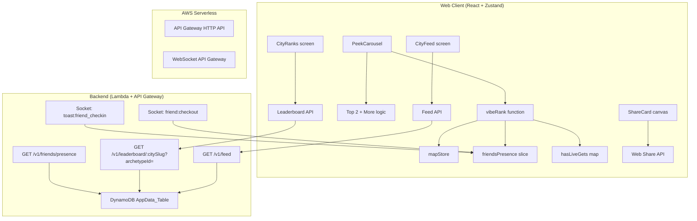
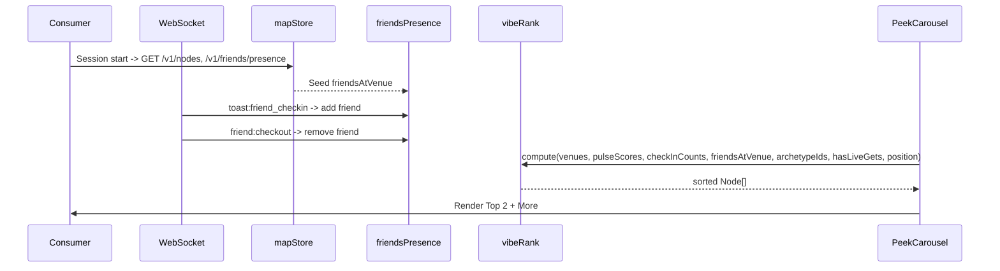

# Design: Vibe-Ranked Browse

## Overview

This design extends the existing `vibeRank` function and supporting infrastructure to implement a full lexicographic ranking with taste-match (archetype affinity + friends presence), business tier boost, live gets signal, and a "Top 2 + More" entry point. It also introduces City Ranks (archetype-segmented leaderboard evolution) and City Feed (vibe-enriched activity feed with "Join them?" CTAs, archetype clustering, and shareable milestones).

The architecture remains strictly serverless (Lambda + DynamoDB PAY_PER_REQUEST + API Gateway HTTP API). All new data lives in the existing `AppData_Table`. Presence signals are event-driven (socket + session seed) - no polling. Share cards are generated client-side (canvas/SVG -> image). The ranking function stays pure and property-testable.

### Key Design Decisions

1. **Lexicographic sort, not additive scoring** - Each signal short-circuits before the next is consulted. Proximity is structurally incapable of outranking any higher signal (Discovery DNA compliance).
2. **Friends presence as a Zustand store slice** - Extends `mapStore` (rather than a new store) to keep reactivity co-located with node data the ranking already reads.
3. **Option A for live gets** - `hasLiveGets: Record<string, boolean>` populated from rewards-near-me response (simpler, avoids coupling ranking to reward store internals).
4. **Client-side share cards** - `html2canvas` or `<canvas>` rendering for milestone/rank cards. No new Lambda for image gen.
5. **Archetype segment as a query param** - The leaderboard endpoint gains `?archetypeId=...` without breaking the existing response shape.

---

## Architecture



### Data Flow - Ranking



---

## Components and Interfaces

### 1. Extended `vibeRank` Function

The ranking function evolves from `(venues, pulseScores, checkInCounts, position, positionFresh)` to include taste-match, tier, and live-gets signals.

```typescript
// apps/web/src/lib/carouselRanking.ts (extended)

export interface RankInput {
  venues: Node[]
  pulseScores: Record<string, number>
  checkInCounts: Record<string, number>
  lastKnownPosition: { lat: number; lng: number } | null
  positionFresh: boolean
  // New signals
  consumerArchetypeId: string | null
  venueArchetypeIds: Record<string, string> // mapStore.archetypeIds (live overrides)
  friendsAtVenue: Record<string, string[]> // nodeId -> userId[]
  hasLiveGets: Record<string, boolean>
}
// NOTE: business tier and default archetype are NOT passed as separate maps.
// They already live on each Node (`node.businessTier`, `node.defaultArchetypeId`),
// so the comparator derives them directly: the tier multiplier from
// `TIER_SIZE_MULTIPLIER[node.businessTier ?? 'starter']` (the shared constant in
// `packages/shared/constants/tier-size.ts`), and the resolved archetype from
// `venueArchetypeIds[id] ?? node.defaultArchetypeId ?? 'archetype-eclectic'`.
// This keeps a single source of truth and matches requirements R1 (priority 3)
// and R2.1, which both read from the node.

export function vibeRank(input: RankInput): Node[] {
  // Pure, deterministic, no I/O, no Date.now()
  // Lexicographic: taste-match -> aliveness -> tier -> live-gets -> distance -> id
}
```

### 2. `tasteMatchScore` - Pure Helper

```typescript
/**
 * Compute taste-match score for a single venue.
 * archetypeMatch: 0 or 1
 * friendsCount: length of friendsAtVenue[nodeId]
 * Total: archetypeMatch + friendsCount
 */
export function tasteMatchScore(
  consumerArchetypeId: string | null,
  venueArchetypeId: string, // resolved: live -> default -> eclectic
  friendsAtVenueCount: number,
): number {
  const archetypeMatch = consumerArchetypeId && consumerArchetypeId === venueArchetypeId ? 1 : 0
  return archetypeMatch + friendsAtVenueCount
}
```

### 3. Friends Presence - `mapStore` Extension

Rather than a separate store, add a `friendsAtVenue` slice to `mapStore`:

```typescript
// packages/shared/stores/mapStore.ts - additions
interface MapStore {
  // ... existing fields ...
  friendsAtVenue: Record<string, string[]> // nodeId -> userId[] (deduped)
  hasLiveGets: Record<string, boolean> // nodeId -> boolean
  setFriendsPresence: (byNode: Record<string, string[]>) => void // bulk replace; takes filterActiveFriends' grouped output directly
  addFriendPresence: (nodeId: string, userId: string) => void // no-op if userId already present (dedup)
  removeFriendPresence: (nodeId: string, userId: string) => void
  clearFriendsPresence: () => void // called on logout (R3.3)
  setHasLiveGets: (map: Record<string, boolean>) => void
}
```

### 4. Friends Presence API

```typescript
// GET /v1/friends/presence
// Auth: requireAuth('consumer') - unauthenticated requests are rejected (401);
//       the client simply does not call it when logged out, so the store stays
//       empty (R3.3). It does NOT return an empty 200 for anonymous callers.
// Response: { items: Array<{ nodeId: string; userId: string; expiresAt: string }> }
// Server returns only friends with active, non-expired check-ins (honest
// presence). `expiresAt` is included so the client re-applies `filterActiveFriends`
// on seed (defence in depth against clock skew / slightly stale rows).
```

### 5. Socket Events for Friends Presence

**Payload gap (must fix):** the current `toast:friend_checkin` payload in
`ServerToClientEvents` is `{ type: 'checkin'; message: string; nodeId?: string; avatarUrl?: string }`.
It carries no `userId` and `nodeId` is optional, so it cannot maintain a
`nodeId -> userId[]` store. This design REQUIRES:

- Extending the `toast:friend_checkin` payload (in `packages/shared/types/index.ts`
  and `backend/src/shared/socket/types.ts`) with a required `userId: string` and a
  required `nodeId: string`, and updating the backend emit in
  `backend/src/shared/socket/events.ts` / `broadcast.ts` to populate them.
- On receipt, the client calls `addFriendPresence(nodeId, userId)` (deduplicated).

For removal:

- New event `friend:checkout`, emitted when a friend checks out OR their presence
  expires (the backend already tracks `expiresAt`).
- Payload: `{ userId: string; nodeId: string }`. On receipt -> `removeFriendPresence(nodeId, userId)`.

### 6. Top 2 + More Entry Point

A UI-level component wrapping the existing `PeekCarousel` browse strip:

```typescript
interface BrowseStripState {
  isExpanded: boolean // false = top 2 view, true = full browse
  carouselOrder: Node[] // full ranked list
}

// On carousel open / filter change: isExpanded = false
// On "More" tap: isExpanded = true
// On carousel dismiss / filter change: isExpanded = false
```

### 7. City Ranks - Leaderboard Evolution

Extends the existing `GET /v1/leaderboard/:citySlug` endpoint:

```typescript
// GET /v1/leaderboard/:citySlug?archetypeId=archetype-nomad
// Response shape (additive, not breaking):
{
  entries: LeaderboardEntry[]  // existing shape + new fields
  userRank: { rank: number; checkInCount: number } | null
  segment: 'archetype' | 'city-wide'  // new
}

// LeaderboardEntry additions:
interface CityRankEntry extends LeaderboardEntry {
  topVenueId?: string      // venue streak callout
  topVenueName?: string
  archetypeId?: string     // for archetype glyph display
}
```

### 8. City Feed - Activity Feed Evolution

Extends the existing `GET /v1/feed` endpoint response:

```typescript
// Feed item shape evolution (additive):
interface EnrichedFeedItem {
  // existing fields...
  id: string
  checkedInAt: string
  user: { id: string; username: string; displayName: string; avatarUrl: string | null; tier: string }
  node: { id: string; name: string; slug: string; category: string }
  isFriend: boolean
  // New vibe enrichment:
  venuePulseState?: NodeState // current pulse state (honest - live value)
  venueCheckInCount?: number // current live count
  venueArchetypeId?: string // current venue archetype
  friendStillPresent?: boolean // for "Join them?" CTA eligibility
  // Feed item type discrimination:
  feedType: 'checkin' | 'milestone' | 'live_get' | 'archetype_cluster'
}
```

### 9. Share Card Generator (Client-Side)

```typescript
// apps/web/src/lib/shareCard.ts

// Pure: distills only the generating consumer's own stats into the card payload.
// This is the Property 9 (Share Card Privacy) target - it must never copy a
// foreign user's id/name/avatar/history into its output, even when such data is
// available in the calling scope.
export function buildShareCardData(input: ConsumerStats): ShareCardData {
  // returns { rank, archetypeId, archetypeName, tier, weeklyCheckInCount, topVenueName }
  // (own data only)
}

export async function generateShareCard(data: ShareCardData): Promise<Blob> {
  // Renders a canvas element from buildShareCardData's output
  // Returns image blob for Web Share API
}

export async function shareOrCopy(blob: Blob, text: string, url: string): Promise<void> {
  if (navigator.share) {
    await navigator.share({ text, url, files: [new File([blob], 'share.png', { type: 'image/png' })] })
  } else {
    await navigator.clipboard.writeText(`${text}\n${url}`)
  }
}
```

---

## Data Models

### Existing Tables Touched (AppData_Table)

All new data uses the existing `AppData_Table` with `PAY_PER_REQUEST` billing. No new tables or GSIs.

#### Friends Presence (for API seed)

Already tracked via check-in records. The `GET /v1/friends/presence` endpoint queries active check-ins for the user's mutual friends:

```
PK: CHECKIN#{nodeId}
SK: USER#{userId}
Attributes: checkedInAt, expiresAt
```

Filter: `expiresAt > now` AND `userId IN (mutual friend IDs)`

#### Leaderboard with Archetype Segment

Existing leaderboard entries gain an optional `archetypeId` attribute:

```
PK: LEADERBOARD#{cityId}#{weekEnding}
SK: RANK#{0001}#{userId}
Attributes: userId, checkInCount, rank, archetypeId (new), topVenueId (new), topVenueName (new)
```

Query with `archetypeId` filter uses a filter expression on the existing query (acceptable at <=50 entries).

#### Feed Items with Enrichment

Feed items already stored. Vibe enrichment (pulse state, count) is joined at read time from the live node state - not stored on the feed item (honest presence: always show current state).

#### Milestone Records

```
PK: MILESTONE#{userId}
SK: {milestoneType}#{timestamp}
Attributes: type, data, sharedAt?, createdAt
```

Idempotency: Before writing, check if `PK + SK` exists (conditional put with `attribute_not_exists(sk)`).

---

## Correctness Properties

_A property is a characteristic or behavior that should hold true across all valid executions of a system - essentially, a formal statement about what the system should do. Properties serve as the bridge between human-readable specifications and machine-verifiable correctness guarantees._

### Property 1: Lexicographic Dominance

_For any_ two venues A and B in a ranking scenario, if A has a strictly higher value at some signal priority level K (taste-match, aliveness, tier, live-gets, distance) and B has equal or lower values at all levels <= K, then A SHALL appear before B in the ranked output - regardless of B's values at any lower-priority signal.

**Validates: Requirements 1.1, 1.2, 1.3, 1.4, 1.5, 5.3, 5.4, 8.1, 8.2**

### Property 2: Total Deterministic Order

_For any_ valid `RankInput`, the `vibeRank` function SHALL produce a permutation of the input venues (no drops, no duplicates) and two calls with identical input SHALL produce an identical output sequence.

**Validates: Requirements 1.7, 1.8**

### Property 3: Graceful Degradation

_For any_ ranking scenario where the consumer has no `archetypeId`, no friends data, and `positionFresh = false` (or `lastKnownPosition = null`), the ranking SHALL produce the same result as a lexicographic sort by aliveness -> tier -> live-gets -> venue-id - with taste-match effectively 0 for all venues and distance skipped entirely (not treated as zero).

**Validates: Requirements 1.6, 2.6, 2.7, 7.1, 7.2**

### Property 4: Honest Friends Presence

_For any_ set of friend check-in records with varying `expiresAt` timestamps and a given `nowMs`, the friends-at-venue count for a venue SHALL equal the number of friends whose presence has NOT expired (i.e., `expiresAt > nowMs`). Expired friends SHALL never contribute to the taste-match score.

**Validates: Requirements 2.8, 3.5, 13.4**

### Property 5: Live Gets Lifecycle Fidelity

_For any_ set of rewards associated with a venue, `hasLiveGets` SHALL be `true` if and only if at least one reward has `getCategory in {'event', 'offer'}` AND `lifecycle === 'live'`. Rewards with `lifecycle = 'upcoming'` or `'ended'` SHALL NOT make `hasLiveGets` true.

**Validates: Requirements 5.5**

### Property 6: Top 2 Initial Display

_For any_ ranked `carouselOrder` with 3 or more venues, the initial browse strip SHALL display exactly the first 2 venues from the ranked order and a "More" affordance. For lists with fewer than 3 venues, no "More" affordance is shown and all venues are immediately visible.

**Validates: Requirements 4.1, 4.2, 4.5**

### Property 7: Browse Expansion State Machine

_For any_ sequence of user actions after "More" is tapped, the browse strip SHALL remain in expanded state (showing all ranked venues) until either the carousel is dismissed OR a `Category_Filter` change occurs - at which point it resets to the top-2 view with the new filter's results.

**Validates: Requirements 4.4**

### Property 8: Venue Streak Derivation

_For any_ user's check-in history within a leaderboard period, the `topVenueId` shown in their rank entry SHALL be the venue where they checked in the most times during that period. In the case of a tie, the most recently visited venue wins.

**Validates: Requirements 10.2.1**

### Property 9: Share Card Privacy

_For any_ generated share card (rank or milestone), the card content SHALL contain only the generating consumer's own data (rank, archetype, tier, check-in count, top venue). No other user's personal data (userId, name, avatar, check-in history) SHALL appear in the card output.

**Validates: Requirements 10.3.4, 13.1**

### Property 10: "Join Them?" Eligibility

_For any_ feed item, the "Join them?" CTA SHALL be rendered if and only if: (1) the friend's presence is active and non-expired (friendStillPresent = true), AND (2) the venue's current pulse state is one of `active`, `buzzing`, or `popping`. If either condition is false, the CTA SHALL NOT appear.

**Validates: Requirements 11.2.1, 11.2.3**

### Property 11: Archetype Cluster Membership

_For any_ archetype cluster displayed to a consumer with `archetypeId = X`, every check-in item in that cluster SHALL have been made by a user whose `archetypeId` matches X. Items from users with a different archetype SHALL never appear in the cluster.

**Validates: Requirements 11.3.2**

### Property 12: Feed Excludes Ended Gets

_For any_ live-get feed item, the associated get SHALL have `lifecycle = 'live'`. Gets with `lifecycle = 'ended'` or `'upcoming'` SHALL never appear as feed items.

**Validates: Requirements 11.4.4**

### Property 13: Milestone Idempotency

_For any_ sequence of milestone-triggering events (check-ins, tier changes, streak completions), each unique milestone type+qualifier combination SHALL produce exactly one feed entry. Duplicate triggers for the same milestone SHALL NOT create additional entries.

**Validates: Requirements 11.5.5**

### Property 14: Feed Ordering Invariant

_For any_ feed response, items SHALL be ordered such that: (1) the archetype cluster, if present, is pinned at position 0; (2) "happening now" items (where friends are currently present at alive venues) appear next; (3) all remaining items follow in reverse-chronological order (most recent `checkedInAt` first).

**Validates: Requirements 11.6.1, 11.6.2**

---

## Error Handling

### Ranking Function (Pure - No Exceptions)

The `vibeRank` function is total: it never throws on valid-shaped input. Missing data is handled with defaults:

| Missing Signal                                        | Behaviour                                                            |
| ----------------------------------------------------- | -------------------------------------------------------------------- |
| `consumerArchetypeId = null`                          | Archetype match = 0 for all venues                                   |
| `friendsAtVenue[nodeId]` absent                       | Friends count = 0                                                    |
| `venueArchetypeIds[nodeId]` absent                    | Falls back to `node.defaultArchetypeId`, then `'archetype-eclectic'` |
| `pulseScores[nodeId]` absent                          | Aliveness contribution = 0                                           |
| `checkInCounts[nodeId]` absent                        | Aliveness contribution = 0                                           |
| `hasLiveGets[nodeId]` absent                          | Treated as `false`                                                   |
| `node.businessTier` absent                            | Defaults to `'starter'` -> multiplier `1.0` (same as free/payg)      |
| `positionFresh = false` or `lastKnownPosition = null` | Distance signal skipped entirely                                     |

### Friends Presence Store

| Error Condition                                         | Behaviour                                                                                                             |
| ------------------------------------------------------- | --------------------------------------------------------------------------------------------------------------------- |
| `GET /v1/friends/presence` fails (network error, 5xx)   | Store remains empty (all counts = 0). Ranking proceeds without friends signal. Log warning.                           |
| Socket disconnect mid-session                           | Store retains last-known state. On reconnect, re-seed from API (recovers any `friend:checkout` missed while offline). |
| `friend:checkout` for unknown user/node                 | No-op (idempotent removal).                                                                                           |
| `friend:checkout` arrives for an already-removed friend | No-op (idempotent). Removal is event-driven; the client runs no expiry timers of its own.                             |

### Feed & Leaderboard API

| Error Condition                                  | Behaviour                                                             |
| ------------------------------------------------ | --------------------------------------------------------------------- |
| Missing `archetypeId` query param on leaderboard | Return city-wide leaderboard (backwards compatible).                  |
| Feed enrichment fails (node no longer exists)    | Return feed item without vibe enrichment (degrade gracefully).        |
| Milestone conditional put fails (already exists) | Swallow `ConditionalCheckFailedException` - idempotent, not an error. |
| Share API unavailable (`navigator.share` throws) | Fall back to clipboard copy with text summary + link.                 |

### Privacy Guard Integration

All new surfaces pass through the existing `filterByPrivacy` guard. If the guard cannot reach DynamoDB (timeout/error), it fails closed - excluded users stay excluded, and the response degrades to anonymous-only data rather than exposing PII.

---

## Testing Strategy

### Property-Based Tests (fast-check, Vitest)

The core ranking logic and data derivation functions are pure and well-suited for property-based testing. All property tests use `fast-check` (already in the project) with a minimum of 100 iterations (200 for the main ranking property, matching existing test patterns).

**Library:** `fast-check` (already a dev dependency)
**Runner:** `vitest --run`
**Location:** `apps/web/src/lib/carouselRanking.test.ts` (extend existing file)

Each property test is tagged with:

```
Feature: vibe-ranked-browse, Property {N}: {title}
```

**Properties to implement as PBT:**

| Property                          | Target Function                     | Generator Strategy                                             |
| --------------------------------- | ----------------------------------- | -------------------------------------------------------------- |
| 1: Lexicographic Dominance        | `vibeRank`                          | Random venue pairs with one signal differing, all others equal |
| 2: Total Deterministic Order      | `vibeRank`                          | Full random scenarios (venues, scores, position, friends)      |
| 3: Graceful Degradation           | `vibeRank`                          | Scenarios with null archetype, empty friends, stale position   |
| 4: Honest Friends Presence        | `filterActiveFriends`               | Friend entries with random expiry times around `nowMs`         |
| 5: Live Gets Lifecycle            | `deriveHasLiveGets`                 | Reward arrays with random lifecycles                           |
| 6: Top 2 Initial Display          | `deriveBrowseStrip`                 | Random ranked lists of 0-20 venues                             |
| 7: Browse Expansion State Machine | State reducer                       | Random action sequences                                        |
| 8: Venue Streak Derivation        | `deriveTopVenue`                    | Random check-in histories                                      |
| 9: Share Card Privacy             | `buildShareCardData`                | Random consumer stats + foreign-user data in scope             |
| 10: "Join Them?" Eligibility      | `isJoinEligible`                    | Random (friendPresent, pulseState) tuples                      |
| 11: Archetype Cluster             | `filterArchetypeCluster`            | Random feed items with mixed archetypes                        |
| 12: Feed Excludes Ended Gets      | `filterLiveGets`                    | Reward arrays with random lifecycles                           |
| 13: Milestone Idempotency         | `createMilestone` (conditional put) | Repeated milestone triggers                                    |
| 14: Feed Ordering                 | `sortFeedItems`                     | Random feed items with mixed types/timestamps                  |

### Unit Tests (Example-Based, Vitest)

For specific examples, edge cases, and UI behaviour:

- Concrete taste-match score calculations (2.4, 2.5)
- "More" button visibility when < 3 venues (4.5)
- Keyboard accessibility of "More" affordance (4.6)
- Reduced-motion camera behaviour (6.2)
- Leaderboard API backwards compatibility (14.3)
- Share card content verification (10.3.2, 10.3.3)
- Feed item visual accent for buzzing/popping (11.1.2)
- Focus_Signal triggered on venue tap (10.2.2, 11.2.2, 11.3.4, 12.1)

### Integration Tests

For backend API endpoints and socket event flows:

- `GET /v1/friends/presence` returns only active friends (3.4, 3.5)
- `GET /v1/leaderboard/:citySlug?archetypeId=` returns filtered results (10.1.1)
- `GET /v1/feed` returns enriched items with current vibe data (11.1.1)
- Socket `toast:friend_checkin` -> store update (3.4)
- Privacy guard filtering on feed and leaderboard (13.2, 13.3)
- Milestone generation from check-in events (11.5.1)

### Existing Tests to Update

The existing `carouselRanking.test.ts` property tests (Properties 8-11 from map-discovery-experience) will be updated:

- Extend `RankInput` interface with new fields (taste-match, friends, tier, live-gets)
- Old "vibe then distance then id" properties are superseded by the new lexicographic properties
- `scopeToViewport` tests remain unchanged (viewport logic is unaffected)

---

## Low-Level Design: Key Algorithms

### `vibeRank` Comparator (Pseudocode)

```typescript
function compare(a: Node, b: Node): number {
  // 1. Taste-match score (higher wins)
  const tasteA = tasteMatchScore(consumerArchetypeId, resolveArchetype(a), friendsCount(a))
  const tasteB = tasteMatchScore(consumerArchetypeId, resolveArchetype(b), friendsCount(b))
  if (tasteA !== tasteB) return tasteB - tasteA

  // 2. Aliveness (higher wins)
  const aliveA = (pulseScores[a.id] ?? 0) + (checkInCounts[a.id] ?? 0)
  const aliveB = (pulseScores[b.id] ?? 0) + (checkInCounts[b.id] ?? 0)
  if (aliveA !== aliveB) return aliveB - aliveA

  // 3. Business tier (higher multiplier wins) - read from the node + shared constant
  const tierA = TIER_SIZE_MULTIPLIER[a.businessTier ?? 'starter']
  const tierB = TIER_SIZE_MULTIPLIER[b.businessTier ?? 'starter']
  if (tierA !== tierB) return tierB - tierA

  // 4. Has live gets (true > false)
  const getsA = hasLiveGets[a.id] ? 1 : 0
  const getsB = hasLiveGets[b.id] ? 1 : 0
  if (getsA !== getsB) return getsB - getsA

  // 5. Distance (nearer wins, only when position fresh)
  if (positionFresh && lastKnownPosition) {
    const distA = haversineMeters(lastKnownPosition, { lat: a.lat, lng: a.lng })
    const distB = haversineMeters(lastKnownPosition, { lat: b.lat, lng: b.lng })
    if (distA !== distB) return distA - distB
  }

  // 6. Venue ID ascending (deterministic tiebreaker)
  return a.id < b.id ? -1 : a.id > b.id ? 1 : 0
}
```

### `resolveArchetype` Helper

```typescript
function resolveArchetype(node: Node, venueArchetypeIds: Record<string, string>): string {
  return venueArchetypeIds[node.id] ?? node.defaultArchetypeId ?? 'archetype-eclectic'
}
```

### `deriveHasLiveGets` - From Rewards Data

```typescript
export function deriveHasLiveGets(
  rewards: Array<{ nodeId: string; getCategory?: string; lifecycle?: string }>,
): Record<string, boolean> {
  const result: Record<string, boolean> = {}
  for (const r of rewards) {
    if ((r.getCategory === 'event' || r.getCategory === 'offer') && r.lifecycle === 'live') {
      result[r.nodeId] = true
    }
  }
  return result
}
```

### `filterActiveFriends` - Honest Presence Filter

```typescript
export function filterActiveFriends(
  friends: Array<{ nodeId: string; userId: string; expiresAt: string }>,
  nowMs: number,
): Record<string, string[]> {
  const result: Record<string, string[]> = {}
  for (const f of friends) {
    if (Date.parse(f.expiresAt) > nowMs) {
      if (!result[f.nodeId]) result[f.nodeId] = []
      result[f.nodeId].push(f.userId)
    }
  }
  return result
}
```

### Browse Strip State Reducer

```typescript
type BrowseAction =
  | { type: 'OPEN' }
  | { type: 'TAP_MORE' }
  | { type: 'DISMISS' }
  | { type: 'FILTER_CHANGE' }
  | { type: 'STEP' } // stepping through venues

interface BrowseState {
  isExpanded: boolean
}

function browseReducer(state: BrowseState, action: BrowseAction): BrowseState {
  switch (action.type) {
    case 'OPEN':
    case 'DISMISS':
    case 'FILTER_CHANGE':
      return { isExpanded: false }
    case 'TAP_MORE':
      return { isExpanded: true }
    case 'STEP':
      return state // stepping doesn't change expansion
  }
}
```

### Feed Ordering Algorithm

```typescript
function sortFeedItems(items: FeedItem[]): FeedItem[] {
  const cluster = items.filter((i) => i.feedType === 'archetype_cluster')
  const happeningNow = items.filter(
    (i) => i.feedType === 'checkin' && i.friendStillPresent && isAlive(i.venuePulseState),
  )
  const rest = items.filter((i) => !cluster.includes(i) && !happeningNow.includes(i))

  // Reverse chronological within each section
  const byTime = (a: FeedItem, b: FeedItem) => Date.parse(b.checkedInAt) - Date.parse(a.checkedInAt)

  return [...cluster, ...happeningNow.sort(byTime), ...rest.sort(byTime)]
}
```

### Milestone Idempotency (DynamoDB Conditional Write)

```typescript
async function createMilestone(userId: string, type: string, qualifier: string, data: object) {
  const sk = `${type}#${qualifier}`
  try {
    await documentClient.send(
      new PutCommand({
        TableName: TableNames.appData,
        Item: { pk: `MILESTONE#${userId}`, sk, ...data, createdAt: new Date().toISOString() },
        ConditionExpression: 'attribute_not_exists(sk)',
      }),
    )
  } catch (e: any) {
    if (e.name === 'ConditionalCheckFailedException') return // Idempotent - already exists
    throw e
  }
}
```
