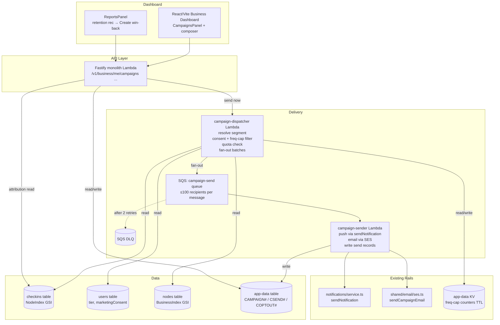

# Design Document: Win-Back Campaigns

## Overview

Win-Back Campaigns is the **activation layer** that turns Venue Intelligence Report insights into customer-reaching action. A business owner defines a Campaign — a segment of their own past visitors, a message, optional reward, and channels — and the platform delivers it through the **existing** email (SES) and push (Expo / Web Push) rails. The headline metric is **Attributed Return Visits**: recipients who actually came back within an attribution window.

The system is fully serverless and reuses what already exists:

- **Push delivery** reuses `sendNotification()` in `backend/src/features/notifications/service.ts` (WebSocket primary, Expo/Web Push fallback, preference checks, history persistence).
- **Email delivery** reuses `backend/src/shared/email/ses.ts` (SESv2 `SendEmailCommand`). A small `sendCampaignEmail()` is added alongside the existing transactional senders.
- **Audience query** mirrors the proven pattern in `notifyNewRewardConsumers()` (paginate `getCheckInsByNode` → dedupe by `userId`).
- **Storage** uses the existing `app-data` table (`pk`/`sk` + `gsi1`), like reports and notifications.
- **Frequency cap** uses the existing DynamoDB KV store (`kvGet`/`kvIncr`) with TTL, exactly like `canSendRewardPush`.
- **Fan-out** uses SQS + worker Lambda, identical in shape to the reports dispatcher/generator.

No SMS, no phone numbers, no new always-on resources, no new tables or GSIs.

### Key Design Decisions

1. **Reuse, don't rebuild, the delivery rails.** Push goes through `sendNotification` and email through the SES module. Campaigns add orchestration (segment resolution, consent/cap filtering, fan-out, analytics) on top — not a new messaging subsystem. This keeps the surface area small and inherits the existing token-invalidation, preference, and history behavior. (Requirements 5, C3.)

2. **Email + push only, enforced at the type boundary.** The `channel` field is a Zod enum of exactly `['push', 'email']`. There is no code path that accepts, stores, or reads a phone number. This is a structural guarantee of the no-SMS rule, not a runtime check that could be loosened. (Requirements 5, 12.4, C1.)

3. **Dispatcher/Sender fan-out via SQS**, mirroring the reports feature. The dispatcher resolves + filters the audience once, then publishes batches of ≤100 recipient tokens. Workers deliver independently with retry isolation and a DLQ. This keeps any single Lambda well under timeout and scales with recipient count. (Requirements 10.)

4. **Anonymized send records.** Per-recipient send outcomes are keyed by a salted, per-campaign hash of `userId` (`Anonymized_Token`), never the raw userId. Analytics are pure aggregates. Campaign documents themselves contain zero consumer identifiers. (Requirements 11.4, 6, POPIA.)

5. **Attribution computed on read, from existing check-ins.** Rather than maintaining a join table, Attributed Return Visits are computed by re-resolving recipient tokens against post-send check-ins at the campaign nodes. The set of recipient tokens is the only state needed, and it already exists in the send records. (Requirements 11.2.)

6. **Consent is opt-in by default and separate from notification prefs.** A consumer who gets transactional reward-code pushes is _not_ a campaign recipient unless they granted `marketingConsent`. Default-absent means not-granted. (Requirements 6.)

7. **Send quota enforced before fan-out.** The monthly recipient quota is checked atomically against a per-business per-month counter at send time, and a send that would exceed it is rejected whole (never truncated). This bounds SES/push cost per tier. (Requirements 9.3, 9.4.)

8. **Tier gating at the API layer**, consistent with the reports feature — the panel and routes return upgrade responses for starter/payg, full functionality for growth/pro. (Requirements 9.)

## Architecture



### Delivery Flow

1. Owner creates a Campaign (`draft`) via the composer. The API estimates recipient count by resolving the segment and applying consent/cap filters (without sending).
2. Owner sends now. Send-now invokes the dispatcher directly (async). (Scheduled/future-dated sending is out of scope; see requirement 8.)
3. The **dispatcher** resolves the segment to userIds, filters by marketing consent + opt-out + frequency cap, checks the monthly send quota, derives anonymized tokens, and publishes SQS batches.
4. Each **sender** invocation delivers a batch: push through `sendNotification`, email through `sendCampaignEmail`, writing one `Campaign_Send_Record` per recipient and incrementing the frequency-cap counter once per recipient.
5. When all batches drain, the campaign flips to `sent` with final counts. Analytics (including Attributed Return Visits) are computed on read.

## Components and Interfaces

### 1. Campaign Dispatcher Lambda (`backend/src/features/campaigns/dispatcher.ts`)

Invoked async on send-now (directly by the campaign service).

```typescript
interface DispatchCampaignEvent {
  businessId: string
  campaignId: string
}

// 1. Load campaign, assert status is 'sending'
// 2. resolveSegment(campaign) -> userIds
// 3. filterByConsentAndOptOut(userIds, businessId) -> consented
// 4. filterByFrequencyCap(consented) -> eligible
// 5. assertWithinQuota(businessId, eligible.length)
// 6. tokenize(eligible, campaignSalt) -> tokens, persist token list on campaign run
// 7. chunk(eligible, 100) -> SQS messages { campaignId, businessId, recipients: [{token, userId}] }
```

> Note: the dispatcher passes `userId` to the sender (needed to actually deliver), but only the `token` is persisted in send records and analytics. The `userId` never lands in a stored campaign/analytics document.

### 2. Campaign Sender Lambda (`backend/src/features/campaigns/sender.ts`)

SQS-triggered worker delivering one batch.

```typescript
interface CampaignSendMessage {
  campaignId: string
  businessId: string
  recipients: Array<{ token: string; userId: string }>
}

// For each recipient:
//   - push channel  -> sendNotification({ userId, type: 'campaign', title, body, data, skipPreferenceCheck: false })
//   - email channel -> resolve verified email (Cognito) -> sendCampaignEmail(...)
//   - record outcome: 'delivered_push' | 'delivered_email' | 'delivered_both' | 'no_channel' | 'failed'
//   - incrementFrequencyCap(userId) once if any attempt made
```

### 3. Segment Resolver (`backend/src/features/campaigns/segment-resolver.ts`)

Pure-ish module (DB reads in, set of userIds out). Reuses `getCheckInsByNode` pagination.

```typescript
type Segment = 'lapsed' | 'first_timers' | 'regulars' | 'all_past_visitors'

interface SegmentInput {
  segment: Segment
  nodeIds: string[]
  lapsedWindowDays: number // used only for 'lapsed'
  nowMs: number
}

// Returns deduped userIds. Internally builds, per node, a map userId -> {count, lastCheckInMs};
// merges across nodes; then applies the segment rule:
//   lapsed:            visited before cutoff AND lastCheckIn older than lapsedWindowDays
//   first_timers:      total check-in count across nodes === 1
//   regulars:          tier(userId, business) in {regular, fixture, institution, legend}
//   all_past_visitors: any check-in
async function resolveSegment(input: SegmentInput): Promise<string[]>
```

Cap: at most the most-recent 10000 check-ins per node are scanned (Requirement 14.4); this is a documented predictability bound, surfaced as `truncated: true` in the estimate response when hit.

### 4. Consent & Frequency Filters (`backend/src/features/campaigns/eligibility.ts`)

```typescript
// Marketing consent lives on the user record (new field) OR an explicit opt-out row.
async function filterByConsentAndOptOut(userIds: string[], businessId: string): Promise<string[]>

// Frequency cap reuses dynamodb-kv: key `campaign:freqcap:<userId>`, window 7 days, max 4.
async function filterByFrequencyCap(userIds: string[]): Promise<string[]>
async function incrementFrequencyCap(userId: string): Promise<void>
```

Opt-out rows: `pk = COPTOUT#<userId>`, `sk = COPTOUT#<businessId>` for per-business, `sk = COPTOUT#ALL` for global.

### 5. Campaign Service (`backend/src/features/campaigns/service.ts`)

```typescript
function createCampaign(businessId: string, input: CreateCampaignInput): Promise<Campaign>
function estimateRecipients(businessId: string, campaignId: string): Promise<RecipientEstimate>
function sendCampaign(businessId: string, campaignId: string): Promise<Campaign>
function cancelCampaign(businessId: string, campaignId: string): Promise<Campaign>
function getCampaign(businessId: string, campaignId: string): Promise<CampaignWithAnalytics>
function listCampaigns(businessId: string, opts): Promise<{ items: CampaignSummary[]; nextCursor?: string }>
function computeAnalytics(campaign: Campaign): Promise<CampaignAnalytics> // includes Attributed Return Visits
```

### 6. Campaign API Routes (`backend/src/features/campaigns/handler.ts`)

Added to the Fastify monolith. All under `requireAuth('business','staff')` + `requireBusinessPermission('manage_campaigns')`, plus tier gating.

```
POST   /v1/business/me/campaigns                      create draft
GET    /v1/business/me/campaigns                       list (paginated)
GET    /v1/business/me/campaigns/:campaignId           detail + analytics
POST   /v1/business/me/campaigns/:campaignId/estimate   recipient estimate (post-filter)
POST   /v1/business/me/campaigns/:campaignId/send       send now
POST   /v1/business/me/campaigns/:campaignId/cancel     cancel draft
```

Consumer-facing opt-out (under consumer auth, or a signed unsubscribe token for email links):

```
POST   /v1/users/me/campaign-optout                    { businessId? }  (omit businessId = global)
GET    /v1/campaigns/unsubscribe?token=...             one-click email unsubscribe (signed token, no login)
```

### 7. Email Sender Addition (`backend/src/shared/email/ses.ts`)

```typescript
// Added alongside sendPasswordResetEmail / sendTrialExpiryEmail.
export async function sendCampaignEmail(
  to: string,
  businessName: string,
  subject: string,
  bodyText: string,
  unsubscribeUrl: string,
): Promise<void>
// Includes List-Unsubscribe header + visible unsubscribe link (Requirement 12.2).
```

### 8. Dashboard CampaignsPanel (`apps/business/src/screens/panels/CampaignsPanel.tsx`)

New lazy-loaded, permission-gated panel (`manage_campaigns`), registered in `BusinessDashboard.tsx` panel list and `PANEL_PERMISSIONS`. Composer + history + teaser overlay for starter/payg, matching the `ReportsPanel` pattern. The `ReportsPanel` gains a "Create win-back campaign" CTA next to `retention`-type recommendations (Requirement 4).

## Data Models

### Campaign document (app-data)

```
pk:     CAMPAIGN#<businessId>
sk:     CAMPAIGN#<createdAt>#<campaignId>
gsi1pk: CAMPAIGNS#<businessId>
gsi1sk: <createdAt>            (list sorted by date desc)
ttl:    <createdAt + 13 months>

campaignId, businessId, status,
segment, lapsedWindowDays?, nodeIds[],
title, body, channels[], rewardId?, reportId?,
sentAt?, attributionWindowDays,
campaignSalt,                 (per-campaign hash salt; not a secret, rotates token space)
counts: { targeted, filteredConsent, filteredFreqCap, attempted,
          deliveredPush, deliveredEmail, deliveredBoth, noChannel, failed }
```

### Campaign send record (app-data)

```
pk:  CSEND#<campaignId>
sk:  CSEND#<recipientToken>
ttl: <sentAt + 120 days>
recipientToken, channelOutcome, attemptedAt
```

`recipientToken = sha256(userId + campaignId + campaignSalt)`. No userId stored.

### Opt-out record (app-data)

```
pk: COPTOUT#<userId>
sk: COPTOUT#<businessId>  | COPTOUT#ALL
optedOutAt
```

### Marketing consent

A `marketingConsent: boolean` field on the user record (default absent = not granted), set via the existing privacy/consent surface. Read during dispatch.

### Frequency-cap counter (app-data KV, existing helper)

```
key: campaign:freqcap:<userId>   value: integer   ttl: 7 days
```

### DynamoDB Access Patterns

| Operation                 | Table         | Key/Index         | Pattern                                                     |
| ------------------------- | ------------- | ----------------- | ----------------------------------------------------------- |
| Resolve segment check-ins | checkins      | NodeIndex GSI     | `getCheckInsByNode` paginated per node, cap 10000           |
| Read user tier / consent  | users         | Primary key       | BatchGetItem on unique userIds                              |
| Verify node ownership     | nodes         | BusinessIndex GSI | Query business nodes, set-membership check                  |
| Store / load campaign     | app-data      | Primary key       | Put / Get on `CAMPAIGN#<businessId>`                        |
| List campaigns            | app-data      | GSI1              | Query `CAMPAIGNS#<businessId>`, ScanIndexForward=false      |
| Write / read send records | app-data      | Primary key       | Put / Query on `CSEND#<campaignId>`                         |
| Opt-out check             | app-data      | Primary key       | BatchGet `COPTOUT#<userId>` (sk business + ALL)             |
| Frequency cap             | app-data (KV) | Primary key       | `kvGet` / `kvIncr` with TTL                                 |
| Quota counter             | app-data (KV) | Primary key       | `kvIncr` `campaign:quota:<businessId>:<yyyy-mm>`            |
| Attribution               | checkins      | NodeIndex GSI     | Post-send `getCheckInsByNode` per node, tokenize, intersect |

## Correctness Properties

_A property is a characteristic that should hold across all valid executions — the bridge between human-readable spec and machine-verifiable correctness._

### Property 1: Lapsed Segment Exclusivity

_For any_ set of check-ins across the campaign's nodes and any `lapsedWindowDays`, the `lapsed` segment SHALL contain exactly the userIds with at least one check-in before the cutoff and zero check-ins within the most recent `lapsedWindowDays`, and SHALL contain no userId who checked in within that window.

**Validates: Requirements 2.1, 2.3**

### Property 2: Segment Deduplication

_For any_ set of check-ins where a userId appears at multiple of the business's nodes, the resolved segment SHALL contain that userId at most once.

**Validates: Requirements 2.2, 3.4**

### Property 3: First-Timers Correctness

_For any_ set of check-ins, the `first_timers` segment SHALL contain exactly the userIds whose total check-in count across the campaign's nodes equals 1.

**Validates: Requirements 3.1**

### Property 4: Channel Enum Closure (No SMS)

_For any_ campaign creation input, the Campaign_Service SHALL accept the input only if every channel is in `{push, email}`, and the serialized campaign SHALL contain no phone-number field; any input containing a channel outside that set SHALL be rejected. (Also enforces Constraint C1 — no SMS.)

**Validates: Requirements 5.3, 5.4**

### Property 5: Consent Opt-In Default

_For any_ consumer with no recorded marketing-consent value, the eligibility filter SHALL exclude that consumer from campaign recipients.

**Validates: Requirements 6.1, 6.4**

### Property 6: Opt-Out Honored

_For any_ consumer who has a global opt-out OR a per-business opt-out for the sending business, the eligibility filter SHALL exclude that consumer regardless of consent state.

**Validates: Requirements 6.2, 12.3**

### Property 7: Frequency Cap Bound

_For any_ sequence of campaign sends to a consumer within the rolling window, the number of campaigns counted against that consumer SHALL never exceed the Frequency_Cap maximum, and a consumer at the cap SHALL be excluded from further campaigns until the window expires.

**Validates: Requirements 7.1, 7.4**

### Property 8: Quota Non-Truncation

_For any_ business with remaining monthly quota `q` and a send with eligible recipient count `n`, the send SHALL proceed only if `n ≤ q`; when `n > q` the send SHALL be rejected entirely and the recipient count actually dispatched SHALL be 0.

**Validates: Requirements 9.3, 9.4**

### Property 9: Send Idempotency

_For any_ campaign, after it enters `sending` or `sent`, a subsequent send request SHALL be rejected and SHALL not dispatch any additional messages.

**Validates: Requirements 8.6**

### Property 10: Batch Partitioning Invariant

_For any_ eligible recipient set, the SQS messages produced by the dispatcher SHALL partition the recipients into disjoint batches each of size ≤ 100, whose union equals the eligible set exactly (no recipient dropped, none duplicated).

**Validates: Requirements 10.1**

### Property 11: Send-Record Anonymity

_For any_ produced Campaign_Send_Record or analytics response, the serialized document SHALL contain no value matching a known PII pattern (UUID userId, cognitoSub, email, phone), only tokens and aggregate counts. (Also enforces Constraint C1 — no phone.)

**Validates: Requirements 11.4, 6.1**

### Property 12: Attribution Single-Count

_For any_ set of post-send check-ins by recipients, Attributed_Return_Visits SHALL count each recipient at most once even if they checked in multiple times, and SHALL count only check-ins within `attributionWindowDays` after that recipient's send time.

**Validates: Requirements 11.2, 11.5**

### Property 13: Tier Gating

_For any_ business tier, when the tier is starter or payg the send endpoint SHALL return an upgrade-required response and dispatch 0 messages; when growth or pro it SHALL permit sending subject to quota.

**Validates: Requirements 9.1, 9.2**

## Error Handling

### Delivery Errors

| Scenario                               | Handling                                                                      | Recovery                                                 |
| -------------------------------------- | ----------------------------------------------------------------------------- | -------------------------------------------------------- |
| Dispatcher fails before fan-out        | Campaign left in `sending`; async invocation retried; CloudWatch error metric | Manual re-trigger; idempotent (no batches published yet) |
| Single recipient delivery fails        | Record `failed`, continue batch                                               | Counted in analytics; no retry of individual recipient   |
| Sender invocation fails                | SQS retry ×2 → DLQ; other batches unaffected                                  | DLQ redrive                                              |
| Recipient has no push token, push-only | Record `no_channel`, no other channel attempted                               | Expected; surfaced in analytics                          |
| Email send (SES) throttled             | SDK retry/backoff; on hard fail record `failed`                               | DLQ for whole batch on invocation failure                |

### API Errors

| Scenario                            | HTTP | Response                                                                      |
| ----------------------------------- | ---- | ----------------------------------------------------------------------------- |
| Unauthenticated                     | 401  | `{ error: "unauthorized" }`                                                   |
| Missing `manage_campaigns`          | 403  | `{ error: "forbidden" }`                                                      |
| Node not owned by business          | 403  | `{ error: "forbidden", message: "Node not owned by business" }`               |
| Tier not entitled (starter/payg)    | 402  | `{ error: "upgrade_required", message: "Campaigns require the Growth plan" }` |
| Send exceeds monthly quota          | 409  | `{ error: "quota_exceeded", remaining: <n> }`                                 |
| Re-send of sent/sending campaign    | 409  | `{ error: "already_sent" }`                                                   |
| Campaign not found / other business | 404  | `{ error: "not_found" }`                                                      |

### Data Integrity Safeguards

- **Send idempotency**: status transition to `sending` is the lock; the dispatcher refuses to run twice for the same campaign run.
- **Quota atomicity**: quota counter incremented via conditional KV update at dispatch; rejected sends increment nothing.
- **TTL cleanup**: send records (120 days), campaigns (13 months), frequency-cap and quota counters (window-scoped) all expire via DynamoDB TTL — no cleanup job.
- **Anonymization boundary**: userId is used only transiently inside dispatcher/sender memory; only tokens are persisted.

## Testing Strategy

### Property-Based Testing

**Library**: fast-check with Vitest, ≥100 iterations per property, each test tagged `Feature: winback-campaigns, Property {N}: {title}`. Custom arbitraries for check-in sets, user/tier/consent records, campaign inputs, and recipient sets.

| Property                     | Module Under Test                      | Key Generators                                             |
| ---------------------------- | -------------------------------------- | ---------------------------------------------------------- |
| P1 Lapsed exclusivity        | `segment-resolver.ts`                  | Check-in sets across nodes with varied timestamps + window |
| P2 Dedup                     | `segment-resolver.ts`                  | Check-ins repeating userIds across nodes                   |
| P3 First-timers              | `segment-resolver.ts`                  | Check-in sets with varied per-user counts                  |
| P4 Channel enum / no SMS     | `types.ts` (Zod)                       | Random channel arrays incl. invalid values                 |
| P5 Consent default           | `eligibility.ts`                       | Users with/without consent field                           |
| P6 Opt-out honored           | `eligibility.ts`                       | Random opt-out rows (per-business + global)                |
| P7 Frequency cap             | `eligibility.ts`                       | Sequences of sends within/over window                      |
| P8 Quota non-truncation      | `service.ts` (quota check)             | Random remaining quota × eligible counts                   |
| P9 Send idempotency          | `service.ts`                           | Campaign status transitions                                |
| P10 Batch partitioning       | `dispatcher.ts` (chunk)                | Random recipient sets, sizes around 100 boundaries         |
| P11 Send-record anonymity    | `sender.ts` record builder + analytics | Random records scanned for PII patterns                    |
| P12 Attribution single-count | `service.ts` (computeAnalytics)        | Recipients with multiple/zero post-send check-ins          |
| P13 Tier gating              | `handler.ts` gate                      | Random tiers × send requests                               |

### Unit / Example Tests

- Segment boundaries: zero check-ins, exactly-one check-in (first-timer boundary), check-in exactly at window edge, 10000-cap truncation flag.
- Eligibility: consent true/false/absent, per-business vs global opt-out precedence, cap at exactly max.
- Quota: send equal to remaining (allowed), send one over (rejected), month rollover.
- Sender: push-only with no token (`no_channel`), email-only with no verified email, both-channels partial failure.
- Unsubscribe: signed token validity/expiry, one-click without login, global vs per-business.

### Integration Tests

- API routes: create/list/detail/estimate/send/cancel under auth + permission + tier gate.
- Dispatcher → SQS → sender end-to-end with mock DynamoDB and stubbed `sendNotification`/SES; verify counts and send records.
- Report → campaign: `retention` recommendation pre-fills composer; `reportId` recorded on the campaign.
- Attribution: seed post-send check-ins, verify single-count within window and exclusion outside window.

### Test Organization

```
backend/src/features/campaigns/
├── __tests__/
│   ├── segment-resolver.property.test.ts
│   ├── eligibility.property.test.ts
│   ├── dispatcher.property.test.ts
│   ├── service.property.test.ts
│   ├── sender.property.test.ts
│   ├── tier-gating.property.test.ts
│   ├── handler.integration.test.ts
│   └── delivery.integration.test.ts
```
